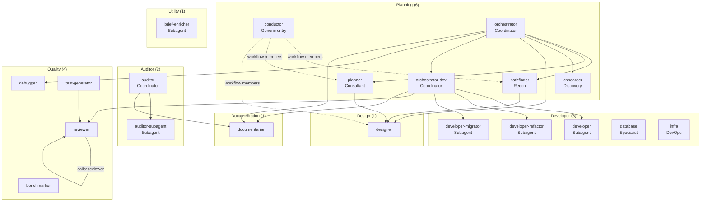

> [Lire en français](agents.fr.md)

# Agent Reference

20 agents in total, organized into 7 families (planning, developer, auditor, quality, design, documentation, utility).
Each agent is defined in `agents/<family>/<id>.md` with a frontmatter declaring its metadata,
permissions, skills, and mode. This `agents/` folder is the source of truth for this page.

> See the [Glossary](../reference/glossary.en.md) for definitions of Agent, Bucket A/B, Skill, and other terms.

## Agents in a v5 session

In v5, the agent no longer decides the chain: the session **workflow** does
(YAML `apiVersion: oh/v1`, [ADR-039](./adr/039-declarative-workflows-oh-v1.en.md)).

- **Member agents**: the workflow `agents:` map lists the session agents, with their role
  (`workflow` in the chain, `independent` available on demand, `disabled` removed) and, if needed,
  a `mode` (`primary` / `subagent`) that replaces the frontmatter one.
- **Order**: `after:` locks an agent until a checkpoint is passed (or until another agent has run).
  While the lock holds, oh refuses delegation to that agent ([ADR-042](./adr/042-checkpoints-headless-decisions.en.md)).
- **Delegations**: `calls:` sets who may launch whom. Without `calls:`, the graph comes from the frontmatter `task`
  permission, restricted to the workflow members. Details: [Inter-agent delegation](./task-delegation.en.md).
- **Checkpoints**: declared in the workflow (`checkpoints:`), with a behavior per mode
  (`pause`, `auto`, `skip`, `conditional`). The agent signals them with the `workflow_checkpoint` MCP tool;
  oh keeps the state and raises the decisions ([ADR-042](./adr/042-checkpoints-headless-decisions.en.md)).
- **Entry agent**: the workflow `entry.agent`, or `conductor` by default (`cadrage`, `sweep` workflows).
  The `libre` workflow lets you pick the entry agent (`oh run libre --agent <id>`).
- **Closed world**: an agent only sees the agents and skills of the **session bundle** built from the
  workflow ([ADR-043](./adr/043-session-bundle-deploy-removal.en.md)). OpenCode's native agents are
  disabled, and the `Attest` check blocks startup if anything else is visible
  ([ADR-041](./adr/041-closed-world-isolation.en.md)).

Consequence: the frontmatter `task` permissions describe what an agent *may* delegate in general.
In a session, only the agents of the bundle can be reached. To see the actual content of a session:
`oh workflow show <id>` and `oh bundle show <id>`.

## Agent Hierarchy

The diagram shows the delegations allowed by the frontmatter (`permission.task`). In a session, only
those linking two workflow members remain possible. `documentarian` can also be delegated to by most
writing agents (`developer-rw` base) and by `planner`, `pathfinder`, `debugger`, `reviewer`,
`benchmarker`, `test-generator`: not all of these links are drawn.



> Standalone diagram source: [`docs/diagrams/agent-hierarchy.mermaid`](../diagrams/agent-hierarchy.mermaid)

---

## Agent Format

```markdown
---
id: <unique-identifier>
label: <DisplayedName>
description: <Short description — visible in AI tools>
mode: primary         # primary (default) | subagent
model: <model>        # last level of the model cascade
permission_base: <base>   # optional — permissions/<base>.yaml (coordinator, developer-rw, readonly-code)
permission:
  question: allow     # optional — enables OpenCode's question tool (interactive primary agents only)
  skill: allow        # allow | deny — enables the native skill tool (Bucket B)
  task:               # agents this agent may launch (then restricted to the workflow)
    "*": deny
    "documentarian": allow
mcpServers: [gitlab]  # optional — MCP servers used by the agent
skills: [path/to/skill, ...]          # Bucket A — assembled inline when the session bundle is built
native_skills: [path/to/skill, ...]   # Bucket B — delivered in the session bundle skills/, loaded on-demand
---

# <Title>

<Agent body>
```

| Field | Role |
|-------|------|
| `id` | Unique identifier, used by workflows (`agents:`, `entry.agent`, `calls:`) and in the session bundle |
| `label` | Name displayed in the tool |
| `description` | Short phrase describing the role — appears in agent lists |
| `mode` | `primary` (default) or `subagent` — controls visibility in OpenCode; the workflow can override it |
| `model` | Default model, last level of the cascade (workflow·agent > workflow > project·agent > … > frontmatter) |
| `permission_base` | Permission base (`permissions/<base>.yaml`) merged with `permission:`; single-level inheritance |
| `permission.question` | `allow` — enables OpenCode's `question` tool for this agent. Reserved for interactive `primary` agents. Always paired with the `posture/tool-question` skill. |
| `permission.skill` | `allow` — enables the native `skill` tool so the agent can load Bucket B skills on-demand. In the closed world, only the bundle skills are allowed. |
| `permission.task` | Agents this agent may launch. In a session, the list is restricted to the workflow members (or replaced by `calls:`). |
| `skills` | **Bucket A** — paths relative to `skills/`, injected inline when the session bundle is built, always active from the first token. Workflow protocols, handoff formats, universal principles. |
| `native_skills` | **Bucket B** — paths relative to `skills/`, delivered in the session bundle as `skills/<name>/SKILL.md`, loaded on-demand by the LLM via the `skill` tool. Domain standards, stack skills, checklists. |

See [ADR-010](./adr/010-hybrid-skills-architecture.en.md) for the rationale behind the Bucket A / Bucket B split.

### Primary / Subagent Modes

The `mode:` field controls how an agent is exposed in OpenCode:

| Mode | OpenCode |
|------|----------|
| `primary` | Visible in the session Tab picker — present in the session bundle `agents/` |
| `subagent` | Invocable by other agents of the bundle, hidden in the Tab picker. Present in the session bundle `agents/` with a delegation-oriented description. |

The effective mode follows a priority: **workflow** (`agents.<id>.mode`) > **agent frontmatter** > **`primary`** (default).
Example: in `feature`, `planner` and `reviewer` are `subagent`; in `quick`, `developer` becomes `primary`.
The entry agent must be `primary`.

---

## Agent Inventory

Taken from the frontmatter files in `agents/`.

| Family | Agent | Mode (frontmatter) | Permission base | MCP |
|--------|-------|--------------------|-----------------|-----|
| planning | `conductor` | `primary` | `coordinator` | — |
| planning | `orchestrator` | `primary` | — | — |
| planning | `orchestrator-dev` | `primary` | — | — |
| planning | `planner` | `primary` | — | `gitlab` |
| planning | `pathfinder` | `primary` | — | `gitlab` |
| planning | `onboarder` | `primary` | — | `gitlab` |
| developer | `developer` | `subagent` | `developer-rw` | — |
| developer | `developer-refactor` | `subagent` | `developer-rw` | — |
| developer | `developer-migrator` | `subagent` | `developer-rw` | — |
| developer | `database` | `primary` | `developer-rw` | — |
| developer | `infra` | `primary` | `developer-rw` | — |
| auditor | `auditor` | `primary` | `coordinator` | — |
| auditor | `auditor-subagent` | `subagent` | `readonly-code` | — |
| quality | `reviewer` | `primary` | — | — |
| quality | `debugger` | `primary` | — | — |
| quality | `benchmarker` | `primary` | — | — |
| quality | `test-generator` | `primary` | `developer-rw` | — |
| design | `designer` | `primary` | — | `figma` |
| documentation | `documentarian` | `primary` | — | — |
| utility | `brief-enricher` | `subagent` | — | — |

---

## Skill Assignment Matrix (source of truth)

This table is the authoritative reference for which skills each agent loads. It is taken from the actual agent frontmatter files. For skill descriptions, see [Skills reference](./skills.en.md).

> `shared/universal-guardrails` is Bucket A (inline) in **every** agent except `brief-enricher`: it is not repeated in the tables.
> `shared/team-awareness` and `shared/team-policies-enforcement` are Bucket B in **every** agent, except `conductor` (only `shared/team-awareness`): they are not repeated either.
> `shared/living-docs-enrichment` is Bucket B (native / on-demand) everywhere it appears.

### Planning family

| Agent | Bucket A (inline) | Bucket B (native / on-demand) |
|-------|-------------------|-------------------------------|
| **conductor** | `posture/coordination-only`, `posture/concision-posture`, `posture/retranscription-coordinateur`, `posture/tool-question`, `posture/tool-todowrite`, `workflow/workflow-map` (generated from the workflow YAML) | `shared/rtk-usage` |
| **orchestrator** | `posture/coordination-only`, `posture/concision-posture`, `posture/retranscription-coordinateur`, `orchestrator/orchestrator-workflow-modes`, `orchestrator/orchestrator-handoff-format`, `orchestrator/orchestrator-protocol`, `posture/tool-question`, `posture/tool-todowrite`, `planning/planner-handoff-format`, `shared/hub-workflow-reference` | `planning/pathfinder-handoff-format`, `design/design-handoff-format`, `auditor/audit-handoff-format`, `planning/onboarder-handoff-format`, `quality/debugger-handoff-format`, `documentarian/documentarian-handoff-format`, `shared/rtk-usage`, `orchestrator/orchestrator-recap-edge`, `developer/beads-plan`, `orchestrator/takeover-context-protocol` |
| **orchestrator-dev** | `posture/coordination-only`, `posture/concision-posture`, `posture/retranscription-coordinateur`, `orchestrator/orchestrator-workflow-modes`, `orchestrator/orchestrator-dev-protocol`, `orchestrator/orchestrator-handoff-format`, `posture/tool-question`, `posture/tool-todowrite`, `developer/developer-handoff-format`, `reviewer/reviewer-handoff-format`, `documentarian/documentarian-handoff-format` | `orchestrator/orchestrator-dev-standalone`, `orchestrator/orchestrator-dev-subagent`, `developer/dev-drift-detection`, `orchestrator/session-state-protocol`, `shared/rtk-usage`, `orchestrator/orchestrator-dev-ticket-workflow`, `orchestrator/orchestrator-dev-parallel`, `orchestrator/orchestrator-dev-recap`, `orchestrator/orchestrator-dev-edge-cases`, `orchestrator/error-recovery-protocol`, `orchestrator/team-coordination`, `orchestrator/takeover-context-protocol`, `orchestrator/parallel-coordination` |
| **planner** | `planning/planner-workflow`, `planning/planner-handoff-format`, `design/design-planner-format`, `adapters/gitlab-planner-protocol`, `posture/concision-posture`, `posture/tool-question`, `shared/hub-workflow-reference` | `planning/planner-execution-modes`, `planning/websearch-stack-research`, `shared/rtk-usage`, `planning/planner-phase-0`, `planning/planner-phase-1`, `planning/planner-phase-2`, `planning/planner-phase-3-4`, `planning/planner-phase-5-6`, `planning/planner-patterns-protocol`, `shared/living-docs-enrichment`, `shared/websearch-usage`, `planning/planner-design-templates`, `planning/planner-beads-templates`, `developer/beads-plan`, `posture/expert-posture` |
| **pathfinder** | `developer/beads-plan`, `planning/pathfinder-protocol`, `planning/pathfinder-handoff-format`, `adapters/gitlab-pathfinder-protocol`, `posture/concision-posture`, `posture/tool-question`, `shared/websearch-usage`, `shared/wiki-navigation` | `planning/pathfinder-execution-modes`, `planning/websearch-stack-research`, `shared/rtk-usage`, `shared/living-docs-enrichment` |
| **onboarder** | `planning/onboarder-workflow`, `planning/onboarder-handoff-format`, `planning/onboarder-profiles`, `adapters/gitlab-onboarder-protocol`, `posture/tool-question`, `developer/dev-standards-git`, `shared/wiki-navigation` | `planning/onboarder-execution-modes`, `planning/websearch-stack-research`, `shared/rtk-usage`, `planning/onboarder-phase-0`, `planning/onboarder-phase-1`, `planning/onboarder-phase-2`, `planning/onboarder-phase-3-4`, `planning/onboarder-phase-5`, `shared/living-docs-enrichment`, `shared/websearch-usage`, `developer/beads-plan`, `posture/expert-posture` |

### Developer family

| Agent | Bucket A (inline) | Bucket B (native / on-demand) |
|-------|-------------------|-------------------------------|
| **developer** | `developer/dev-standards-universal`, `developer/dev-standards-simplicity`, `developer/quick-fix`, `developer/beads-dev`, `developer/developer-handoff-format`, `posture/subagent-concision-posture`, `shared/wiki-navigation`, `shared/context-mode-usage` | `developer/dev-standards-security`, `developer/dev-standards-git`, `developer/dev-standards-testing`, `reviewer/reviewer-reception`, `shared/rtk-usage`, `shared/living-docs-enrichment`, `developer/beads-plan` |
| **developer-refactor** | `developer/dev-standards-universal`, `developer/dev-standards-simplicity`, `developer/quick-fix`, `developer/beads-plan`, `developer/beads-dev`, `developer/developer-handoff-format`, `posture/subagent-concision-posture`, `shared/wiki-navigation`, `shared/context-mode-usage` | `developer/dev-standards-security`, `developer/dev-standards-testing`, `developer/dev-standards-git`, `developer/dev-standards-refactoring`, `shared/rtk-usage`, `shared/living-docs-enrichment` |
| **developer-migrator** | *(same as developer-refactor)* | `developer/dev-standards-security`, `developer/dev-standards-testing`, `developer/dev-standards-git`, `developer/dev-standards-migration`, `shared/rtk-usage`, `shared/living-docs-enrichment` |
| **database** | `developer/dev-standards-universal`, `posture/tool-question`, `shared/wiki-navigation` | `developer/dev-standards-security`, `shared/living-docs-enrichment` |
| **infra** | `developer/dev-standards-universal`, `posture/tool-question`, `shared/wiki-navigation` | `developer/dev-standards-security`, `shared/living-docs-enrichment` |

### Auditor family

| Agent | Bucket A (inline) | Bucket B (native / on-demand) |
|-------|-------------------|-------------------------------|
| **auditor** | `posture/coordination-only`, `posture/retranscription-coordinateur`, `auditor/auditor-workflow`, `auditor/audit-protocol-light`, `auditor/audit-handoff-format`, `posture/tool-question` | `auditor/auditor-execution-modes`, `shared/rtk-usage`, `shared/living-docs-enrichment` |
| **auditor-subagent** | `auditor/audit-protocol-light`, `posture/subagent-concision-posture`, `auditor/audit-handoff-format`, `shared/wiki-navigation` | `auditor/websearch-cve-lookup`, `auditor/websearch-performance-research`, `shared/rtk-usage`, `posture/expert-posture`, `shared/websearch-usage` |

### Quality family

| Agent | Bucket A (inline) | Bucket B (native / on-demand) |
|-------|-------------------|-------------------------------|
| **reviewer** | `developer/dev-standards-universal`, `reviewer/review-protocol`, `posture/concision-posture`, `posture/tool-question`, `reviewer/reviewer-handoff-format`, `shared/wiki-navigation` | `reviewer/reviewer-standalone`, `reviewer/reviewer-subagent`, `reviewer/reviewer-adversarial`, `reviewer/reviewer-edge-case`, `reviewer/review-merge`, `developer/dev-standards-security`, `developer/dev-standards-backend`, `developer/dev-standards-frontend`, `developer/dev-standards-frontend-data`, `developer/dev-standards-frontend-a11y`, `developer/dev-standards-testing`, `developer/dev-standards-git`, `developer/dev-standards-api`, `developer/dev-standards-devops`, `shared/rtk-usage`, `shared/living-docs-enrichment` |
| **debugger** | `quality/debugger-workflow`, `quality/debugger-handoff-format`, `quality/debugger-forensic`, `quality/debugger-report-templates`, `posture/tool-question`, `shared/wiki-navigation` | `quality/debugger-execution-modes`, `shared/rtk-usage`, `quality/debugger-phase-0-1`, `quality/debugger-phase-2-3`, `quality/debugger-phase-4-5`, `shared/living-docs-enrichment`, `posture/expert-posture` |
| **benchmarker** | `developer/dev-standards-universal`, `posture/tool-question`, `shared/wiki-navigation` | `shared/living-docs-enrichment` |
| **test-generator** | `developer/dev-standards-universal`, `developer/dev-standards-testing`, `posture/tool-question`, `shared/wiki-navigation` | `shared/living-docs-enrichment` |

### Design family

| Agent | Bucket A (inline) | Bucket B (native / on-demand) |
|-------|-------------------|-------------------------------|
| **designer** | `designer/designer-protocol`, `design/design-planner-format`, `design/design-handoff-format`, `posture/tool-question` | `designer/ux-protocol`, `designer/ui-protocol`, `designer/figma-recon-protocol`, `designer/figma-deep-protocol`, `designer/prototype-protocol`, `designer/designer-subagent`, `designer/designer-standalone`, `design/websearch-design-patterns`, `shared/rtk-usage`, `designer/design-principles`, `designer/ui-patterns-reference`, `designer/content-design`, `designer/tui-patterns`, `shared/websearch-usage`, `developer/beads-plan`, `posture/expert-posture` |

### Documentation family

| Agent | Bucket A (inline) | Bucket B (native / on-demand) |
|-------|-------------------|-------------------------------|
| **documentarian** | `developer/dev-standards-git`, `developer/beads-dev`, `documentarian/doc-protocol`, `posture/tool-question`, `documentarian/documentarian-handoff-format` | `documentarian/doc-standards`, `documentarian/doc-adr`, `documentarian/doc-api`, `documentarian/doc-changelog`, `documentarian/doc-slides`, `documentarian/doc-wiki-protocol`, `shared/skill-authoring-protocol`, `shared/rtk-usage`, `shared/websearch-usage`, `developer/beads-plan`, `posture/expert-posture` |

### Utility family

| Agent | Bucket A (inline) | Bucket B (native / on-demand) |
|-------|-------------------|-------------------------------|
| **brief-enricher** | *(none)* | *(none besides the team skills)* |

---

## Family — Coordinators

Agents that drive other agents without ever coding themselves.

### `conductor`

| | |
|--|--|
| **Label** | Conductor |
| **File** | `agents/planning/conductor.md` |
| **Mode** | `primary` |
| **Permissions** | `coordinator` base: no `bash`, no `edit` or `write`. `task` open on `*` in the frontmatter, restricted by the bundle to the workflow graph. `question` and `todowrite` allowed. |
| **Skills** | See [Skill Assignment Matrix](#skill-assignment-matrix-source-of-truth) — conductor row |
| **Invocation** | Default entry agent of a workflow without `entry.agent` (`cadrage`, `sweep`) |

Generic workflow coordination agent. It contains no hard-coded chain: it follows the
**`workflow/workflow-map`** skill, generated from the workflow YAML and inlined in the bundle (agents, allowed
delegations, checkpoints, modes, outputs).

Loop: find the next agent of the chain whose `after` condition is met, pass the checkpoint before it
(`workflow_checkpoint`), launch the agent with `task`, transcribe its return without summarizing it, repeat.
At the end of the chain: recap and declaration of the outputs (`workflow_outputs`).

It neither reads nor modifies files, runs no commands, does not write to Beads, and never asks again for the
mode (set at launch). It can only launch the agents of its "May delegate to" line in the map.
Upstream questions from an agent: it relays the question with `question`, then relaunches the agent with its `task_id`.

> See [ADR-039](./adr/039-declarative-workflows-oh-v1.en.md) (hybrid orchestration) and
> [ADR-042](./adr/042-checkpoints-headless-decisions.en.md) (checkpoints).

---

### `orchestrator`

| | |
|--|--|
| **Label** | Orchestrator |
| **File** | `agents/planning/orchestrator.md` |
| **Skills** | See [Skill Assignment Matrix](#skill-assignment-matrix-source-of-truth) — orchestrator row |
| **MCP Servers** | _(none)_ |
| **Invocation** | Entry agent of the `feature` and `libre` (default) workflows — `"Implement [feature]"` / `"Handle tickets [IDs]"` |

AI project manager. Drives the complete delivery of a feature by mobilizing the
workflow agents: exploration (`pathfinder`), planning (`planner`), design (`designer`),
implementation (via `orchestrator-dev`), diagnosis (`debugger`). Signals the workflow
checkpoints at each phase. Never codes.

**Chain:** set by the session workflow (v5, `oh/v1`), no longer by the agent. The former entry modes A–E become
workflows: `feature` and `cadrage` (A/B), `onboarding` (C), `debug` (D), `ticket` and `quick` (E). The agent keeps
only its posture and contracts (transcription, invocation of and return from planning agents, routing delegated to
the planner).

Never routes directly to `developer-*` — always delegates to `orchestrator-dev`.

**Technical permissions:** `bash`, `read`, `edit`, `write`, `glob`, `grep` all disabled. Acts only via `task` (delegation), `question` and `workflow_checkpoint` (checkpoints). Invocable agents: `pathfinder`, `planner`, `onboarder`, `designer`, `orchestrator-dev`, `debugger`, `documentarian`, restricted to the workflow members.

**Context injection:** project context (stack, conventions) is automatically injected into the session: the project instructions (`ONBOARDING.md`, `CONVENTIONS.md`, `[deploy] instruction_files`) are embedded in the agents of the session bundle. The orchestrator never reads files directly — if context is missing, the `project-context` precondition of `feature` offers to run the `onboarding` workflow first.

**Missing agent handling:** if a required agent is not part of the session (the agents of a session are those of its workflow), the orchestrator asks a structured question with options: use a substitute (substitution table by domain) / skip the ticket. To make the agent available, add it to the workflow and relaunch the session (`oh deploy` removed in v5). Never silently falls back to another agent.

**Completion gate (CP-feature):** before building the CP-feature, checks that the final orchestrator-dev report documents the 3 completion checks (tests passed, observable behavior as expected, regressions documented). If missing → blocking: question to the user (ask orchestrator-dev again / accept / stop).

---

### `orchestrator-dev`

| | |
|--|--|
| **Label** | OrchestratorDev |
| **File** | `agents/planning/orchestrator-dev.md` |
| **Skills** | See [Skill Assignment Matrix](#skill-assignment-matrix-source-of-truth) — orchestrator-dev row |
| **Invocation** | Entry agent of the `ticket` and `review-feedback` workflows; subagent of `orchestrator` in `feature` — `"Implement tickets [IDs]"` |

AI tech lead specialized in driving implementation. Takes a list of ready-to-implement
Beads tickets, routes to the `developer` agent with the appropriate domain specified in the
invocation prompt (or to `developer-refactor` / `developer-migrator`), supervises the review.
Three modes: `manuel`, `semi-auto`, `auto`, set at launch (`oh run … --mode`) within the workflow `modes.allowed` list.

CP-2 (commit or fix?) is `mandatory` and pauses in all modes of the shipped workflows. It unlocks `commit`, `push` and `close` (`unlocks:`): until it is approved, oh refuses these operations to every agent; then the `developer`, handed back by `orchestrator-dev`, commits and closes the ticket.

`bd close`, `bd comments add`, and `bd update` are always executed by the `developer` agent in delegation prompts — never directly by `orchestrator-dev`. The orchestrator-dev only reads Beads tickets (`bd show`, `bd list`).

In `orchestrator_feature` mode: all CPs (CP-1, CP-3, dedicated branch, CP-2, blockage, blocked ticket) produce a `## Question pour l'orchestrator` + `## Retour vers orchestrator` (partial) block and end the session so the orchestrator agent relays the question to the user.

**Architectural drift (BLOCKED_ARCHITECTURE):** when a developer returns this status, loads the `developer/dev-drift-detection` skill via the `skill` tool and presents 3 options to the user: revise the Beads ticket scope / revert + new approach / branch to a prerequisite refactoring ticket (set to `blocked` until resolved).

> [ADR-006](./adr/006-orchestrator-configurable-mode.en.md) (modes) is superseded: modes and checkpoints are declared in the workflow ([ADR-039](./adr/039-declarative-workflows-oh-v1.en.md), [ADR-042](./adr/042-checkpoints-headless-decisions.en.md)).

---

### `auditor`

| | |
|--|--|
| **Label** | Auditor |
| **File** | `agents/auditor/auditor.md` |
| **Skills** | See [Skill Assignment Matrix](#skill-assignment-matrix-source-of-truth) — auditor row |
| **Invocation** | Entry agent of the `audit` workflow (`oh run audit`) — `"Audit [project/scope]"` / `"Audit [domain]"` |

Multi-domain audit coordinator. Drives audits in 5 structured phases: prerequisites check
(scope, stack, file access) → project context loading (reads `ONBOARDING.md` first, or
quick reconnaissance) → domain selection with stack compatibility check → delegation to
the `auditor-subagent` agent (invoked as many times as needed, one domain per invocation) → consolidation executive summary (global score, top 5 priority
actions, cross-cutting recommendations).

Produces a multi-domain executive summary. Read-only (`coordinator` base) — never modifies files directly.

**Phase 4 — Living docs enrichment:** after the summary, consolidates the
`### Findings to document` sections of the received reports and proposes to the user to enrich
`ONBOARDING.md` and/or `CONVENTIONS.md`. If accepted, delegates writing to the `documentarian` via `task`
(skill `living-docs-enrichment`), provided `documentarian` is a workflow member. Cannot invoke the `documentarian` without explicit confirmation.

In `orchestrator_feature` mode: uses the session interruption mechanism — each end of phase (0 to 3) produces a `## Retour intermédiaire vers orchestrator` + `## Question pour l'orchestrator` block and ends the session.

---

## Family — Audit Agents

Single subagent of the auditor (ADR-017). Read-only. Invocable via the auditor.

| Agent | File | Domain | References |
|-------|------|--------|-----------|
| `auditor-subagent` | `agents/auditor/auditor-subagent.md` | Security, Performance, Accessibility, Ecodesign, Architecture, Privacy, Observability — domain specified at invocation | OWASP Top 10, Core Web Vitals, WCAG 2.1 AA / RGAA 4.1, RGESN / GreenIT, SOLID / Clean Architecture, GDPR / EDPB / CNIL, RED method / SLOs / OpenTelemetry |

The `auditor-subagent` receives the domain + `native_skill` to load in the invocation prompt from the `auditor` coordinator.
It injects `auditor/audit-protocol-light` (common lightweight report format)
+ its domain-specific skill (`auditor/audit-<domain>`) loaded on-demand
+ `auditor/audit-handoff-format` (structured return contract).

All reports produced include a **`### Findings to document`** section
at the end — findings to capitalize in `ONBOARDING.md` / `CONVENTIONS.md`.
This section is consolidated by the `auditor` coordinator in Phase 4 (skill `living-docs-enrichment`).
The agent never makes `task` calls — its read-only constraint is strict (`readonly-code` base, no `bash`).

---

## Family — Developer Agents

1 generic agent specialized by domain at invocation time.
Follows the same Beads workflow (`bd claim → implement → test → bd close`).

The **domain** and the **native_skills to load** are passed by `orchestrator-dev` in the invocation prompt.
Each `task` instance runs in its own child session — parallel invocations with different domains are independent.

Common skills for the three `developer*` agents: `dev-standards-universal`, `dev-standards-simplicity`, `quick-fix`, `dev-standards-security`, `dev-standards-git`, `dev-standards-testing`, `beads-plan`, `beads-dev`, `developer/developer-handoff-format`, `shared/living-docs-enrichment` (see the matrix for the bucket of each).

| Agent | File | Domain | Specific Native Skills |
|-------|------|--------|----------------------|
| `developer` | `agents/developer/developer.md` | frontend, backend, fullstack, api, mobile, data, devops, platform, security — domain passed at invocation | Domain skills injected via invocation prompt (see `orchestrator-dev-protocol`) |

**Separate agents (distinct workflow):**

| Agent | File | Domain |
|-------|------|--------|
| `developer-refactor` | `agents/developer/developer-refactor.md` | Structural refactoring only — never changes observable behavior |
| `developer-migrator` | `agents/developer/developer-migrator.md` | Incremental migrations — framework upgrades, major versions, EOL dependencies |
| `database` | `agents/developer/database.md` | DB specialist: schema design, migration planning, query optimization, DB security audit |
| `infra` | `agents/developer/infra.md` | IaC specialist: Terraform/K8s/Helm review, cloud cost estimation, IaC security (tfsec, checkov) |

> See [ADR-013](./adr/013-developer-agent-consolidation.en.md) for the consolidation decision.
> See [ADR-002](./adr/002-developer-segmentation.en.md) (superseded) for the previous segmentation rationale.
> Domain routing guide: [agents/developer-differentiation.md](./agents/developer-differentiation.md) (French).

**Domain → native_skills mapping (summary):**

| Domain | Native skills |
|--------|--------------|
| `frontend` | `dev-standards-frontend`, `dev-standards-frontend-a11y`, `dev-standards-testing` + detected stacks |
| `backend` | `dev-standards-backend`, `dev-standards-api`, `dev-standards-testing` + detected stacks |
| `fullstack` | `dev-standards-frontend`, `dev-standards-frontend-a11y`, `dev-standards-backend`, `dev-standards-api`, `dev-standards-testing` + detected stacks |
| `api` | `dev-standards-backend`, `dev-standards-api`, `dev-standards-testing` |
| `mobile` | `dev-standards-testing` + detected mobile stacks |
| `data` | `dev-standards-testing` + detected data stacks |
| `devops` | `dev-standards-devops` + detected infra stacks |
| `platform` | `dev-standards-devops` + detected platform stacks |
| `security` | `dev-standards-security-hardening`, `dev-standards-backend`, `dev-standards-testing` |
| `go` | `dev-standards-golang` + detected stacks |
| `rust` | `dev-standards-rust` + detected stacks |

Stack skills detected in the project are added to the session bundle when it is built. The frontend domain skills (`dev-standards-frontend`, `-a11y`, `-data`), offered by `orchestrator-dev`, `developer` and `reviewer`, are shipped only when the project has a frontend; without a project path, nothing is filtered.

**`database` agent — modes:**

| Mode | Trigger | Output |
|------|---------|--------|
| `schema` | Schema design requested | ERD, table definitions, constraints, indexes |
| `migration` | Migration planning requested | Ordered migration plan, rollback strategy |
| `query` | Query optimization requested | Explain plan analysis, index recommendations |
| `audit` | DB security audit requested | Security findings, privilege review, encryption audit |

**`infra` agent — modes:**

| Mode | Trigger | Output |
|------|---------|--------|
| `review` | IaC review requested (Terraform/K8s/Helm) | Structured review by severity |
| `cost` | Cloud cost estimation requested | Resource cost breakdown, optimization recommendations |
| `security` | IaC security scan requested | tfsec/checkov findings, remediation |
| `drift` | Drift detection requested | Delta between declared state and actual state |

**Post-ticket — Living docs enrichment:** after each `bd close`, identifies patterns, conventions, or technical constraints discovered during implementation that are absent from `CONVENTIONS.md` or `ONBOARDING.md`, and proposes to the user to capitalize them (skill `living-docs-enrichment`).

---

## Family — Design Agents

UX/UI design agent. Works upstream of implementation.
Never codes. Invocable directly or via the `orchestrator`.

### `designer`

| | |
|--|--|
| **Label** | Designer |
| **File** | `agents/design/designer.md` |
| **Mode** | `primary` (`subagent` in `feature` and `cadrage`) |
| **Permissions** | No `write`, no `edit`. `bash` deny-by-default (allowlist: `bd show *`, `bd list *`). MCP Figma access (sole agent with this permission). |
| **Skills** | See [Skill Assignment Matrix](#skill-assignment-matrix-source-of-truth) — designer row |
| **Invocation** | `"Explore Figma for [feature]"` / `"UX spec for [ticket]"` / `"UI spec for [component]"` / `"Full design spec for [feature]"` |

Unified design agent. Operates in four modes specified at invocation:

| Mode | Trigger | Output |
|------|---------|--------|
| `recon` | Figma exploration requested (by planner/pathfinder/onboarder via `task`) | Figma findings: components, tokens, design system detected |
| `ux` | UX spec requested | User flows, heuristics (Nielsen), acceptance criteria — no graphic mockups |
| `ui` | UI spec requested | Design tokens, component variants/states, UI guidelines for `developer` (frontend domain) |
| `ux+ui` | Full design spec requested | Complete UX phase then UI phase in a single session |

**Sole Figma agent:** `designer` is the only agent in the hub with MCP Figma access.
`planner`, `pathfinder`, and `onboarder` delegate their Figma needs to `designer` via
`task` (mode `recon`) instead of calling the MCP directly — provided `designer` is a workflow member.

**When invoked from `planner` (Phase 1.5 — optional design delegation):** produces
the spec in standardized format `## SPEC UX — [feature]` and/or `## SPEC UI — [ComponentName]`
for automatic reintegration into the plan (no `bd close` — the planner resumes control).

In `orchestrator_feature` mode: never uses the `question` tool — critical clarifications
go through the `## Retour intermédiaire vers orchestrator` + `## Question pour l'orchestrator` blocks
with session termination.

**Delegation:** invoked by `orchestrator`, `planner`, `pathfinder` (`task` permissions) and by `conductor` in `cadrage`.

---

## Family — Quality Agents

Agents dedicated to code quality, invocable as the entry agent of a workflow or via a coordinator.

### `reviewer`

| | |
|--|--|
| **Label** | CodeReviewer |
| **File** | `agents/quality/reviewer.md` |
| **Skills** | See [Skill Assignment Matrix](#skill-assignment-matrix-source-of-truth) — reviewer row |
| **Invocation** | Entry agent of the `review` workflow (`oh run review`); subagent of `orchestrator-dev` — branch name / PR URL + optionally `bd show <ID>` (the reviewer fetches the diff itself via `git diff`) |

Analyzes PR/MR diffs. Produces a structured report by severity (Critical /
Major / Minor / Suggestion / Positive points). Read-only — never modifies files.

**Multi-mode review:** supports three review modes that can be combined:
- **Standard** — 6-category checklist, calibrated severity (default for per-ticket reviews)
- **Adversarial** — maximum skepticism posture, min. 10 findings, dangerous assumptions, architecture challenges, confidence score (mandatory at CP-feature, optional via `oh run review`)
- **Edge-case** — exhaustive unhandled execution path hunting (available everywhere as an option)

Combined modes (`standard+adversarial`, `all`) launch **parallel independent sessions** with full context isolation, then merge results via the `review-merge` skill (deduplication, severity hierarchy, provenance tagging). In the `review` workflow, this self-delegation is declared explicitly (`calls: [reviewer]`).

**Post-report — Living docs enrichment:** after producing the review report, identifies conventions and patterns observed in the diff that are absent from `CONVENTIONS.md` or `ONBOARDING.md`, and proposes to capitalize them. If accepted, delegates writing to the `documentarian` via `task` (skill `living-docs-enrichment`).

---

### `debugger`

| | |
|--|--|
| **Label** | Debugger |
| **File** | `agents/quality/debugger.md` |
| **Skills** | See [Skill Assignment Matrix](#skill-assignment-matrix-source-of-truth) — debugger row |
| **Invocation** | Entry agent of the `debug` workflow (`oh run debug`) — `"This bug: [stacktrace]"` / `"Analyze these logs: [logs]"` |

Diagnoses the root cause of a bug in 6 structured phases: artefact verification
(Phase 0 — pauses if insufficient) → contextual exploration → complementary questions
(optional) → 4-step diagnosis (reproduction/isolation/identification/graded hypothesis
high/medium/low) → edge case detection (race conditions, environment-specific, data,
configuration, dependencies, regression). Produces a diagnostic report with graded
hypotheses. Creates a Beads correction ticket after explicit confirmation.
Never fixes the bug.

**`--forensic` mode**: reinforced forensic analysis with evidence grading
(Confirmed / Deduced / Hypothesized). Stronghold-first — anchored on a Confirmed piece of evidence
before any reasoning. Produces a case file `.investigation-{slug}.md` (hypothesis table,
evidence, timeline, missing evidence). Missing evidence = a finding in itself. Delegation
mandatory if >5 files or >10K tokens.

**Phase 5 — Living docs enrichment:** after the report, identifies blind spots uncovered by the diagnosis and error patterns worth remembering, then proposes to the user to enrich `ONBOARDING.md` and/or `CONVENTIONS.md`. If accepted, delegates writing to the `documentarian` via `task` (skill `living-docs-enrichment`). Cannot invoke the `documentarian` without explicit user confirmation.

In `orchestrator_feature` mode: uses the session interruption mechanism — each checkpoint (end of phase, pause, confirmation of an irreversible action) produces a `## Retour intermédiaire vers orchestrator` + `## Question pour l'orchestrator` block and ends the session.

> See [ADR-004](./adr/004-qa-debugger-separation.en.md).

---

### `benchmarker`

| | |
|--|--|
| **Label** | Benchmarker |
| **File** | `agents/quality/benchmarker.md` |
| **Invocation** | `"Benchmark [target]"` / `"Lighthouse audit [url]"` / `"Load test [endpoint]"` |

Performance benchmarking specialist. Operates in four modes:

| Mode | Tools | Output |
|------|-------|--------|
| `frontend` | Lighthouse, WebPageTest | Core Web Vitals report, LCP/CLS/FID analysis, optimization recommendations |
| `api` | k6, autocannon, wrk | Throughput/latency/error-rate report, percentile breakdown, bottleneck identification |
| `go` | pprof, benchstat | CPU/memory profile, flame graph analysis, benchmark comparison |
| `python` | py-spy, memory-profiler | Sampling profile, hot functions, memory leak detection |

Does not modify code (`edit: deny`); `write` is allowed for its reports. Produces structured benchmark reports with baseline comparisons and actionable recommendations.

---

### `test-generator`

| | |
|--|--|
| **Label** | TestGenerator |
| **File** | `agents/quality/test-generator.md` |
| **Invocation** | `"Generate tests for [target]"` / `"Coverage gap analysis for [module]"` / `"Property tests for [function]"` |

Test generation specialist. Operates in four modes:

| Mode | Output |
|------|--------|
| `gap-analysis` | Coverage gap report: uncovered lines, branches, edge cases — prioritized by risk |
| `unit` | Unit tests targeting uncovered functions/methods — follows existing test conventions |
| `integration` | Integration tests covering component boundaries and external dependencies |
| `property` | Property-based tests (hypothesis/fast-check/QuickCheck) for invariant verification |

Writes tests directly. Follows the project's existing testing conventions and stack (detected from `dev-standards-testing` and stack skills). Never modifies production code. May delegate to `reviewer` and `documentarian`.

---

## Family — Planning Agents

### `planner`

| | |
|--|--|
| **Label** | ProjectPlanner |
| **File** | `agents/planning/planner.md` |
| **Skills** | See [Skill Assignment Matrix](#skill-assignment-matrix-source-of-truth) — planner row |
| **MCP Servers** | `gitlab` |
| **Invocation** | Subagent in `feature` and `cadrage` — natural language feature description / `"Plan ticket #42"` |

Functional and technical consultant who analyzes the project context before planning.
Workflow in 7 phases: prerequisites check → **complexity scoring** (Phase 0.5 — 4 criteria:
technical domains, third-party integrations, security sensitivity, codebase size; score 4–16 pts;
Small/Medium/Large/Enterprise tiers; drives mandatory pathfinder and pre-implementation audit)
→ contextual exploration (codebase, tickets,
UX/UI signals) → optional design delegation (Phase 1.5) → complementary questions →
hierarchical plan (epics → tickets, deduced and justified priorities) → edge case
detection (duplicates, oversized tickets, circular dependencies) → Beads creation with
full enrichment → optional ai-delegated delegation (Phase 5.5) → final verification.

Creates epics in Beads if > 5 tickets (asks otherwise), uses `--parent` and `--deps`
for hierarchy and dependencies. Handles contingencies: scope change, ticket splitting,
late dependency, duplicate. Never codes. Iterative phases with backwards possible
(max 3 iterations per phase).

**Phase 1.5 — Design delegation (optional):** when UX or UI signals are detected
in Phase 1, the planner offers 3 options to the user:
- **Option A** (`"invoke design"`) — directly invokes `designer`
  as a sub-agent (mode `ux`, `ui`, or `ux+ui`), awaits the structured block `## SPEC UX/UI — …` and integrates the spec into the plan.
- **Option B** — the user invokes the agent themselves and pastes the spec back.
- **Option C** (`"continue without design"`) — proceeds with available context,
  partial `--design` fields + `bd comments add` to trace the missing spec.

**Phase 6 — Living docs enrichment:** after plan validation, identifies architectural patterns and conventions observed in the codebase but absent from `ONBOARDING.md`/`CONVENTIONS.md`, and proposes to the user to capitalize them. If accepted, delegates writing to the `documentarian` via `task` (skill `living-docs-enrichment`).

---

### `pathfinder`

| | |
|--|--|
| **Label** | Pathfinder |
| **File** | `agents/planning/pathfinder.md` |
| **Skills** | See [Skill Assignment Matrix](#skill-assignment-matrix-source-of-truth) — pathfinder row |
| **MCP Servers** | `gitlab` |
| **Invocation** | Subagent in `feature` and `cadrage` — `"Pathfind feature [X]"` / `"Estimate the complexity of [feature]"` / `"Pathfind ticket #42"` |

Fast reconnaissance agent. Explores the context of a feature and produces a complexity
estimate (XS/S/M/L/XL) with a structured report usable by the planner or the orchestrator.
Free workflow — no rigid phases. Suggests escalating to the planner if the feature exceeds M.

**GitLab enrichment (optional):** if a GitLab issue or MR is provided, uses
`gitlab-pathfinder-protocol` to adjust the estimate based on acceptance criteria, labels, and milestone.

**Figma enrichment (optional):** if the feature touches a user interface, delegates
Figma reconnaissance to the `designer` (mode `recon`) to detect components and adjust complexity.

**Post-report — Living docs enrichment:** after producing the report, identifies architectural patterns and conventions observed during reconnaissance that are absent from `ONBOARDING.md`/`CONVENTIONS.md`, and proposes to the user to capitalize them. If accepted, delegates writing to the `documentarian` via `task` (skill `living-docs-enrichment`).

---

### `onboarder`

| | |
|--|--|
| **Label** | Onboarder |
| **File** | `agents/planning/onboarder.md` |
| **Skills** | See [Skill Assignment Matrix](#skill-assignment-matrix-source-of-truth) — onboarder row |
| **MCP Servers** | `gitlab` |
| **Invocation** | Entry agent of the `onboarding` workflow (`oh run onboarding`) — `"Onboard yourself on this project"` / `"Discover this project"` |

Project discovery agent. Explores an existing project's codebase in 6 structured phases
(prerequisites check → adaptive exploration 7 profiles → questions → context report →
edge case detection → deliverables production). Produces the [living documentation wiki](./living-wiki.en.md)
(`docs/wiki/`) and a minimal `ONBOARDING.md` pointing to it.

**Exploration capabilities:**
- **Phase 1.4 — Business context exploration**: domain detection (e-commerce, fintech, health, etc.),
  target users, key concepts, glossary. Semantic analysis of the codebase to extract recurring concepts.
- **Phase 1.4bis — GitLab exploration** (optional, if a GitLab project is detected): mapping of labels (types, priorities, domains), active milestones, backlog volume.
- **Phase 1.5 — Figma exploration** (optional, if a frontend is detected): search for project mockups,
  design system detection (DSFR, Material, Custom), design token extraction. Figma access goes through the `designer`.
- **Phase 1.6 — Test strategy exploration**: framework detection (Vitest, Jest, pytest, Playwright, Cypress),
  test/source ratio, philosophy identification (TDD, BDD, test-after), configured coverage threshold.

Detects edge cases: stack/conventions inconsistencies, known CVEs, hidden technical debt,
undocumented hybrid architecture. Produces a prioritized agent map in 3 levels
(priority by risk, recommended by stack, optional).

Read-only — never modifies files (except the wiki and `ONBOARDING.md`). `bash` denied.
Never automatically triggers another agent — it suggests invocations, the user decides.

Offered by the `project-context` precondition of `feature` and `cadrage` on a project without context.

**Phase 5 — Incremental enrichment:** when the wiki already exists (enriched by other agents), proposes incremental enrichment rather than a full overwrite. Full overwrite remains available with an explicit warning about losing accumulated enrichments.

In `orchestrator_feature` mode: uses the session interruption mechanism — each end of phase (0 to 4) produces a `## Retour intermédiaire vers orchestrator` + `## Question pour l'orchestrator` block and ends the session.

---

## Family — Documentation Agents

### `documentarian`

| | |
|--|--|
| **Label** | Documentarian |
| **File** | `agents/documentation/documentarian.md` |
| **Skills** | See [Skill Assignment Matrix](#skill-assignment-matrix-source-of-truth) — documentarian row |
| **Invocation** | `independent` member of `feature`, `ticket`… — `"Document [topic]"` / `"Create an ADR for [decision]"` / `"Update the CHANGELOG"` / `"Enrich the wiki"` |

Writes and updates technical, functional, architectural documentation, API docs,
changelogs, and Marp presentations. Creates and maintains the living documentation wiki (`docs/wiki/`).
Systematically explores existing structure before writing. Adapts to the format in place —
recommends improvements without imposing them. Never changes a format without explicit confirmation.

Guiding principle: **explore → adapt or propose → wait if needed → write**.

---

## Family — Utility Agents

### `brief-enricher`

| | |
|--|--|
| **Label** | Brief Enricher |
| **File** | `agents/utility/brief-enricher.md` |
| **Mode** | `subagent` |
| **Permissions** | `read`, `glob`, `grep`, `skill`; everything else denied (`edit`, `write`, `bash`, `task`, `webfetch`, `todowrite`) |
| **Invocation** | Entry agent of the `brief-enrich` workflow (`oh run brief-enrich --headless`, formerly `oh takeover-brief enrich`) |

Read-only utility agent: enriches a takeover brief with an analysis of the source code.
It has no inline skill (not even `shared/universal-guardrails`).

---

## Rules Common to All Agents

- **Read-only agents** (no `edit` or `write`): conductor, orchestrator, auditor, auditor-subagent, reviewer, debugger, designer, planner, pathfinder, brief-enricher — `planner`, `pathfinder` and `debugger` can still write to Beads
- **Agents that delegate documentation writing**: auditor (coordinator), planner, pathfinder, debugger, reviewer — may invoke the `documentarian` via `task` to enrich `ONBOARDING.md` / `CONVENTIONS.md` / the wiki, only after explicit user confirmation (skill `living-docs-enrichment`) and if `documentarian` is a workflow member
- **Agents that write code**: `developer`, `developer-refactor`, `developer-migrator`, `database`, `infra`, `test-generator` — only modify files in their domain
- **Agents that write documentation**: documentarian — the agent in charge of writing to `ONBOARDING.md`, `CONVENTIONS.md` and the wiki afterwards (the `onboarder` creates them); other agents propose enrichments via the `living-docs-enrichment` skill, always delegated to `documentarian` after explicit user confirmation
- **Agents that create tickets**: planner (feature tickets), pathfinder (after confirmation), debugger (bug tickets after confirmation)
- **Agents that read tickets**: most can do `bd show <ID>` to contextualize their work, within the workflow `beads.allow` list
- **Coordinator agents**: conductor, orchestrator, orchestrator-dev, auditor — never code, drive other agents
- **Discovery agents**: onboarder — explores and reports, doesn't drive other agents
- **`primary` agents** (frontmatter): conductor, orchestrator, orchestrator-dev, planner, pathfinder, onboarder, auditor, designer, documentarian, debugger, reviewer, benchmarker, test-generator, database, infra
- **`subagent` agents** (frontmatter): `developer`, `developer-refactor`, `developer-migrator`, `auditor-subagent`, `brief-enricher`
- **In a session**: the effective mode and possible delegations are those of the workflow; an agent outside the bundle does not exist for the session
