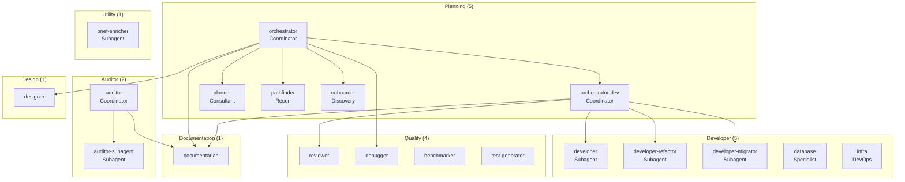

# Agent Reference

19 agents in total, organized into 7 families (planning, developer, auditor, quality, design, documentation, utility).
Each agent is defined in `agents/<family>/<id>.md` with a frontmatter declaring its metadata,
skills, and mode.

> See the [Glossary](../reference/glossary.en.md) for definitions of Agent, Bucket A/B, Skill, and other terms.

## Agent Hierarchy



> Standalone diagram source: [`docs/diagrams/agent-hierarchy.mermaid`](../diagrams/agent-hierarchy.mermaid)

---

## Agent Format

```markdown
---
id: <unique-identifier>
label: <DisplayedName>
description: <Short description — visible in AI tools>
mode: primary         # primary (default) | subagent
permission:
  question: allow     # optional — enables OpenCode's question tool (interactive primary agents only)
  skill: allow        # allow | deny — enables the native skill tool (Bucket B)
skills: [path/to/skill, ...]          # Bucket A — assembled inline at deploy time
native_skills: [path/to/skill, ...]   # Bucket B — deployed to .opencode/skills/, loaded on-demand
---

# <Title>

<Agent body>
```

| Field | Role |
|-------|------|
| `id` | Unique identifier, used by adapters and `oh agent` |
| `label` | Name displayed in the tool |
| `description` | Short phrase describing the role — appears in agent lists |
| `mode` | `primary` (default) or `subagent` — controls visibility in OpenCode |
| `permission.question` | `allow` — enables OpenCode's `question` tool for this agent. Reserved for interactive `primary` agents. Always paired with the `posture/tool-question` skill. |
| `permission.skill` | `allow` — enables the native `skill` tool so the agent can load Bucket B skills on-demand. Set to `deny` for coordinators/orchestrators that never need contextual skills. |
| `skills` | **Bucket A** — paths relative to `skills/`, injected inline at deploy time, always active from the first token. Workflow protocols, handoff formats, universal principles. |
| `native_skills` | **Bucket B** — paths relative to `skills/`, deployed to `.opencode/skills/<name>/SKILL.md`, loaded on-demand by the LLM via the `skill` tool. Domain standards, stack skills, checklists. |

See [ADR-010](./adr/010-hybrid-skills-architecture.en.md) for the rationale behind the Bucket A / Bucket B split.

### Primary / Subagent Modes

The `mode:` field controls how an agent is exposed in OpenCode:

| Mode | OpenCode |
|------|----------|
| `primary` | Visible in the Tab picker — present in `.opencode/agents/` |
| `subagent` | Listed in `opencode.json` with `"mode": "subagent"` — invocable by other agents, hidden in Tab picker. Present in `.opencode/agents/` with delegation-oriented description. |

The effective mode follows a priority: **project override** (`- Modes:` in `projects.md`) > **agent frontmatter** > **`primary`** (default).

To modify modes for a project without touching frontmatter: `oh agent mode <PROJECT_ID>`.

---

## Skill Assignment Matrix (source of truth)

This table is the authoritative reference for which skills each agent loads. It is generated from the actual agent frontmatter files. For skill descriptions, see [Skills reference](./skills.en.md).

> `shared/universal-guardrails` is Bucket A (inline) in **every** agent except `brief-enricher`.
> `shared/living-docs-enrichment` is Bucket B (native / on-demand) everywhere it appears.

### Planning family

| Agent | Bucket A (inline) | Bucket B (native / on-demand) |
|-------|-------------------|-------------------------------|
| **orchestrator** | `posture/coordination-only`, `posture/concision-posture`, `posture/retranscription-coordinateur`, `orchestrator/orchestrator-workflow-modes`, `orchestrator/orchestrator-handoff-format`, `orchestrator/orchestrator-protocol`, `developer/beads-plan`, `posture/tool-question`, `posture/tool-todowrite`, `planning/planner-handoff-format`, `shared/hub-workflow-reference` | `planning/pathfinder-handoff-format`, `design/design-handoff-format`, `auditor/audit-handoff-format`, `planning/onboarder-handoff-format`, `quality/debugger-handoff-format`, `documentarian/documentarian-handoff-format`, `shared/rtk-usage`, `orchestrator/orchestrator-recap-edge` |
| **orchestrator-dev** | `posture/coordination-only`, `posture/concision-posture`, `posture/retranscription-coordinateur`, `orchestrator/orchestrator-workflow-modes`, `orchestrator/orchestrator-dev-protocol`, `orchestrator/orchestrator-handoff-format`, `posture/tool-question`, `posture/tool-todowrite`, `developer/developer-handoff-format`, `reviewer/reviewer-handoff-format`, `documentarian/documentarian-handoff-format` | `orchestrator/orchestrator-dev-standalone`, `orchestrator/orchestrator-dev-subagent`, `developer/dev-drift-detection`, `orchestrator/session-state-protocol`, `shared/rtk-usage`, `orchestrator/orchestrator-dev-ticket-workflow`, `orchestrator/orchestrator-dev-parallel`, `orchestrator/orchestrator-dev-recap`, `orchestrator/orchestrator-dev-edge-cases` |
| **conductor** | `shared/universal-guardrails`, `posture/coordination-only`, `posture/concision-posture`, `posture/retranscription-coordinateur`, `posture/tool-question`, `posture/tool-todowrite`, `workflow/workflow-map` (generated from the workflow YAML) | `shared/rtk-usage`, `shared/team-awareness` |
| **planner** | `developer/beads-plan`, `planning/planner-workflow`, `planning/planner-handoff-format`, `planning/planner-design-templates`, `planning/planner-beads-templates`, `design/design-planner-format`, `adapters/gitlab-planner-protocol`, `posture/expert-posture`, `posture/concision-posture`, `posture/tool-question`, `shared/websearch-usage`, `shared/hub-workflow-reference` | `planning/planner-execution-modes`, `planning/websearch-stack-research`, `shared/rtk-usage`, `planning/planner-phase-0`, `planning/planner-phase-1`, `planning/planner-phase-2`, `planning/planner-phase-3-4`, `planning/planner-phase-5-6`, `planning/planner-patterns-protocol`, `shared/living-docs-enrichment` |
| **pathfinder** | `developer/beads-plan`, `planning/pathfinder-protocol`, `planning/pathfinder-handoff-format`, `adapters/gitlab-pathfinder-protocol`, `posture/concision-posture`, `posture/tool-question`, `shared/websearch-usage`, `shared/wiki-navigation` | `planning/pathfinder-execution-modes`, `planning/websearch-stack-research`, `shared/rtk-usage`, `shared/living-docs-enrichment` |
| **onboarder** | `planning/onboarder-workflow`, `planning/onboarder-handoff-format`, `planning/onboarder-profiles`, `adapters/gitlab-onboarder-protocol`, `posture/expert-posture`, `posture/tool-question`, `developer/beads-plan`, `developer/dev-standards-git`, `shared/websearch-usage`, `shared/wiki-navigation` | `planning/onboarder-execution-modes`, `planning/websearch-stack-research`, `shared/rtk-usage`, `planning/onboarder-phase-0`, `planning/onboarder-phase-1`, `planning/onboarder-phase-2`, `planning/onboarder-phase-3-4`, `planning/onboarder-phase-5`, `shared/living-docs-enrichment` |

### Developer family

| Agent | Bucket A (inline) | Bucket B (native / on-demand) |
|-------|-------------------|-------------------------------|
| **developer** | `developer/dev-standards-universal`, `developer/dev-standards-simplicity`, `developer/quick-fix`, `developer/beads-plan`, `developer/beads-dev`, `developer/developer-handoff-format`, `posture/subagent-concision-posture`, `shared/wiki-navigation`, `shared/context-mode-usage` | `developer/dev-standards-security`, `developer/dev-standards-git`, `developer/dev-standards-testing`, `reviewer/reviewer-reception`, `shared/rtk-usage`, `shared/living-docs-enrichment` |
| **developer-refactor** | *(same as developer)* | *(same as developer)* + `developer/dev-standards-refactoring` |
| **developer-migrator** | *(same as developer)* | *(same as developer)* + `developer/dev-standards-migration` |
| **database** | `developer/dev-standards-universal`, `posture/tool-question`, `shared/wiki-navigation` | `developer/dev-standards-security`, `shared/living-docs-enrichment` |
| **infra** | `developer/dev-standards-universal`, `posture/tool-question`, `shared/wiki-navigation` | `developer/dev-standards-security`, `shared/living-docs-enrichment` |

### Auditor family

| Agent | Bucket A (inline) | Bucket B (native / on-demand) |
|-------|-------------------|-------------------------------|
| **auditor** | `posture/coordination-only`, `posture/retranscription-coordinateur`, `auditor/auditor-workflow`, `auditor/audit-protocol-light`, `auditor/audit-handoff-format`, `posture/tool-question` | `auditor/auditor-execution-modes`, `shared/rtk-usage`, `shared/living-docs-enrichment` |
| **auditor-subagent** | `auditor/audit-protocol-light`, `posture/expert-posture`, `posture/subagent-concision-posture`, `auditor/audit-handoff-format`, `shared/websearch-usage`, `shared/wiki-navigation` | `auditor/websearch-cve-lookup`, `auditor/websearch-performance-research`, `shared/rtk-usage` |

### Quality family

| Agent | Bucket A (inline) | Bucket B (native / on-demand) |
|-------|-------------------|-------------------------------|
| **reviewer** | `developer/dev-standards-universal`, `reviewer/review-protocol`, `posture/concision-posture`, `posture/tool-question`, `reviewer/reviewer-handoff-format`, `shared/wiki-navigation` | `reviewer/reviewer-standalone`, `reviewer/reviewer-subagent`, `reviewer/reviewer-adversarial`, `reviewer/reviewer-edge-case`, `reviewer/review-merge`, `developer/dev-standards-security`, `developer/dev-standards-backend`, `developer/dev-standards-frontend`, `developer/dev-standards-frontend-data`, `developer/dev-standards-frontend-a11y`, `developer/dev-standards-testing`, `developer/dev-standards-git`, `shared/rtk-usage`, `shared/living-docs-enrichment` |
| **debugger** | `quality/debugger-workflow`, `quality/debugger-handoff-format`, `quality/debugger-forensic`, `quality/debugger-report-templates`, `posture/expert-posture`, `posture/tool-question`, `shared/wiki-navigation` | `quality/debugger-execution-modes`, `shared/rtk-usage`, `quality/debugger-phase-0-1`, `quality/debugger-phase-2-3`, `quality/debugger-phase-4-5`, `shared/living-docs-enrichment` |
| **benchmarker** | `developer/dev-standards-universal`, `posture/tool-question`, `shared/wiki-navigation` | `shared/living-docs-enrichment` |
| **test-generator** | `developer/dev-standards-universal`, `developer/dev-standards-testing`, `posture/tool-question`, `shared/wiki-navigation` | `shared/living-docs-enrichment` |

### Design family

| Agent | Bucket A (inline) | Bucket B (native / on-demand) |
|-------|-------------------|-------------------------------|
| **designer** | `designer/designer-protocol`, `developer/beads-plan`, `design/design-planner-format`, `design/design-handoff-format`, `posture/expert-posture`, `posture/tool-question`, `shared/websearch-usage` | `designer/ux-protocol`, `designer/ui-protocol`, `designer/figma-recon-protocol`, `designer/figma-deep-protocol`, `designer/designer-subagent`, `designer/designer-standalone`, `design/websearch-design-patterns`, `shared/rtk-usage`, `designer/design-principles`, `designer/ui-patterns-reference`, `designer/content-design`, `designer/tui-patterns` |

### Documentation family

| Agent | Bucket A (inline) | Bucket B (native / on-demand) |
|-------|-------------------|-------------------------------|
| **documentarian** | `developer/dev-standards-git`, `developer/beads-plan`, `developer/beads-dev`, `documentarian/doc-protocol`, `posture/expert-posture`, `posture/tool-question`, `documentarian/documentarian-handoff-format`, `shared/websearch-usage` | `documentarian/doc-standards`, `documentarian/doc-adr`, `documentarian/doc-api`, `documentarian/doc-changelog`, `documentarian/doc-slides`, `documentarian/doc-wiki-protocol`, `shared/skill-authoring-protocol`, `shared/rtk-usage` |

### Utility family

| Agent | Bucket A (inline) | Bucket B (native / on-demand) |
|-------|-------------------|-------------------------------|
| **brief-enricher** | *(none)* | *(none)* |

---

## Family — Coordinators

Agents that drive other agents without ever coding themselves.

### `onboarder`

| | |
|--|--|
| **Label** | Onboarder |
| **File** | `agents/planning/onboarder.md` |
| **Skills** | See [Skill Assignment Matrix](#skill-assignment-matrix-source-of-truth) — onboarder row |
| **Invocation** | `"Onboard yourself on this project"` / `"Discover this project"` / `"Before starting, explore the project"` |

Project discovery agent. Explores an existing project's codebase in 6 structured phases
(prerequisites check → adaptive exploration 7 profiles → questions → context report →
edge case detection → deliverables production). Produces `ONBOARDING.md`, `CONVENTIONS.md`
and optionally `projects.md`.

Detects edge cases: stack/conventions inconsistencies, known CVEs, hidden technical debt,
undocumented hybrid architecture. Produces a prioritized agent map in 3 levels
(priority by risk, recommended by stack, optional).

Read-only — never modifies files (except the deliverables it produces).
Never automatically triggers another agent — it suggests invocations, the user decides.

Invocable directly or through the `onboarding` workflow, offered by the `project-context`
precondition of `feature` and `cadrage` on a project without context.

**Phase 5 — Incremental enrichment:** when `ONBOARDING.md` and `CONVENTIONS.md` already exist (enriched by other agents), proposes incremental enrichment rather than a full overwrite. Delegates incremental updates to the `documentarian` via `task` (skill `living-docs-enrichment`). Full overwrite remains available with an explicit warning about losing accumulated enrichments.

---

### `orchestrator`

| | |
|--|--|
| **Label** | Orchestrator |
| **File** | `agents/planning/orchestrator.md` |
| **Skills** | See [Skill Assignment Matrix](#skill-assignment-matrix-source-of-truth) — orchestrator row |
| **Invocation** | `"Implement [feature]"` / `"Handle tickets [IDs]"` |

AI project manager. Drives the complete delivery of a feature by mobilizing all
necessary agents: design (`designer`), audit (auditor-*),
implementation (via orchestrator-dev). Enforces explicit checkpoints at each
phase. Never codes.

**Chain:** set by the session workflow (v5, `oh/v1`), no longer by the agent. The former entry modes A–E become
workflows: `feature` and `cadrage` (A/B), `onboarding` (C), `debug` (D), `ticket` and `quick` (E). The agent keeps
only its posture and contracts (transcription, invocation of and return from planning agents, routing delegated to
the planner).

Never routes directly to `developer-*` — always delegates to `orchestrator-dev`.

**Technical permissions:** `bash`, `read`, `edit`, `write` all disabled. Acts only via `task` (delegation) and `question` (checkpoints). List of invocable agents explicitly restricted in the frontmatter.

**Context injection:** project context (stack, conventions) is automatically injected into the session via the `instructions` field of `opencode.json` (valid cache `.opencode/context.json` or `ONBOARDING.md`/`CONVENTIONS.md`). The orchestrator never reads files directly — if context is absent from the session, it proposes the `onboarder`.

**Missing agent handling:** if a required agent is not deployed in the project, the orchestrator asks a structured question with options: deploy via `!oh deploy` without leaving OpenCode / use a substitute (substitution table by domain) / skip the ticket. Never silently falls back to another agent.

---

### `orchestrator-dev`

| | |
|--|--|
| **Label** | OrchestratorDev |
| **File** | `agents/planning/orchestrator-dev.md` |
| **Skills** | See [Skill Assignment Matrix](#skill-assignment-matrix-source-of-truth) — orchestrator-dev row |
| **Invocation** | `"Implement tickets [IDs]"` / `"Dev workflow for [feature]"` |

AI tech lead specialized in driving implementation. Takes a list of ready-to-implement
Beads tickets, routes to the `developer` agent with the appropriate domain specified in the
invocation prompt, supervises the review.
Three modes: `manual` (default), `semi-auto`, `auto`. Invocable standalone or from the `orchestrator`.

CP-2 (commit or fix?) is always manual in all modes.

`bd close`, `bd comments add`, and `bd update` are always executed by the `developer-*` agents in delegation prompts — never directly by `orchestrator-dev`. The orchestrator-dev only reads Beads tickets (`bd show`, `bd list`).

> See [ADR-006](./adr/006-orchestrator-configurable-mode.en.md) — modes apply to `orchestrator-dev` only.

---

### `auditor`

| | |
|--|--|
| **Label** | Auditor |
| **File** | `agents/auditor/auditor.md` |
| **Skills** | See [Skill Assignment Matrix](#skill-assignment-matrix-source-of-truth) — auditor row |
| **Invocation** | `"Audit [project/scope]"` / `"Audit [domain]"` |

Multi-domain audit coordinator. Drives audits in 5 structured phases: prerequisites check
(scope, stack, file access) → project context loading (reads `ONBOARDING.md` first, or
quick reconnaissance) → domain selection with stack compatibility check → delegation to
the `auditor-subagent` agent (invoked as many times as needed, one domain per invocation) → consolidation executive summary (global score, top 5 priority
actions, cross-cutting recommendations).

Produces a multi-domain executive summary. Read-only — never modifies files.

---

## Family — Audit Agents

Single subagent of the auditor (ADR-017). Read-only. Invocable via the auditor or directly.

| Agent | File | Domain | References |
|-------|------|--------|-----------|
| `auditor-subagent` | `agents/auditor/auditor-subagent.md` | Security, Performance, Accessibility, Ecodesign, Architecture, Privacy, Observability — domain specified at invocation | OWASP Top 10, Core Web Vitals, WCAG 2.1 AA / RGAA 4.1, RGESN / GreenIT, SOLID / Clean Architecture, GDPR / EDPB / CNIL, RED method / SLOs / OpenTelemetry |

The `auditor-subagent` receives the domain + `native_skill` to load in the invocation prompt from the `auditor` coordinator.
It injects `auditor/audit-protocol-light` (common lightweight report format)
+ its domain-specific skill (`auditor/audit-<domain>`) loaded on-demand
+ `auditor/audit-handoff-format` (structured return contract when invoked from the orchestrator).

All reports produced include a **`### Findings to document`** section
at the end — findings to capitalize in `ONBOARDING.md` / `CONVENTIONS.md`.
This section is consolidated by the `auditor` coordinator in Phase 4 (skill `living-docs-enrichment`).
The agent never makes `task` calls — its read-only constraint is strict.

---

## Family — Developer Agents

1 generic agent specialized by domain at invocation time.
Follows the same Beads workflow (`bd claim → implement → test → bd close`).

The **domain** and the **native_skills to load** are passed by `orchestrator-dev` in the invocation prompt.
Each `task` instance runs in its own isolated session — parallel invocations with different domains are fully independent.

Common skills for all domains: `dev-standards-universal`, `dev-standards-simplicity`, `dev-standards-security`, `dev-standards-git`, `dev-standards-testing`, `beads-plan`, `beads-dev`, `developer/developer-handoff-format`, `shared/living-docs-enrichment`.

| Agent | File | Domain | Specific Native Skills |
|-------|------|--------|----------------------|
| `developer` | `agents/developer/developer.md` | frontend, backend, fullstack, api, mobile, data, devops, platform, security — domain passed at invocation | Domain skills injected via invocation prompt (see `orchestrator-dev-protocol`) |

**Separate agents (distinct workflow):**

| Agent | File | Domain |
|-------|------|--------|
| `developer-refactor` | `agents/developer/developer-refactor.md` | Structural refactoring only — never changes observable behavior |
| `developer-migrator` | `agents/developer/developer-migrator.md` | Incremental migrations — framework upgrades, major versions, EOL dependencies |
| `database` | `agents/developer/database.md` | DB specialist: schema design, migration planning, query optimization, DB security audit |
| `infra` | `agents/developer/infra.md` | IaC specialist: Terraform/K8s/Helm review, cloud cost estimation, IaC security (tfsec, checkov) |

> See [ADR-013](./adr/013-developer-agent-consolidation.en.md) for the consolidation decision.
> See [ADR-002](./adr/002-developer-segmentation.en.md) (superseded) for the previous segmentation rationale.

**Domain → native_skills mapping (summary):**

| Domain | Native skills |
|--------|--------------|
| `frontend` | `dev-standards-frontend`, `dev-standards-frontend-a11y`, `dev-standards-testing` + detected stacks |
| `backend` | `dev-standards-backend`, `dev-standards-api`, `dev-standards-testing` + detected stacks |
| `fullstack` | `dev-standards-frontend`, `dev-standards-frontend-a11y`, `dev-standards-backend`, `dev-standards-api`, `dev-standards-testing` + detected stacks |
| `api` | `dev-standards-backend`, `dev-standards-api`, `dev-standards-testing` |
| `mobile` | `dev-standards-testing` + detected mobile stacks |
| `data` | `dev-standards-testing` + detected data stacks |
| `devops` | `dev-standards-devops` + detected infra stacks |
| `platform` | `dev-standards-devops` + detected platform stacks |
| `security` | `dev-standards-security-hardening`, `dev-standards-backend`, `dev-standards-testing` |
| `go` | `dev-standards-golang` + detected stacks |
| `rust` | `dev-standards-rust` + detected stacks |

**`database` agent — modes:**

| Mode | Trigger | Output |
|------|---------|--------|
| `schema` | Schema design requested | ERD, table definitions, constraints, indexes |
| `migration` | Migration planning requested | Ordered migration plan, rollback strategy |
| `query` | Query optimization requested | Explain plan analysis, index recommendations |
| `audit` | DB security audit requested | Security findings, privilege review, encryption audit |

**`infra` agent — modes:**

| Mode | Trigger | Output |
|------|---------|--------|
| `review` | IaC review requested (Terraform/K8s/Helm) | Structured review by severity |
| `cost` | Cloud cost estimation requested | Resource cost breakdown, optimization recommendations |
| `security` | IaC security scan requested | tfsec/checkov findings, remediation |
| `drift` | Drift detection requested | Delta between declared state and actual state |

**Post-ticket — Living docs enrichment:** after each `bd close`, identifies patterns, conventions, or technical constraints discovered during implementation that are absent from `CONVENTIONS.md` or `ONBOARDING.md`, and proposes to the user to capitalize them (skill `living-docs-enrichment`).

---

## Family — Design Agents

UX/UI design agent. Works upstream of implementation.
Never codes. Invocable directly or via the `orchestrator`.

### `designer`

| | |
|--|--|
| **Label** | Designer |
| **File** | `agents/design/designer.md` |
| **Mode** | `primary` |
| **Permissions** | No `write`, no `edit`. `bash` deny-by-default (allowlist: `bd show *`, `bd list *`). MCP Figma access (sole agent with this permission). |
| **Skills (inline)** | `designer/designer-protocol`, `design/design-planner-format`, `design/design-handoff-format` |
| **Skills (native)** | `designer/ux-protocol`, `designer/ui-protocol`, `designer/figma-recon-protocol`, `designer/figma-deep-protocol`, `designer/designer-execution-modes` |
| **Invocation** | `"Explore Figma for [feature]"` / `"UX spec for [ticket]"` / `"UI spec for [component]"` / `"Full design spec for [feature]"` |

Unified design agent. Operates in four modes specified at invocation:

| Mode | Trigger | Output |
|------|---------|--------|
| `recon` | Figma exploration requested (by planner/pathfinder/onboarder via `task`) | Figma findings: components, tokens, design system detected |
| `ux` | UX spec requested | User flows, heuristics (Nielsen), acceptance criteria — no graphic mockups |
| `ui` | UI spec requested | Design tokens, component variants/states, UI guidelines for `developer-frontend` |
| `ux+ui` | Full design spec requested | Complete UX phase then UI phase in a single session |

**Sole Figma agent:** `designer` is the only agent in the hub with MCP Figma access.
`planner`, `pathfinder`, and `onboarder` delegate all Figma needs to `designer` via
`task` (mode `recon`) instead of calling the MCP directly.

**When invoked from `planner` (Phase 1.5 — optional design delegation):** produces
the spec in standardized format `## SPEC UX — [feature]` and/or `## SPEC UI — [ComponentName]`
for automatic reintegration into the plan (no `bd close` — the planner resumes control).

**Delegation:** invoked by `orchestrator`, `planner`, `pathfinder`, `onboarder`.

---

## Family — Quality Agents

Agents dedicated to code quality, invocable standalone or via the orchestrator.

### `reviewer`

| | |
|--|--|
| **Label** | CodeReviewer |
| **File** | `agents/quality/reviewer.md` |
| **Skills** | See [Skill Assignment Matrix](#skill-assignment-matrix-source-of-truth) — reviewer row |
| **Invocation** | Branch name / PR URL + optionally `bd show <ID>` (the reviewer fetches the diff itself via `git diff`) |

Analyzes PR/MR diffs. Produces a structured report by severity (Critical /
Major / Minor / Suggestion / Positive points). Read-only — never modifies files.

**Multi-mode review:** supports three review modes that can be combined:
- **Standard** — 6-category checklist, calibrated severity (default for per-ticket reviews)
- **Adversarial** — maximum skepticism posture, min. 10 findings, dangerous assumptions, architecture challenges, confidence score (mandatory at CP-feature, optional via `oh review`)
- **Edge-case** — exhaustive unhandled execution path hunting (available everywhere as an option)

Combined modes (`standard+adversarial`, `all`) launch **parallel independent sessions** with full context isolation, then merge results via the `review-merge` skill (deduplication, severity hierarchy, provenance tagging).

**Post-report — Living docs enrichment:** after producing the review report, identifies conventions and patterns observed in the diff that are absent from `CONVENTIONS.md` or `ONBOARDING.md`, and proposes to capitalize them. If accepted, delegates writing to the `documentarian` via `task` (skill `living-docs-enrichment`).

---

### `debugger`

| | |
|--|--|
| **Label** | Debugger |
| **File** | `agents/quality/debugger.md` |
| **Skills** | See [Skill Assignment Matrix](#skill-assignment-matrix-source-of-truth) — debugger row |
| **Invocation** | `"This bug: [stacktrace]"` / `"Analyze these logs: [logs]"` |

Diagnoses the root cause of a bug in 6 structured phases: artefact verification
(Phase 0 — pauses if insufficient) → contextual exploration → complementary questions
(optional) → 4-step diagnosis (reproduction/isolation/identification/graded hypothesis
high/medium/low) → edge case detection (race conditions, environment-specific, data,
configuration, dependencies, regression). Produces a diagnostic report with graded
hypotheses. Creates a Beads correction ticket after explicit confirmation.
Never fixes the bug.

**Phase 5 — Living docs enrichment:** after the report, identifies blind spots uncovered by the diagnosis and error patterns worth remembering, then proposes to the user to enrich `ONBOARDING.md` and/or `CONVENTIONS.md`. If accepted, delegates writing to the `documentarian` via `task` (skill `living-docs-enrichment`). Cannot invoke the `documentarian` without explicit user confirmation.

> See [ADR-004](./adr/004-qa-debugger-separation.en.md).

---

### `benchmarker`

| | |
|--|--|
| **Label** | Benchmarker |
| **File** | `agents/quality/benchmarker.md` |
| **Invocation** | `"Benchmark [target]"` / `"Lighthouse audit [url]"` / `"Load test [endpoint]"` |

Performance benchmarking specialist. Operates in four modes:

| Mode | Tools | Output |
|------|-------|--------|
| `frontend` | Lighthouse, WebPageTest | Core Web Vitals report, LCP/CLS/FID analysis, optimization recommendations |
| `api` | k6, autocannon, wrk | Throughput/latency/error-rate report, percentile breakdown, bottleneck identification |
| `go` | pprof, benchstat | CPU/memory profile, flame graph analysis, benchmark comparison |
| `python` | py-spy, memory-profiler | Sampling profile, hot functions, memory leak detection |

Read-only — never modifies files. Produces structured benchmark reports with baseline comparisons and actionable recommendations.

---

### `test-generator`

| | |
|--|--|
| **Label** | TestGenerator |
| **File** | `agents/quality/test-generator.md` |
| **Invocation** | `"Generate tests for [target]"` / `"Coverage gap analysis for [module]"` / `"Property tests for [function]"` |

Test generation specialist. Operates in four modes:

| Mode | Output |
|------|--------|
| `gap-analysis` | Coverage gap report: uncovered lines, branches, edge cases — prioritized by risk |
| `unit` | Unit tests targeting uncovered functions/methods — follows existing test conventions |
| `integration` | Integration tests covering component boundaries and external dependencies |
| `property` | Property-based tests (hypothesis/fast-check/QuickCheck) for invariant verification |

Writes tests directly. Follows the project's existing testing conventions and stack (detected from `dev-standards-testing` and stack skills). Never modifies production code.

---

## Family — Planning Agents

### `planner`

| | |
|--|--|
| **Label** | ProjectPlanner |
| **File** | `agents/planning/planner.md` |
| **Skills** | See [Skill Assignment Matrix](#skill-assignment-matrix-source-of-truth) — planner row |
| **Invocation** | Natural language feature description |

Functional and technical consultant who analyzes the project context before planning.
Workflow in 7 phases: prerequisites check → contextual exploration (codebase, tickets,
UX/UI signals) → optional design delegation (Phase 1.5) → complementary questions →
hierarchical plan (epics → tickets, deduced and justified priorities) → edge case
detection (duplicates, oversized tickets, circular dependencies) → Beads creation with
full enrichment → optional ai-delegated delegation (Phase 5.5) → final verification.

Creates epics in Beads if > 5 tickets (asks otherwise), uses `--parent` and `--deps`
for hierarchy and dependencies. Handles contingencies: scope change, ticket splitting,
late dependency, duplicate. Never codes. Iterative phases with backwards possible
(max 3 iterations per phase).

**Phase 1.5 — Design delegation (optional):** when UX or UI signals are detected
in Phase 1, the planner offers 3 options to the user:
- **Option A** (`"invoke design"`) — directly invokes `designer`
  as a sub-agent (mode `ux`, `ui`, or `ux+ui`), awaits the structured block `## SPEC UX/UI — …` and integrates the spec into the plan.
- **Option B** — the user invokes the agent themselves and pastes the spec back.
- **Option C** (`"continue without design"`) — proceeds with available context,
  partial `--design` fields + `bd comments add` to trace the missing spec.

**Phase 6 — Living docs enrichment:** after plan validation, identifies architectural patterns and conventions observed in the codebase but absent from `ONBOARDING.md`/`CONVENTIONS.md`, and proposes to the user to capitalize them. If accepted, delegates writing to the `documentarian` via `task` (skill `living-docs-enrichment`).

---

## Family — Documentation Agents

### `documentarian`

| | |
|--|--|
| **Label** | Documentarian |
| **File** | `agents/documentation/documentarian.md` |
| **Skills** | See [Skill Assignment Matrix](#skill-assignment-matrix-source-of-truth) — documentarian row |
| **Invocation** | `"Document [topic]"` / `"Create an ADR for [decision]"` / `"Update the CHANGELOG"` / `"What's missing in the docs?"` / `"Create a presentation for [topic]"` |

Writes and updates technical, functional, architectural documentation, API docs,
changelogs, and Marp presentations. Systematically explores existing structure before writing.
Adapts to the format in place — recommends improvements without imposing them.
Never changes a format without explicit confirmation.

Guiding principle: **explore → adapt or propose → wait if needed → write**.

---

## Rules Common to All Agents

- **Read-only agents**: auditor-subagent, reviewer, debugger, designer, benchmarker — never modify files
- **Agents that write code**: developer-*, test-generator — only modify files in their domain
- **Agents that write documentation**: documentarian — only modifies documentation files (all other agents may propose enrichments to `ONBOARDING.md`/`CONVENTIONS.md` via the `living-docs-enrichment` skill, always delegated to `documentarian` after explicit user confirmation)
- **Agents that create tickets**: planner (feature tickets), debugger (bug tickets after confirmation)
- **Agents that read tickets**: all can do `bd show <ID>` to contextualize their work
- **Coordinator agents**: orchestrator, orchestrator-dev, auditor — never code, drive other agents
- **Discovery agents**: onboarder — read-only, explores and reports, doesn't drive other agents
- **`primary` agents**: orchestrator, orchestrator-dev, planner, auditor, designer, documentarian, onboarder, debugger, reviewer, benchmarker, test-generator, database, infra — directly visible to the user
- **`subagent` agents**: `developer`, `developer-refactor`, `developer-migrator` and `auditor-subagent` — invocable by coordinator agents
