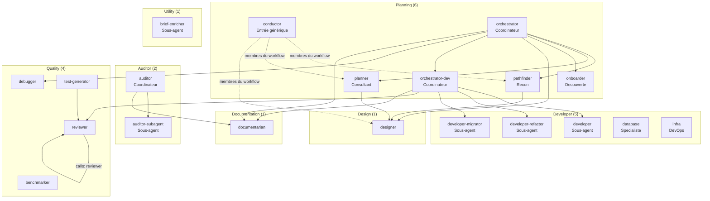

> [Read in English](agents.en.md)

# Référence des agents

20 agents au total, organisés en 7 familles (planning, developer, auditor, quality, design, documentation, utility).
Chaque agent est défini dans `agents/<famille>/<id>.md` avec un frontmatter déclarant ses métadonnées,
ses permissions, ses skills et son mode. Ce dossier `agents/` est la source de vérité de cette page.

> Voir le [Glossaire](../reference/glossary.fr.md) pour les definitions d'Agent, Bucket A/B, Skill et autres termes.

## Les agents dans une session v5

En v5, ce n'est plus l'agent qui décide de l'enchaînement : c'est le **workflow** de la session
(YAML `apiVersion: oh/v1`, [ADR-039](./adr/039-declarative-workflows-oh-v1.fr.md)).

- **Agents membres** : la carte `agents:` du workflow liste les agents de la session, avec leur rôle
  (`workflow` dans la chaîne, `independent` disponible à la demande, `disabled` retiré) et, au besoin,
  un `mode` (`primary` / `subagent`) qui remplace celui du frontmatter.
- **Ordre** : `after:` verrouille un agent jusqu'au passage d'un checkpoint (ou jusqu'à ce qu'un autre agent ait tourné).
  Tant que le verrou n'est pas levé, oh refuse la délégation vers cet agent ([ADR-042](./adr/042-checkpoints-headless-decisions.fr.md)).
- **Délégations** : `calls:` fixe qui peut lancer qui. Sans `calls:`, le graphe vient de la permission `task`
  du frontmatter, restreinte aux membres du workflow. Détails : [Délégation inter-agents](./task-delegation.fr.md).
- **Checkpoints** : déclarés dans le workflow (`checkpoints:`), avec un comportement par mode
  (`pause`, `auto`, `skip`, `conditional`). L'agent les signale avec l'outil MCP `workflow_checkpoint` ;
  oh tient l'état et pose les décisions ([ADR-042](./adr/042-checkpoints-headless-decisions.fr.md)).
- **Agent d'entrée** : celui de `entry.agent` du workflow, ou `conductor` par défaut (workflows `cadrage`, `sweep`).
  Le workflow `libre` laisse choisir l'agent d'entrée (`oh run libre --agent <id>`).
- **Monde fermé** : un agent ne voit que les agents et les skills du **paquet de session** construit depuis le
  workflow ([ADR-043](./adr/043-session-bundle-deploy-removal.fr.md)). Les agents natifs d'opencode sont
  désactivés, et la vérification `Attest` bloque le démarrage si quelque chose d'autre est visible
  ([ADR-041](./adr/041-closed-world-isolation.fr.md)).

Conséquence : les permissions `task` du frontmatter décrivent ce qu'un agent *peut* déléguer dans l'absolu.
Dans une session, seuls les agents du paquet sont joignables. Pour voir le contenu réel d'une session :
`oh workflow show <id>` et `oh bundle show <id>`.

## Hierarchie des agents

Le schéma montre les délégations permises par le frontmatter (`permission.task`). Dans une session, seules
celles qui relient deux membres du workflow restent possibles. `documentarian` est aussi délégable par la plupart
des agents qui écrivent (base `developer-rw`) et par `planner`, `pathfinder`, `debugger`, `reviewer`,
`benchmarker`, `test-generator` : ces liens ne sont pas tous dessinés.



> Source du diagramme : [`docs/diagrams/agent-hierarchy.mermaid`](../diagrams/agent-hierarchy.mermaid)

---

## Format d'un agent

```markdown
---
id: <identifiant-unique>
label: <NomAffiché>
description: <Description courte — visible dans les outils IA>
mode: primary         # primary (défaut) | subagent
model: <modèle>       # dernier niveau de la cascade des modèles
permission_base: <base>   # optionnel — permissions/<base>.yaml (coordinator, developer-rw, readonly-code)
permission:
  question: allow     # optionnel — autorise l'outil question d'OpenCode (agents primary interactifs uniquement)
  skill: allow        # allow | deny — active l'outil skill natif (Bucket B)
  task:               # agents que cet agent peut lancer (restreint ensuite au workflow)
    "*": deny
    "documentarian": allow
mcpServers: [gitlab]  # optionnel — MCP utilisés par l'agent
skills: [chemin/vers/skill, ...]          # Bucket A — assemblées inline à la construction du paquet de session
native_skills: [chemin/vers/skill, ...]   # Bucket B — livrées dans skills/ du paquet de session, chargées à la demande
---

# <Titre>

<Corps de l'agent>
```

| Champ | Rôle |
|-------|------|
| `id` | Identifiant unique, utilisé par les workflows (`agents:`, `entry.agent`, `calls:`) et dans le paquet de session |
| `label` | Nom affiché dans l'outil |
| `description` | Phrase courte décrivant le rôle — apparaît dans les listes d'agents |
| `mode` | `primary` (défaut) ou `subagent` — contrôle la visibilité dans OpenCode ; le workflow peut le remplacer |
| `model` | Modèle par défaut, dernier niveau de la cascade (workflow·agent > workflow > projet·agent > … > frontmatter) |
| `permission_base` | Base de permissions (`permissions/<base>.yaml`) fusionnée avec `permission:` ; un seul niveau d'héritage |
| `permission.question` | `allow` — active l'outil `question` d'OpenCode pour cet agent. Réservé aux agents `primary` interactifs. Toujours associé à la skill `posture/tool-question`. |
| `permission.skill` | `allow` — active l'outil `skill` natif pour que l'agent puisse charger les skills Bucket B à la demande. En monde fermé, seules les skills du paquet sont autorisées. |
| `permission.task` | Agents que cet agent peut lancer. Dans une session, la liste est restreinte aux membres du workflow (ou remplacée par `calls:`). |
| `skills` | **Bucket A** — chemins relatifs à `skills/`, injectés inline à la construction du paquet de session, toujours actifs dès le premier token. Protocoles de workflow, formats de handoff, principes universels. |
| `native_skills` | **Bucket B** — chemins relatifs à `skills/`, livrés dans le paquet de session sous `skills/<name>/SKILL.md`, chargés à la demande par le LLM via l'outil `skill`. Standards de domaine, stack skills, checklists. |

Voir [ADR-010](./adr/010-hybrid-skills-architecture.fr.md) pour le raisonnement derrière la séparation Bucket A / Bucket B.

### Modes primary / subagent

Le champ `mode:` contrôle comment un agent est exposé dans OpenCode :

| Mode | OpenCode |
|------|----------|
| `primary` | Visible dans le Tab picker de la session — présent dans `agents/` du paquet de session |
| `subagent` | Invocable par d'autres agents du paquet, invisible dans le Tab picker. Présent dans `agents/` du paquet de session avec une description orientée délégation. |

Le mode effectif suit une priorité : **workflow** (`agents.<id>.mode`) > **frontmatter agent** > **`primary`** (défaut).
Exemple : dans `feature`, `planner` et `reviewer` sont en `subagent` ; dans `quick`, `developer` passe en `primary`.
L'agent d'entrée doit être `primary`.

---

## Inventaire des agents

Relevé des frontmatter de `agents/`.

| Famille | Agent | Mode (frontmatter) | Base de permissions | MCP |
|---------|-------|--------------------|---------------------|-----|
| planning | `conductor` | `primary` | `coordinator` | — |
| planning | `orchestrator` | `primary` | — | — |
| planning | `orchestrator-dev` | `primary` | — | — |
| planning | `planner` | `primary` | — | `gitlab` |
| planning | `pathfinder` | `primary` | — | `gitlab` |
| planning | `onboarder` | `primary` | — | `gitlab` |
| developer | `developer` | `subagent` | `developer-rw` | — |
| developer | `developer-refactor` | `subagent` | `developer-rw` | — |
| developer | `developer-migrator` | `subagent` | `developer-rw` | — |
| developer | `database` | `primary` | `developer-rw` | — |
| developer | `infra` | `primary` | `developer-rw` | — |
| auditor | `auditor` | `primary` | `coordinator` | — |
| auditor | `auditor-subagent` | `subagent` | `readonly-code` | — |
| quality | `reviewer` | `primary` | — | — |
| quality | `debugger` | `primary` | — | — |
| quality | `benchmarker` | `primary` | — | — |
| quality | `test-generator` | `primary` | `developer-rw` | — |
| design | `designer` | `primary` | — | `figma` |
| documentation | `documentarian` | `primary` | — | — |
| utility | `brief-enricher` | `subagent` | — | — |

---

## Matrice d'assignation des skills (source de verite)

Ce tableau est la reference faisant autorite pour les skills charges par chaque agent. Il est relevé dans les frontmatter reels des agents. Pour les descriptions des skills, voir [Reference des skills](./skills.fr.md).

> `shared/universal-guardrails` est Bucket A (inline) dans **chaque** agent sauf `brief-enricher` : il n'est pas répété dans les tableaux.
> `shared/team-awareness` et `shared/team-policies-enforcement` sont Bucket B dans **chaque** agent, sauf `conductor` (seulement `shared/team-awareness`) : ils ne sont pas répétés non plus.
> `shared/living-docs-enrichment` est Bucket B (natif / a la demande) partout ou il apparait.

### Famille planning

| Agent | Bucket A (inline) | Bucket B (natif / a la demande) |
|-------|-------------------|-------------------------------|
| **conductor** | `posture/coordination-only`, `posture/concision-posture`, `posture/retranscription-coordinateur`, `posture/tool-question`, `posture/tool-todowrite`, `workflow/workflow-map` (générée depuis le YAML du workflow) | `shared/rtk-usage` |
| **orchestrator** | `posture/coordination-only`, `posture/concision-posture`, `posture/retranscription-coordinateur`, `orchestrator/orchestrator-workflow-modes`, `orchestrator/orchestrator-handoff-format`, `orchestrator/orchestrator-protocol`, `posture/tool-question`, `posture/tool-todowrite`, `planning/planner-handoff-format`, `shared/hub-workflow-reference` | `planning/pathfinder-handoff-format`, `design/design-handoff-format`, `auditor/audit-handoff-format`, `planning/onboarder-handoff-format`, `quality/debugger-handoff-format`, `documentarian/documentarian-handoff-format`, `shared/rtk-usage`, `orchestrator/orchestrator-recap-edge`, `developer/beads-plan`, `orchestrator/takeover-context-protocol` |
| **orchestrator-dev** | `posture/coordination-only`, `posture/concision-posture`, `posture/retranscription-coordinateur`, `orchestrator/orchestrator-workflow-modes`, `orchestrator/orchestrator-dev-protocol`, `orchestrator/orchestrator-handoff-format`, `posture/tool-question`, `posture/tool-todowrite`, `developer/developer-handoff-format`, `reviewer/reviewer-handoff-format`, `documentarian/documentarian-handoff-format` | `orchestrator/orchestrator-dev-standalone`, `orchestrator/orchestrator-dev-subagent`, `developer/dev-drift-detection`, `orchestrator/session-state-protocol`, `shared/rtk-usage`, `orchestrator/orchestrator-dev-ticket-workflow`, `orchestrator/orchestrator-dev-parallel`, `orchestrator/orchestrator-dev-recap`, `orchestrator/orchestrator-dev-edge-cases`, `orchestrator/error-recovery-protocol`, `orchestrator/team-coordination`, `orchestrator/takeover-context-protocol`, `orchestrator/parallel-coordination` |
| **planner** | `planning/planner-workflow`, `planning/planner-handoff-format`, `design/design-planner-format`, `adapters/gitlab-planner-protocol`, `posture/concision-posture`, `posture/tool-question`, `shared/hub-workflow-reference` | `planning/planner-execution-modes`, `planning/websearch-stack-research`, `shared/rtk-usage`, `planning/planner-phase-0`, `planning/planner-phase-1`, `planning/planner-phase-2`, `planning/planner-phase-3-4`, `planning/planner-phase-5-6`, `planning/planner-patterns-protocol`, `shared/living-docs-enrichment`, `shared/websearch-usage`, `planning/planner-design-templates`, `planning/planner-beads-templates`, `developer/beads-plan`, `posture/expert-posture` |
| **pathfinder** | `developer/beads-plan`, `planning/pathfinder-protocol`, `planning/pathfinder-handoff-format`, `adapters/gitlab-pathfinder-protocol`, `posture/concision-posture`, `posture/tool-question`, `shared/websearch-usage`, `shared/wiki-navigation` | `planning/pathfinder-execution-modes`, `planning/websearch-stack-research`, `shared/rtk-usage`, `shared/living-docs-enrichment` |
| **onboarder** | `planning/onboarder-workflow`, `planning/onboarder-handoff-format`, `planning/onboarder-profiles`, `adapters/gitlab-onboarder-protocol`, `posture/tool-question`, `developer/dev-standards-git`, `shared/wiki-navigation` | `planning/onboarder-execution-modes`, `planning/websearch-stack-research`, `shared/rtk-usage`, `planning/onboarder-phase-0`, `planning/onboarder-phase-1`, `planning/onboarder-phase-2`, `planning/onboarder-phase-3-4`, `planning/onboarder-phase-5`, `shared/living-docs-enrichment`, `shared/websearch-usage`, `developer/beads-plan`, `posture/expert-posture` |

### Famille developer

| Agent | Bucket A (inline) | Bucket B (natif / a la demande) |
|-------|-------------------|-------------------------------|
| **developer** | `developer/dev-standards-universal`, `developer/dev-standards-simplicity`, `developer/quick-fix`, `developer/beads-dev`, `developer/developer-handoff-format`, `posture/subagent-concision-posture`, `shared/wiki-navigation`, `shared/context-mode-usage` | `developer/dev-standards-security`, `developer/dev-standards-git`, `developer/dev-standards-testing`, `reviewer/reviewer-reception`, `shared/rtk-usage`, `shared/living-docs-enrichment`, `developer/beads-plan` |
| **developer-refactor** | `developer/dev-standards-universal`, `developer/dev-standards-simplicity`, `developer/quick-fix`, `developer/beads-plan`, `developer/beads-dev`, `developer/developer-handoff-format`, `posture/subagent-concision-posture`, `shared/wiki-navigation`, `shared/context-mode-usage` | `developer/dev-standards-security`, `developer/dev-standards-testing`, `developer/dev-standards-git`, `developer/dev-standards-refactoring`, `shared/rtk-usage`, `shared/living-docs-enrichment` |
| **developer-migrator** | *(identique a developer-refactor)* | `developer/dev-standards-security`, `developer/dev-standards-testing`, `developer/dev-standards-git`, `developer/dev-standards-migration`, `shared/rtk-usage`, `shared/living-docs-enrichment` |
| **database** | `developer/dev-standards-universal`, `posture/tool-question`, `shared/wiki-navigation` | `developer/dev-standards-security`, `shared/living-docs-enrichment` |
| **infra** | `developer/dev-standards-universal`, `posture/tool-question`, `shared/wiki-navigation` | `developer/dev-standards-security`, `shared/living-docs-enrichment` |

### Famille auditor

| Agent | Bucket A (inline) | Bucket B (natif / a la demande) |
|-------|-------------------|-------------------------------|
| **auditor** | `posture/coordination-only`, `posture/retranscription-coordinateur`, `auditor/auditor-workflow`, `auditor/audit-protocol-light`, `auditor/audit-handoff-format`, `posture/tool-question` | `auditor/auditor-execution-modes`, `shared/rtk-usage`, `shared/living-docs-enrichment` |
| **auditor-subagent** | `auditor/audit-protocol-light`, `posture/subagent-concision-posture`, `auditor/audit-handoff-format`, `shared/wiki-navigation` | `auditor/websearch-cve-lookup`, `auditor/websearch-performance-research`, `shared/rtk-usage`, `posture/expert-posture`, `shared/websearch-usage` |

### Famille quality

| Agent | Bucket A (inline) | Bucket B (natif / a la demande) |
|-------|-------------------|-------------------------------|
| **reviewer** | `developer/dev-standards-universal`, `reviewer/review-protocol`, `posture/concision-posture`, `posture/tool-question`, `reviewer/reviewer-handoff-format`, `shared/wiki-navigation` | `reviewer/reviewer-standalone`, `reviewer/reviewer-subagent`, `reviewer/reviewer-adversarial`, `reviewer/reviewer-edge-case`, `reviewer/review-merge`, `developer/dev-standards-security`, `developer/dev-standards-backend`, `developer/dev-standards-frontend`, `developer/dev-standards-frontend-data`, `developer/dev-standards-frontend-a11y`, `developer/dev-standards-testing`, `developer/dev-standards-git`, `developer/dev-standards-api`, `developer/dev-standards-devops`, `shared/rtk-usage`, `shared/living-docs-enrichment` |
| **debugger** | `quality/debugger-workflow`, `quality/debugger-handoff-format`, `quality/debugger-forensic`, `quality/debugger-report-templates`, `posture/tool-question`, `shared/wiki-navigation` | `quality/debugger-execution-modes`, `shared/rtk-usage`, `quality/debugger-phase-0-1`, `quality/debugger-phase-2-3`, `quality/debugger-phase-4-5`, `shared/living-docs-enrichment`, `posture/expert-posture` |
| **benchmarker** | `developer/dev-standards-universal`, `posture/tool-question`, `shared/wiki-navigation` | `shared/living-docs-enrichment` |
| **test-generator** | `developer/dev-standards-universal`, `developer/dev-standards-testing`, `posture/tool-question`, `shared/wiki-navigation` | `shared/living-docs-enrichment` |

### Famille design

| Agent | Bucket A (inline) | Bucket B (natif / a la demande) |
|-------|-------------------|-------------------------------|
| **designer** | `designer/designer-protocol`, `design/design-planner-format`, `design/design-handoff-format`, `posture/tool-question` | `designer/ux-protocol`, `designer/ui-protocol`, `designer/figma-recon-protocol`, `designer/figma-deep-protocol`, `designer/prototype-protocol`, `designer/designer-subagent`, `designer/designer-standalone`, `design/websearch-design-patterns`, `shared/rtk-usage`, `designer/design-principles`, `designer/ui-patterns-reference`, `designer/content-design`, `designer/tui-patterns`, `shared/websearch-usage`, `developer/beads-plan`, `posture/expert-posture` |

### Famille documentation

| Agent | Bucket A (inline) | Bucket B (natif / a la demande) |
|-------|-------------------|-------------------------------|
| **documentarian** | `developer/dev-standards-git`, `developer/beads-dev`, `documentarian/doc-protocol`, `posture/tool-question`, `documentarian/documentarian-handoff-format` | `documentarian/doc-standards`, `documentarian/doc-adr`, `documentarian/doc-api`, `documentarian/doc-changelog`, `documentarian/doc-slides`, `documentarian/doc-wiki-protocol`, `shared/skill-authoring-protocol`, `shared/rtk-usage`, `shared/websearch-usage`, `developer/beads-plan`, `posture/expert-posture` |

### Famille utility

| Agent | Bucket A (inline) | Bucket B (natif / a la demande) |
|-------|-------------------|-------------------------------|
| **brief-enricher** | *(aucun)* | *(aucun en dehors des skills d'équipe)* |

---

## Famille — Coordinateurs

Agents qui pilotent d'autres agents sans jamais coder eux-mêmes.

### `conductor`

| | |
|--|--|
| **Label** | Conductor |
| **Fichier** | `agents/planning/conductor.md` |
| **Mode** | `primary` |
| **Permissions** | Base `coordinator` : pas de `bash`, pas d'`edit` ni de `write`. `task` ouvert sur `*` dans le frontmatter, restreint par le paquet au graphe du workflow. `question` et `todowrite` autorisés. |
| **Skills** | Voir [Matrice d'assignation des skills](#matrice-dassignation-des-skills-source-de-verite) — ligne conductor |
| **Invocation** | Agent d'entrée par défaut d'un workflow sans `entry.agent` (`cadrage`, `sweep`) |

Agent générique de coordination des workflows. Il ne contient aucun enchaînement en dur : il suit la skill
**`workflow/workflow-map`**, générée depuis le YAML du workflow et inlinée dans le paquet (agents, délégations
permises, checkpoints, modes, sorties).

Boucle : trouver le prochain agent de la chaîne dont la condition `after` est remplie, passer le checkpoint qui le
précède (`workflow_checkpoint`), lancer l'agent avec `task`, retranscrire son retour sans le résumer, recommencer.
En fin de chaîne : récapitulatif et déclaration des sorties (`workflow_outputs`).

Il ne lit ni ne modifie de fichiers, ne lance pas de commandes, n'écrit pas dans Beads et ne redemande jamais le
mode (fixé au lancement). Il ne peut lancer que les agents de sa ligne « Peut déléguer à » dans la carte.
Questions montantes d'un agent : il relaie la question avec `question`, puis relance l'agent avec son `task_id`.

> Voir [ADR-039](./adr/039-declarative-workflows-oh-v1.fr.md) (orchestration hybride) et
> [ADR-042](./adr/042-checkpoints-headless-decisions.fr.md) (checkpoints).

---

### `orchestrator`

| | |
|--|--|
| **Label** | Orchestrator |
| **Fichier** | `agents/planning/orchestrator.md` |
| **Skills** | Voir [Matrice d'assignation des skills](#matrice-dassignation-des-skills-source-de-verite) — ligne orchestrator |
| **MCP Servers** | _(aucun)_ |
| **Invocation** | Agent d'entrée des workflows `feature` et `libre` (par défaut) — `"Implémente [feature]"` / `"Prends en charge les tickets [IDs]"` |

Chef de projet IA. Pilote la réalisation complète d'une feature en mobilisant les
agents du workflow : exploration (`pathfinder`), planification (`planner`), conception (`designer`),
implémentation (via `orchestrator-dev`), diagnostic (`debugger`). Signale les checkpoints du
workflow à chaque phase. Ne code jamais.

**Enchaînement :** fixé par le workflow de la session (v5, `oh/v1`), plus par l'agent. Les anciens modes d'entrée
A–E deviennent des workflows : `feature` et `cadrage` (A/B), `onboarding` (C), `debug` (D), `ticket` et `quick` (E).
L'agent ne garde que sa posture et ses contrats (retranscription, invocation et retour des agents de planning, routing
délégué au planner).

Ne route jamais directement vers les `developer-*` — délègue toujours à `orchestrator-dev`.

**Permissions techniques :** `bash`, `read`, `edit`, `write`, `glob`, `grep` tous désactivés. Agit uniquement via `task` (délégation), `question` et `workflow_checkpoint` (checkpoints). Agents invocables : `pathfinder`, `planner`, `onboarder`, `designer`, `orchestrator-dev`, `debugger`, `documentarian`, restreints aux membres du workflow.

**Injection de contexte :** le contexte projet (stack, conventions) est injecté automatiquement dans la session : les instructions du projet (`ONBOARDING.md`, `CONVENTIONS.md`, `[deploy] instruction_files`) sont intégrées aux agents du paquet de session. L'orchestrateur ne lit jamais de fichiers directement — si le contexte est absent, la précondition `project-context` de `feature` propose de lancer d'abord le workflow `onboarding`.

**Gestion des agents manquants :** si un agent requis ne fait pas partie de la session (les agents d'une session sont ceux de son workflow), l'agent orchestrator pose une question structurée avec les options : utiliser un substitut (table de substitution par domaine) / ignorer le ticket. Pour rendre l'agent disponible, l'ajouter au workflow et relancer la session (`oh deploy` supprimé en v5). Ne bascule jamais silencieusement vers un autre agent.

**Gate de complétion (CP-feature) :** avant de construire le CP-feature, vérifie que le rapport final d'orchestrator-dev documente les 3 checks de complétion (tests passés, comportement observable conforme, régressions documentées). Si absent → bloquant : question à l'utilisateur (redemander à orchestrator-dev / accepter / stop).

---

### `orchestrator-dev`

| | |
|--|--|
| **Label** | OrchestratorDev |
| **Fichier** | `agents/planning/orchestrator-dev.md` |
| **Skills** | Voir [Matrice d'assignation des skills](#matrice-dassignation-des-skills-source-de-verite) — ligne orchestrator-dev |
| **Invocation** | Agent d'entrée des workflows `ticket` et `review-feedback` ; sous-agent de `orchestrator` dans `feature` — `"Implémente les tickets [IDs]"` |

Tech lead IA spécialisé dans le pilotage de l'implémentation. Prend en charge une
liste de tickets Beads prêts à implémenter, route vers l'agent `developer` avec le domaine approprié précisé dans le prompt d'invocation
(ou vers `developer-refactor` / `developer-migrator`), supervise la review. Trois modes : `manuel`, `semi-auto`,
`auto`, fixés au lancement (`oh run … --mode`) dans la liste `modes.allowed` du workflow.

CP-2 (commit ou corriger ?) est `mandatory` et en pause dans tous les modes des workflows livrés. Il déverrouille `commit`, `push` et `close` (`unlocks:`) : avant sa validation, oh refuse ces opérations à tous les agents ; ensuite le `developer`, relancé par l'`orchestrator-dev`, commite puis ferme le ticket.

`bd close`, `bd comments add` et `bd update` sont toujours exécutés par l'agent `developer` dans les prompts de délégation — jamais directement par `orchestrator-dev`. L'orchestrateur-dev se limite à la lecture des tickets Beads (`bd show`, `bd list`).

En mode `orchestrator_feature` : tous les CPs (CP-1, CP-3, branche dédiée, CP-2, blocage, ticket bloqué) produisent un bloc `## Question pour l'orchestrator` + `## Retour vers orchestrator` (partiel) et terminent la session pour que l'agent orchestrator relaie la question à l'utilisateur.

**Dérive architecturale (BLOCKED_ARCHITECTURE) :** quand un developer retourne ce statut, charge le skill `developer/dev-drift-detection` via l'outil `skill` et présente 3 options à l'utilisateur : réviser le scope du ticket Beads / revert + nouvelle approche / bifurquer vers un ticket de refactoring prérequis (mis en `blocked` jusqu'à résolution).

> [ADR-006](./adr/006-orchestrator-configurable-mode.fr.md) (modes) est remplacé : les modes et les checkpoints sont déclarés dans le workflow ([ADR-039](./adr/039-declarative-workflows-oh-v1.fr.md), [ADR-042](./adr/042-checkpoints-headless-decisions.fr.md)).

---

### `auditor`

| | |
|--|--|
| **Label** | Auditeur |
| **Fichier** | `agents/auditor/auditor.md` |
| **Skills** | Voir [Matrice d'assignation des skills](#matrice-dassignation-des-skills-source-de-verite) — ligne auditor |
| **Invocation** | Agent d'entrée du workflow `audit` (`oh run audit`) — `"Audite [projet/périmètre]"` / `"Audit [domaine]"` |

Coordinateur d'audit multi-domaine. Pilote la réalisation d'audits en 5 phases structurées :
vérification prérequis (périmètre, stack, accès fichiers) → chargement contexte projet (lit
`ONBOARDING.md` en priorité ou reconnaissance rapide) → sélection domaines avec vérification
compatibilité stack → délégation à l'agent `auditor-subagent` (invoqué autant de fois que nécessaire, un domaine par invocation) → consolidation synthèse exécutive
(score global, top 5 actions prioritaires, recommandations transverses).

Produit une synthèse exécutive multi-domaines. Lecture seule (base `coordinator`) — ne modifie jamais de fichiers directement.

**Phase 4 — Enrichissement des documents vivants :** après la synthèse, consolide les sections
`### Découvertes à documenter` des rapports reçus et propose à l'utilisateur d'enrichir
`ONBOARDING.md` et/ou `CONVENTIONS.md`. Si accepté, délègue l'écriture au `documentarian` via `task`
(skill `living-docs-enrichment`), à condition que `documentarian` soit membre du workflow. Ne peut invoquer le `documentarian` sans confirmation explicite.

En mode `orchestrator_feature` : utilise le mécanisme d'interruption de session — chaque fin de phase (0 à 3) produit un bloc `## Retour intermédiaire vers orchestrator` + `## Question pour l'orchestrator` et termine la session.

---

## Famille — Agents d'audit

Sous-agent unique de l'auditeur (ADR-017). Lecture seule. Invocable via l'auditeur.

| Agent | Fichier | Domaine | Référentiels |
|-------|---------|---------|-------------|
| `auditor-subagent` | `agents/auditor/auditor-subagent.md` | Sécurité, Performance, Accessibilité, Éco-conception, Architecture, Privacy, Observabilité — domaine précisé à l'invocation | OWASP Top 10, Core Web Vitals, WCAG 2.1 AA / RGAA 4.1, RGESN / GreenIT, SOLID / Clean Architecture, RGPD / EDPB / CNIL, Méthode RED / SLOs / OpenTelemetry |

L'agent `auditor-subagent` reçoit le domaine + la `native_skill` à charger dans le prompt d'invocation du coordinateur `auditor`.
Il injecte `auditor/audit-protocol-light` (format de rapport commun allégé)
+ la skill de domaine spécifique (`auditor/audit-<domaine>`) chargée à la demande
+ `auditor/audit-handoff-format` (contrat de retour structuré).

Tous les rapports produits incluent une section **`### Découvertes à documenter`**
en fin de rapport — les découvertes à capitaliser dans `ONBOARDING.md` / `CONVENTIONS.md`.
Cette section est consolidée par le coordinateur `auditor` en Phase 4 (skill `living-docs-enrichment`).
L'agent ne fait jamais d'appel `task` — sa lecture seule est stricte (base `readonly-code`, pas de `bash`).

---

## Famille — Agents développeurs

1 agent générique spécialisé par domaine au moment de l'invocation.
Suit le même workflow Beads (`bd claim → implémenter → tester → bd close`).

Le **domaine** et les **native_skills à charger** sont transmis par `orchestrator-dev` dans le prompt d'invocation.
Chaque instance `task` s'exécute dans sa propre session enfant — les invocations parallèles avec des domaines différents sont indépendantes.

Skills communs aux trois agents `developer*` : `dev-standards-universal`, `dev-standards-simplicity`, `quick-fix`, `dev-standards-security`, `dev-standards-git`, `dev-standards-testing`, `beads-plan`, `beads-dev`, `developer/developer-handoff-format`, `shared/living-docs-enrichment` (voir la matrice pour le bucket de chacun).

| Agent | Fichier | Domaine | Native Skills spécifiques |
|-------|---------|---------|--------------------------|
| `developer` | `agents/developer/developer.md` | frontend, backend, fullstack, api, mobile, data, devops, platform, security — domaine précisé à l'invocation | Skills de domaine injectés via le prompt d'invocation (voir `orchestrator-dev-protocol`) |

**Agents séparés (workflow distinct) :**

| Agent | Fichier | Domaine |
|-------|---------|---------|
| `developer-refactor` | `agents/developer/developer-refactor.md` | Refactoring structurel uniquement — ne modifie jamais le comportement observable |
| `developer-migrator` | `agents/developer/developer-migrator.md` | Migrations incrémentales — upgrades de framework, versions majeures, dépendances EOL |
| `database` | `agents/developer/database.md` | Spécialiste BDD : conception de schéma, planification de migration, optimisation de requêtes, audit sécurité BDD |
| `infra` | `agents/developer/infra.md` | Spécialiste IaC : revue Terraform/K8s/Helm, estimation coût cloud, sécurité IaC (tfsec, checkov) |

> Voir [ADR-013](./adr/013-developer-agent-consolidation.fr.md) pour la décision de consolidation.
> Voir [ADR-002](./adr/002-developer-segmentation.fr.md) (remplacé) pour la justification de la segmentation précédente.
> Guide de routing par domaine : [agents/developer-differentiation.md](./agents/developer-differentiation.md).

**Mapping domaine → native_skills (résumé) :**

| Domaine | Native skills |
|---------|--------------|
| `frontend` | `dev-standards-frontend`, `dev-standards-frontend-a11y`, `dev-standards-testing` + stacks détectées |
| `backend` | `dev-standards-backend`, `dev-standards-api`, `dev-standards-testing` + stacks détectées |
| `fullstack` | `dev-standards-frontend`, `dev-standards-frontend-a11y`, `dev-standards-backend`, `dev-standards-api`, `dev-standards-testing` + stacks détectées |
| `api` | `dev-standards-backend`, `dev-standards-api`, `dev-standards-testing` |
| `mobile` | `dev-standards-testing` + stacks mobile détectées |
| `data` | `dev-standards-testing` + stacks data détectées |
| `devops` | `dev-standards-devops` + stacks infra détectées |
| `platform` | `dev-standards-devops` + stacks platform détectées |
| `security` | `dev-standards-security-hardening`, `dev-standards-backend`, `dev-standards-testing` |
| `go` | `dev-standards-golang` + stacks détectées |
| `rust` | `dev-standards-rust` + stacks détectées |

Les skills de stack détectées dans le projet sont ajoutées au paquet de session à sa construction. Les skills du domaine frontend (`dev-standards-frontend`, `-a11y`, `-data`), proposées par `orchestrator-dev`, `developer` et `reviewer`, ne sont livrées que si le projet a un frontend ; sans chemin de projet, rien n'est filtré.

**Agent `database` — modes :**

| Mode | Déclencheur | Sortie |
|------|-------------|--------|
| `schema` | Conception de schéma demandée | ERD, définitions de tables, contraintes, index |
| `migration` | Planification de migration demandée | Plan de migration ordonné, stratégie de rollback |
| `query` | Optimisation de requêtes demandée | Analyse du plan d'exécution, recommandations d'index |
| `audit` | Audit sécurité BDD demandé | Findings de sécurité, revue des privilèges, audit chiffrement |

**Agent `infra` — modes :**

| Mode | Déclencheur | Sortie |
|------|-------------|--------|
| `review` | Revue IaC demandée (Terraform/K8s/Helm) | Revue structurée par sévérité |
| `cost` | Estimation de coût cloud demandée | Décomposition des coûts par ressource, recommandations d'optimisation |
| `security` | Scan sécurité IaC demandé | Findings tfsec/checkov, remédiation |
| `drift` | Détection de dérive demandée | Delta entre état déclaré et état réel |

**Post-ticket — Enrichissement des documents vivants :** après chaque `bd close`, identifie les patterns, conventions ou contraintes techniques découverts lors de l'implémentation qui sont absents de `CONVENTIONS.md` ou `ONBOARDING.md`, et propose à l'utilisateur de les capitaliser (skill `living-docs-enrichment`).

---

## Famille — Agents de design

Agent de conception UX/UI. Travaille en amont de l'implémentation.
Ne code jamais. Invocable directement ou via l'`orchestrator`.

### `designer`

| | |
|--|--|
| **Label** | Designer |
| **Fichier** | `agents/design/designer.md` |
| **Mode** | `primary` (`subagent` dans `feature` et `cadrage`) |
| **Permissions** | Pas de `write`, pas d'`edit`. `bash` deny-by-default (allowlist : `bd show *`, `bd list *`). Accès MCP Figma (seul agent du hub avec cette permission). |
| **Skills** | Voir [Matrice d'assignation des skills](#matrice-dassignation-des-skills-source-de-verite) — ligne designer |
| **Invocation** | `"Explore Figma pour [feature]"` / `"Spec UX pour [ticket]"` / `"Spec UI pour [composant]"` / `"Spec design complète pour [feature]"` |

Agent de design unifié. Opère en quatre modes précisés à l'invocation :

| Mode | Déclencheur | Sortie |
|------|-------------|--------|
| `recon` | Exploration Figma demandée (par planner/pathfinder/onboarder via `task`) | Découvertes Figma : composants, tokens, design system détecté |
| `ux` | Spec UX demandée | Flows utilisateurs, heuristiques Nielsen, critères d'acceptance — pas de maquettes graphiques |
| `ui` | Spec UI demandée | Tokens de design, variants/états des composants, guidelines UI pour `developer` (domaine frontend) |
| `ux+ui` | Spec design complète demandée | Phase UX complète puis phase UI dans une seule session |

**Seul agent Figma :** `designer` est le seul agent du hub avec accès MCP Figma.
`planner`, `pathfinder` et `onboarder` délèguent leurs besoins Figma au `designer`
via `task` (mode `recon`) au lieu d'appeler le MCP directement — à condition que `designer` soit membre du workflow.

**Quand invoqué depuis le `planner` (Phase 1.5 — délégation design optionnelle) :** produit
la spec au format standardisé `## SPEC UX — [feature]` et/ou `## SPEC UI — [NomComposant]`
pour permettre la réintégration automatique dans le plan (pas de `bd close` — le planner reprend la main).

En mode `orchestrator_feature` : n'utilise jamais l'outil `question` — les clarifications
critiques passent par les blocs `## Retour intermédiaire vers orchestrator` + `## Question pour l'orchestrator`
avec terminaison de session.

**Délégation :** invoqué par `orchestrator`, `planner`, `pathfinder` (permissions `task`) et par `conductor` dans `cadrage`.

---

## Famille — Agents qualité

Agents dédiés à la qualité du code, invocables comme agent d'entrée d'un workflow ou via un coordinateur.

### `reviewer`

| | |
|--|--|
| **Label** | CodeReviewer |
| **Fichier** | `agents/quality/reviewer.md` |
| **Skills** | Voir [Matrice d'assignation des skills](#matrice-dassignation-des-skills-source-de-verite) — ligne reviewer |
| **Invocation** | Agent d'entrée du workflow `review` (`oh run review`) ; sous-agent d'`orchestrator-dev` — nom de branche / URL de PR + optionnellement `bd show <ID>` (le reviewer récupère lui-même le diff via `git diff`) |

Analyse les diffs de PR/MR. Produit un rapport structuré par sévérité (Critique /
Majeur / Mineur / Suggestion / Points positifs). Lecture seule — ne modifie jamais
de fichiers.

**Review multi-mode :** supporte trois modes de review combinables :
- **Standard** — checklist 6 catégories, sévérité calibrée (défaut pour les reviews par ticket)
- **Adversarial** — posture de scepticisme maximal, min. 10 findings, hypothèses dangereuses, challenges d'architecture, score de confiance (obligatoire au CP-feature, optionnel via `oh run review`)
- **Edge-case** — chasse exhaustive aux chemins d'exécution non gérés (disponible partout en option)

Les modes combinés (`standard+adversarial`, `all`) lancent des **sessions parallèles indépendantes** avec isolation contextuelle totale, puis fusionnent les résultats via le skill `review-merge` (déduplication, hiérarchie de sévérité, tag de provenance). Dans le workflow `review`, cette auto-délégation est déclarée explicitement (`calls: [reviewer]`).

**Post-rapport — Enrichissement des documents vivants :** après la production du rapport de review, identifie les conventions et patterns observés dans le diff qui sont absents de `CONVENTIONS.md` ou `ONBOARDING.md`, et propose de les capitaliser. Si accepté, délègue l'écriture au `documentarian` via `task` (skill `living-docs-enrichment`).

---

### `debugger`

| | |
|--|--|
| **Label** | Debugger |
| **Fichier** | `agents/quality/debugger.md` |
| **Skills** | Voir [Matrice d'assignation des skills](#matrice-dassignation-des-skills-source-de-verite) — ligne debugger |
| **Invocation** | Agent d'entrée du workflow `debug` (`oh run debug`) — `"Ce bug : [stacktrace]"` / `"Analyse ces logs : [logs]"` |

Diagnostique la cause racine d'un bug en 6 phases structurées : vérification des artefacts
disponibles (Phase 0 — pause si insuffisants) → exploration contextuelle → questions
complémentaires (optionnel) → diagnostic 4 étapes (reproduction/isolation/identification/
hypothèse graduée haute/moyenne/faible) → détection cas particuliers (race conditions,
environnement-spécifique, données, configuration, dépendances, régression). Produit un
rapport de diagnostic avec hypothèses graduées. Crée un ticket Beads de correction après
confirmation explicite. Ne corrige jamais le bug.

**Mode `--forensic`** : analyse criminalistique renforcée avec graduation de preuves
(Confirmed / Deduced / Hypothesized). Stronghold-first — ancrage sur une preuve Confirmed
avant tout raisonnement. Produit un case file `.investigation-{slug}.md` (table d'hypothèses,
preuves, timeline, preuves manquantes). Evidence manquante = finding en soi. Délégation
obligatoire si >5 fichiers ou >10K tokens.

**Phase 5 — Enrichissement des documents vivants :** après le rapport, identifie les zones d'ombre
levées par le diagnostic et les patterns d'erreur à mémoriser, puis propose à l'utilisateur d'enrichir
`ONBOARDING.md` et/ou `CONVENTIONS.md`. Si accepté, délègue l'écriture au `documentarian` via `task`
(skill `living-docs-enrichment`). Ne peut invoquer le `documentarian` sans confirmation explicite.

En mode `orchestrator_feature` : utilise le mécanisme d'interruption de session — chaque checkpoint (fin de phase, pause, confirmation d'action irréversible) produit un bloc `## Retour intermédiaire vers orchestrator` + `## Question pour l'orchestrator` et termine la session.

> Voir [ADR-004](./adr/004-qa-debugger-separation.fr.md).

---

### `benchmarker`

| | |
|--|--|
| **Label** | Benchmarker |
| **Fichier** | `agents/quality/benchmarker.md` |
| **Invocation** | `"Benchmark [cible]"` / `"Audit Lighthouse [url]"` / `"Load test [endpoint]"` |

Spécialiste en benchmarking de performance. Opère en quatre modes :

| Mode | Outils | Sortie |
|------|--------|--------|
| `frontend` | Lighthouse, WebPageTest | Rapport Core Web Vitals, analyse LCP/CLS/FID, recommandations d'optimisation |
| `api` | k6, autocannon, wrk | Rapport débit/latence/taux d'erreur, décomposition par percentile, identification des goulots |
| `go` | pprof, benchstat | Profil CPU/mémoire, analyse flame graph, comparaison de benchmarks |
| `python` | py-spy, memory-profiler | Profil par échantillonnage, fonctions chaudes, détection de fuites mémoire |

Ne modifie pas le code (`edit: deny`) ; `write` est autorisé pour ses rapports. Produit des rapports de benchmark structurés avec comparaisons de baseline et recommandations actionnables.

---

### `test-generator`

| | |
|--|--|
| **Label** | TestGenerator |
| **Fichier** | `agents/quality/test-generator.md` |
| **Invocation** | `"Génère des tests pour [cible]"` / `"Analyse des gaps de couverture pour [module]"` / `"Tests de propriété pour [fonction]"` |

Spécialiste en génération de tests. Opère en quatre modes :

| Mode | Sortie |
|------|--------|
| `gap-analysis` | Rapport de gaps de couverture : lignes, branches, cas limites non couverts — priorisés par risque |
| `unit` | Tests unitaires ciblant les fonctions/méthodes non couvertes — respecte les conventions de test existantes |
| `integration` | Tests d'intégration couvrant les frontières de composants et les dépendances externes |
| `property` | Tests basés sur les propriétés (hypothesis/fast-check/QuickCheck) pour la vérification d'invariants |

Écrit des tests directement. Respecte les conventions de test existantes et la stack du projet (détectée depuis `dev-standards-testing` et les stack skills). Ne modifie jamais le code de production. Peut déléguer à `reviewer` et `documentarian`.

---

## Famille — Agents de planification

### `planner`

| | |
|--|--|
| **Label** | ProjectPlanner |
| **Fichier** | `agents/planning/planner.md` |
| **Skills** | Voir [Matrice d'assignation des skills](#matrice-dassignation-des-skills-source-de-verite) — ligne planner |
| **MCP Servers** | `gitlab` |
| **Invocation** | Sous-agent dans `feature` et `cadrage` — description d'une feature en langage naturel / `"Planifie le ticket #42"` |

Consultant fonctionnel et technique qui analyse le contexte projet avant de planifier.
Workflow en 7 phases : vérification prérequis → **complexity scoring** (Phase 0.5 — 4 critères :
domaines techniques, intégrations tiers, sensibilité sécurité, taille codebase ; score 4–16 pts ;
tiers Small/Medium/Large/Enterprise ; conditionne pathfinder obligatoire et audit pré-implémentation)
→ exploration contextuelle (codebase, tickets,
signaux UX/UI) → délégation design optionnelle (Phase 1.5) → questions complémentaires →
plan hiérarchique (epics → tickets, priorités déduites et justifiées) → détection cas
particuliers (doublons, tickets trop gros, dépendances circulaires) → création Beads avec
enrichissement complet → délégation ai-delegated optionnelle (Phase 5.5) → vérification finale.

Crée les epics dans Beads si > 5 tickets (demande sinon), utilise `--parent` et `--deps`
pour la hiérarchie et les dépendances. Gère les aléas : scope change, ticket à scinder,
dépendance tardive, doublon. Ne code jamais. Phases itératives avec retours en arrière
possibles (max 3 itérations par phase).

**Phase 1.5 — Délégation design (optionnelle) :** quand des signaux UX ou UI sont détectés
en Phase 1, le planner propose 3 options à l'utilisateur :
- **Option A** (`"invoquer design"`) — invoque directement `designer`
  en sous-agent (mode `ux`, `ui` ou `ux+ui`), attend le bloc structuré `## SPEC UX/UI — …` et intègre la spec dans le plan.
- **Option B** — l'utilisateur invoque lui-même l'agent et colle la spec.
- **Option C** (`"continuer sans design"`) — poursuit avec le contexte disponible,
  tickets `--design` partiels + `bd comments add` pour tracer la spec manquante.

**Phase 6 — Enrichissement des documents vivants :** après validation du plan, identifie les
patterns architecturaux et conventions observées dans la codebase mais absents de
`ONBOARDING.md`/`CONVENTIONS.md`, et propose à l'utilisateur de les capitaliser. Si accepté,
délègue l'écriture au `documentarian` via `task` (skill `living-docs-enrichment`).

---

### `pathfinder`

| | |
|--|--|
| **Label** | Pathfinder |
| **Fichier** | `agents/planning/pathfinder.md` |
| **Skills** | Voir [Matrice d'assignation des skills](#matrice-dassignation-des-skills-source-de-verite) — ligne pathfinder |
| **MCP Servers** | `gitlab` |
| **Invocation** | Sous-agent dans `feature` et `cadrage` — `"Pathfinder la feature [X]"` / `"Estime la complexité de [feature]"` / `"Pathfinder le ticket #42"` |

Agent de reconnaissance rapide. Explore le contexte d'une feature et produit une estimation
de complexité (XS/S/M/L/XL) avec un rapport structuré exploitable par le planner ou l'orchestrator.
Workflow libre — pas de phases rigides. Suggère l'escalade vers le planner si la feature dépasse M.

**Enrichissement GitLab (optionnel) :** si un ticket ou une MR GitLab est fourni, utilise
`gitlab-pathfinder-protocol` pour ajuster l'estimation selon les critères d'acceptation, labels et milestone.

**Enrichissement Figma (optionnel) :** si la feature touche une interface utilisateur, délègue
la reconnaissance Figma au `designer` (mode `recon`) pour détecter les composants et ajuster la complexité.

**Post-rapport — Enrichissement des documents vivants :** après la production du rapport, identifie les patterns architecturaux et conventions observés lors de la reconnaissance qui sont absents de `ONBOARDING.md`/`CONVENTIONS.md`, et propose à l'utilisateur de les capitaliser. Si accepté, délègue l'écriture au `documentarian` via `task` (skill `living-docs-enrichment`).

---

### `onboarder`

| | |
|--|--|
| **Label** | Onboarder |
| **Fichier** | `agents/planning/onboarder.md` |
| **Skills** | Voir [Matrice d'assignation des skills](#matrice-dassignation-des-skills-source-de-verite) — ligne onboarder |
| **MCP Servers** | `gitlab` |
| **Invocation** | Agent d'entrée du workflow `onboarding` (`oh run onboarding`) — `"Onboarde-toi sur ce projet"` / `"Découvre ce projet"` |

Agent de découverte de projet. Explore la codebase d'un projet existant en 6 phases structurées
(vérification prérequis → exploration adaptative 7 profils → questions → rapport contexte →
détection cas particuliers → production des livrables). Produit le [wiki documentaire vivant](./living-wiki.fr.md)
(`docs/wiki/`) et un `ONBOARDING.md` minimaliste qui y renvoie.

**Capacités d'exploration :**
- **Phase 1.4 — Exploration contexte métier** : détection du domaine (e-commerce, fintech, santé, etc.),
  utilisateurs cibles, concepts clés, glossaire. Analyse sémantique de la codebase pour extraire les concepts récurrents.
- **Phase 1.4bis — Exploration GitLab** (optionnelle, si projet GitLab détecté) : cartographie des labels (types, priorités, domaines), milestones actifs, volume du backlog.
- **Phase 1.5 — Exploration Figma** (optionnelle, si frontend détecté) : recherche des maquettes projet,
  détection du design system (DSFR, Material, Custom), extraction des design tokens. L'accès Figma passe par le `designer`.
- **Phase 1.6 — Exploration stratégie de test** : détection frameworks (Vitest, Jest, pytest, Playwright, Cypress),
  calcul ratio test/source, identification philosophie (TDD, BDD, test-after), extraction seuil de couverture configuré.

Détecte les cas particuliers : incohérences stack/conventions, CVE connus, dette technique masquée,
architecture hybride non documentée. Produit une carte des agents recommandés en 3 niveaux
(prioritaires par risques, recommandés par stack, optionnels).

Lecture seule — ne modifie jamais de fichiers (sauf le wiki et `ONBOARDING.md`). `bash` refusé.
Ne déclenche jamais automatiquement un autre agent — il suggère des invocations, l'utilisateur décide.

Proposé par la précondition `project-context` de `feature` et `cadrage` sur un projet sans contexte.

**Phase 5 — Enrichissement incrémental :** quand le wiki existe déjà (enrichi par d'autres agents), propose un enrichissement incrémental plutôt qu'une réécriture complète. La réécriture complète reste disponible avec un avertissement explicite sur la perte des enrichissements accumulés.

En mode `orchestrator_feature` : utilise le mécanisme d'interruption de session — chaque fin de phase (0 à 4) produit un bloc `## Retour intermédiaire vers orchestrator` + `## Question pour l'orchestrator` et termine la session.

---

## Famille — Agents de documentation

### `documentarian`

| | |
|--|--|
| **Label** | Documentarian |
| **Fichier** | `agents/documentation/documentarian.md` |
| **Skills** | Voir [Matrice d'assignation des skills](#matrice-dassignation-des-skills-source-de-verite) — ligne documentarian |
| **Invocation** | Membre `independent` de `feature`, `ticket`… — `"Documente [sujet]"` / `"Crée un ADR pour [décision]"` / `"Mets à jour le CHANGELOG"` / `"Enrichis le wiki"` |

Rédige et met à jour la documentation technique, fonctionnelle, architecturale, API,
les changelogs et les présentations Marp. Crée et maintient le wiki documentaire vivant (`docs/wiki/`).
Explore systématiquement la structure existante avant d'écrire. S'adapte au format en place —
recommande des améliorations sans les imposer. Ne change jamais un format sans confirmation explicite.

Principe directeur : **explorer → adapter ou proposer → attendre si nécessaire → écrire**.

---

## Famille — Agents utilitaires

### `brief-enricher`

| | |
|--|--|
| **Label** | Brief Enricher |
| **Fichier** | `agents/utility/brief-enricher.md` |
| **Mode** | `subagent` |
| **Permissions** | `read`, `glob`, `grep`, `skill` ; tout le reste refusé (`edit`, `write`, `bash`, `task`, `webfetch`, `todowrite`) |
| **Invocation** | Agent d'entrée du workflow `brief-enrich` (`oh run brief-enrich --headless`, ex-`oh takeover-brief enrich`) |

Agent utilitaire en lecture seule : enrichit un brief de reprise (takeover brief) avec une analyse du code source.
Il n'a aucune skill inline (pas même `shared/universal-guardrails`).

---

## Règles communes à tous les agents

- **Agents en lecture seule** (pas d'`edit` ni de `write`) : conductor, orchestrator, auditor, auditor-subagent, reviewer, debugger, designer, planner, pathfinder, brief-enricher — `planner`, `pathfinder` et `debugger` peuvent toutefois écrire dans Beads
- **Agents qui délèguent l'écriture documentaire** : auditor (coordinateur), planner, pathfinder, debugger, reviewer — peuvent invoquer le `documentarian` via `task` pour enrichir `ONBOARDING.md` / `CONVENTIONS.md` / le wiki, uniquement après confirmation explicite de l'utilisateur (skill `living-docs-enrichment`) et si `documentarian` est membre du workflow
- **Agents qui écrivent du code** : `developer`, `developer-refactor`, `developer-migrator`, `database`, `infra`, `test-generator` — modifient uniquement les fichiers de leur domaine
- **Agents qui écrivent de la documentation** : documentarian — seul agent chargé d'écrire dans `ONBOARDING.md`, `CONVENTIONS.md` et le wiki après coup (l'`onboarder` les crée) ; les autres agents proposent des enrichissements via la skill `living-docs-enrichment`, toujours délégués au `documentarian` après confirmation explicite de l'utilisateur
- **Agents qui créent des tickets** : planner (tickets feature), pathfinder (après confirmation), debugger (tickets bug après confirmation)
- **Agents qui lisent les tickets** : la plupart peuvent faire `bd show <ID>` pour contextualiser leur travail, dans la limite de `beads.allow` du workflow
- **Agents coordinateurs** : conductor, orchestrator, orchestrator-dev, auditor — ne codent jamais, pilotent d'autres agents
- **Agents de découverte** : onboarder — explore et rapporte, ne pilote pas d'autres agents
- **Agents `primary`** (frontmatter) : conductor, orchestrator, orchestrator-dev, planner, pathfinder, onboarder, auditor, designer, documentarian, debugger, reviewer, benchmarker, test-generator, database, infra
- **Agents `subagent`** (frontmatter) : `developer`, `developer-refactor`, `developer-migrator`, `auditor-subagent`, `brief-enricher`
- **Dans une session** : le mode effectif et les délégations possibles sont ceux du workflow ; un agent hors du paquet n'existe pas pour la session
