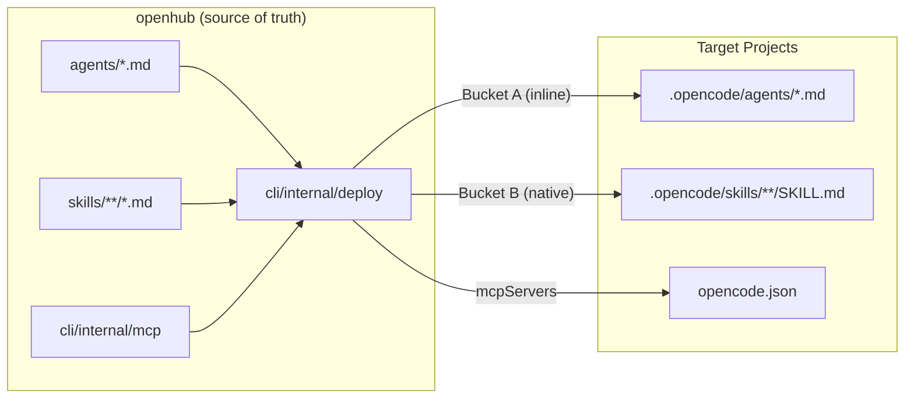
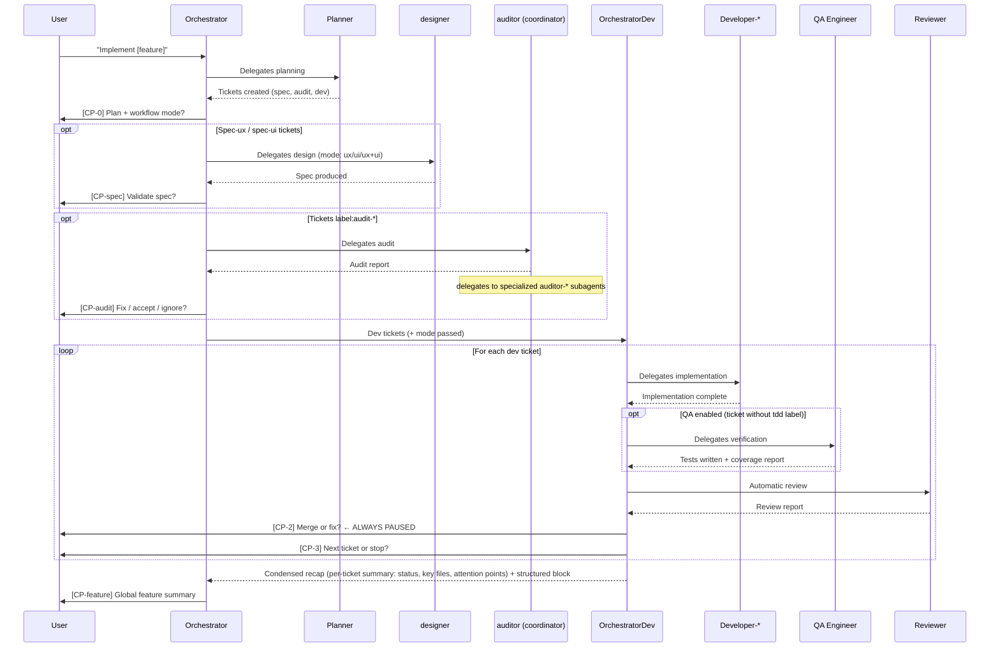
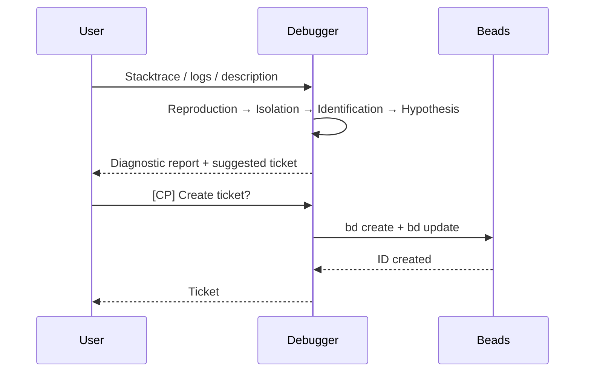

# Architecture Overview

## Core Concepts

### Hub

The **hub** (`openhub`) is the central repository containing the canonical sources
of all agents and skills. It is the single source of truth — always edit here,
never in target projects.

### Agent

An **agent** is a Markdown file (`.md`) that defines the identity of an AI role:
who it is, what it does, what it doesn't do, and its condensed workflow.
Agents are short (~40-80 lines) and don't contain detailed protocols.

See [agents.en.md](./agents.en.md) for the complete reference.

### Skill

A **skill** is a protocol block: report format, checklist, behavior rules, examples.
The hub uses a **hybrid architecture** with two deployment paths:

| Path | Frontmatter field | When loaded |
|------|------------------|-------------|
| **Bucket A — Inline** | `skills: [...]` | Always — assembled into the system prompt at deploy time |
| **Bucket B — Native** | `native_skills: [...]` | On-demand — the LLM loads from `.opencode/skills/` via the `skill` tool |

A skill can be shared across multiple agents (e.g. `dev-standards-universal`
is Bucket A in all developer agents and the reviewer).

See [skills.en.md](./skills.en.md) for the complete reference.
See [ADR-001](./adr/001-agent-skill-separation.en.md) for the separation decision.
See [ADR-010](./adr/010-hybrid-skills-architecture.en.md) for the inline vs native split.

### MCP Server

An **MCP Server** (Model Context Protocol) is a **Go native** implementation in
`cli/internal/mcp/` that provides tool integrations to agents. MCP Servers run
via `oh mcp serve <name>` (stdio JSON-RPC protocol).

Current MCP Servers:
- **figma**: Figma API integration (search files, detect UI signals, get structure)
- **gitlab**: GitLab API integration (issues, merge requests, labels, milestones)
- **gslides**: Google Slides API integration

MCP Servers are deployed into projects as `mcpServers` entries in `opencode.json`.

See [Figma Integration Guide](../guides/figma-integration.en.md) for figma usage.
See [GitLab Integration Guide](../guides/gitlab-integration.en.md) for gitlab usage.

### Deployment

Deployment is handled by the `cli/internal/deploy/` package (Go). It performs
**transactional deployment**: agents, skills, config, and MCP servers are injected
into the target project's `opencode.json`.

Commands: `oh deploy`, `oh sync`.

### Target Project

A **target project** is an application repository onto which agents are deployed
via `oh deploy`.

---

## Diagram — Deployment Flow



---

## Diagram — Orchestrator Workflow

The orchestrator operates at two levels: `orchestrator` (feature project manager)
delegates design, audits, then implementation to `orchestrator-dev`
(implementation tech lead) which drives the `developer-*` agents.



---

## Diagram — Debug Workflow



---

## Design Principles

### 1. Identity / Protocol Separation

The agent defines **who** it is, the skill defines **how** it works.
This separation enables protocol reuse across agents and keeps
agent files readable.

Skills are further split into two buckets: Bucket A (always-on, inline)
for mandatory protocols and workflow contracts, and Bucket B (native, on-demand)
for domain-specific context loaded only when the task requires it.

→ [ADR-001](./adr/001-agent-skill-separation.en.md)
→ [ADR-010](./adr/010-hybrid-skills-architecture.en.md)

### 2. Specialization over Generalism

Developer agents are segmented into 9 specializations so each agent
receives only context relevant to its domain.

→ [ADR-002](./adr/002-developer-segmentation.en.md)

### 3. Explicit Checkpoints

The orchestrator never advances the workflow automatically. Each critical
step requires explicit user confirmation.

→ [ADR-003](./adr/003-orchestrator-checkpoints.en.md)

### 4. Separation of Quality Responsibilities

Implementing, testing, and diagnosing are three distinct responsibilities entrusted
to three different agents (developer, qa-engineer, debugger).

→ [ADR-004](./adr/004-qa-debugger-separation.en.md)

### 5. Read-only for non-developer agents

Agents `auditor-*`, `reviewer`, and `designer` never write to the target project.
Only `developer-*` and `qa-engineer` agents modify source code files.

Documentary writing (wiki `docs/wiki/` and minimal `ONBOARDING.md`) is reserved for
the `onboarder` (initial generation) and `documentarian` (enrichments). All agents that
produce analysis or implementation work may enrich the wiki only by delegating to the
`documentarian` after explicit user confirmation (skill `shared/living-docs-enrichment`).
They never write directly.

This continuous enrichment loop covers all agents: `auditor` coordinator (Phase 4),
`planner` (Phase 6), `debugger` (Phase 5), `developer-*` (after each ticket), `reviewer`
(post-report), `qa-engineer` (post-report), `pathfinder` (post-report), and `onboarder`
(incremental mode when `docs/wiki/index.md` already exists).

See [Living Documentation Wiki](./living-wiki.en.md) for the complete system architecture.

---

## File Structure

```
openhub/
├── agents/              ← AI role definitions (18 agents)
├── skills/              ← Protocols: Bucket A (inline) + Bucket B (on-demand)
├── cli/                 ← Go CLI binary (oh)
│   ├── cmd/             ← Cobra commands
│   └── internal/
│       ├── app/         ← Application context
│       ├── beads/       ← Beads ticket integration
│       ├── config/      ← hub.toml configuration
│       ├── deploy/      ← Transactional deployment engine
│       ├── domain/      ← Domain types (Project, Session, Secret)
│       ├── i18n/        ← Internationalization (fr/en)
│       ├── mcp/         ← Native MCP servers (figma, gitlab, gslides)
│       ├── opencode/    ← Binary management, compatibility, project config
│       ├── plugin/      ← Plugin system (RTK embedded)
│       ├── prompt/      ← Stack detection, prompt builders
│       ├── storage/     ← SQLite + keychain + filecrypt
│       ├── tui/         ← BubbleTea views (dashboard, board, picker)
│       └── worktree/    ← Git worktree management
└── docs/                ← Documentation (bilingual fr/en)
```
