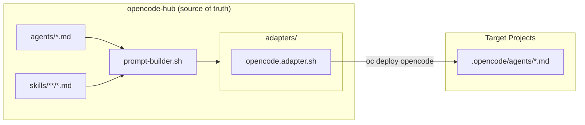
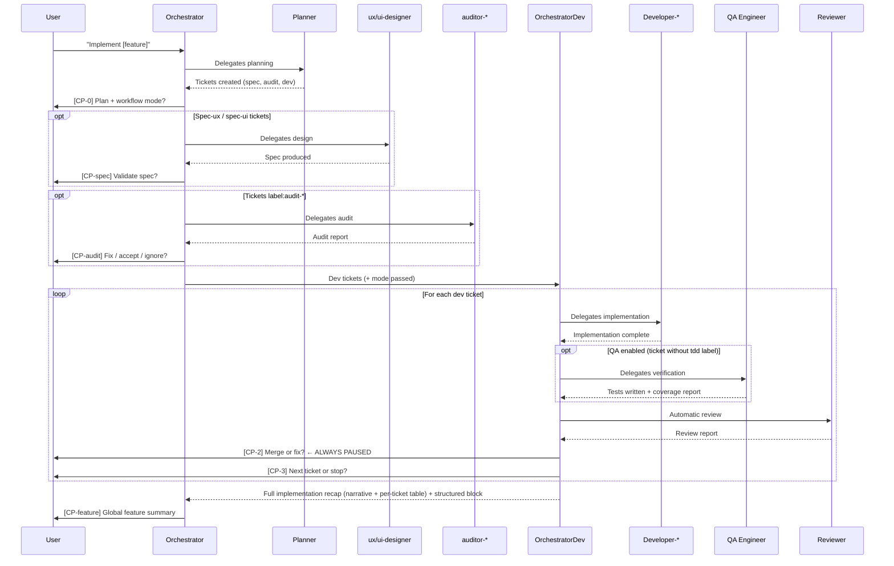
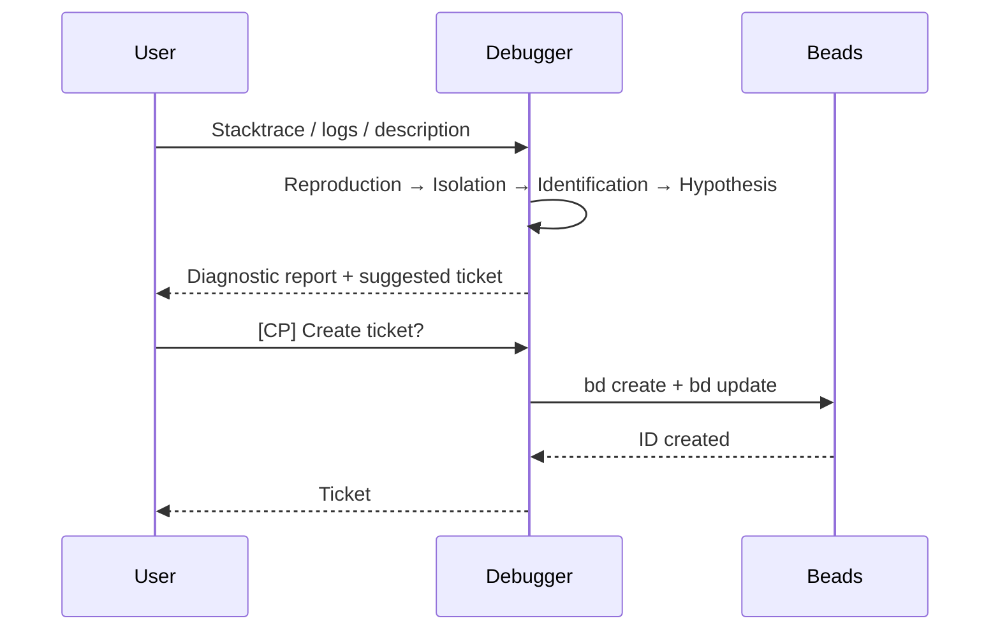

# Architecture Overview

## Core Concepts

### Hub

The **hub** (`opencode-hub`) is the central repository containing the canonical sources
of all agents and skills. It is the single source of truth — always edit here,
never in target projects.

### Agent

An **agent** is a Markdown file (`.md`) that defines the identity of an AI role:
who it is, what it does, what it doesn't do, and its condensed workflow.
Agents are short (~40-80 lines) and don't contain detailed protocols.

See [agents.en.md](./agents.en.md) for the complete reference.

### Skill

A **skill** is an injectable protocol block: report format, checklist,
behavior rules, examples. Skills are declared in the agent's frontmatter
(`skills: [...]`) and assembled at deployment.

A skill can be shared across multiple agents (e.g. `dev-standards-universal`
is injected into all developer agents and the reviewer).

See [skills.en.md](./skills.en.md) for the complete reference.
See [ADR-001](./adr/001-agent-skill-separation.en.md) for the separation decision.

### Adapter

An **adapter** is a shell script (`scripts/adapters/<target>.adapter.sh`) that
translates agents + skills from the hub format to the format expected by a target tool.
One adapter exists: `opencode`.

### Target Project

A **target project** is an application repository onto which agents are deployed
via `oc deploy`. The hub knows projects via `projects/projects.md`.

---

## Diagram — Deployment Flow



---

## Diagram — Orchestrator Workflow

The orchestrator operates at two levels: `orchestrator` (feature project manager)
delegates design, audits, then implementation to `orchestrator-dev`
(implementation tech lead) which drives the `developer-*` agents.



---

## Diagram — Debug Workflow



---

## Design Principles

### 1. Identity / Protocol Separation

The agent defines **who** it is, the skill defines **how** it works.
This separation enables protocol reuse across agents and keeps
agent files readable.

→ [ADR-001](./adr/001-agent-skill-separation.en.md)

### 2. Specialization over Generalism

Developer agents are segmented into 9 specializations so each agent
receives only context relevant to its domain.

→ [ADR-002](./adr/002-developer-segmentation.en.md)

### 3. Explicit Checkpoints

The orchestrator never advances the workflow automatically. Each critical
step requires explicit user confirmation.

→ [ADR-003](./adr/003-orchestrator-checkpoints.en.md)

### 4. Separation of Quality Responsibilities

Implementing, testing, and diagnosing are three distinct responsibilities entrusted
to three different agents (developer, qa-engineer, debugger).

→ [ADR-004](./adr/004-qa-debugger-separation.en.md)

### 5. Read-only for Non-Developer Agents

Auditor, reviewer, and debugger agents never write to the target project.
Only developer and qa-engineer agents modify files.

---

## File Structure

```
opencode-hub/
├── agents/          ← Canonical agent sources (edit here)
├── skills/          ← Injectable protocols and standards
├── scripts/
│   ├── adapters/    ← Translation hub → target tool format
│   ├── lib/         ← Shared helpers (prompt-builder, adapter-manager)
│   └── cmd-*.sh     ← Implementation of oc commands
├── config/
│   ├── hub.json             ← Global hub configuration
│   ├── stack-skills.json    ← Stack → dynamically injected skills mapping
│   └── providers/           ← LLM provider configuration
├── projects/
│   ├── projects.md       ← Project registry (local, git-ignored)
│   └── projects.example.md ← Versioned template
└── docs/            ← Documentation (this folder)
    ├── architecture/
    ├── guides/
    ├── dev/         ← Bash gotchas and developer guides
    ├── presentations/ ← Presentations and slides
    └── reference/
```
