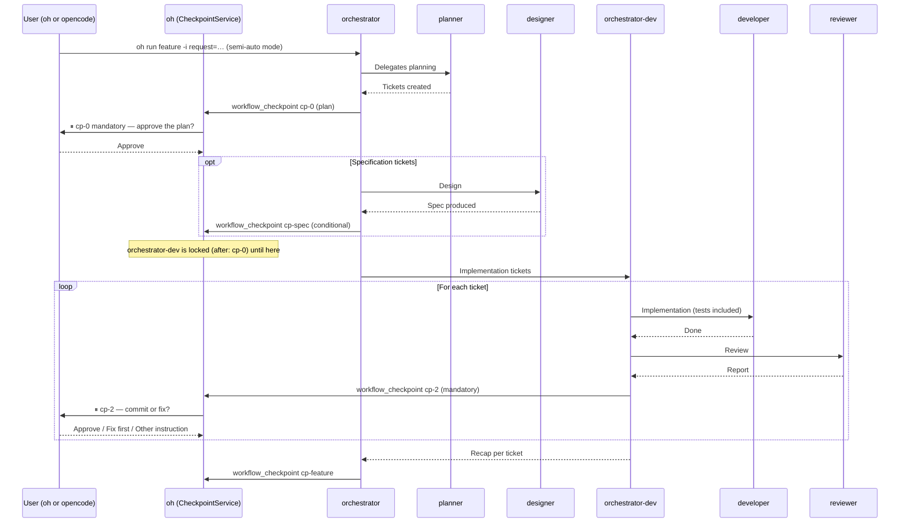

> [Lire en français](overview.fr.md)

# Architecture Overview

> See also: [Glossary](../reference/glossary.en.md) for term definitions, [v5 migration guide](../guides/migration-v5.en.md) for what changed since v4.

## System View

`oh` is the **control tower**, opencode the **cockpit**: `oh` picks the workflow, builds the session bundle, starts one opencode server per group and follows the sessions; opencode runs the agents and is the conversation interface. Closing the opencode window does not stop the session.



> Standalone diagram source: [`docs/diagrams/system-overview.mermaid`](../diagrams/system-overview.mermaid)

## Session Flow

```
oh run <workflow> (or "Start" in the TUI)
  1. Workflow resolution        hub < team < project (< draft) < session options
  2. Launch form / --recap      inputs, mode, runtime, location, warnings
  3. Session bundle             ~/.oh/bundles/<hash>/ (immutable, shared by the group)
  4. Server group               one `opencode serve` per (bundle, project, runtime)
  5. Check                      closed world (Attest): otherwise the session does not start
  6. Session                    created through the API (id chosen by oh), initial prompt
  7. Opening                    iTerm2 → Terminal.app → tmux → browser → current terminal
  8. Follow-up and decisions    ohd daemon: feed, ⏸ ? ! $ ✗, notifications, sleep after 5 min
```

Nothing is written into the project anymore: `oh deploy` and `oh sync` are removed in v5 (they are aliases that explain the migration; leftovers of former deployments are removed with `oh migrate deploy-cleanup`).

Session lifecycle: [`session-lifecycle.svg`](../diagrams/session-lifecycle.svg); user guide: [v5 sessions](../guides/sessions-v5.en.md).

## Core Concepts

### Hub

The **hub** (`openhub`) is the central repository holding the sources of the agents (`agents/`), skills (`skills/`) and shipped workflows (`workflows/`). They are embedded in the binary (`internal/hubcontent`) and extracted to `~/.oh/hub/`. It is the source of truth: edit here, never in projects.

### Workflow

A **workflow** is a declarative YAML file (`apiVersion: oh/v1`) describing a use case: entry agent, member agents and their order (`after`, `calls`), checkpoints and their behaviour per mode (`manuel`, `semi-auto`, `auto`), inputs, typed outputs, resources (skills, MCP, plugins, allowed Beads commands), risk (`read`, `plan`, `write`, `publish`), allowed runtimes and restrictions (`limits`). The hub ships 12 of them (`feature`, `ticket`, `quick`, `cadrage`, `onboarding`, `review`, `review-feedback`, `audit`, `debug`, `sweep`, `brief-enrich`, `libre`); the generic `conductor` agent is the entry when no dedicated agent is set.

Workflows are resolved **by layers**: hub, then team and project (in the team-state repository), then session options. A more specific layer extends the previous one (`extends`); security can only be tightened, and a layer can lock fields (`enforce`). Each resolved value keeps its origin (`oh workflow show --origin`).

See [Shipped workflows](../reference/workflows.en.md), [Team workflows](../guides/team-workflows.en.md), [workflow map](../diagrams/workflow-scenarios-map.svg) and [layered resolution](../diagrams/config-resolution.svg). Decisions: [ADR-039](./adr/039-declarative-workflows-oh-v1.en.md), [ADR-040](./adr/040-workflows-team-state-governance.en.md).

### Session Bundle

At each launch, `internal/bundle` builds the **session bundle** `~/.oh/bundles/<hash>/` from the resolved workflow: member agents (Bucket A skills inlined), on-demand skills (Bucket B, stack skills, `skills.extra`, skills generated from the YAML such as `workflow/workflow-map`), permissions, delegation graph and maximum depth, MCP servers (including oh's `workflow` server) and the oh plugin. The bundle is **immutable** and addressed by its hash: the sessions of a group share it, and a resume starts again from the same bundle.

Commands: `oh bundle show <workflow> [--budget]`, `oh bundle build <workflow>`. Decision: [ADR-043](./adr/043-session-bundle-deploy-removal.en.md).

### Closed World

A session sees **only** the agents and skills of its bundle: opencode native agents disabled, built-in skills denied, agents outside the workflow invisible. This is not configurable. The adapter checks it at every server start (`Attest`: agents, skills and MCP actually visible, effective rules per agent); on any mismatch, the session does not start. Decision: [ADR-041](./adr/041-closed-world-isolation.en.md).

### Server Group

A **group** = (bundle version, project, runtime). Each group has its own `opencode serve`, shared by its sessions; each session has its own location (project folder or worktree), environment, permission rules and prompt. Several tickets launched together (`oh run ticket --tickets a,b`) give N sessions in a single server, with one worktree per session that writes. An idle server with no pending decision goes to sleep after 5 minutes; resuming restarts the server on the same bundle.

### Tool Adapter

The logic stays in `oh`; one **adapter** per tool translates a neutral model (`SessionSpec`, `BundleSpec`) into the tool's format and drives its server: `Render`, server start, session creation through the API, `Attest`, events, decisions, control (interrupt, switch model, compact, fork), results, export/import. Only the **opencode V2** adapter exists (`internal/adapters/opencodev2`); opencode V1 is no longer supported. Nothing specific to a tool (name, provider ids, variables, API, paths, native agents) appears outside its adapter: the rest of oh goes through the interface and neutral capabilities, a single composition root (`cmd/v5_adapters.go`) picks the adapter, and an architecture test (`internal/archtest`) enforces it (D19). Decisions: [ADR-038](./adr/038-sessionspec-tool-adapters.en.md) (partly replaces [ADR-036](./adr/036-platform-abstraction-layer.en.md)), [ADR-048](./adr/048-opencode-v1-abandonment.en.md), [ADR-049](./adr/049-tool-independence-architecture-guard.en.md).

### `ohd` Daemon

The daemon (`oh daemon status|stop`, started on demand) runs on the machine and hosts:

- the **LLM credential proxy**: opencode only receives a group token (`ohs_…`); the real key stays in the keychain; allow-list of inference paths and models, SigV4 signing for AWS profiles, usage counting;
- session **supervision**: SSE event stream, pending decisions, state, system notifications, sleep, re-applying the session environment to sub-sessions;
- the **gateways**: Beads gateway (fake `bd`, in every runtime) and, off the machine, HTTP MCP gateway for the oh MCP servers of the bundle;
- the optional **restrictions** (off by default): max active sessions, per-session and daily budget, memory cap, model list (`oh budget`).

On Windows, the daemon runs inside the `oh` process. Decisions: [ADR-044](./adr/044-credential-proxy-session-limits.en.md), [ADR-047](./adr/047-session-interaction-daemon.en.md).

### Checkpoints and Decisions

A **checkpoint** is a control point of the workflow (`cp-1`, `cp-2`…), with a behaviour per mode (`pause`, `auto`, `skip`, `conditional`). It is enforced at three levels: the generated prompt (workflow map), the `workflow_checkpoint` MCP tool with an `ask` permission (approved through the permissions API) and the oh plugin. The state machine lives in `oh` (`CheckpointService`): agents locked by `after:` stay refused until the checkpoint is passed, and a circuit breaker stops looping delegations.

Decisions (⏸ checkpoint, ? question, ! permission, $ budget, ✗ error) can be taken from any client: Sessions view and "To handle" box of the TUI, `oh session approve|answer|dismiss`, opencode interface or browser. The first answer wins. Decision: [ADR-042](./adr/042-checkpoints-headless-decisions.en.md) (replaces [ADR-003](./adr/003-orchestrator-checkpoints.en.md)).

### Execution Environments

| Environment | Where opencode runs | What stays on the machine |
|---|---|---|
| ⌂ local | `opencode serve` process on the machine | everything |
| ▣ container | one container per group (Colima, Podman or Docker CLI); image = project dev Dockerfile + oh layer; bundle mounted read-only | keys (proxy), Beads (gateway), oh MCP servers (gateway) |
| ☁ remote | GitLab CI job of the `oh-runner` project (`oh runner run`) | machine keys; Beads: snapshot in, journal out, replayed locally (`oh session resolve`) |

The runtime is chosen at launch (`--runtime`, else project config, Settings, workflow), within `runtime.allowed`. See [topology](../diagrams/execution-topology.svg), [Container](../guides/container.en.md), [Remote runners](../guides/remote-runners.en.md). Decisions: [ADR-045](./adr/045-execution-environments.en.md), [ADR-046](./adr/046-beads-gateways.en.md).

### team-state

The **team-state** is the team's shared git repository: members, policies, claims, events, wiki, and now team and project workflows (`workflows/published`, drafts, history, `workflows.lock`) and the team brick catalog (`catalog/`). Any member can publish (draft → validated publication, offline queue). A project without a team gets a **solo space** (local team-state without remote, `oh team init --solo`, promotable with `oh team promote`). Decision: [ADR-040](./adr/040-workflows-team-state-governance.en.md).

### Agent

An **agent** is a Markdown file (`agents/<family>/<id>.md`) defining the identity of a role: who it is, what it does, what it does not do, its permissions and skills. 20 agents in 7 families. See [agents.en.md](./agents.en.md).

### Skill

A **skill** is an injectable protocol block (report format, checklist, rules). Two delivery paths:

| Path | Frontmatter field | When loaded |
|--------|------------------|-------------|
| **Bucket A — Inline** | `skills: [...]` | Always — assembled into the agent body when the bundle is built |
| **Bucket B — On demand** | `native_skills: [...]` | The model loads it from the bundle's `skills/` via the `skill` tool |

See [skills.en.md](./skills.en.md), [delivery flow](../diagrams/skill-injection-flow.svg), [ADR-001](./adr/001-agent-skill-separation.en.md), [ADR-010](./adr/010-hybrid-skills-architecture.en.md).

### MCP Server

oh's **MCP servers** are native Go implementations (`cli/internal/mcp/`), run by `oh mcp serve <name>` (stdio JSON-RPC): `figma`, `gitlab`, `gslides`, `github`, `jira`, `linear`, `team`, and `workflow` (checkpoints and outputs, added to every workflow bundle). The servers enabled for the project are placed in the bundle at launch; the `mcp:` field of a workflow filters them. Off the machine, they are served by the daemon's MCP gateway. Tokens stay in the machine keychain.

### Community Skills

Community skills are installed from the [oh-skills-index](https://github.com/datichb/oh-skills-index) or a Git URL (`oh skill add|list|remove|search|check`) and stored in `~/.oh/skills/<name>/`. They are only shipped in a bundle when the workflow lists them in `skills.extra`.

### Observability

The session registry (`oh.db`: sessions, decisions, usage per session and per day) feeds `oh metrics`, `oh serve`, the Sessions view and `oh session results` (cost, tokens, model, changed files, branch, MR description). The `agent_events` table (one row per agent of a session: the entry agent and each subagent, with status, duration, tokens, cost and skills loaded) is fed by the daemon and gives the per-agent table of `oh metrics`, `oh serve` and the Metrics view.

---

## Example — `feature` workflow

The orchestrator (`orchestrator`) delegates design then implementation to `orchestrator-dev`, which drives `developer` and `reviewer`. The mode is set at launch (`--mode` or launch form); every checkpoint goes through `workflow_checkpoint`, and `oh` decides whether it waits for the user.


```mermaid
sequenceDiagram
    participant U as User (oh or opencode)
    participant OH as oh (CheckpointService)
    participant O as orchestrator
    participant PL as planner
    participant DS as designer
    participant OD as orchestrator-dev
    participant DEV as developer
    participant R as reviewer

    U->>O: oh run feature -i request=… (semi-auto mode)
    O->>PL: Delegates planning
    PL-->>O: Tickets created
    O->>OH: workflow_checkpoint cp-0 (plan)
    OH->>U: ⏸ cp-0 mandatory — approve the plan?
    U-->>OH: Approve
    opt Specification tickets
        O->>DS: Design
        DS-->>O: Spec produced
        O->>OH: workflow_checkpoint cp-spec (conditional)
    end
    Note over OH: orchestrator-dev is locked (after: cp-0) until here
    O->>OD: Implementation tickets
    loop For each ticket
        OD->>DEV: Implementation (tests included)
        DEV-->>OD: Done
        OD->>R: Review
        R-->>OD: Report
        OD->>OH: workflow_checkpoint cp-2 (mandatory)
        OH->>U: ⏸ cp-2 — commit or fix?
        U-->>OH: Approve / Fix first / Other instruction
    end
    OD-->>O: Recap per ticket
    O->>OH: workflow_checkpoint cp-feature
```

---

## Design Principles

### 1. Identity / protocol separation

The agent defines **who** it is, the skill defines **how** it works. Bucket A (always active, inline) for mandatory protocols, Bucket B (on demand) for domain contexts.

→ [ADR-001](./adr/001-agent-skill-separation.en.md), [ADR-010](./adr/010-hybrid-skills-architecture.en.md)

### 2. The workflow is the unit of launch

The sequence of agents, the checkpoints and the resources are declared in the workflow, not coded in the agents. An agent only knows the agents of its workflow.

→ [ADR-039](./adr/039-declarative-workflows-oh-v1.en.md)

### 3. Closed world, checked

The model only sees the bundle of its session; this is checked at every start.

→ [ADR-041](./adr/041-closed-world-isolation.en.md), [ADR-043](./adr/043-session-bundle-deploy-removal.en.md)

### 4. Explicit checkpoints, decided by oh

Critical steps require a user decision depending on the mode; the state machine is in `oh`, not in the prompt, and locked agents cannot be called before their checkpoint.

→ [ADR-042](./adr/042-checkpoints-headless-decisions.en.md)

### 5. Secrets and Beads stay on the machine

opencode never receives an LLM key or an integration token; Beads is never copied into a container or a job (gateway, snapshot and journal).

→ [ADR-044](./adr/044-credential-proxy-session-limits.en.md), [ADR-046](./adr/046-beads-gateways.en.md), [ADR-019](./adr/019-agent-security-model.en.md)

### 6. The logic stays in oh

The CLI, the TUI and the future `oh serve` go through the same services (`internal/services/…`, `runsvc`, `daemon`); the AI tool sits behind an adapter.

→ [ADR-038](./adr/038-sessionspec-tool-adapters.en.md)

### 7. Separation of quality responsibilities

Implementing and diagnosing are given to different agents (developer, debugger); tests are written by the developer and checked by the reviewer. Audit, review and design agents do not write into the project; documentation writing (`docs/wiki/`) is reserved to the `onboarder` and the `documentarian` (see [Living documentation wiki](./living-wiki.en.md)).

→ [ADR-004](./adr/004-qa-debugger-separation.en.md), [ADR-013](./adr/013-developer-agent-consolidation.en.md)

---

## v5 Architecture Decisions

| ADR | Decision | Replaces / evolves |
|---|---|---|
| [038](./adr/038-sessionspec-tool-adapters.en.md) | Neutral `SessionSpec` model and tool adapters | partly replaces 036 (`platform` keeps `Credentials` and `StatsProvider`) |
| [039](./adr/039-declarative-workflows-oh-v1.en.md) | Declarative `oh/v1` workflows | replaces 006, 018 |
| [040](./adr/040-workflows-team-state-governance.en.md) | Workflows in the team-state, governance, solo space | evolves 024, 029, 033 |
| [041](./adr/041-closed-world-isolation.en.md) | Closed world and isolation check | evolves 019 |
| [042](./adr/042-checkpoints-headless-decisions.en.md) | Three-level checkpoints and headless decisions | replaces 003 |
| [043](./adr/043-session-bundle-deploy-removal.en.md) | Session bundle and removal of per-project deployment | replaces 011; evolves 008, 010 |
| [044](./adr/044-credential-proxy-session-limits.en.md) | LLM credential proxy and session restrictions | evolves 019, 021, 033 |
| [045](./adr/045-execution-environments.en.md) | Execution environments: local, container, remote | — |
| [046](./adr/046-beads-gateways.en.md) | Beads on the machine and gateways | — |
| [047](./adr/047-session-interaction-daemon.en.md) | Session interaction, multi-session, `ohd` daemon | evolves 012 (automatic worktree) |
| [048](./adr/048-opencode-v1-abandonment.en.md) | Dropping opencode V1 | deprecates 014 |
| [049](./adr/049-tool-independence-architecture-guard.en.md) | Tool independence and architecture guard | evolves 038 |

All ADRs: [`docs/architecture/adr/`](./adr/).

---

## File Structure

```
openhub/
├── agents/              ← Role definitions (20 agents, 7 families)
├── skills/              ← Protocols: Bucket A (inline) + Bucket B (on demand)
├── workflows/           ← Shipped workflows (oh/v1) + prompt templates
├── cli/                 ← Go binary (oh)
│   ├── cmd/             ← Cobra commands and TUI wiring
│   └── internal/
│       ├── workflow/    ← oh/v1 schema, layered resolution, validation, prompt rendering
│       ├── services/    ← Services shared by CLI/TUI: workflow, session, checkpoint, remote
│       ├── bundle/      ← Session bundle build (~/.oh/bundles/<hash>/)
│       ├── bricks/      ← Bricks: agent assembly, skills, permissions, model cascade
│       ├── sessionspec/ ← Neutral model (SessionSpec, BundleSpec)
│       ├── adapters/    ← Adapter interface + opencodev2 (render, server, Attest, plugin)
│       ├── runsvc/      ← Launch: server groups, sessions, worktrees, sleep, resume
│       ├── daemon/      ← ohd daemon: supervision, decisions, feed, notifications
│       ├── credproxy/   ← LLM credential proxy
│       ├── gateway/     ← Beads and MCP gateways
│       ├── runtime/     ← Execution environments (local, container)
│       ├── remote/      ← Machine ↔ GitLab CI job contract, generated pipeline, GitLab client
│       ├── limits/      ← Session restrictions (I6)
│       ├── teamstate/   ← team-state repository (claims, workflows, catalog, solo)
│       ├── mcp/         ← Native MCP servers (including workflow and team)
│       ├── storage/     ← SQLite (oh.db), keychain, file encryption
│       ├── tui/         ← tview/tcell TUI (shell, views, widgets)
│       ├── deploycleanup/ ← Cleanup of former deployments
│       └── …            ← beads, config, i18n, prompt, tracker, worktree, termlaunch…
├── docs/                ← Documentation (bilingual fr/en)
└── ~/.oh/               ← User data (outside the repository)
    ├── hub.toml · oh.db ← Configuration and registry
    ├── hub/             ← Extracted hub content (agents, skills, workflows)
    ├── bundles/<hash>/  ← Session bundles (immutable)
    ├── sessions/<id>/   ← Static environment, restrictions, results, remote artifacts
    ├── servers/<group>/ ← opencode data of the group (XDG_DATA_HOME), proxy URL
    ├── teams/<id>/      ← Solo spaces
    └── skills/          ← Community skills
```

**Platforms:** macOS and Linux (amd64, arm64); Windows local only (daemon inside the oh process, no container or remote).
