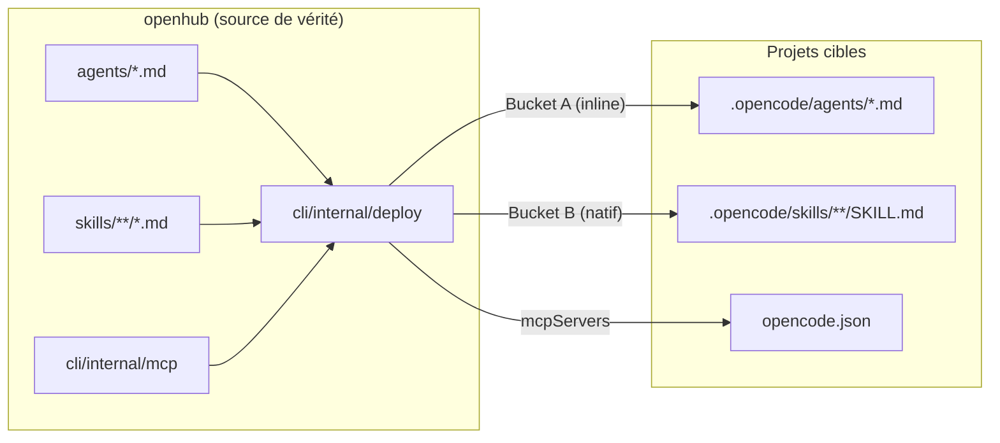
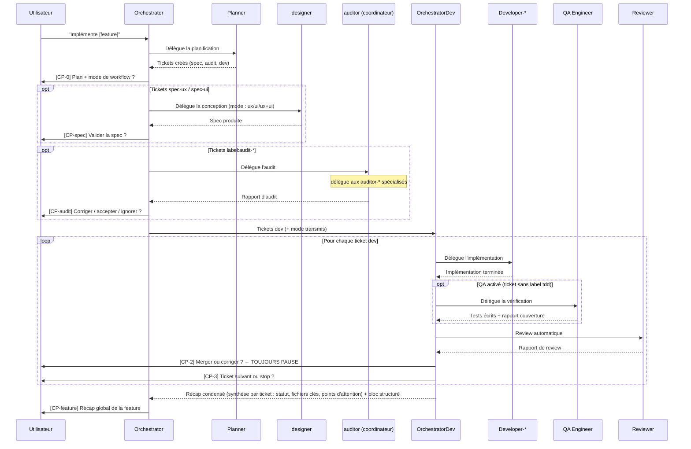
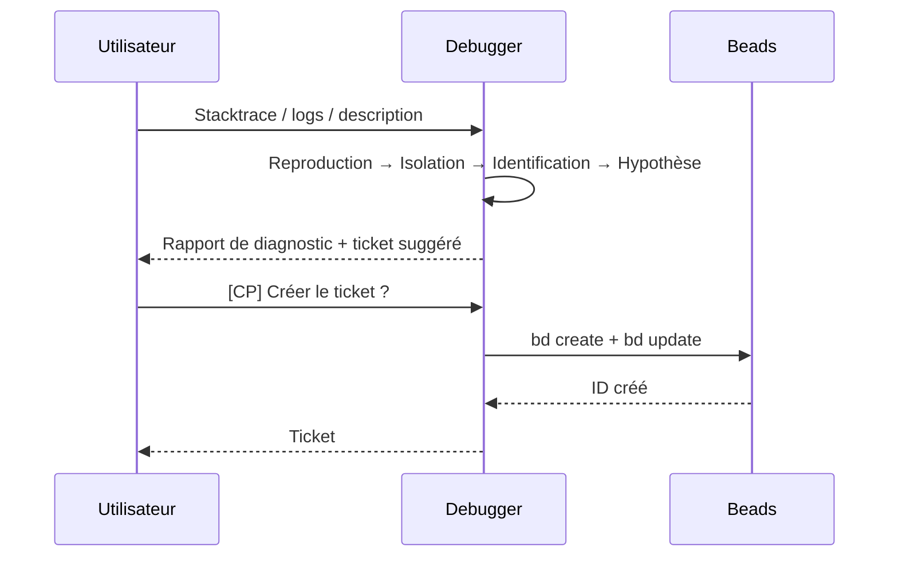

# Vue d'ensemble de l'architecture

## Concepts fondamentaux

### Hub

Le **hub** (`openhub`) est le dépôt central qui contient les sources canoniques
de tous les agents et skills. C'est la source de vérité — on édite toujours ici,
jamais dans les projets cibles.

### Agent

Un **agent** est un fichier Markdown (`.md`) qui définit l'identité d'un rôle IA :
qui il est, ce qu'il fait, ce qu'il ne fait pas, et son workflow condensé.
Les agents sont courts (~40-80 lignes) et ne contiennent pas les protocoles détaillés.

Voir [agents.fr.md](./agents.fr.md) pour la référence complète.

### Skill

Un **skill** est un bloc de protocole injectable : format de rapport, checklist,
règles de comportement, exemples. Le hub utilise une **architecture hybride** avec
deux chemins de déploiement :

| Chemin | Champ frontmatter | Quand chargé |
|--------|------------------|-------------|
| **Bucket A — Inline** | `skills: [...]` | Toujours — assemblé dans le system prompt au déploiement |
| **Bucket B — Natif** | `native_skills: [...]` | À la demande — le LLM charge depuis `.opencode/skills/` via l'outil `skill` |

Un skill peut être partagé entre plusieurs agents (ex: `dev-standards-universal`
est Bucket A dans tous les agents développeurs et dans le reviewer).

Voir [skills.fr.md](./skills.fr.md) pour la référence complète.
Voir [ADR-001](./adr/001-agent-skill-separation.fr.md) pour la décision de séparation.
Voir [ADR-010](./adr/010-hybrid-skills-architecture.fr.md) pour la séparation inline vs natif.

### Serveur MCP

Un **serveur MCP** (Model Context Protocol) est une implémentation **Go native** dans
`cli/internal/mcp/` qui fournit des intégrations outils aux agents. Les serveurs MCP
tournent via `oh mcp serve <name>` (protocole stdio JSON-RPC).

Serveurs MCP actuels :
- **figma** : Intégration API Figma (recherche fichiers, détection signaux UI, structure)
- **gitlab** : Intégration API GitLab (tickets, merge requests, labels, milestones)
- **gslides** : Intégration API Google Slides

Les serveurs MCP sont déployés dans les projets en tant qu'entrées `mcpServers` dans `opencode.json`.

Voir [Guide Intégration Figma](../guides/figma-integration.fr.md) pour l'utilisation de figma.
Voir [Guide Intégration GitLab](../guides/gitlab-integration.fr.md) pour l'utilisation de gitlab.

### Déploiement

Le déploiement est géré par le package `cli/internal/deploy/` (Go). Il effectue un
**déploiement transactionnel** : agents, skills, config et serveurs MCP sont injectés
dans le `opencode.json` du projet cible.

Commandes : `oh deploy`, `oh sync`.

### Projet cible

Un **projet cible** est un dépôt applicatif sur lequel les agents sont déployés
via `oh deploy`.

---

## Diagramme — Flux de déploiement



---

## Diagramme — Workflow orchestrateur

L'orchestrateur opère en deux niveaux : `orchestrator` (chef de projet feature)
délègue la conception, les audits, puis l'implémentation à `orchestrator-dev`
(tech lead d'implémentation) qui pilote les agents `developer-*`.



---

## Diagramme — Workflow debug



---

## Principes de design

### 1. Séparation identité / protocole

L'agent définit **qui** il est, le skill définit **comment** il travaille.
Cette séparation permet la réutilisation des protocoles entre agents et maintient
les fichiers agents lisibles.

Les skills sont en outre répartis en deux buckets : Bucket A (toujours actif, inline)
pour les protocoles obligatoires et les contrats de workflow, et Bucket B (natif, à la demande)
pour les contextes de domaine chargés uniquement quand la tâche le requiert.

→ [ADR-001](./adr/001-agent-skill-separation.fr.md)
→ [ADR-010](./adr/010-hybrid-skills-architecture.fr.md)

### 2. Spécialisation plutôt que généralisme

Les agents développeurs sont segmentés en 9 spécialisations pour que chaque agent
reçoive uniquement le contexte pertinent à son domaine.

→ [ADR-002](./adr/002-developer-segmentation.fr.md)

### 3. Checkpoints explicites

L'orchestrateur ne fait jamais avancer le workflow automatiquement. Chaque étape
critique nécessite une confirmation explicite de l'utilisateur.

→ [ADR-003](./adr/003-orchestrator-checkpoints.fr.md)

### 4. Séparation des responsabilités de qualité

Implémenter, tester et diagnostiquer sont trois responsabilités distinctes confiées
à trois agents différents (developer, qa-engineer, debugger).

→ [ADR-004](./adr/004-qa-debugger-separation.fr.md)

### 5. Lecture seule pour les agents non-développeurs

Les agents auditor-*, reviewer, designer n'écrivent jamais dans le projet cible.
Seuls les agents developer et qa-engineer modifient des fichiers de code.

L'écriture documentaire (wiki `docs/wiki/` et `ONBOARDING.md` minimaliste) est réservée à
l'`onboarder` (génération initiale) et au `documentarian` (enrichissements). Tous les agents
produisant une analyse ou une implémentation peuvent enrichir le wiki uniquement via délégation
au `documentarian` après confirmation explicite de l'utilisateur (skill `shared/living-docs-enrichment`).
Ils ne font jamais d'écriture directe.

Cette boucle d'enrichissement continu couvre tous les agents : `auditor` coordinateur (Phase 4),
`planner` (Phase 6), `debugger` (Phase 5), `developer-*` (après chaque ticket), `reviewer`
(post-rapport), `qa-engineer` (post-rapport), `pathfinder` (post-rapport), et `onboarder`
(mode enrichissement incrémental lorsque `docs/wiki/index.md` existe déjà).

Voir [Wiki Documentaire Vivant](./living-wiki.fr.md) pour l'architecture complète du système.

---

## Structure des fichiers

```
openhub/
├── agents/              ← Définitions de rôles IA (18 agents)
├── skills/              ← Protocoles : Bucket A (inline) + Bucket B (à la demande)
├── cli/                 ← Binaire CLI Go (oh)
│   ├── cmd/             ← Commandes Cobra
│   └── internal/
│       ├── app/         ← Contexte applicatif
│       ├── beads/       ← Intégration tickets Beads
│       ├── config/      ← Configuration hub.toml
│       ├── deploy/      ← Moteur de déploiement transactionnel
│       ├── domain/      ← Types domaine (Project, Session, Secret)
│       ├── i18n/        ← Internationalisation (fr/en)
│       ├── mcp/         ← Serveurs MCP natifs (figma, gitlab, gslides)
│       ├── opencode/    ← Gestion binaire, compatibilité, config projet
│       ├── plugin/      ← Système de plugins (RTK embarqué)
│       ├── prompt/      ← Détection stack, prompt builders
│       ├── storage/     ← SQLite + keychain + filecrypt
│       ├── tui/         ← Vues BubbleTea (dashboard, board, picker)
│       └── worktree/    ← Gestion worktree Git
└── docs/                ← Documentation (bilingue fr/en)
```
