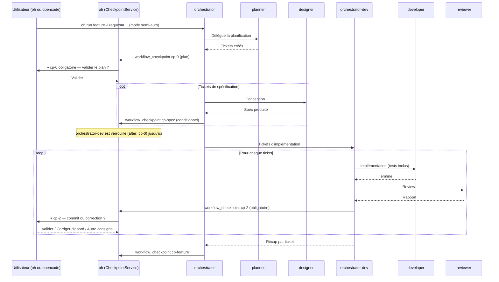

> [Read in English](overview.en.md)

# Vue d'ensemble de l'architecture

> Voir aussi : [Glossaire](../reference/glossary.fr.md) pour les définitions des termes, [Guide de migration v5](../guides/migration-v5.fr.md) pour ce qui a changé depuis la v4.

## Vue système

`oh` est la **tour de contrôle**, opencode la **cabine** : `oh` choisit le workflow, construit le paquet de session, démarre un serveur opencode par groupe et suit les sessions ; opencode exécute les agents et sert d'interface de conversation. Fermer la fenêtre d'opencode n'arrête pas la session.


> Source du diagramme : [`docs/diagrams/system-overview.mermaid`](../diagrams/system-overview.mermaid)

## Flux d'une session

```
oh run <workflow> (ou « Démarrer » dans la TUI)
  1. Résolution du workflow     hub < équipe < projet (< brouillon) < options de session
  2. Fiche / --recap            entrées, mode, environnement, emplacement, avertissements
  3. Paquet de session          ~/.oh/bundles/<hash>/ (immuable, partagé par le groupe)
  4. Serveur de groupe          un `opencode serve` par (paquet, projet, environnement)
  5. Vérification               monde fermé (Attest) : sinon la session ne démarre pas
  6. Session                    créée par l'API (identifiant choisi par oh), prompt initial
  7. Ouverture                  iTerm2 → Terminal.app → tmux → navigateur → terminal courant
  8. Suivi et décisions         démon ohd : flux, ⏸ ? ! $ ✗, notifications, veille après 5 min
```

Plus rien n'est écrit dans le projet : `oh deploy` et `oh sync` sont supprimés en v5 (ce sont des alias qui expliquent la migration ; les restes des anciens déploiements se retirent avec `oh migrate deploy-cleanup`).

Cycle de vie d'une session : [`session-lifecycle.svg`](../diagrams/session-lifecycle.svg) ; guide utilisateur : [Sessions v5](../guides/sessions-v5.fr.md).

## Concepts fondamentaux

### Hub

Le **hub** (`openhub`) est le dépôt central qui contient les sources des agents (`agents/`), des skills (`skills/`) et des workflows livrés (`workflows/`). Ils sont embarqués dans le binaire (`internal/hubcontent`) et extraits dans `~/.oh/hub/`. C'est la source de vérité : on édite ici, jamais dans les projets.

### Workflow

Un **workflow** est un fichier YAML déclaratif (`apiVersion: oh/v1`) qui décrit un cas d'usage : agent d'entrée, agents membres et leur ordre (`after`, `calls`), checkpoints et leur comportement par mode (`manuel`, `semi-auto`, `auto`), entrées, sorties typées, ressources (skills, MCP, plugins, Beads autorisés), risque (`read`, `plan`, `write`, `publish`), environnements autorisés et restrictions (`limits`). Le hub en livre 12 (`feature`, `ticket`, `quick`, `cadrage`, `onboarding`, `review`, `review-feedback`, `audit`, `debug`, `sweep`, `brief-enrich`, `libre`) ; l'agent générique `conductor` sert d'entrée quand aucun agent dédié n'est indiqué.

Les workflows se résolvent **par couches** : hub, puis équipe et projet (dans le dépôt team-state), puis options de session. Une couche plus spécifique étend la précédente (`extends`) ; la sécurité ne peut que se durcir, et une couche peut verrouiller des champs (`enforce`). Chaque valeur résolue garde son origine (`oh workflow show --origin`).

Voir [Workflows livrés](../reference/workflows.fr.md), [Workflows d'équipe](../guides/team-workflows.fr.md), [carte des workflows](../diagrams/workflow-scenarios-map.svg) et [résolution par couches](../diagrams/config-resolution.svg). Décisions : [ADR-039](./adr/039-declarative-workflows-oh-v1.fr.md), [ADR-040](./adr/040-workflows-team-state-governance.fr.md).

### Paquet de session

À chaque lancement, `internal/bundle` construit le **paquet de session** `~/.oh/bundles/<hash>/` à partir du workflow résolu : agents membres (skills Bucket A intégrées), skills à la demande (Bucket B, skills de stack, `skills.extra`, skills générées depuis le YAML comme `workflow/workflow-map`), permissions, graphe de délégation et profondeur maximale, serveurs MCP (dont le serveur `workflow` d'oh) et plugin oh. Le paquet est **immuable** et adressé par son hash : les sessions d'un même groupe le partagent, une reprise repart du même paquet.

Commandes : `oh bundle show <workflow> [--budget]`, `oh bundle build <workflow>`. Décision : [ADR-043](./adr/043-session-bundle-deploy-removal.fr.md).

### Monde fermé

Une session ne voit **que** les agents et skills de son paquet : agents natifs d'opencode désactivés, skills intégrées refusées, agents hors du workflow invisibles. Ce n'est pas réglable. L'adaptateur le vérifie à chaque démarrage de serveur (`Attest` : agents, skills et MCP réellement visibles, règles effectives par agent) ; en cas d'écart, la session ne démarre pas. Décision : [ADR-041](./adr/041-closed-world-isolation.fr.md).

### Groupe de serveur

Un **groupe** = (version du paquet, projet, environnement d'exécution). Chaque groupe a son propre `opencode serve`, partagé par ses sessions ; chaque session a son emplacement (dossier du projet ou worktree), son environnement, ses règles de permissions et son prompt. Plusieurs tickets lancés ensemble (`oh run ticket --tickets a,b`) donnent N sessions dans un seul serveur, avec un worktree par session qui écrit. Un serveur inactif sans décision en attente se met en veille après 5 minutes ; la reprise redémarre le serveur sur le même paquet.

### Adaptateur d'outil

La logique reste dans `oh` ; un **adaptateur** par outil traduit un modèle neutre (`SessionSpec`, `BundleSpec`) dans le format de l'outil et pilote son serveur : `Render`, démarrage du serveur, création de session par l'API, `Attest`, événements, décisions, contrôle (interrompre, changer de modèle, compacter, fork), résultats, export/import. Seul l'adaptateur **opencode V2** existe (`internal/adapters/opencodev2`) ; opencode V1 n'est plus pris en charge. Aucun nom d'agent natif d'un outil n'apparaît hors de son adaptateur. Décisions : [ADR-038](./adr/038-sessionspec-tool-adapters.fr.md) (remplace en partie l'[ADR-036](./adr/036-platform-abstraction-layer.fr.md)), [ADR-048](./adr/048-opencode-v1-abandonment.fr.md).

### Démon `ohd`

Le démon (`oh daemon status|stop`, lancé à la demande) tourne sur la machine et héberge :

- le **proxy d'identifiants LLM** : opencode ne reçoit qu'un jeton de groupe (`ohs_…`) ; la vraie clé reste dans le trousseau ; liste blanche des chemins d'inférence et des modèles, signature SigV4 pour les profils AWS, comptage de l'usage ;
- la **supervision** des sessions : flux d'événements SSE, décisions en attente, état, notifications système, mise en veille, réapplication de l'environnement de session aux sous-sessions ;
- les **passerelles** : passerelle Beads (faux `bd`, dans tous les environnements) et, hors machine, passerelle MCP HTTP pour les serveurs MCP d'oh du paquet ;
- les **restrictions** optionnelles (désactivées par défaut) : sessions actives max, budget par session et journalier, plafond mémoire, liste de modèles (`oh budget`).

Sous Windows, le démon tourne dans le processus `oh`. Décisions : [ADR-044](./adr/044-credential-proxy-session-limits.fr.md), [ADR-047](./adr/047-session-interaction-daemon.fr.md).

### Checkpoints et décisions

Un **checkpoint** est un point de contrôle du workflow (`cp-1`, `cp-2`…), avec un comportement par mode (`pause`, `auto`, `skip`, `conditional`). Il est tenu à trois niveaux : le prompt généré (carte du workflow), l'outil MCP `workflow_checkpoint` en permission `ask` (validé par l'API des permissions) et le plugin oh. La machine à états est dans `oh` (`CheckpointService`) : les agents verrouillés par `after:` restent refusés tant que le checkpoint n'est pas passé, et un coupe-circuit arrête les délégations en boucle.

Les décisions (⏸ checkpoint, ? question, ! permission, $ budget, ✗ erreur) se prennent depuis n'importe quel client : vue Sessions et boîte « À traiter » de la TUI, `oh session approve|answer|dismiss`, interface opencode ou navigateur. La première réponse gagne. Décision : [ADR-042](./adr/042-checkpoints-headless-decisions.fr.md) (remplace l'[ADR-003](./adr/003-orchestrator-checkpoints.fr.md)).

### Environnements d'exécution

| Environnement | Où tourne opencode | Ce qui reste sur la machine |
|---|---|---|
| ⌂ local | processus `opencode serve` sur la machine | tout |
| ▣ conteneur | un conteneur par groupe (Colima, Podman ou Docker CLI) ; image = Dockerfile de dev du projet + couche oh ; paquet monté en lecture seule | clés (proxy), Beads (passerelle), serveurs MCP d'oh (passerelle) |
| ☁ distant | job GitLab CI du projet `oh-runner` (`oh runner run`) | clés de la machine ; Beads : instantané en entrée, journal en sortie rejoué localement (`oh session resolve`) |

L'environnement se choisit au lancement (`--runtime`, sinon config du projet, Réglages, workflow), dans la limite de `runtime.allowed`. Voir [topologie](../diagrams/execution-topology.svg), [Conteneur](../guides/container.fr.md), [Runners distants](../guides/remote-runners.fr.md). Décisions : [ADR-045](./adr/045-execution-environments.fr.md), [ADR-046](./adr/046-beads-gateways.fr.md).

### team-state

Le **team-state** est le dépôt git partagé de l'équipe : membres, policies, claims, événements, wiki, et désormais les workflows d'équipe et de projet (`workflows/published`, brouillons, historique, `workflows.lock`) et le catalogue de briques d'équipe (`catalog/`). Tout membre peut publier (brouillon → publication validée, file hors ligne). Un projet sans équipe a un **espace solo** (team-state local sans remote, `oh team init --solo`, promouvable par `oh team promote`). Décision : [ADR-040](./adr/040-workflows-team-state-governance.fr.md).

### Agent

Un **agent** est un fichier Markdown (`agents/<famille>/<id>.md`) qui définit l'identité d'un rôle : qui il est, ce qu'il fait, ce qu'il ne fait pas, ses permissions et ses skills. 20 agents en 7 familles. Voir [agents.fr.md](./agents.fr.md).

### Skill

Un **skill** est un bloc de protocole injectable (format de rapport, checklist, règles). Deux chemins de livraison :

| Chemin | Champ frontmatter | Quand chargé |
|--------|------------------|-------------|
| **Bucket A — Inline** | `skills: [...]` | Toujours — intégré au corps de l'agent à la construction du paquet |
| **Bucket B — À la demande** | `native_skills: [...]` | Le modèle le charge depuis les `skills/` du paquet via l'outil `skill` |

Voir [skills.fr.md](./skills.fr.md), [flux de livraison](../diagrams/skill-injection-flow.svg), [ADR-001](./adr/001-agent-skill-separation.fr.md), [ADR-010](./adr/010-hybrid-skills-architecture.fr.md).

### Serveur MCP

Les **serveurs MCP** d'oh sont des implémentations Go natives (`cli/internal/mcp/`), lancées par `oh mcp serve <nom>` (stdio JSON-RPC) : `figma`, `gitlab`, `gslides`, `github`, `jira`, `linear`, `team`, et `workflow` (checkpoints et sorties, ajouté à tout paquet de workflow). Les serveurs activés pour le projet sont placés dans le paquet au lancement ; le champ `mcp:` d'un workflow les filtre. Hors machine, ils sont servis par la passerelle MCP du démon. Les jetons restent dans le trousseau de la machine.

### Skills communautaires

Les skills communautaires s'installent depuis le [oh-skills-index](https://github.com/datichb/oh-skills-index) ou une URL Git (`oh skill add|list|remove|search|check`) et se rangent dans `~/.oh/skills/<nom>/`. Elles ne sont livrées dans un paquet que si le workflow les liste dans `skills.extra`.

### Observabilité

Le registre des sessions (`oh.db` : sessions, décisions, usage par session et par jour) alimente `oh metrics`, `oh serve`, la vue Sessions et `oh session results` (coût, tokens, modèle, fichiers modifiés, branche, description de MR). La table `agent_events` (une ligne par agent d'une session : agent d'entrée et chaque sous-agent, avec statut, durée, tokens, coût et skills chargées) est alimentée par le démon et donne le tableau par agent de `oh metrics`, `oh serve` et de la vue Métriques.

---

## Exemple — workflow `feature`

L'orchestrateur (`orchestrator`) délègue la conception puis l'implémentation à `orchestrator-dev`, qui pilote `developer` et `reviewer`. Le mode est fixé au lancement (`--mode` ou fiche) ; chaque checkpoint passe par `workflow_checkpoint`, et `oh` décide s'il attend l'utilisateur.


```mermaid
sequenceDiagram
    participant U as Utilisateur (oh ou opencode)
    participant OH as oh (CheckpointService)
    participant O as orchestrator
    participant PL as planner
    participant DS as designer
    participant OD as orchestrator-dev
    participant DEV as developer
    participant R as reviewer

    U->>O: oh run feature -i request=… (mode semi-auto)
    O->>PL: Délègue la planification
    PL-->>O: Tickets créés
    O->>OH: workflow_checkpoint cp-0 (plan)
    OH->>U: ⏸ cp-0 obligatoire — valider le plan ?
    U-->>OH: Valider
    opt Tickets de spécification
        O->>DS: Conception
        DS-->>O: Spec produite
        O->>OH: workflow_checkpoint cp-spec (conditionnel)
    end
    Note over OH: orchestrator-dev est verrouillé (after: cp-0) jusqu'ici
    O->>OD: Tickets d'implémentation
    loop Pour chaque ticket
        OD->>DEV: Implémentation (tests inclus)
        DEV-->>OD: Terminé
        OD->>R: Review
        R-->>OD: Rapport
        OD->>OH: workflow_checkpoint cp-2 (obligatoire)
        OH->>U: ⏸ cp-2 — commit ou correction ?
        U-->>OH: Valider / Corriger d'abord / Autre consigne
    end
    OD-->>O: Récap par ticket
    O->>OH: workflow_checkpoint cp-feature
```

---

## Principes de design

### 1. Séparation identité / protocole

L'agent définit **qui** il est, le skill définit **comment** il travaille. Bucket A (toujours actif, inline) pour les protocoles obligatoires, Bucket B (à la demande) pour les contextes de domaine.

→ [ADR-001](./adr/001-agent-skill-separation.fr.md), [ADR-010](./adr/010-hybrid-skills-architecture.fr.md)

### 2. Le workflow est l'unité de lancement

L'enchaînement des agents, les checkpoints et les ressources sont déclarés dans le workflow, pas codés dans les agents. Un agent ne connaît que les agents de son workflow.

→ [ADR-039](./adr/039-declarative-workflows-oh-v1.fr.md)

### 3. Monde fermé, vérifié

Le modèle ne voit que le paquet de sa session ; c'est vérifié à chaque démarrage.

→ [ADR-041](./adr/041-closed-world-isolation.fr.md), [ADR-043](./adr/043-session-bundle-deploy-removal.fr.md)

### 4. Checkpoints explicites, décidés par oh

Les étapes critiques demandent une décision de l'utilisateur selon le mode ; la machine à états est dans `oh`, pas dans le prompt, et les agents verrouillés ne peuvent pas être appelés avant leur checkpoint.

→ [ADR-042](./adr/042-checkpoints-headless-decisions.fr.md)

### 5. Les secrets et Beads restent sur la machine

opencode ne reçoit jamais de clé LLM ni de jeton d'intégration ; Beads n'est jamais copié dans un conteneur ou un job (passerelle, instantané et journal).

→ [ADR-044](./adr/044-credential-proxy-session-limits.fr.md), [ADR-046](./adr/046-beads-gateways.fr.md), [ADR-019](./adr/019-agent-security-model.fr.md)

### 6. La logique reste dans oh

CLI, TUI et futur `oh serve` passent par les mêmes services (`internal/services/…`, `runsvc`, `daemon`) ; l'outil d'IA est derrière un adaptateur.

→ [ADR-038](./adr/038-sessionspec-tool-adapters.fr.md)

### 7. Séparation des responsabilités de qualité

Implémenter et diagnostiquer sont confiés à des agents différents (developer, debugger) ; les tests sont écrits par le developer et vérifiés par le reviewer. Les agents d'audit, de revue et de design n'écrivent pas dans le projet ; l'écriture documentaire (`docs/wiki/`) est réservée à l'`onboarder` et au `documentarian` (voir [Wiki documentaire vivant](./living-wiki.fr.md)).

→ [ADR-004](./adr/004-qa-debugger-separation.fr.md), [ADR-013](./adr/013-developer-agent-consolidation.fr.md)

---

## Décisions d'architecture v5

| ADR | Décision | Remplace / fait évoluer |
|---|---|---|
| [038](./adr/038-sessionspec-tool-adapters.fr.md) | Modèle neutre `SessionSpec` et adaptateurs d'outil | remplace en partie 036 (`platform` garde `Credentials` et `StatsProvider`) |
| [039](./adr/039-declarative-workflows-oh-v1.fr.md) | Workflows déclaratifs `oh/v1` | remplace 006, 018 |
| [040](./adr/040-workflows-team-state-governance.fr.md) | Workflows dans le team-state, gouvernance, espace solo | fait évoluer 024, 029, 033 |
| [041](./adr/041-closed-world-isolation.fr.md) | Monde fermé et vérification d'isolation | fait évoluer 019 |
| [042](./adr/042-checkpoints-headless-decisions.fr.md) | Checkpoints à trois niveaux et décisions sans interface | remplace 003 |
| [043](./adr/043-session-bundle-deploy-removal.fr.md) | Paquet de session et suppression du déploiement par projet | remplace 011 ; fait évoluer 008, 010 |
| [044](./adr/044-credential-proxy-session-limits.fr.md) | Proxy d'identifiants LLM et restrictions des sessions | fait évoluer 019, 021, 033 |
| [045](./adr/045-execution-environments.fr.md) | Environnements d'exécution : local, conteneur, distant | — |
| [046](./adr/046-beads-gateways.fr.md) | Beads sur la machine et passerelles | — |
| [047](./adr/047-session-interaction-daemon.fr.md) | Interaction avec les sessions, multi-session, démon `ohd` | fait évoluer 012 (worktree automatique) |
| [048](./adr/048-opencode-v1-abandonment.fr.md) | Abandon d'opencode V1 | déprécie 014 |

Tous les ADR : [`docs/architecture/adr/`](./adr/).

---

## Structure des fichiers

```
openhub/
├── agents/              ← Définitions des rôles (20 agents, 7 familles)
├── skills/              ← Protocoles : Bucket A (inline) + Bucket B (à la demande)
├── workflows/           ← Workflows livrés (oh/v1) + gabarits de prompt
├── cli/                 ← Binaire Go (oh)
│   ├── cmd/             ← Commandes Cobra et câblage de la TUI
│   └── internal/
│       ├── workflow/    ← Schéma oh/v1, résolution par couches, validation, rendu des prompts
│       ├── services/    ← Services partagés CLI/TUI : workflow, session, checkpoint, remote
│       ├── bundle/      ← Construction des paquets de session (~/.oh/bundles/<hash>/)
│       ├── bricks/      ← Briques : assemblage des agents, skills, permissions, cascade des modèles
│       ├── sessionspec/ ← Modèle neutre (SessionSpec, BundleSpec)
│       ├── adapters/    ← Interface d'adaptateur + opencodev2 (rendu, serveur, Attest, plugin)
│       ├── runsvc/      ← Lancement : groupes de serveurs, sessions, worktrees, veille, reprise
│       ├── daemon/      ← Démon ohd : supervision, décisions, flux, notifications
│       ├── credproxy/   ← Proxy d'identifiants LLM
│       ├── gateway/     ← Passerelles Beads et MCP
│       ├── runtime/     ← Environnements d'exécution (local, container)
│       ├── remote/      ← Contrat machine ↔ job GitLab CI, pipeline généré, client GitLab
│       ├── limits/      ← Restrictions des sessions (I6)
│       ├── teamstate/   ← Dépôt team-state (claims, workflows, catalogue, solo)
│       ├── mcp/         ← Serveurs MCP natifs (dont workflow et team)
│       ├── storage/     ← SQLite (oh.db), trousseau, chiffrement de fichiers
│       ├── tui/         ← TUI tview/tcell (shell, vues, widgets)
│       ├── deploycleanup/ ← Nettoyage des anciens déploiements
│       └── …            ← beads, config, i18n, prompt, tracker, worktree, termlaunch…
├── docs/                ← Documentation (bilingue fr/en)
└── ~/.oh/               ← Données utilisateur (hors dépôt)
    ├── hub.toml · oh.db ← Configuration et registre
    ├── hub/             ← Contenu du hub extrait (agents, skills, workflows)
    ├── bundles/<hash>/  ← Paquets de session (immuables)
    ├── sessions/<id>/   ← Environnement statique, restrictions, résultats, artefacts distants
    ├── servers/<groupe>/ ← Données opencode du groupe (XDG_DATA_HOME), URL du proxy
    ├── teams/<id>/      ← Espaces solo
    └── skills/          ← Skills communautaires
```

**Plateformes :** macOS et Linux (amd64, arm64) ; Windows en local uniquement (démon dans le processus oh, pas de conteneur ni de distant).
