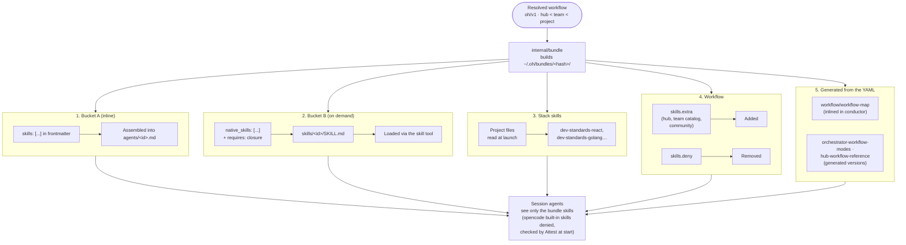

> 🇫🇷 [Lire en français](skills.fr.md)

# Skills Reference

Skills contain detailed protocols, output formats, checklists, and rules that agents apply.
The hub uses a **hybrid architecture** with two delivery paths (Bucket A inlined, Bucket B on demand) — see [ADR-010](./adr/010-hybrid-skills-architecture.en.md).

Sources of truth:

- the hub `skills/` folder (198 files: 184 skills and 14 annexes in `skills/templates/`);
- the agent frontmatter (`agents/**/*.md`): `skills:` = Bucket A (inlined), `native_skills:` = Bucket B (on demand).

Since v5, nothing is deployed into the project any more: skills reach the session through the **session bundle**, built at each launch from the workflow (see below).

> See the [Glossary](../reference/glossary.en.md) for definitions of Skill, Bucket A/B, Stack Skills, and other terms.

---

## Delivery in the session bundle (v5)

At each launch (`oh run <workflow>`), `internal/bundle` builds the session bundle `~/.oh/bundles/<hash>/` from the **resolved workflow** ([ADR-043](./adr/043-session-bundle-deploy-removal.en.md), [ADR-039](./adr/039-declarative-workflows-oh-v1.en.md)). The bundle is immutable, read-only, and identified by a hash of its content: same input, same bundle.

### What the bundle contains

| Element | Source | Where in the bundle |
|---------|--------|---------------------|
| **Member agents of the workflow** | The workflow `agents:` block | `agents/<id>.md` |
| **Bucket A skills** | `skills:` in each member agent's frontmatter (+ `requires:` closure) | Inlined into the agent body |
| **Bucket B skills** | `native_skills:` of the member agents, `requires:` closure resolved | `skills/<id>/SKILL.md` (+ `annexes:` files) |
| **Stack skills** | Detected in the project at launch (`ResolveStackSkills`) | `skills/<id>/SKILL.md` |
| **`skills.extra` / `skills.deny`** | The workflow `skills:` block: `extra` adds skills (hub, team catalog, community), `deny` removes some | Added to or removed from `skills/` |
| **Skills generated from the YAML** | The workflow itself | Replace the static skill with the same reference |

Skills generated from the workflow YAML (`cli/internal/bundle/workflowgen.go`):

- `workflow/workflow-map`: map of the workflow (agents, delegations, checkpoints, modes, outputs). Inlined into `conductor`. The static `skills/workflow/workflow-map.md` is only used outside a workflow.
- `orchestrator/orchestrator-workflow-modes` and `shared/hub-workflow-reference`: generated versions for the agents that load them (`orchestrator`, `orchestrator-dev`, `planner`). They replace the static hub file.

Build rules:

- the identifier of a skill in the bundle is the last segment of its reference (`developer/beads-plan` → `beads-plan`). It must be unique and equal to the frontmatter `name:`;
- a `requires:` dependency that is missing, denied by `skills.deny` or cyclic is a build error;
- a skill referenced by an agent but missing from the hub is skipped (warning); `oh skill check` reports these cases.

### Closed world

The model only sees the skills of the bundle ([ADR-041](./adr/041-closed-world-isolation.en.md)):

- the `skill` tool is denied on `*`, then allowed for the bundle skills only;
- opencode built-in skills (`opencode`, `report`) are therefore denied;
- at start, `Attest` compares what the server exposes (agents, skills visible to each agent, MCP) with the bundle. Any difference makes the launch fail.

Consequence: a skill requested in a prompt (for example a `[SKILL:...]` marker injected by a coordinator) is only available if it is in the bundle.

### Bundle cost

```bash
oh bundle show <workflow> --budget          # estimated tokens per agent and per skill
oh bundle show <workflow> -p <project>      # with the project's stack skills
oh bundle build <workflow> --json           # builds the bundle and describes its content
```

`oh skill budget <wf>` is a deprecated alias of `oh bundle show <wf> --budget`. The budget is an estimate (≈ 4 characters per token). In the TUI, the **Bricks catalog** (`bricks`) shows the skills, their origin, their estimated cost, and the workflows that ship them.

Related ADRs: [ADR-043](./adr/043-session-bundle-deploy-removal.en.md) (session bundle), [ADR-041](./adr/041-closed-world-isolation.en.md) (closed world), [ADR-039](./adr/039-declarative-workflows-oh-v1.en.md) (`oh/v1` workflows), [ADR-010](./adr/010-hybrid-skills-architecture.en.md) (Bucket A/B, evolved by 043), [ADR-008](./adr/008-stack-skills-dynamic-injection.en.md) (stack skills, evolved by 043).

---

## Skill injection overview



> Diagram source: [`docs/diagrams/skill-injection-flow.mermaid`](../diagrams/skill-injection-flow.mermaid)

---

## Delivery paths

| Path | Declaration | Delivered to | When loaded |
|------|-------------|--------------|-------------|
| **Inline (Bucket A)** | `skills: [...]` in the agent frontmatter | Agent body, `agents/<id>.md` in the bundle | Always — from the first token |
| **Native (Bucket B)** | `native_skills: [...]` in the agent frontmatter | `skills/<id>/SKILL.md` in the bundle | On demand — the LLM loads it via the `skill` tool |
| **Stack** | Automatic detection in the project | `skills/<id>/SKILL.md` in the bundle | On demand |
| **Workflow** | `skills.extra` (add) / `skills.deny` (remove) | `skills/<id>/SKILL.md` in the bundle | On demand |
| **Generated** | Workflow YAML | Replaces the static skill with the same reference (inline or on demand) | Like the replaced skill |

**Bucket A** — Workflow protocols, handoff formats, universal principles, posture skills, core execution skills (`beads-dev`, `quick-fix`). Must be active from the first token.

**Bucket B** — Domain standards, stack skills, checklists, doc type skills, detailed phases, research skills. Loaded only when the task needs them.

All hub agents have `permission: skill: allow`, either directly or through their `permission_base` (`coordinator`, `developer-rw`, `readonly-code`). In the session, the closed-world rules limit the `skill` tool to the bundle skills.

---

## Skill inventory (source of truth)

**184 skills** across 13 folders (144 domain skills + 40 stack skills), plus **14 annexes** in `skills/templates/`.

How to read the tables: the **Agents** column gives the bucket and the agents from their frontmatter (`A` = `skills:`, `B` = `native_skills:`). `—` = no agent references it: the skill is only in a bundle if a workflow adds it through `skills.extra`.

Short notations:

- **all** = the 19 agents except `brief-enricher`;
- **dev-rw** = `developer`, `developer-refactor`, `developer-migrator`.

### `shared/` — 16 skills (cross-cutting)

| Skill | Agents | Content |
|-------|--------|---------|
| `universal-guardrails` | A: all | Cross-cutting guardrails — git push, recap/question ordering, context-mode usage, cleanup of background processes |
| `wiki-navigation` | A: auditor-subagent, database, dev-rw, infra, onboarder, pathfinder, benchmarker, debugger, reviewer, test-generator | Living wiki navigation: read the index first, load the relevant pages, never the whole wiki |
| `hub-workflow-reference` | A: orchestrator, planner | Agent catalog, pathfinder vs planner heuristic, standard sequences, handoff table. **Generated from the workflow** in the bundle |
| `websearch-usage` | A: pathfinder · B: auditor-subagent, designer, documentarian, onboarder, planner | `websearch` tool good practices: targeted queries, source checking |
| `living-docs-enrichment` | B: auditor, database, dev-rw, infra, onboarder, pathfinder, planner, benchmarker, debugger, reviewer, test-generator | Incremental enrichment of the wiki (`docs/wiki/`), `ONBOARDING.md` and `CONVENTIONS.md`; delegates writing to the documentarian after confirmation |
| `team-awareness` | B: the 20 agents | Collaboration through the `team` MCP server (claims, status, activity) |
| `team-policies-enforcement` | B: the 20 agents except conductor | Compliance with team policies |
| `skill-authoring-protocol` | B: documentarian | Skill authoring — TDD RED/GREEN/REFACTOR, SDO checklist, anti-patterns, validation checklist |
| `rtk-usage` | B: 15 agents | **Pre-v5** — RTK guide (see [Pre-v5 skills](#pre-v5-skills)) |
| `context-mode-usage` | A: dev-rw | **Pre-v5** — usage of the context-mode `ctx_*` tools (see [Pre-v5 skills](#pre-v5-skills)) |
| `elicitation-techniques` | — | Elicitation techniques when requirements are ambiguous |
| `handoff-bloc-unique-rule` | — | Universal handoff contract (producer/consumer rules) |
| `phase-0-validation-loop` | — | Phase 0 validation loop (Start / Refine / Stop) |
| `standalone-execution-protocol` | — | Standalone execution protocol (mode detection, recap → question ordering) |
| `subagent-execution-protocol` | — | Subagent execution protocol (interruption, checklist) |
| `tracker-integration-protocol` | — | GitLab/GitHub tracker integration (triggers, ticket reading, errors) |

The last six are in no frontmatter: other skills mention them in their text, but that does not add them to the bundle (only `requires:` does).

### `posture/` — 7 skills (behavioral posture)

| Skill | Agents | Content |
|-------|--------|---------|
| `coordination-only` | A: auditor, conductor, orchestrator, orchestrator-dev | Coordinators: never code, only delegate (`task`, `question`) |
| `concision-posture` | A: conductor, orchestrator, orchestrator-dev, pathfinder, planner, reviewer | `lite` concision: drops intro phrases, restatements of known context, transitions and closing formulas. Does not touch handoff blocks, mandatory recaps or technical content. See [ADR-015](./adr/015-concision-posture.en.md) |
| `subagent-concision-posture` | A: auditor-subagent, dev-rw | Subagent concision: only the handoff block is expected |
| `expert-posture` | B: auditor-subagent, designer, documentarian, onboarder, planner, debugger | Exploration before answering, argued counter-recommendation (⚠️), confirmation pause before a risky action (🛑) |
| `retranscription-coordinateur` | A: auditor, conductor, orchestrator, orchestrator-dev | How coordinators relay subagent returns |
| `tool-question` | A: all except auditor-subagent and dev-rw | opencode `question` tool — syntax, multi-questions, `multiple: true`, mandatory structure (`header` ≤ 30 chars), recommended option first |
| `tool-todowrite` | A: conductor, orchestrator, orchestrator-dev | `todowrite` tool — 3-step threshold, real-time updates, difference with Beads |

### `orchestrator/` — 19 skills

| Skill | Agents | Content |
|-------|--------|---------|
| `orchestrator-protocol` | A: orchestrator | Feature orchestrator protocol — index, rules, session entries, CP-0. The sequence comes from the session workflow |
| `orchestrator-workflow-modes` | A: orchestrator, orchestrator-dev | The 3 modes (manual / semi-auto / auto) — behavior per checkpoint, absolute rules. **Generated from the workflow** in the bundle |
| `orchestrator-handoff-format` | A: orchestrator, orchestrator-dev | **Handoff contract** orchestrator-dev ↔ orchestrator: `## Return to orchestrator` (per-ticket summary then detail table, status `success`/`partial`/`blocked`) and `## Question for the orchestrator` (high-stakes CPs, `task_id` for resumption) |
| `orchestrator-recap-edge` | B: orchestrator | Global feature recap and edge cases |
| `orchestrator-dev-protocol` | A: orchestrator-dev | Index, domain → skills routing matrix for `developer`, `tdd` label detection. Detailed phases loaded on demand |
| `orchestrator-dev-ticket-workflow` | B: orchestrator-dev | Ticket-by-ticket workflow (steps 1a to 6: presentation, branch, delegation, pre-review, review, decision, report) |
| `orchestrator-dev-standalone` | B: orchestrator-dev | Standalone path — CP-0 recaps the tickets, CPs via the `question` tool |
| `orchestrator-dev-subagent` | B: orchestrator-dev | Subagent path — high-stakes CPs raised as `## Question for the orchestrator` blocks |
| `orchestrator-dev-recap` | B: orchestrator-dev | Implementation recap, return block, metrics |
| `orchestrator-dev-edge-cases` | B: orchestrator-dev | Edge cases: drift, failed review, conflicts, agent failure |
| `orchestrator-dev-feedback-mode` | — | Fix mini-workflow from a review feedback (`[MODE:feedback]`) |
| `orchestrator-dev-parallel` | B: orchestrator-dev | **Pre-v5** — parallelism with worktrees inside a session (see [Pre-v5 skills](#pre-v5-skills)) |
| `parallel-coordination` | B: orchestrator-dev | **Pre-v5** — coordination of the former parallel mode |
| `session-state-protocol` | B: orchestrator-dev | **Pre-v5** — session state for the former TUI dashboard |
| `error-recovery-protocol` | B: orchestrator-dev | Retry and recovery after a subagent failure: classification, retry budget, fallbacks |
| `team-coordination` | B: orchestrator-dev | Team coordination (claims, conflicts, handover) |
| `takeover-context-protocol` | B: orchestrator, orchestrator-dev | Using a takeover brief on a ticket handed over by another member |
| `orchestrator-modes` | — | **Pre-v5** — the 5 orchestrator entry modes (A to E) |
| `orchestrator-ticket-routing` | — | **Pre-v5** — routing by ticket type |

### `planning/` — 24 skills

| Skill | Agents | Content |
|-------|--------|---------|
| `planner-workflow` | A: planner | 7-phase planner workflow — index and principles (0 prerequisites → 0.5 complexity scoring → 1 exploration + UX/UI signals → 1.5 design delegation → 2 questions → 3 plan → 4 edge cases → 5 Beads creation → 5.5 ai-delegated → 6 verification) |
| `planner-handoff-format` | A: orchestrator, planner | **Handoff contract** — created tickets with planned agent and dependencies, hypotheses, estimate, risks, status |
| `planner-execution-modes` | B: planner | Planner standalone and subagent paths |
| `planner-phase-0` | B: planner | Phase 0 (prerequisites) and 0.5 (complexity scoring: 4 criteria × 4 pts, Small/Medium/Large/Enterprise tiers) |
| `planner-phase-1` | B: planner | Phase 1 (exploration) and 1.5 (design delegation) |
| `planner-phase-2` | B: planner | Phase 2 — complementary questions |
| `planner-phase-3-4` | B: planner | Phase 3 (hierarchical plan) and 4 (edge cases) |
| `planner-phase-5-6` | B: planner | Phase 5 (Beads creation), 5.5 (ai-delegated), 6 (verification) |
| `planner-design-templates` | B: planner | Phase 1.5 design delegation — UX/UI options, context to pass, resumption after spec |
| `planner-beads-templates` | B: planner | Beads ticket creation (Phase 5) — epics, features, tasks, dependencies, labels |
| `planner-patterns-protocol` | B: planner | Using the patterns library |
| `pathfinder-protocol` | A: pathfinder | Fast reconnaissance, XS→XL estimate, plan draft, direct / escalate recommendation |
| `pathfinder-handoff-format` | A: pathfinder · B: orchestrator | **Handoff contract** — pathfinder report and escalation format to the planner |
| `pathfinder-execution-modes` | B: pathfinder | Pathfinder standalone and subagent paths |
| `onboarder-workflow` | A: onboarder | 6-phase onboarder workflow — index and principles |
| `onboarder-handoff-format` | A: onboarder · B: orchestrator | **Handoff contract** — stack, conventions, debt (🔴/🟠/🟡), uncertainty zones, files produced, status |
| `onboarder-profiles` | A: onboarder | Exploration profiles per technology (Vue.js, React/Next.js, Node.js, Python, API, Data/ML, DevOps, Mobile) |
| `onboarder-execution-modes` | B: onboarder | Onboarder standalone and subagent paths |
| `onboarder-phase-0` | B: onboarder | Phase 0 — prerequisites |
| `onboarder-phase-1` | B: onboarder | Phase 1 — adaptive exploration |
| `onboarder-phase-2` | B: onboarder | Phase 2 — complementary questions |
| `onboarder-phase-3-4` | B: onboarder | Phase 3 (context report, agent matrix) and 4 (edge cases) |
| `onboarder-phase-5` | B: onboarder | Phase 5 — living wiki production |
| `websearch-stack-research` | B: onboarder, pathfinder, planner | Stack, library and pattern research via websearch |

### `developer/` — 19 generic skills + 40 stack skills

| Skill | Agents | Content |
|-------|--------|---------|
| `dev-standards-universal` | A: dev-rw, database, infra, benchmarker, reviewer, test-generator | Clean Code, SOLID, naming, structure — language-agnostic. Completion gate (tests, behavior, regressions) and `BLOCKED_ARCHITECTURE` signal |
| `dev-standards-simplicity` | A: dev-rw | KISS, YAGNI, no premature abstraction or optimization, measurable complexity thresholds |
| `quick-fix` | A: dev-rw | Deterministic fixes without review (lint, missing import, typo, formatting) |
| `beads-dev` | A: dev-rw, documentarian | Beads executor workflow: `bd update --claim`, `bd close --suggest-next`, `ai-delegated` rules |
| `beads-plan` | A: developer-refactor, developer-migrator, pathfinder · B: developer, designer, documentarian, onboarder, orchestrator, planner | Reading and creating Beads tickets: `bd list`, `bd show`, `bd create`, labels, dependencies, external links |
| `developer-handoff-format` | A: dev-rw, orchestrator-dev | **Handoff contract** `## Return to orchestrator-dev`: modified files, tests, acceptance criteria, points of attention, status |
| `dev-standards-security` | B: dev-rw, database, infra, reviewer | Secrets, input validation, injections, auth, logs, dependencies |
| `dev-standards-testing` | A: test-generator · B: dev-rw, reviewer | Testing strategy, pyramid, coverage, TDD, completion gate |
| `dev-standards-git` | A: documentarian, onboarder · B: dev-rw, reviewer | Conventional Commits, branches, PR/MR |
| `dev-standards-backend` | B: reviewer | Layered architecture, DTOs, services, repositories |
| `dev-standards-frontend` | B: reviewer | Logic/presentation separation, performance, bundle, lazy loading |
| `dev-standards-frontend-data` | B: reviewer | Frontend data management — decision matrix (local state, Store, Queries, Cookies, WebStorage, IndexedDB, Query String) |
| `dev-standards-frontend-a11y` | B: reviewer | WCAG 2.1 A/AA, semantic HTML, ARIA, contrast |
| `dev-standards-api` | B: reviewer | Versioning, pagination, errors, idempotency, schema-first, breaking changes, webhooks |
| `dev-standards-devops` | B: reviewer | Shell scripts, secrets, image registries, observability, IaC |
| `dev-standards-refactoring` | B: developer-refactor | Refactoring patterns, impact analysis, small steps, test safety net |
| `dev-standards-migration` | B: developer-migrator | Migrations (frameworks, versions, DB/ORM), Strangler Fig, rollback |
| `dev-drift-detection` | B: orchestrator-dev | Architectural drift: signals, 3 options (revise scope / revert / branch off), report |
| `dev-standards-security-hardening` | — | CORS, HTTP headers, hashing, JWT, sessions, rate limiting, encryption |

Domain standards (`dev-standards-frontend`, `-backend`, `-api`…) are requested from `developer` by `orchestrator-dev` in the delegation prompt (matrix in `orchestrator-dev-protocol`). They are in the bundles that contain `reviewer`, which declares them as Bucket B.

The **40 stack skills** in `developer/stacks/` are described in [Stack skills](#stack-skills--developerstacks).

### `auditor/` — 13 skills

| Skill | Agents | Content |
|-------|--------|---------|
| `auditor-workflow` | A: auditor | 5-phase coordinator workflow (0 prerequisites → 1 project context → 2 domain selection → 3 delegation to subagents → 4 consolidation) |
| `auditor-execution-modes` | B: auditor | Auditor standalone and subagent paths |
| `audit-protocol-light` | A: auditor, auditor-subagent | Common report format: 4 criticality levels (🔴/🟠/🟡/💡), /10 score, finding format |
| `audit-handoff-format` | A: auditor, auditor-subagent · B: orchestrator | **Handoff contract** — scope, vulnerabilities by severity, recommendations, residual risk, status |
| `websearch-cve-lookup` | B: auditor-subagent | CVE lookup (OWASP, NVD, advisories) |
| `websearch-performance-research` | B: auditor-subagent | Web research for performance audits |
| `audit-security` | — | OWASP Top 10, dependency CVEs, secrets, HTTP headers |
| `audit-performance` | — | Web Vitals, N+1, bundle size, cache |
| `audit-architecture` | — | SOLID, coupling, cohesion, technical debt |
| `audit-accessibility` | — | WCAG 2.1 AA, RGAA 4.1 |
| `audit-ecodesign` | — | RGESN, GreenIT, digital sobriety |
| `audit-privacy` | — | GDPR, EDPB, minimisation, consent, PIA |
| `audit-observability` | — | RED method, structured logs, traces, SLOs, alerting, dashboards |

The 7 domain checklists are meant to be passed to `auditor-subagent` by the coordinator, but no agent declares them: they are only in the `audit` bundle if a workflow adds them through `skills.extra`.

### `quality/` — 8 skills

| Skill | Agents | Content |
|-------|--------|---------|
| `debugger-workflow` | A: debugger | 6-phase debugger workflow — index and principles |
| `debugger-handoff-format` | A: debugger · B: orchestrator | **Handoff contract** — root cause with certainty level, explored hypotheses, impact, fix tickets, status |
| `debugger-forensic` | A: debugger | `--forensic` mode: Confirmed/Deduced/Hypothesized evidence, stronghold-first, `.investigation-{slug}.md` case file, delegation thresholds |
| `debugger-report-templates` | A: debugger | Templates for the diagnosis report and the Beads fix ticket |
| `debugger-execution-modes` | B: debugger | Debugger standalone and subagent paths |
| `debugger-phase-0-1` | B: debugger | Phase 0 (prerequisites) and 1 (exploration) |
| `debugger-phase-2-3` | B: debugger | Phase 2 (questions) and 3 (4-step diagnosis) |
| `debugger-phase-4-5` | B: debugger | Phase 4 (edge cases) and 5 (report + ticket) |

### `reviewer/` — 8 skills

| Skill | Agents | Content |
|-------|--------|---------|
| `review-protocol` | A: reviewer | Review protocol — report format, severities, confidence score, checklist, raw format for multi-mode fusion |
| `reviewer-handoff-format` | A: orchestrator-dev, reviewer | **Handoff contract** `## Return to orchestrator-dev`: verdict (`commit` / `fix` / `fix-security`), verbatim corrections, routing, status |
| `reviewer-standalone` | B: reviewer | Standalone path — mode choice (standard / adversarial / edge-case / combinations), fusion via `review-merge` |
| `reviewer-subagent` | B: reviewer | Subagent path — full report and handoff block mandatory |
| `reviewer-adversarial` | B: reviewer | Adversarial review — maximum skepticism, at least 10 findings, 7 categories, dangerous assumptions |
| `reviewer-edge-case` | B: reviewer | Edge-case hunting — unhandled paths, boundaries, coercions, concurrency |
| `review-merge` | B: reviewer | Fusion of N reports: deduplication, `[STD]`/`[ADV]`/`[EDGE]` provenance, unified report |
| `reviewer-reception` | B: developer | How the developer handles review feedback |

### `designer/` — 12 skills

| Skill | Agents | Content |
|-------|--------|---------|
| `designer-protocol` | A: designer | Core protocol — mode detection (recon / ux / ui / ux+ui), routing to the specialized skills, common rules |
| `designer-standalone` | B: designer | Standalone path — `question` tool at checkpoints, living-docs enrichment |
| `designer-subagent` | B: designer | Subagent path — single session, only output = `## Return to orchestrator` block |
| `ux-protocol` | B: designer | Nielsen heuristics, user flows, UX spec, friction audit |
| `ui-protocol` | B: designer | Design tokens, component spec, visual consistency |
| `figma-recon-protocol` | B: designer | Light Figma reconnaissance (recon mode) |
| `figma-deep-protocol` | B: designer | Deep Figma exploration (ux, ui, ux+ui modes) |
| `prototype-protocol` | B: designer | Quick visual prototype to settle a design question |
| `design-principles` | B: designer | Extended Nielsen, Gestalt, Laws of UX, operational accessibility |
| `ui-patterns-reference` | B: designer | UI patterns per component type (navigation, dashboard, states, forms, modals) |
| `content-design` | B: designer | UX writing: interface messages, voice & tone |
| `tui-patterns` | B: designer | Terminal interface patterns (keyboard-first, widgets, anti-patterns) |

### `design/` — 3 skills

| Skill | Agents | Content |
|-------|--------|---------|
| `design-handoff-format` | A: designer · B: orchestrator | **Handoff contract** designer → orchestrator: full spec, constraints, open points, status |
| `design-planner-format` | A: designer, planner | Mandatory context of the planner → designer delegation (Phase 1.5) |
| `websearch-design-patterns` | B: designer | Web research for UI/UX patterns and design systems |

### `documentarian/` — 8 skills

| Skill | Agents | Content |
|-------|--------|---------|
| `doc-protocol` | A: documentarian | Exploration before writing, adaptation to the existing docs, routing by doc type, gap checklist (annex `templates/doc-lacunes-checklist.md`) |
| `documentarian-handoff-format` | A: documentarian, orchestrator-dev · B: orchestrator | **Handoff contract** — doc type, modified files, status |
| `doc-standards` | B: documentarian | Diataxis, readability, standard structures, anti-patterns |
| `doc-adr` | B: documentarian | ADRs: format detection, MADR, naming, statuses |
| `doc-api` | B: documentarian | OpenAPI 3.x, contracts, breaking changes, narrative guide |
| `doc-changelog` | B: documentarian | Keep a Changelog, SemVer, Conventional Commits |
| `doc-slides` | B: documentarian | Marp presentations (4 templates, HTML/PDF compilation) |
| `doc-wiki-protocol` | B: documentarian | Living wiki format: pages, frontmatter, confidence tags, updates |

### `adapters/` — 6 skills (tracker integration)

| Skill | Agents | Content |
|-------|--------|---------|
| `gitlab-planner-protocol` | A: planner | Reading the GitLab source ticket, labels and milestones for the breakdown |
| `gitlab-pathfinder-protocol` | A: pathfinder | Reading a GitLab ticket to refine the estimate, detection of existing MRs |
| `gitlab-onboarder-protocol` | A: onboarder | GitLab labels, milestones and recent tickets to enrich `ONBOARDING.md` and `CONVENTIONS.md` |
| `github-planner-protocol` | — | GitHub equivalent for the planner |
| `github-pathfinder-protocol` | — | GitHub equivalent for the pathfinder |
| `github-onboarder-protocol` | — | GitHub equivalent for the onboarder |

The GitLab skills are inlined even when the bundle has no `gitlab` MCP. Figma integrations go through the `designer` agent ([ADR-020](./adr/020-designer-fusion.en.md)).

### `workflow/` — 1 skill

| Skill | Agents | Content |
|-------|--------|---------|
| `workflow-map` | A: conductor | Map of the session workflow. **Generated from the YAML** when the bundle is built; the static file is only used outside a workflow |

### `templates/` — 14 annexes

The files in `skills/templates/` are not skills: they are annexes (`annexes:` in a skill frontmatter), copied next to the `SKILL.md` in the bundle. Examples: `review-report-format.md`, `doc-lacunes-checklist.md`, `debugger-case-file.md`, the per-agent handoff blocks.

---

## Pre-v5 skills

These files still exist in `skills/`. They describe behavior from before v5; some are still shipped because an agent declares them.

| Skill | Still shipped? | What changed in v5 |
|-------|----------------|--------------------|
| `shared/rtk-usage` | Yes — Bucket B of 15 agents, so in every shipped bundle except `brief-enrich` | RTK was installed as a global opencode V1 plugin (`oh plugin`, removed in v5). oh no longer installs it |
| `shared/context-mode-usage` | Yes — Bucket A of `developer`, `developer-refactor`, `developer-migrator` | Describes the `ctx_*` tools of the `context-mode` plugin, which does not load under opencode V2. `universal-guardrails` mentions them too |
| `orchestrator/orchestrator-dev-parallel` | Yes — Bucket B of `orchestrator-dev` (`feature`, `ticket`, `review-feedback`, `libre` bundles) | Parallelism with worktrees created inside the session. In v5, parallel work goes through `oh run ticket --tickets a,b`: one session and one worktree per ticket |
| `orchestrator/parallel-coordination` | Yes — Bucket B of `orchestrator-dev` | Describes the former parallel mode (external coordinator, monitor), removed in v5. See [Sessions v5](../guides/sessions-v5.en.md) |
| `orchestrator/session-state-protocol` | Yes — Bucket B of `orchestrator-dev` | Writes `.opencode/session-state.json` via `scripts/lib/session-state.sh` (missing) for the former dashboard. In v5, session state comes from the `ohd` daemon |
| `orchestrator/orchestrator-modes` | No — no agent references it | The 5 orchestrator entry modes (A to E) are replaced by workflows (`feature`, `ticket`, `debug`, `onboarding`…) |
| `orchestrator/orchestrator-ticket-routing` | No — no agent references it | Routing comes from the workflow map and `orchestrator-dev-protocol` |

---

## Skill format

```markdown
---
name: <skill-name>            # = file name, identifier in the bundle
description: <Short description — shown in the session skill catalog>
requires: [<ref>, …]          # optional — skills shipped together with this one
annexes: [templates/<f>.md]   # optional — files copied next to the SKILL.md
plugin: <id>                  # optional — shipped only when the workflow loads this plugin
---

# Skill — <Title>

<Skill body>
```

> `name:` must equal the file name: opencode identifies skills by name. `requires:`, `annexes:` and `plugin:` are read by oh and stripped from the delivered `SKILL.md`. A `plugin: context-mode` skill (instructions for tools provided by a plugin) enters the bundle only when the workflow declares that plugin (`plugins:`). The `bucket:` field is obsolete: the bucket is decided in the agent frontmatter.
> The reference used in agent frontmatter is the path relative to `skills/`, without `.md` (`developer/beads-plan`).
> `oh skill check` checks the catalog: duplicate identifiers, missing or cyclic `requires:`, `name:` different from the file name, missing description, skills referenced by an agent but not found.

---

## Stack skills — `developer/stacks/`

These skills are delivered **on demand** (like Bucket B). At launch, `ResolveStackSkills()` (`cli/internal/bricks/stack_skills.go`) detects the project stack and adds the matching skills to the bundle. They are shared by the whole bundle, not reserved to one agent. See [ADR-008](./adr/008-stack-skills-dynamic-injection.en.md) (evolved by 043).

### Automatic detection

Detection reads a few files at the project root. Only one language is kept, in this order: `go.mod`, `package.json`, `pyproject.toml`/`setup.py`, `Cargo.toml`, `build.gradle(.kts)`, `pom.xml`.

| Signal detected | Skills added |
|-----------------|--------------|
| `go.mod` | `dev-standards-golang` |
| `package.json` | `dev-standards-typescript` |
| `pyproject.toml` or `setup.py` | `dev-standards-python` |
| `Cargo.toml` | `dev-standards-rust` |
| `build.gradle(.kts)` or `pom.xml` | `dev-standards-kotlin` |
| `next` in `package.json` | `dev-standards-nextjs`, `dev-standards-react` |
| `nuxt` in `package.json` | `dev-standards-nuxtjs`, `dev-standards-vuejs` |
| `"react"` in `package.json` | `dev-standards-react` |
| `"vue"` in `package.json` | `dev-standards-vuejs` |
| `"express"` in `package.json` | `dev-standards-express` |
| `vitest` / `jest` in `package.json` | `dev-standards-vitest` / `dev-standards-jest` |
| `Dockerfile` or `docker-compose.y(a)ml` | `dev-standards-docker` |
| `.github/workflows/` | `dev-standards-github-actions` |
| `.gitlab-ci.yml` | `dev-standards-gitlab-ci` |

The other stack skills are not detected: to ship them, a (team or project) workflow adds them through `skills.extra`. `oh bundle show <workflow> -p <project>` shows the ones that are kept.

### Catalog of the 40 stack skills

| Category | Skill | Detection | Content |
|----------|-------|-----------|---------|
| Languages | `dev-standards-typescript` | Yes | Strict config, interfaces vs types, typed errors, type guards, generics |
| Languages | `dev-standards-python` | Yes | ruff, mypy/pyright, exceptions, logging, pytest |
| Languages | `dev-standards-golang` | Yes | Modules, errors, interfaces, goroutines/channels, testify, golangci-lint |
| Languages | `dev-standards-rust` | Yes | Ownership/borrowing, thiserror/anyhow, traits, tokio, clippy |
| Frontend | `dev-standards-vuejs` | Yes | Composition API, `<script setup>`, Pinia, composables, Vue Router |
| Frontend | `dev-standards-react` | Yes | Hooks, TanStack Query, memo/useCallback, RTL |
| Frontend | `dev-standards-nextjs` | Yes | App Router, Server/Client Components, ISR, Server Actions |
| Frontend | `dev-standards-nuxtjs` | Yes | Auto-imports, useFetch, Nitro routes, routeRules |
| Frontend | `dev-standards-angular` | No | Standalone components, Signals, inject(), RxJS, Reactive Forms |
| Backend | `dev-standards-express` | Yes | Domain routing, zod middleware, AppError, helmet/cors |
| Backend | `dev-standards-nestjs` | No | Modules, DTOs + class-validator, guards, ConfigService |
| Backend | `dev-standards-django` | No | BaseModel UUID, serializers, services, migrations |
| Backend | `dev-standards-fastapi` | No | pydantic-settings, Pydantic v2, async services, httpx tests |
| Backend | `dev-standards-laravel` | No | Eloquent, FormRequest, API Resources, queues/jobs |
| Backend | `dev-standards-rails` | No | MVC, service objects, query objects, RSpec |
| Backend | `dev-standards-springboot` | No | JPA, record DTOs + @Valid, @Transactional, ProblemDetail |
| ORM / DB | `dev-standards-prisma` | No | Schema, singleton client, explicit select, transactions |
| ORM / DB | `dev-standards-typeorm` | No | Entities, custom repository, parameterised QueryBuilder |
| ORM / DB | `dev-standards-sqlalchemy` | No | Mapped v2, async sessions, Alembic |
| ORM / DB | `dev-standards-mongodb` | No | Mongoose schemas, lean(), indexes, aggregations |
| API spec | `dev-standards-openapi` | No | `$ref`, reusable schemas, writeOnly, JWT security, codegen |
| Testing | `dev-standards-vitest` | Yes | vi.mock, vi.fn, vi.spyOn, fake timers, Vue Test Utils |
| Testing | `dev-standards-jest` | Yes | jest.mock, jest.fn, RTL, snapshots |
| Testing | `dev-standards-playwright` | No | Semantic locators, POM, session fixtures |
| Testing | `dev-standards-cypress` | No | data-cy, cy.intercept, custom commands, cy.session |
| Mobile | `dev-standards-react-native` | No | Expo, React Navigation, Zustand/RTK, Detox |
| Mobile | `dev-standards-flutter` | No | BLoC/Riverpod, freezed, flutter_test |
| Mobile | `dev-standards-swift` | No | SwiftUI, MVVM, Swift Concurrency, XCTest |
| Mobile | `dev-standards-kotlin` | Yes (Gradle/Maven) | Jetpack Compose, MVVM+Clean, Hilt, Coroutines+Flow |
| Data / ML | `dev-standards-pandas` | No | Vectorisation, pandera, `.pipe()` |
| Data / ML | `dev-standards-dbt` | No | staging/intermediate/mart layers, schema.yml, tests |
| Data / ML | `dev-standards-airflow` | No | TaskFlow API, idempotence, Connections/Variables |
| Data / ML | `dev-standards-pyspark` | No | DataFrame API, broadcast join, partitioning, MLflow |
| DevOps / CI | `dev-standards-docker` | Yes | Multi-stage, non-root, .dockerignore, healthchecks, BuildKit secrets |
| DevOps / CI | `dev-standards-github-actions` | Yes | Minimal permissions, concurrency, SHA pinning, OIDC |
| DevOps / CI | `dev-standards-gitlab-ci` | Yes | `rules`, YAML templates, masked variables, `when: manual` in prod |
| Platform | `dev-standards-terraform` | No | Modules, variables + validation, remote state, plan → PR → apply |
| Platform | `dev-standards-kubernetes` | No | Deployment, RBAC, NetworkPolicy, ResourceQuota, PDB, Kustomize |
| Platform | `dev-standards-helm` | No | Chart structure, values without secrets, helm diff + --atomic |
| Platform | `dev-standards-argocd` | No | GitOps, sync policies per env, ESO, Vault |

---

## Community Skills Marketplace

Community skills extend the hub with third-party protocols. They are published to the [oh-skills-index](https://github.com/datichb/oh-skills-index) or distributed via Git URL.

### Installing community skills

```bash
oh skill add <index-name>            # install by index name
oh skill add https://github.com/...  # install from Git URL
oh skill list                        # list installed community skills
oh skill remove <name>               # remove a community skill
oh skill search <query>              # search the community index
```

### Storage

```
~/.oh/skills/<name>/
├── manifest.json     ← name, description, version, author, skill_file, tags
└── SKILL.md          ← skill content
```

### Delivery

An installed community skill only reaches a session if the workflow lists it in `skills.extra`, by its bare name (no folder). It is then delivered **on demand** in `skills/<name>/SKILL.md` in the bundle. Its name must not clash with a hub skill (identifiers are unique in a bundle). See [Shipped workflows](../reference/workflows.en.md) and [Team workflows](../guides/team-workflows.en.md).

---

## Agent ↔ skills matrix

Summary of the frontmatter of the 20 agents (`agents/**/*.md`). For the per-agent view, see also the [Skill Assignment Matrix](./agents.en.md#skill-assignment-matrix-source-of-truth).

Common skills, not repeated in the table:

- `shared/universal-guardrails` (A): all agents except `brief-enricher`;
- `shared/team-awareness` (B): the 20 agents;
- `shared/team-policies-enforcement` (B): all except `conductor`;
- `shared/rtk-usage` (B, [pre-v5](#pre-v5-skills)): the agents marked ¹.

Handoff skills (`*-handoff-format`) are loaded by both the producer and the consumer so that they share the same contract.

| Agent | Bucket A (`skills:`) | Bucket B (`native_skills:`) |
|-------|----------------------|-----------------------------|
| `conductor` ¹ | coordination-only, concision-posture, retranscription-coordinateur, tool-question, tool-todowrite, **workflow-map** (generated) | — |
| `orchestrator` ¹ | coordination-only, concision-posture, retranscription-coordinateur, orchestrator-workflow-modes (generated), orchestrator-handoff-format, orchestrator-protocol, tool-question, tool-todowrite, planner-handoff-format, hub-workflow-reference (generated) | pathfinder-handoff-format, design-handoff-format, audit-handoff-format, onboarder-handoff-format, debugger-handoff-format, documentarian-handoff-format, orchestrator-recap-edge, beads-plan, takeover-context-protocol |
| `orchestrator-dev` ¹ | coordination-only, concision-posture, retranscription-coordinateur, orchestrator-workflow-modes (generated), orchestrator-dev-protocol, orchestrator-handoff-format, tool-question, tool-todowrite, developer-handoff-format, reviewer-handoff-format, documentarian-handoff-format | orchestrator-dev-standalone, orchestrator-dev-subagent, dev-drift-detection, session-state-protocol, orchestrator-dev-ticket-workflow, orchestrator-dev-parallel, orchestrator-dev-recap, orchestrator-dev-edge-cases, error-recovery-protocol, team-coordination, takeover-context-protocol, parallel-coordination |
| `pathfinder` ¹ | beads-plan, pathfinder-protocol, pathfinder-handoff-format, gitlab-pathfinder-protocol, concision-posture, tool-question, websearch-usage, wiki-navigation | pathfinder-execution-modes, websearch-stack-research, living-docs-enrichment |
| `planner` ¹ | planner-workflow, planner-handoff-format, design-planner-format, gitlab-planner-protocol, concision-posture, tool-question, hub-workflow-reference (generated) | planner-execution-modes, websearch-stack-research, planner-phase-0, -1, -2, -3-4, -5-6, planner-patterns-protocol, living-docs-enrichment, websearch-usage, planner-design-templates, planner-beads-templates, beads-plan, expert-posture |
| `onboarder` ¹ | onboarder-workflow, onboarder-handoff-format, onboarder-profiles, gitlab-onboarder-protocol, tool-question, dev-standards-git, wiki-navigation | onboarder-execution-modes, websearch-stack-research, onboarder-phase-0, -1, -2, -3-4, -5, living-docs-enrichment, websearch-usage, beads-plan, expert-posture |
| `designer` ¹ | designer-protocol, design-planner-format, design-handoff-format, tool-question | ux-protocol, ui-protocol, figma-recon-protocol, figma-deep-protocol, prototype-protocol, designer-subagent, designer-standalone, websearch-design-patterns, design-principles, ui-patterns-reference, content-design, tui-patterns, websearch-usage, beads-plan, expert-posture |
| `documentarian` ¹ | dev-standards-git, beads-dev, doc-protocol, tool-question, documentarian-handoff-format | doc-standards, doc-adr, doc-api, doc-changelog, doc-slides, doc-wiki-protocol, skill-authoring-protocol, websearch-usage, beads-plan, expert-posture |
| `developer` ¹ | dev-standards-universal, dev-standards-simplicity, quick-fix, beads-dev, developer-handoff-format, subagent-concision-posture, wiki-navigation, context-mode-usage | dev-standards-security, dev-standards-git, dev-standards-testing, reviewer-reception, living-docs-enrichment, beads-plan |
| `developer-refactor` ¹ | dev-standards-universal, dev-standards-simplicity, quick-fix, beads-plan, beads-dev, developer-handoff-format, subagent-concision-posture, wiki-navigation, context-mode-usage | dev-standards-security, dev-standards-testing, dev-standards-git, dev-standards-refactoring, living-docs-enrichment |
| `developer-migrator` ¹ | dev-standards-universal, dev-standards-simplicity, quick-fix, beads-plan, beads-dev, developer-handoff-format, subagent-concision-posture, wiki-navigation, context-mode-usage | dev-standards-security, dev-standards-testing, dev-standards-git, dev-standards-migration, living-docs-enrichment |
| `reviewer` ¹ | dev-standards-universal, review-protocol, concision-posture, tool-question, reviewer-handoff-format, wiki-navigation | reviewer-standalone, reviewer-subagent, reviewer-adversarial, reviewer-edge-case, review-merge, dev-standards-security, -backend, -frontend, -frontend-data, -frontend-a11y, -testing, -git, -api, -devops, living-docs-enrichment |
| `debugger` ¹ | debugger-workflow, debugger-handoff-format, debugger-forensic, debugger-report-templates, tool-question, wiki-navigation | debugger-execution-modes, debugger-phase-0-1, -2-3, -4-5, living-docs-enrichment, expert-posture |
| `auditor` ¹ | coordination-only, retranscription-coordinateur, auditor-workflow, audit-protocol-light, audit-handoff-format, tool-question | auditor-execution-modes, living-docs-enrichment |
| `auditor-subagent` ¹ | audit-protocol-light, subagent-concision-posture, audit-handoff-format, wiki-navigation | websearch-cve-lookup, websearch-performance-research, expert-posture, websearch-usage |
| `database` | dev-standards-universal, tool-question, wiki-navigation | dev-standards-security, living-docs-enrichment |
| `infra` | dev-standards-universal, tool-question, wiki-navigation | dev-standards-security, living-docs-enrichment |
| `test-generator` | dev-standards-universal, dev-standards-testing, tool-question, wiki-navigation | living-docs-enrichment |
| `benchmarker` | dev-standards-universal, tool-question, wiki-navigation | living-docs-enrichment |
| `brief-enricher` | — (`skills: []`) | — (common skills only) |

`database`, `infra`, `test-generator` and `benchmarker` are in none of the 12 shipped workflows: their skills only reach a bundle if a team or project workflow declares them as members. Stack skills are added to each bundle depending on the project ([Stack skills](#stack-skills--developerstacks)).
