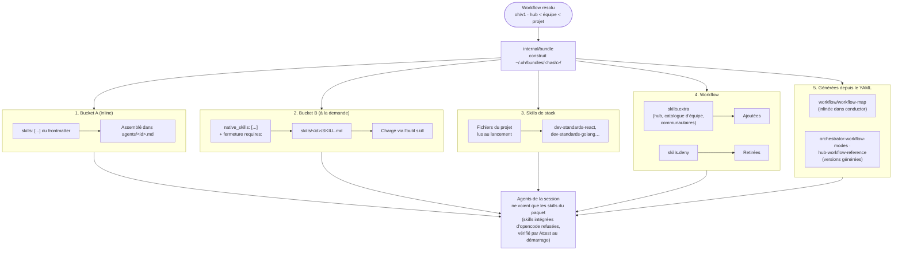

> [Read in English](skills.en.md)

# Référence des skills

Les skills contiennent des protocoles détaillés, des formats de sortie, des checklists et des règles que les agents appliquent.
Le hub utilise une **architecture hybride** avec deux chemins de livraison (Bucket A inliné, Bucket B à la demande) — voir [ADR-010](./adr/010-hybrid-skills-architecture.fr.md).

Sources de vérité :

- le dossier `skills/` du hub (198 fichiers : 184 skills et 14 annexes dans `skills/templates/`) ;
- le frontmatter des agents (`agents/**/*.md`) : `skills:` = Bucket A (inliné), `native_skills:` = Bucket B (à la demande).

Depuis la v5, rien n'est plus déployé dans le projet : les skills arrivent dans la session par le **paquet de session**, construit à chaque lancement depuis le workflow (voir ci-dessous).

> Voir le [Glossaire](../reference/glossary.fr.md) pour les définitions de Skill, Bucket A/B, Stack Skills et autres termes.

---

## Livraison dans le paquet de session (v5)

À chaque lancement (`oh run <workflow>`), `internal/bundle` construit le paquet de session `~/.oh/bundles/<hash>/` à partir du **workflow résolu** ([ADR-043](./adr/043-session-bundle-deploy-removal.fr.md), [ADR-039](./adr/039-declarative-workflows-oh-v1.fr.md)). Le paquet est immuable, en lecture seule et identifié par un hash de son contenu : même entrée, même paquet.

### Ce que contient le paquet

| Élément | Origine | Où dans le paquet |
|---------|---------|-------------------|
| **Agents membres du workflow** | Bloc `agents:` du workflow | `agents/<id>.md` |
| **Skills Bucket A** | `skills:` du frontmatter de chaque agent membre (+ fermeture `requires:`) | Inlinées dans le corps de l'agent |
| **Skills Bucket B** | `native_skills:` des agents membres, fermeture `requires:` résolue | `skills/<id>/SKILL.md` (+ annexes `annexes:`) |
| **Skills de stack** | Détectées dans le projet au lancement (`ResolveStackSkills`) | `skills/<id>/SKILL.md` |
| **`skills.extra` / `skills.deny`** | Bloc `skills:` du workflow : `extra` ajoute des skills (hub, catalogue de l'équipe, communautaires), `deny` en retire | Ajout ou retrait dans `skills/` |
| **Skills générées depuis le YAML** | Le workflow lui-même | Remplacent la version statique de même référence |

Skills générées depuis le YAML du workflow (`cli/internal/bundle/workflowgen.go`) :

- `workflow/workflow-map` : carte du workflow (agents, délégations, checkpoints, modes, sorties). Inlinée dans `conductor`. La version statique de `skills/workflow/workflow-map.md` ne sert que hors workflow.
- `orchestrator/orchestrator-workflow-modes` et `shared/hub-workflow-reference` : versions générées pour les agents qui les chargent (`orchestrator`, `orchestrator-dev`, `planner`). Elles remplacent le fichier statique du hub.

Règles de construction :

- l'identifiant d'une skill dans le paquet est le dernier segment de sa référence (`developer/beads-plan` → `beads-plan`). Il doit être unique et égal au `name:` du frontmatter ;
- une dépendance `requires:` introuvable, refusée par `skills.deny` ou cyclique est une erreur au build ;
- une skill référencée par un agent mais absente du hub est ignorée (avertissement) ; `oh skill check` signale ces cas.

### Monde fermé

Le modèle ne voit que les skills du paquet ([ADR-041](./adr/041-closed-world-isolation.fr.md)) :

- l'outil `skill` est refusé sur `*`, puis autorisé pour les seules skills du paquet ;
- les skills intégrées d'opencode (`opencode`, `report`) sont donc refusées ;
- au démarrage, `Attest` compare ce que le serveur expose (agents, skills visibles pour chaque agent, MCP) au paquet. Un écart fait échouer le lancement.

Conséquence : une skill que l'on demande dans un prompt (par exemple `[SKILL:...]` injecté par un coordinateur) n'est disponible que si elle est dans le paquet.

### Coût d'un paquet

```bash
oh bundle show <workflow> --budget          # tokens estimés par agent et par skill
oh bundle show <workflow> -p <projet>       # avec les skills de stack du projet
oh bundle build <workflow> --json           # construit le paquet et décrit son contenu
```

`oh skill budget <wf>` est un alias déprécié de `oh bundle show <wf> --budget`. Le budget est une estimation (≈ 4 caractères par token). Dans la TUI, le **Catalogue des briques** (`bricks`) montre les skills, leur origine, leur coût estimé et les workflows qui les livrent.

ADR liés : [ADR-043](./adr/043-session-bundle-deploy-removal.fr.md) (paquet de session), [ADR-041](./adr/041-closed-world-isolation.fr.md) (monde fermé), [ADR-039](./adr/039-declarative-workflows-oh-v1.fr.md) (workflows `oh/v1`), [ADR-010](./adr/010-hybrid-skills-architecture.fr.md) (Bucket A/B, évolué par 043), [ADR-008](./adr/008-stack-skills-dynamic-injection.fr.md) (skills de stack, évolué par 043).

---

## Vue d'ensemble de l'injection de skills



> Source du diagramme : [`docs/diagrams/skill-injection-flow.mermaid`](../diagrams/skill-injection-flow.mermaid)

---

## Chemins de livraison

| Chemin | Déclaration | Livré dans | Quand chargé |
|--------|-------------|------------|--------------|
| **Inline (Bucket A)** | `skills: [...]` du frontmatter de l'agent | Corps de l'agent, `agents/<id>.md` du paquet | Toujours — dès le premier token |
| **Natif (Bucket B)** | `native_skills: [...]` du frontmatter de l'agent | `skills/<id>/SKILL.md` du paquet | À la demande — le LLM la charge via l'outil `skill` |
| **Stack** | Détection automatique dans le projet | `skills/<id>/SKILL.md` du paquet | À la demande |
| **Workflow** | `skills.extra` (ajout) / `skills.deny` (retrait) | `skills/<id>/SKILL.md` du paquet | À la demande |
| **Générée** | YAML du workflow | Remplace la skill statique de même référence (inline ou à la demande) | Comme la skill remplacée |

**Bucket A** — Protocoles de workflow, formats de handoff, principes universels, skills de posture, skills d'exécution de base (`beads-dev`, `quick-fix`). Doit être actif dès le premier token.

**Bucket B** — Standards de domaine, skills de stack, checklists, skills de type documentaire, phases détaillées, skills de recherche. Chargées seulement quand la tâche en a besoin.

Tous les agents du hub ont `permission: skill: allow`, directement ou par leur `permission_base` (`coordinator`, `developer-rw`, `readonly-code`). Dans la session, les règles du monde fermé limitent l'outil `skill` aux skills du paquet.

---

## Inventaire des skills (source de vérité)

**184 skills** dans 13 dossiers (144 skills de domaine + 40 skills de stack), plus **14 annexes** dans `skills/templates/`.

Lecture des tableaux : la colonne **Agents** donne le bucket et les agents d'après leur frontmatter (`A` = `skills:`, `B` = `native_skills:`). `—` = aucun agent ne la référence : la skill n'est dans un paquet que si un workflow l'ajoute par `skills.extra`.

Notations courtes :

- **tous** = les 19 agents sauf `brief-enricher` ;
- **dev-rw** = `developer`, `developer-refactor`, `developer-migrator`.

### `shared/` — 16 skills (transverses)

| Skill | Agents | Contenu |
|-------|--------|---------|
| `universal-guardrails` | A : tous | Garde-fous transverses — git push, ordre récap/question, usage de context-mode, nettoyage des processus en arrière-plan |
| `wiki-navigation` | A : auditor-subagent, database, dev-rw, infra, onboarder, pathfinder, benchmarker, debugger, reviewer, test-generator | Navigation du wiki vivant : lire l'index d'abord, charger les pages utiles, jamais le wiki entier |
| `hub-workflow-reference` | A : orchestrator, planner | Catalogue des agents, heuristique pathfinder vs planner, séquences standard, table des handoffs. **Version générée depuis le workflow** dans le paquet |
| `websearch-usage` | A : pathfinder · B : auditor-subagent, designer, documentarian, onboarder, planner | Bonnes pratiques de l'outil `websearch` : requêtes ciblées, vérification des sources |
| `living-docs-enrichment` | B : auditor, database, dev-rw, infra, onboarder, pathfinder, planner, benchmarker, debugger, reviewer, test-generator | Enrichissement incrémental du wiki (`docs/wiki/`), d'`ONBOARDING.md` et de `CONVENTIONS.md` ; délègue l'écriture au documentarian après confirmation |
| `team-awareness` | B : les 20 agents | Collaboration via le serveur MCP `team` (claims, statut, activité) |
| `team-policies-enforcement` | B : les 20 agents sauf conductor | Respect des politiques d'équipe |
| `skill-authoring-protocol` | B : documentarian | Rédaction de skills — TDD RED/GREEN/REFACTOR, checklist SDO, anti-patterns, checklist de validation |
| `rtk-usage` | B : 15 agents | **Antérieure à v5** — guide RTK (voir [Skills antérieures à v5](#skills-antérieures-à-v5)) |
| `context-mode-usage` | A : dev-rw | **Antérieure à v5** — usage des outils `ctx_*` de context-mode (voir [Skills antérieures à v5](#skills-antérieures-à-v5)) |
| `elicitation-techniques` | — | Techniques d'élicitation quand les besoins sont ambigus |
| `handoff-bloc-unique-rule` | — | Contrat universel de handoff (règles producteur/consommateur) |
| `phase-0-validation-loop` | — | Boucle de validation Phase 0 (Démarrer / Préciser / Arrêter) |
| `standalone-execution-protocol` | — | Protocole d'exécution standalone (détection du mode, ordre récap → question) |
| `subagent-execution-protocol` | — | Protocole d'exécution sous-agent (interruption, checklist) |
| `tracker-integration-protocol` | — | Intégration tracker GitLab/GitHub (déclencheurs, lecture de ticket, erreurs) |

Les six dernières ne sont dans aucun frontmatter : d'autres skills les citent dans leur texte, mais cela ne les ajoute pas au paquet (seul `requires:` le fait).

### `posture/` — 7 skills (posture comportementale)

| Skill | Agents | Contenu |
|-------|--------|---------|
| `coordination-only` | A : auditor, conductor, orchestrator, orchestrator-dev | Coordinateurs : ne jamais coder, seulement déléguer (`task`, `question`) |
| `concision-posture` | A : conductor, orchestrator, orchestrator-dev, pathfinder, planner, reviewer | Concision niveau `lite` : supprime les formules d'intro, les reformulations du contexte connu, les transitions et formules de clôture. Ne touche ni aux blocs handoff, ni aux récaps obligatoires, ni au contenu technique. Voir [ADR-015](./adr/015-concision-posture.fr.md) |
| `subagent-concision-posture` | A : auditor-subagent, dev-rw | Concision des sous-agents : seul le bloc de handoff est attendu |
| `expert-posture` | B : auditor-subagent, designer, documentarian, onboarder, planner, debugger | Exploration avant de répondre, recommandation contraire argumentée (⚠️), pause de confirmation avant une action à risque (🛑) |
| `retranscription-coordinateur` | A : auditor, conductor, orchestrator, orchestrator-dev | Retranscription des retours de sous-agents par les coordinateurs |
| `tool-question` | A : tous sauf auditor-subagent et dev-rw | Outil `question` d'opencode — syntaxe, multi-questions, `multiple: true`, structure obligatoire (`header` ≤ 30 car.), option recommandée en premier |
| `tool-todowrite` | A : conductor, orchestrator, orchestrator-dev | Outil `todowrite` — seuil des 3 étapes, mise à jour en temps réel, différence avec Beads |

### `orchestrator/` — 19 skills

| Skill | Agents | Contenu |
|-------|--------|---------|
| `orchestrator-protocol` | A : orchestrator | Protocole de l'orchestrator feature — index, règles, entrées de session, CP-0. L'enchaînement vient du workflow de la session |
| `orchestrator-workflow-modes` | A : orchestrator, orchestrator-dev | Les 3 modes (manuel / semi-auto / auto) — comportements par checkpoint, règles absolues. **Version générée depuis le workflow** dans le paquet |
| `orchestrator-handoff-format` | A : orchestrator, orchestrator-dev | **Contrat de handoff** orchestrator-dev ↔ orchestrator : `## Retour vers orchestrator` (synthèse par ticket puis tableau de détail, statut `succès`/`partiel`/`bloqué`) et `## Question pour l'orchestrator` (CP à enjeu fort, `task_id` pour la reprise) |
| `orchestrator-recap-edge` | B : orchestrator | Récap global de feature et cas particuliers |
| `orchestrator-dev-protocol` | A : orchestrator-dev | Index, matrice de routage domaine → skills à demander à `developer`, détection du label `tdd`. Phases détaillées chargées à la demande |
| `orchestrator-dev-ticket-workflow` | B : orchestrator-dev | Workflow ticket par ticket (étapes 1a à 6 : présentation, branche, délégation, pre-review, review, décision, compte rendu) |
| `orchestrator-dev-standalone` | B : orchestrator-dev | Parcours standalone — CP-0 récapitule les tickets, CP via l'outil `question` |
| `orchestrator-dev-subagent` | B : orchestrator-dev | Parcours sous-agent — CP à enjeu fort remontés par blocs `## Question pour l'orchestrator` |
| `orchestrator-dev-recap` | B : orchestrator-dev | Récap d'implémentation, bloc retour, métriques |
| `orchestrator-dev-edge-cases` | B : orchestrator-dev | Cas particuliers : dérive, review échouée, conflits, panne d'agent |
| `orchestrator-dev-feedback-mode` | — | Mini-workflow de correction depuis un feedback de review (`[MODE:feedback]`) |
| `orchestrator-dev-parallel` | B : orchestrator-dev | **Antérieure à v5** — parallélisme par worktrees dans une session (voir [Skills antérieures à v5](#skills-antérieures-à-v5)) |
| `parallel-coordination` | B : orchestrator-dev | **Antérieure à v5** — coordination de l'ancien mode parallèle |
| `session-state-protocol` | B : orchestrator-dev | **Antérieure à v5** — état de session pour l'ancien tableau de bord TUI |
| `error-recovery-protocol` | B : orchestrator-dev | Retry et reprise après échec d'un sous-agent : classification, budget de retry, replis |
| `team-coordination` | B : orchestrator-dev | Coordination d'équipe (claims, conflits, passage de relais) |
| `takeover-context-protocol` | B : orchestrator, orchestrator-dev | Utiliser un brief de reprise sur un ticket transféré par un autre membre |
| `orchestrator-modes` | — | **Antérieure à v5** — les 5 modes d'entrée de l'orchestrator (A à E) |
| `orchestrator-ticket-routing` | — | **Antérieure à v5** — routage par type de ticket |

### `planning/` — 24 skills

| Skill | Agents | Contenu |
|-------|--------|---------|
| `planner-workflow` | A : planner | Workflow planner en 7 phases — index et principes (0 prérequis → 0.5 complexity scoring → 1 exploration + signaux UX/UI → 1.5 délégation design → 2 questions → 3 plan → 4 cas particuliers → 5 création Beads → 5.5 ai-delegated → 6 vérification) |
| `planner-handoff-format` | A : orchestrator, planner | **Contrat de handoff** — tickets créés avec agent prévu et dépendances, hypothèses, estimation, risques, statut |
| `planner-execution-modes` | B : planner | Parcours standalone et sous-agent du planner |
| `planner-phase-0` | B : planner | Phase 0 (prérequis) et 0.5 (complexity scoring : 4 critères × 4 pts, tiers Small/Medium/Large/Enterprise) |
| `planner-phase-1` | B : planner | Phase 1 (exploration) et 1.5 (délégation design) |
| `planner-phase-2` | B : planner | Phase 2 — questions complémentaires |
| `planner-phase-3-4` | B : planner | Phase 3 (plan hiérarchique) et 4 (cas particuliers) |
| `planner-phase-5-6` | B : planner | Phase 5 (création Beads), 5.5 (ai-delegated), 6 (vérification) |
| `planner-design-templates` | B : planner | Délégation design Phase 1.5 — options UX/UI, contexte à transmettre, reprise après spec |
| `planner-beads-templates` | B : planner | Création de tickets Beads (Phase 5) — epics, features, tasks, dépendances, labels |
| `planner-patterns-protocol` | B : planner | Utilisation de la bibliothèque de patterns |
| `pathfinder-protocol` | A : pathfinder | Reconnaissance rapide, estimation XS→XL, draft de plan, recommandation direct / escalade |
| `pathfinder-handoff-format` | A : pathfinder · B : orchestrator | **Contrat de handoff** — rapport pathfinder et format d'escalade vers le planner |
| `pathfinder-execution-modes` | B : pathfinder | Parcours standalone et sous-agent du pathfinder |
| `onboarder-workflow` | A : onboarder | Workflow onboarder en 6 phases — index et principes |
| `onboarder-handoff-format` | A : onboarder · B : orchestrator | **Contrat de handoff** — stack, conventions, dette (🔴/🟠/🟡), zones d'incertitude, fichiers produits, statut |
| `onboarder-profiles` | A : onboarder | Profils d'exploration par technologie (Vue.js, React/Next.js, Node.js, Python, API, Data/ML, DevOps, Mobile) |
| `onboarder-execution-modes` | B : onboarder | Parcours standalone et sous-agent de l'onboarder |
| `onboarder-phase-0` | B : onboarder | Phase 0 — prérequis |
| `onboarder-phase-1` | B : onboarder | Phase 1 — exploration adaptative |
| `onboarder-phase-2` | B : onboarder | Phase 2 — questions complémentaires |
| `onboarder-phase-3-4` | B : onboarder | Phase 3 (rapport de contexte, matrice agents) et 4 (cas particuliers) |
| `onboarder-phase-5` | B : onboarder | Phase 5 — production du wiki vivant |
| `websearch-stack-research` | B : onboarder, pathfinder, planner | Recherche de stacks, librairies et patterns via websearch |

### `developer/` — 19 skills génériques + 40 skills de stack

| Skill | Agents | Contenu |
|-------|--------|---------|
| `dev-standards-universal` | A : dev-rw, database, infra, benchmarker, reviewer, test-generator | Clean Code, SOLID, nommage, structure — agnostique du langage. Gate de complétion (tests, comportement, régressions) et signal `BLOCKED_ARCHITECTURE` |
| `dev-standards-simplicity` | A : dev-rw | KISS, YAGNI, pas d'abstraction ni d'optimisation prématurées, seuils de complexité mesurables |
| `quick-fix` | A : dev-rw | Corrections déterministes sans review (lint, import manquant, typo, formatage) |
| `beads-dev` | A : dev-rw, documentarian | Workflow exécuteur Beads : `bd update --claim`, `bd close --suggest-next`, règles `ai-delegated` |
| `beads-plan` | A : developer-refactor, developer-migrator, pathfinder · B : developer, designer, documentarian, onboarder, orchestrator, planner | Lecture et création de tickets Beads : `bd list`, `bd show`, `bd create`, labels, dépendances, liens externes |
| `developer-handoff-format` | A : dev-rw, orchestrator-dev | **Contrat de handoff** `## Retour vers orchestrator-dev` : fichiers modifiés, tests, critères d'acceptance, points d'attention, statut |
| `dev-standards-security` | B : dev-rw, database, infra, reviewer | Secrets, validation des entrées, injections, auth, logs, dépendances |
| `dev-standards-testing` | A : test-generator · B : dev-rw, reviewer | Stratégie de tests, pyramide, couverture, TDD, gate de complétion |
| `dev-standards-git` | A : documentarian, onboarder · B : dev-rw, reviewer | Conventional Commits, branches, PR/MR |
| `dev-standards-backend` | B : reviewer | Architecture en couches, DTOs, services, repositories |
| `dev-standards-frontend` | B : reviewer | Séparation logique/présentation, performance, bundle, lazy loading |
| `dev-standards-frontend-data` | B : reviewer | Gestion des données côté frontend — matrice de décision (état local, Store, Queries, Cookies, WebStorage, IndexedDB, Query String) |
| `dev-standards-frontend-a11y` | B : reviewer | WCAG 2.1 A/AA, HTML sémantique, ARIA, contrastes |
| `dev-standards-api` | B : reviewer | Versioning, pagination, erreurs, idempotence, schema-first, breaking changes, webhooks |
| `dev-standards-devops` | B : reviewer | Scripts shell, secrets, registries d'images, observabilité, IaC |
| `dev-standards-refactoring` | B : developer-refactor | Patterns de refactoring, analyse d'impact, petits pas, filet de tests |
| `dev-standards-migration` | B : developer-migrator | Migrations (frameworks, versions, DB/ORM), Strangler Fig, rollback |
| `dev-drift-detection` | B : orchestrator-dev | Dérive architecturale : signaux, 3 options (réviser scope / revert / bifurquer), rapport |
| `dev-standards-security-hardening` | — | CORS, headers HTTP, hashing, JWT, sessions, rate limiting, chiffrement |

Les standards de domaine (`dev-standards-frontend`, `-backend`, `-api`…) sont demandés à `developer` par `orchestrator-dev` dans le prompt de délégation (matrice de `orchestrator-dev-protocol`). Ils sont dans les paquets qui contiennent `reviewer`, qui les déclare en Bucket B.

Les **40 skills de stack** de `developer/stacks/` sont décrites dans [Skills de stack](#skills-de-stack--developerstacks).

### `auditor/` — 13 skills

| Skill | Agents | Contenu |
|-------|--------|---------|
| `auditor-workflow` | A : auditor | Workflow du coordinateur en 5 phases (0 prérequis → 1 contexte projet → 2 sélection des domaines → 3 délégation aux sous-agents → 4 consolidation) |
| `auditor-execution-modes` | B : auditor | Parcours standalone et sous-agent de l'auditor |
| `audit-protocol-light` | A : auditor, auditor-subagent | Format de rapport commun : 4 niveaux de criticité (🔴/🟠/🟡/💡), score /10, format des findings |
| `audit-handoff-format` | A : auditor, auditor-subagent · B : orchestrator | **Contrat de handoff** — périmètre, vulnérabilités par sévérité, recommandations, risque résiduel, statut |
| `websearch-cve-lookup` | B : auditor-subagent | Recherche CVE (OWASP, NVD, advisories) |
| `websearch-performance-research` | B : auditor-subagent | Recherche web pour les audits de performance |
| `audit-security` | — | OWASP Top 10, CVE des dépendances, secrets, headers HTTP |
| `audit-performance` | — | Web Vitals, N+1, taille du bundle, cache |
| `audit-architecture` | — | SOLID, couplage, cohésion, dette technique |
| `audit-accessibility` | — | WCAG 2.1 AA, RGAA 4.1 |
| `audit-ecodesign` | — | RGESN, GreenIT, sobriété numérique |
| `audit-privacy` | — | RGPD, EDPB, minimisation, consentement, PIA |
| `audit-observability` | — | Méthode RED, logs structurés, traces, SLOs, alerting, dashboards |

Les 7 checklists de domaine sont prévues pour être indiquées à `auditor-subagent` par le coordinateur, mais aucun agent ne les déclare : elles ne sont dans le paquet `audit` que si un workflow les ajoute par `skills.extra`.

### `quality/` — 8 skills

| Skill | Agents | Contenu |
|-------|--------|---------|
| `debugger-workflow` | A : debugger | Workflow debugger en 6 phases — index et principes |
| `debugger-handoff-format` | A : debugger · B : orchestrator | **Contrat de handoff** — cause racine avec niveau de certitude, hypothèses explorées, impact, tickets de correction, statut |
| `debugger-forensic` | A : debugger | Mode `--forensic` : preuves Confirmed/Deduced/Hypothesized, stronghold-first, case file `.investigation-{slug}.md`, seuils de délégation |
| `debugger-report-templates` | A : debugger | Gabarits du rapport de diagnostic et du ticket Beads de correction |
| `debugger-execution-modes` | B : debugger | Parcours standalone et sous-agent du debugger |
| `debugger-phase-0-1` | B : debugger | Phase 0 (prérequis) et 1 (exploration) |
| `debugger-phase-2-3` | B : debugger | Phase 2 (questions) et 3 (diagnostic en 4 étapes) |
| `debugger-phase-4-5` | B : debugger | Phase 4 (cas particuliers) et 5 (rapport + ticket) |

### `reviewer/` — 8 skills

| Skill | Agents | Contenu |
|-------|--------|---------|
| `review-protocol` | A : reviewer | Protocole de review — format du rapport, sévérités, score de confiance, checklist, format brut pour la fusion multi-mode |
| `reviewer-handoff-format` | A : orchestrator-dev, reviewer | **Contrat de handoff** `## Retour vers orchestrator-dev` : verdict (`commit` / `corriger` / `corriger-sécurité`), corrections verbatim, routage, statut |
| `reviewer-standalone` | B : reviewer | Parcours standalone — choix du mode (standard / adversarial / edge-case / combinaisons), fusion via `review-merge` |
| `reviewer-subagent` | B : reviewer | Parcours sous-agent — rapport complet et bloc handoff obligatoires |
| `reviewer-adversarial` | B : reviewer | Review adversariale — scepticisme maximal, 10 findings minimum, 7 catégories, hypothèses dangereuses |
| `reviewer-edge-case` | B : reviewer | Chasse aux cas limites — chemins non gérés, frontières, coercions, concurrence |
| `review-merge` | B : reviewer | Fusion de N rapports : déduplication, provenance `[STD]`/`[ADV]`/`[EDGE]`, rapport unifié |
| `reviewer-reception` | B : developer | Traitement d'un feedback de review par le développeur |

### `designer/` — 12 skills

| Skill | Agents | Contenu |
|-------|--------|---------|
| `designer-protocol` | A : designer | Protocole central — détection du mode (recon / ux / ui / ux+ui), routage vers les skills spécialisées, règles communes |
| `designer-standalone` | B : designer | Parcours standalone — outil `question` aux checkpoints, enrichissement living-docs |
| `designer-subagent` | B : designer | Parcours sous-agent — session unique, seul output = bloc `## Retour vers orchestrator` |
| `ux-protocol` | B : designer | Heuristiques Nielsen, user flows, spec UX, audit de friction |
| `ui-protocol` | B : designer | Tokens de design, spec de composants, cohérence visuelle |
| `figma-recon-protocol` | B : designer | Reconnaissance Figma légère (mode recon) |
| `figma-deep-protocol` | B : designer | Exploration Figma approfondie (modes ux, ui, ux+ui) |
| `prototype-protocol` | B : designer | Prototype visuel rapide pour trancher une question de design |
| `design-principles` | B : designer | Nielsen enrichi, Gestalt, Laws of UX, accessibilité opérationnelle |
| `ui-patterns-reference` | B : designer | Patterns UI par type de composant (navigation, dashboard, états, formulaires, modals) |
| `content-design` | B : designer | UX writing : messages d'interface, voice & tone |
| `tui-patterns` | B : designer | Patterns d'interfaces terminal (clavier d'abord, widgets, anti-patterns) |

### `design/` — 3 skills

| Skill | Agents | Contenu |
|-------|--------|---------|
| `design-handoff-format` | A : designer · B : orchestrator | **Contrat de handoff** designer → orchestrator : spec intégrale, contraintes, points ouverts, statut |
| `design-planner-format` | A : designer, planner | Contexte obligatoire de la délégation planner → designer (Phase 1.5) |
| `websearch-design-patterns` | B : designer | Recherche web de patterns UI/UX et design systems |

### `documentarian/` — 8 skills

| Skill | Agents | Contenu |
|-------|--------|---------|
| `doc-protocol` | A : documentarian | Exploration avant rédaction, adaptation à l'existant, routage par type de doc, checklist de lacunes (annexe `templates/doc-lacunes-checklist.md`) |
| `documentarian-handoff-format` | A : documentarian, orchestrator-dev · B : orchestrator | **Contrat de handoff** — type de doc, fichiers modifiés, statut |
| `doc-standards` | B : documentarian | Diataxis, lisibilité, structures types, anti-patterns |
| `doc-adr` | B : documentarian | ADR : détection du format, MADR, nommage, statuts |
| `doc-api` | B : documentarian | OpenAPI 3.x, contrats, breaking changes, guide narratif |
| `doc-changelog` | B : documentarian | Keep a Changelog, SemVer, Conventional Commits |
| `doc-slides` | B : documentarian | Présentations Marp (4 gabarits, compilation HTML/PDF) |
| `doc-wiki-protocol` | B : documentarian | Format du wiki vivant : pages, frontmatter, tags de confiance, mise à jour |

### `adapters/` — 6 skills (intégration trackers)

| Skill | Agents | Contenu |
|-------|--------|---------|
| `gitlab-planner-protocol` | A : planner | Lecture du ticket source GitLab, labels et milestones pour la décomposition |
| `gitlab-pathfinder-protocol` | A : pathfinder | Lecture d'un ticket GitLab pour affiner l'estimation, détection de MR existantes |
| `gitlab-onboarder-protocol` | A : onboarder | Labels, milestones et tickets récents GitLab pour enrichir `ONBOARDING.md` et `CONVENTIONS.md` |
| `github-planner-protocol` | — | Équivalent GitHub pour le planner |
| `github-pathfinder-protocol` | — | Équivalent GitHub pour le pathfinder |
| `github-onboarder-protocol` | — | Équivalent GitHub pour l'onboarder |

Les skills GitLab sont inlinées même sans MCP `gitlab` dans le paquet. Les intégrations Figma passent par l'agent `designer` ([ADR-020](./adr/020-designer-fusion.fr.md)).

### `workflow/` — 1 skill

| Skill | Agents | Contenu |
|-------|--------|---------|
| `workflow-map` | A : conductor | Carte du workflow de la session. **Générée depuis le YAML** à la construction du paquet ; le fichier statique ne sert que hors workflow |

### `templates/` — 14 annexes

Les fichiers de `skills/templates/` ne sont pas des skills : ce sont des annexes (`annexes:` du frontmatter d'une skill), copiées à côté du `SKILL.md` dans le paquet. Exemples : `review-report-format.md`, `doc-lacunes-checklist.md`, `debugger-case-file.md`, les blocs de handoff par agent.

---

## Skills antérieures à v5

Ces fichiers existent toujours dans `skills/`. Ils décrivent un comportement antérieur à v5 ; certains sont encore livrés parce qu'un agent les déclare.

| Skill | Encore livrée ? | Ce qui a changé en v5 |
|-------|-----------------|-----------------------|
| `shared/rtk-usage` | Oui — Bucket B de 15 agents, donc dans tous les paquets livrés sauf `brief-enrich` | RTK s'installait comme plugin global opencode V1 (`oh plugin`, supprimé en v5). oh ne l'installe plus |
| `shared/context-mode-usage` | Oui — Bucket A de `developer`, `developer-refactor`, `developer-migrator` | Décrit les outils `ctx_*` du plugin `context-mode`, qui ne se charge pas sous opencode V2. `universal-guardrails` en parle aussi |
| `orchestrator/orchestrator-dev-parallel` | Oui — Bucket B d'`orchestrator-dev` (paquets `feature`, `ticket`, `review-feedback`, `libre`) | Parallélisme par worktrees créés dans la session. En v5, le parallèle passe par `oh run ticket --tickets a,b` : une session et un worktree par ticket |
| `orchestrator/parallel-coordination` | Oui — Bucket B d'`orchestrator-dev` | Décrit l'ancien mode parallèle (coordinateur externe, moniteur), supprimé en v5. Voir [Sessions v5](../guides/sessions-v5.fr.md) |
| `orchestrator/session-state-protocol` | Oui — Bucket B d'`orchestrator-dev` | Écrit `.opencode/session-state.json` via `scripts/lib/session-state.sh` (absent) pour l'ancien tableau de bord. En v5, l'état des sessions vient du démon `ohd` |
| `orchestrator/orchestrator-modes` | Non — aucun agent ne la référence | Les 5 modes d'entrée (A à E) de l'orchestrator sont remplacés par les workflows (`feature`, `ticket`, `debug`, `onboarding`…) |
| `orchestrator/orchestrator-ticket-routing` | Non — aucun agent ne la référence | Le routage vient de la carte du workflow et d'`orchestrator-dev-protocol` |

---

## Format d'un skill

```markdown
---
name: <nom-du-skill>          # = nom du fichier, identifiant dans le paquet
description: <Description courte — affichée dans le catalogue de skills de la session>
requires: [<ref>, …]          # facultatif — skills livrées avec celle-ci
annexes: [templates/<f>.md]   # facultatif — fichiers copiés à côté du SKILL.md
plugin: <id>                  # facultatif — livrée seulement si le workflow charge ce plugin
---

# Skill — <Titre>

<Corps du skill>
```

> `name:` doit être égal au nom du fichier : opencode identifie les skills par leur nom. `requires:`, `annexes:` et `plugin:` sont lus par oh et retirés du `SKILL.md` livré. Une skill `plugin: context-mode` (consignes d'outils fournis par un plugin) n'entre dans le paquet que si le workflow déclare ce plugin (`plugins:`). De même, les permissions propres à un plugin (outils `ctx_*` de context-mode, commandes `rtk` ; liste dans `permissions/plugin-tools.yaml`) sont retirées des agents quand le plugin n'est pas chargé. Un agent qui cite une skill absente du paquet (plugin absent, skills frontend dans un projet sans frontend) reçoit une ligne qui la nomme : il ne tente pas de la charger. Le champ `bucket:` est obsolète : le bucket se décide dans le frontmatter de l'agent.
> La référence utilisée dans le frontmatter des agents est le chemin relatif à `skills/`, sans `.md` (`developer/beads-plan`).
> `oh skill check` vérifie le catalogue : identifiants en double, `requires:` manquants ou cycliques, `name:` différent du nom de fichier, description absente, skills référencées par un agent mais introuvables.

---

## Skills de stack — `developer/stacks/`

Ces skills sont livrées **à la demande** (comme le Bucket B). Au lancement, `ResolveStackSkills()` (`cli/internal/bricks/stack_skills.go`) détecte la stack du projet et ajoute les skills correspondantes au paquet. Elles sont communes au paquet, pas réservées à un agent. Voir [ADR-008](./adr/008-stack-skills-dynamic-injection.fr.md) (évolué par 043).

### Détection automatique

La détection lit quelques fichiers à la racine du projet. Un seul langage est retenu, dans cet ordre : `go.mod`, `package.json`, `pyproject.toml`/`setup.py`, `Cargo.toml`, `build.gradle(.kts)`, `pom.xml`.

| Signal détecté | Skills ajoutées |
|----------------|-----------------|
| `go.mod` | `dev-standards-golang` |
| `package.json` | `dev-standards-typescript` |
| `pyproject.toml` ou `setup.py` | `dev-standards-python` |
| `Cargo.toml` | `dev-standards-rust` |
| `build.gradle(.kts)` ou `pom.xml` | `dev-standards-kotlin` |
| `next` dans `package.json` | `dev-standards-nextjs`, `dev-standards-react` |
| `nuxt` dans `package.json` | `dev-standards-nuxtjs`, `dev-standards-vuejs` |
| `"react"` dans `package.json` | `dev-standards-react` |
| `"vue"` dans `package.json` | `dev-standards-vuejs` |
| `"express"` dans `package.json` | `dev-standards-express` |
| `vitest` / `jest` dans `package.json` | `dev-standards-vitest` / `dev-standards-jest` |
| `Dockerfile` ou `docker-compose.y(a)ml` | `dev-standards-docker` |
| `.github/workflows/` | `dev-standards-github-actions` |
| `.gitlab-ci.yml` | `dev-standards-gitlab-ci` |

Les autres skills de stack ne sont pas détectées : pour les livrer, un workflow (d'équipe ou de projet) les ajoute par `skills.extra`. `oh bundle show <workflow> -p <projet>` affiche celles qui sont retenues.

### Catalogue des 40 skills de stack

| Catégorie | Skill | Détection | Contenu |
|-----------|-------|-----------|---------|
| Langages | `dev-standards-typescript` | Oui | Config stricte, interfaces vs types, erreurs typées, type guards, generics |
| Langages | `dev-standards-python` | Oui | ruff, mypy/pyright, exceptions, logging, pytest |
| Langages | `dev-standards-golang` | Oui | Modules, erreurs, interfaces, goroutines/channels, testify, golangci-lint |
| Langages | `dev-standards-rust` | Oui | Ownership/borrowing, thiserror/anyhow, traits, tokio, clippy |
| Frontend | `dev-standards-vuejs` | Oui | Composition API, `<script setup>`, Pinia, composables, Vue Router |
| Frontend | `dev-standards-react` | Oui | Hooks, TanStack Query, memo/useCallback, RTL |
| Frontend | `dev-standards-nextjs` | Oui | App Router, Server/Client Components, ISR, Server Actions |
| Frontend | `dev-standards-nuxtjs` | Oui | Auto-imports, useFetch, routes Nitro, routeRules |
| Frontend | `dev-standards-angular` | Non | Standalone components, Signals, inject(), RxJS, Reactive Forms |
| Backend | `dev-standards-express` | Oui | Routage par domaine, middleware zod, AppError, helmet/cors |
| Backend | `dev-standards-nestjs` | Non | Modules, DTOs + class-validator, guards, ConfigService |
| Backend | `dev-standards-django` | Non | BaseModel UUID, serializers, services, migrations |
| Backend | `dev-standards-fastapi` | Non | pydantic-settings, Pydantic v2, services async, tests httpx |
| Backend | `dev-standards-laravel` | Non | Eloquent, FormRequest, API Resources, queues/jobs |
| Backend | `dev-standards-rails` | Non | MVC, service objects, query objects, RSpec |
| Backend | `dev-standards-springboot` | Non | JPA, record DTOs + @Valid, @Transactional, ProblemDetail |
| ORM / BDD | `dev-standards-prisma` | Non | Schema, client singleton, select explicite, transactions |
| ORM / BDD | `dev-standards-typeorm` | Non | Entités, repository custom, QueryBuilder paramétré |
| ORM / BDD | `dev-standards-sqlalchemy` | Non | Mapped v2, sessions async, Alembic |
| ORM / BDD | `dev-standards-mongodb` | Non | Schemas Mongoose, lean(), index, agrégations |
| Spec API | `dev-standards-openapi` | Non | `$ref`, schemas réutilisables, writeOnly, sécurité JWT, codegen |
| Tests | `dev-standards-vitest` | Oui | vi.mock, vi.fn, vi.spyOn, fake timers, Vue Test Utils |
| Tests | `dev-standards-jest` | Oui | jest.mock, jest.fn, RTL, snapshots |
| Tests | `dev-standards-playwright` | Non | Locators sémantiques, POM, fixtures de session |
| Tests | `dev-standards-cypress` | Non | data-cy, cy.intercept, commandes custom, cy.session |
| Mobile | `dev-standards-react-native` | Non | Expo, React Navigation, Zustand/RTK, Detox |
| Mobile | `dev-standards-flutter` | Non | BLoC/Riverpod, freezed, flutter_test |
| Mobile | `dev-standards-swift` | Non | SwiftUI, MVVM, Swift Concurrency, XCTest |
| Mobile | `dev-standards-kotlin` | Oui (Gradle/Maven) | Jetpack Compose, MVVM+Clean, Hilt, Coroutines+Flow |
| Data / ML | `dev-standards-pandas` | Non | Vectorisation, pandera, `.pipe()` |
| Data / ML | `dev-standards-dbt` | Non | Couches staging/intermediate/mart, schema.yml, tests |
| Data / ML | `dev-standards-airflow` | Non | TaskFlow API, idempotence, Connections/Variables |
| Data / ML | `dev-standards-pyspark` | Non | DataFrame API, broadcast join, partitionnement, MLflow |
| DevOps / CI | `dev-standards-docker` | Oui | Multi-stage, non-root, .dockerignore, healthchecks, secrets BuildKit |
| DevOps / CI | `dev-standards-github-actions` | Oui | Permissions minimales, concurrency, SHA pinning, OIDC |
| DevOps / CI | `dev-standards-gitlab-ci` | Oui | `rules`, templates YAML, variables masquées, `when: manual` en prod |
| Plateforme | `dev-standards-terraform` | Non | Modules, variables + validation, state distant, plan → PR → apply |
| Plateforme | `dev-standards-kubernetes` | Non | Deployment, RBAC, NetworkPolicy, ResourceQuota, PDB, Kustomize |
| Plateforme | `dev-standards-helm` | Non | Structure de chart, values sans secrets, helm diff + --atomic |
| Plateforme | `dev-standards-argocd` | Non | GitOps, sync policies par env, ESO, Vault |

---

## Marketplace de skills communautaires

Les skills communautaires étendent le hub avec des protocoles tiers. Elles sont publiées dans le [oh-skills-index](https://github.com/datichb/oh-skills-index) ou distribuées par URL Git.

### Installer des skills communautaires

```bash
oh skill add <nom-index>              # installer par nom d'index
oh skill add https://github.com/...  # installer depuis une URL Git
oh skill list                         # lister les skills communautaires installées
oh skill remove <nom>                 # supprimer une skill communautaire
oh skill search <requête>             # rechercher dans l'index communautaire
```

### Stockage

```
~/.oh/skills/<name>/
├── manifest.json     ← name, description, version, author, skill_file, tags
└── SKILL.md          ← contenu de la skill
```

### Livraison

Une skill communautaire installée n'arrive dans une session que si le workflow la liste dans `skills.extra`, par son nom seul (sans dossier). Elle est alors livrée **à la demande** dans `skills/<nom>/SKILL.md` du paquet. Son nom ne doit pas entrer en conflit avec une skill du hub (identifiants uniques dans un paquet). Voir [Workflows livrés](../reference/workflows.fr.md) et [Workflows d'équipe](../guides/team-workflows.fr.md).

---

## Matrice agents ↔ skills

Résumé du frontmatter des 20 agents (`agents/**/*.md`). Pour la vue par agent, voir aussi la [Matrice d'assignation des skills](./agents.fr.md#matrice-dassignation-des-skills-source-de-verite).

Communs, non répétés dans le tableau :

- `shared/universal-guardrails` (A) : tous les agents sauf `brief-enricher` ;
- `shared/team-awareness` (B) : les 20 agents ;
- `shared/team-policies-enforcement` (B) : tous sauf `conductor` ;
- `shared/rtk-usage` (B, [antérieure à v5](#skills-antérieures-à-v5)) : les agents marqués ¹.

Les skills de handoff (`*-handoff-format`) sont chargées par le producteur et par le consommateur pour partager le même contrat.

| Agent | Bucket A (`skills:`) | Bucket B (`native_skills:`) |
|-------|----------------------|-----------------------------|
| `conductor` ¹ | coordination-only, concision-posture, retranscription-coordinateur, tool-question, tool-todowrite, **workflow-map** (générée) | — |
| `orchestrator` ¹ | coordination-only, concision-posture, retranscription-coordinateur, orchestrator-workflow-modes (générée), orchestrator-handoff-format, orchestrator-protocol, tool-question, tool-todowrite, planner-handoff-format, hub-workflow-reference (générée) | pathfinder-handoff-format, design-handoff-format, audit-handoff-format, onboarder-handoff-format, debugger-handoff-format, documentarian-handoff-format, orchestrator-recap-edge, beads-plan, takeover-context-protocol |
| `orchestrator-dev` ¹ | coordination-only, concision-posture, retranscription-coordinateur, orchestrator-workflow-modes (générée), orchestrator-dev-protocol, orchestrator-handoff-format, tool-question, tool-todowrite, developer-handoff-format, reviewer-handoff-format, documentarian-handoff-format | orchestrator-dev-standalone, orchestrator-dev-subagent, dev-drift-detection, session-state-protocol, orchestrator-dev-ticket-workflow, orchestrator-dev-parallel, orchestrator-dev-recap, orchestrator-dev-edge-cases, error-recovery-protocol, team-coordination, takeover-context-protocol, parallel-coordination |
| `pathfinder` ¹ | beads-plan, pathfinder-protocol, pathfinder-handoff-format, gitlab-pathfinder-protocol, concision-posture, tool-question, websearch-usage, wiki-navigation | pathfinder-execution-modes, websearch-stack-research, living-docs-enrichment |
| `planner` ¹ | planner-workflow, planner-handoff-format, design-planner-format, gitlab-planner-protocol, concision-posture, tool-question, hub-workflow-reference (générée) | planner-execution-modes, websearch-stack-research, planner-phase-0, -1, -2, -3-4, -5-6, planner-patterns-protocol, living-docs-enrichment, websearch-usage, planner-design-templates, planner-beads-templates, beads-plan, expert-posture |
| `onboarder` ¹ | onboarder-workflow, onboarder-handoff-format, onboarder-profiles, gitlab-onboarder-protocol, tool-question, dev-standards-git, wiki-navigation | onboarder-execution-modes, websearch-stack-research, onboarder-phase-0, -1, -2, -3-4, -5, living-docs-enrichment, websearch-usage, beads-plan, expert-posture |
| `designer` ¹ | designer-protocol, design-planner-format, design-handoff-format, tool-question | ux-protocol, ui-protocol, figma-recon-protocol, figma-deep-protocol, prototype-protocol, designer-subagent, designer-standalone, websearch-design-patterns, design-principles, ui-patterns-reference, content-design, tui-patterns, websearch-usage, beads-plan, expert-posture |
| `documentarian` ¹ | dev-standards-git, beads-dev, doc-protocol, tool-question, documentarian-handoff-format | doc-standards, doc-adr, doc-api, doc-changelog, doc-slides, doc-wiki-protocol, skill-authoring-protocol, websearch-usage, beads-plan, expert-posture |
| `developer` ¹ | dev-standards-universal, dev-standards-simplicity, quick-fix, beads-dev, developer-handoff-format, subagent-concision-posture, wiki-navigation, context-mode-usage | dev-standards-security, dev-standards-git, dev-standards-testing, reviewer-reception, living-docs-enrichment, beads-plan |
| `developer-refactor` ¹ | dev-standards-universal, dev-standards-simplicity, quick-fix, beads-plan, beads-dev, developer-handoff-format, subagent-concision-posture, wiki-navigation, context-mode-usage | dev-standards-security, dev-standards-testing, dev-standards-git, dev-standards-refactoring, living-docs-enrichment |
| `developer-migrator` ¹ | dev-standards-universal, dev-standards-simplicity, quick-fix, beads-plan, beads-dev, developer-handoff-format, subagent-concision-posture, wiki-navigation, context-mode-usage | dev-standards-security, dev-standards-testing, dev-standards-git, dev-standards-migration, living-docs-enrichment |
| `reviewer` ¹ | dev-standards-universal, review-protocol, concision-posture, tool-question, reviewer-handoff-format, wiki-navigation | reviewer-standalone, reviewer-subagent, reviewer-adversarial, reviewer-edge-case, review-merge, dev-standards-security, -backend, -frontend, -frontend-data, -frontend-a11y, -testing, -git, -api, -devops, living-docs-enrichment |
| `debugger` ¹ | debugger-workflow, debugger-handoff-format, debugger-forensic, debugger-report-templates, tool-question, wiki-navigation | debugger-execution-modes, debugger-phase-0-1, -2-3, -4-5, living-docs-enrichment, expert-posture |
| `auditor` ¹ | coordination-only, retranscription-coordinateur, auditor-workflow, audit-protocol-light, audit-handoff-format, tool-question | auditor-execution-modes, living-docs-enrichment |
| `auditor-subagent` ¹ | audit-protocol-light, subagent-concision-posture, audit-handoff-format, wiki-navigation | websearch-cve-lookup, websearch-performance-research, expert-posture, websearch-usage |
| `database` | dev-standards-universal, tool-question, wiki-navigation | dev-standards-security, living-docs-enrichment |
| `infra` | dev-standards-universal, tool-question, wiki-navigation | dev-standards-security, living-docs-enrichment |
| `test-generator` | dev-standards-universal, dev-standards-testing, tool-question, wiki-navigation | living-docs-enrichment |
| `benchmarker` | dev-standards-universal, tool-question, wiki-navigation | living-docs-enrichment |
| `brief-enricher` | — (`skills: []`) | — (communs seulement) |

`database`, `infra`, `test-generator` et `benchmarker` ne figurent dans aucun des 12 workflows livrés : leurs skills n'arrivent dans un paquet que si un workflow d'équipe ou de projet les déclare comme membres. Les skills de stack s'ajoutent à chaque paquet selon le projet ([Skills de stack](#skills-de-stack--developerstacks)).
