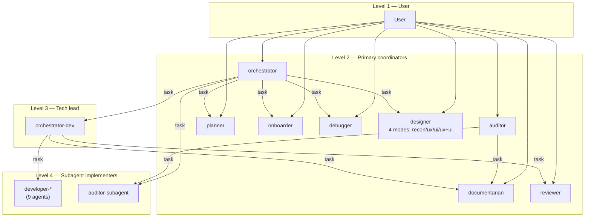
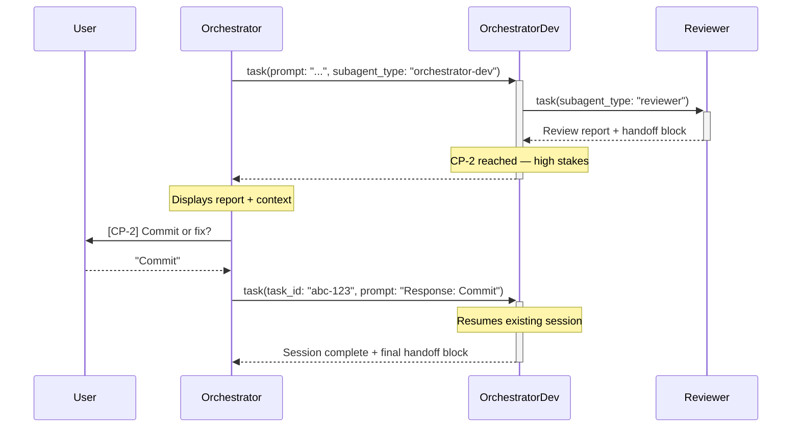
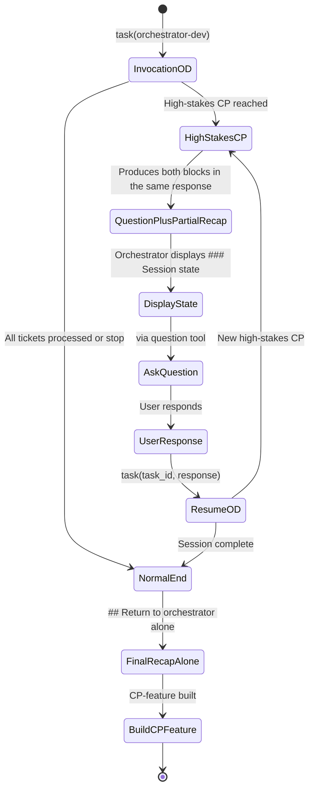

> [Lire en français](task-delegation.fr.md)

# Inter-Agent Delegation — The `task` Tool

This document details the agent delegation mechanism in OpenCode,
the invocation hierarchy, and inter-agent communication protocols.

> See also: [ADR-003](./adr/003-orchestrator-checkpoints.fr.md) (checkpoints),
> [ADR-006](./adr/006-orchestrator-configurable-mode.fr.md) (workflow modes),
> [ADR-009](./adr/009-inter-agent-handoff-contracts.fr.md) (handoff contracts).

---

## The `task` tool — core mechanics

The `task` tool is the sole delegation mechanism between agents in OpenCode.
It allows a parent agent to invoke a child agent to perform an autonomous task,
then retrieve the result as a text output.

### Interface

```typescript
task({
  subagent_type: string,   // ID of the agent to invoke (required)
  prompt: string,          // Instructions for the sub-agent (required)
  description: string,     // Short description (3-5 words) for tracking
  task_id?: string         // ID of a previous session to resume (optional)
})
```

### Behavior

- **Isolated session**: the sub-agent has its own LLM context —
  it does not see the parent's conversation history.
- **Single result**: the sub-agent returns a single text message to the parent
  at the end of its session.
- **Context via prompt**: any information needed by the sub-agent must be
  explicitly passed in the `prompt`.

### Difference from other tools

| Tool | Role | Modifies the project? |
|------|------|-----------------------|
| `task` | Delegate a task to another agent | Depends on the sub-agent |
| `bash` | Execute a shell command | Yes (if modifying command) |
| `edit` | Modify an existing file | Yes |
| `write` | Create a new file | Yes |
| `question` | Ask the user a question | No |

### Permissions — per-agent whitelist

The `task` tool is subject to an explicit whitelist in `opencode.json`.
Each agent declares which sub-agents it may invoke:

```json
{
  "agent": {
    "orchestrator": {
      "permission": {
        "task": {
          "*": "deny",
          "planner": "allow",
          "onboarder": "allow",
          "designer": "allow",
          "auditor-subagent": "allow",
          "orchestrator-dev": "allow",
          "debugger": "allow"
        }
      }
    },
    "orchestrator-dev": {
      "permission": {
        "task": {
          "*": "deny",
          "developer-*": "allow",
          "reviewer": "allow",
          "documentarian": "allow"
        }
      }
    }
  }
}
```

The `"*": "deny"` pattern with explicit exceptions ensures that an agent
cannot arbitrarily invoke any other agent.

---

## Agent hierarchy and routing rules

### The 4 invocation levels



### Invocation rights matrix

| Calling agent | Can invoke via `task` |
|---------------|-----------------------|
| `orchestrator` | `planner`, `onboarder`, `designer`, `auditor-subagent`, `orchestrator-dev`, `debugger` |
| `orchestrator-dev` | `developer-*`, `reviewer`, `documentarian` |
| `auditor` | `auditor-subagent`, `documentarian` |
| `planner` | `documentarian` |
| `debugger` | `documentarian` |

### `primary` vs `subagent` modes

| Mode | User visibility | Invocation |
|------|-----------------|------------|
| `primary` | Visible in the Tab picker | Directly by the user or via `task` |
| `subagent` | Hidden from the Tab picker | Only via `task` by an authorized parent |

The `developer-*` and `auditor-subagent` agents are in `subagent` mode —
they do not appear in the user interface and can only be invoked by their designated parent.

### Absolute rule — level isolation

> **The orchestrator NEVER routes directly to `developer-*` agents.**

This rule is fundamental: the `orchestrator` always delegates to
`orchestrator-dev`, which in turn routes to the appropriate `developer-*`.
This indirection allows:

- Centralizing the implementation workflow (review, correction cycles)
- Maintaining consistent handoff protocols
- Isolating responsibilities (design vs. implementation)

---

## Inter-agent communication protocols

### The general pattern

Each sub-agent, when invoked via `task`, produces **only** a structured block
`## Return to <parent>` which is its **sole output**:

1. **Single structured block `## Return to <parent>`** — contains all information
   needed by the coordinator: actionable metadata (status, routing, verdict,
   summary tables) AND detailed content embedded in a dedicated section
   (`### Full report`, `### Full spec`, `### Full pathfinder report`, etc.).
   This block is self-contained — the coordinator can relay its fields directly
   to the user without loss of information.

No free text (narrative report, introduction, summary, conclusion) is produced
before or after the block. The single block is the only communication interface
between the child agent and its parent coordinator.

```markdown
## Return to orchestrator

**Agent:** <name>
**Ticket:** #<ID> — <title>

---

## Return to orchestrator-dev

**Agent:** developer-backend
**Ticket:** #bd-42 — Fix null guard

### Implementation
**Diff summary:** 3 files, +85 / -5
[...]

### Status
`implemented`
```

### The two handoff blocks toward the orchestrator

When `orchestrator-dev` is invoked from the `orchestrator`, it uses
two distinct blocks depending on the situation:

| Situation | Block produced |
|-----------|----------------|
| Normal end (all tickets processed or stop) | `## Return to orchestrator` |
| High-stakes CP — decision required | `## Question for the orchestrator` **+** `## Return to orchestrator` |

The `## Question for the orchestrator` block contains:
- Full context (review report, cycle history...)
- The question to ask the user
- The available options
- The session state (`task_id` for resumption)

### Handoff contract table

| Skill | Producer | Consumer | Key fields |
|-------|----------|----------|------------|
| `developer/developer-handoff-format` | `developer-*` | `orchestrator-dev` | Modified files, checked criteria, attention points, status |
| `reviewer/reviewer-handoff-format` | `reviewer` | `orchestrator-dev` | Verdict, verbatim corrections, recommended routing |
| `documentarian/documentarian-handoff-format` | `documentarian` | `orchestrator-dev` | Type, modified files, summary |
| `orchestrator/orchestrator-handoff-format` | `orchestrator-dev` | `orchestrator` | Processed tickets, per-ticket detail, attention points, global status |
| `auditor/audit-handoff-format` | `auditor-*` | `orchestrator` | Vulnerabilities, recommendations, residual risk |
| `design/design-handoff-format` | `designer` | `orchestrator` | Full spec, constraints, open points |
| `planning/planner-handoff-format` | `planner` | `orchestrator` | Ticket table, planned agents, dependencies |
| `planning/onboarder-handoff-format` | `onboarder` | `orchestrator` | Stack, conventions, debt, uncertainties |
| `quality/debugger-handoff-format` | `debugger` | `orchestrator` | Root cause, certainty, impact, urgent actions |

### The no-summary and no-duplication rule

> **Never summarize content produced by a sub-agent.**
> **Never re-encode in the narrative content data already present in the structured block.**

These two rules are repeated in every handoff skill because they are critical:

- The consumer displays the condensed summary (status, key files, attention points per ticket) before presenting
  a checkpoint to the user
- Reviewer corrections are copied **verbatim** into Beads comments
- The review report is transmitted **as-is** to the user at CP-2
- The narrative provides what the structured block cannot: evidence,
  context, reasoning — not a repetition of the block's tables and fields

A summary loses information and can lead to incorrect decisions.
Duplication between narrative and structured block produces redundant feedback
visible to the user.

→ [ADR-009](./adr/009-inter-agent-handoff-contracts.fr.md)

---

## Session resumption with `task_id`

### Mechanism

When a high-stakes CP occurs, `orchestrator-dev` does not ask the question
itself — it produces a `## Question for the orchestrator` block and ends its
session. The `orchestrator`:

1. Receives the block with the `task_id` of the suspended session
2. Displays the full context to the user
3. Asks the question via the `question` tool
4. Re-invokes `orchestrator-dev` with the same `task_id` + the response

### Resumption flow



### High-stakes CPs triggering this mechanism

| CP | Trigger | Context transmitted |
|----|---------|---------------------|
| **CP-2** | Review report received | Summary + full report |
| **3-cycle blockage** | 3 reviews without resolution | Reports from the 3 cycles |
| **Unresolved dependency** | Ticket blocked by a parent | ID and status of the blocker |
| **Blocked ticket** | Developer signals a blockage | Reason for the blockage |

### The `task_id` is an OpenCode session ID

The `task_id` is not a proprietary LLM identifier — it is a **standard OpenCode session ID**. When a parent agent invokes `task(subagent_type, prompt)`, OpenCode creates a child session navigable in the TUI (`session_child_first`, `session_child_cycle`) and accessible via the SDK (`session.children()`). The ID returned by the `task` tool is this session's ID.

**Direct consequences:**
- Resumption via `task_id` is **reliable**: it is not an LLM context replay, it is a reconnection to an existing server-side session with its full message history intact
- The risk of "LLM context loss" during a resumption does not exist — context is persisted server-side by OpenCode

**What remains unknown:**

| Point | Status |
|-------|--------|
| How the child agent knows its own `task_id` | Probably injected into the system context by OpenCode — not publicly documented |
| Session lifetime | Sessions persist server-side (`session.delete()` exists) — TTL not documented |
| Behavior if `task_id` is invalid | `session.get()` throws an error — behavior of the `task` tool unspecified |
| `task` absent from the `/docs/tools` docs | The tool exists (listed in the permissions schema) but is not documented in the built-ins list — gap or intentional |

**Residual risk — OpenCode restart:** if OpenCode restarts between the moment `orchestrator-dev` produces the upstream question and the moment the orchestrator agent re-invokes with the `task_id`, the child session may have disappeared. This case is not handled in the skills — see `### task_id — session not found` in the Attention Points section.

---

## The invocation context marker

### Execution path loading convention

Since ADR-016, the orchestrator agent injects two markers into `task` prompts sent to primary agents:

```
[CONTEXT] Invoked from the feature orchestrator.
[SKILL:planning/planner-subagent]
```

The `[SKILL:<name>]` marker tells the agent which path skill to load at startup:
- Present → the agent loads the sub-agent skill (interruption mechanism active)
- Absent → the agent loads the default standalone skill (`question` tool active)

This mechanism replaces detection of the `[CONTEXT]` marker directly within agents — the branching logic is now entirely within dedicated skills.

> **Available path skills:**
>
> | Agent | Standalone | Sub-agent |
> |-------|-----------|-----------|
> | planner | `planning/planner-standalone` | `planning/planner-subagent` |
> | pathfinder | `planning/pathfinder-standalone` | `planning/pathfinder-subagent` |
> | onboarder | `planning/onboarder-standalone` | `planning/onboarder-subagent` |
> | auditor | `auditor/auditor-standalone` | `auditor/auditor-subagent` |
> | orchestrator-dev | `orchestrator/orchestrator-dev-standalone` | `orchestrator/orchestrator-dev-subagent` |
> | reviewer | `reviewer/reviewer-standalone` | `reviewer/reviewer-subagent` |

### Standalone vs. from-orchestrator behavior

| Aspect | Standalone | From orchestrator |
|--------|-----------|-------------------|
| Path skill | `-standalone` (implicit default) | `-subagent` (injected via `[SKILL:...]`) |
| Workflow mode | Requested at CP-0 | Passed as parameter |
| CP questions | Asked via `question` | `## Question for the orchestrator` block |
| Global recap | Displayed to the user | Transmitted to the orchestrator |
| Handoff block | Not produced | **Required** |

### Agents implementing the interruption mechanism

The following agents implement the session interruption mechanism when the sub-agent skill is loaded:

| Agent | Interruption granularity | Interruption type |
|-------|--------------------------|-------------------|
| **orchestrator-dev** | High-stakes CPs (CP-2, blockage, blocked ticket) + intermediate CPs (CP-1, CP-3, branch) in `manual` mode | Systematic at each CP |
| **planner** | End of each phase (0 to 5) + ad hoc pauses | Systematic |
| **pathfinder** | Critical clarification detected | Ad hoc only |
| **onboarder** | End of each phase (0 to 4) + ad hoc pauses | Systematic |
| **auditor** (coordinator) | End of each phase (0 to 3) + ad hoc pauses | Systematic |
| **debugger** | End of each phase + irreversible action confirmations | Systematic |
| **designer** | Critical clarification (design system, user information, ambiguous mode) | Ad hoc only |

### Re-invocation with task_id

On re-invocations with `task_id`, the orchestrator agent **must always re-transmit** the `[SKILL:...]` marker:

```
task(
  subagent_type: "planner",
  task_id: "<task_id>",
  prompt: "Phase 1 response: [option]. [CONTEXT] Invoked from the feature orchestrator. [SKILL:planning/planner-subagent]"
)
```

Without this marker, the reloaded agent starts in standalone mode — degraded but not broken behavior.

---

## Checkpoints and decision points

### Full checkpoint table

| CP | Agent | Moment | Pause modes | **Mechanism in orchestrator_feature mode** |
|----|-------|--------|-------------|---------------------------------------------|
| **CP-onboard** | `orchestrator` | After `onboarder`, before planning | Always manual | Upstream question from onboarder → task_id |
| **CP-0** | `orchestrator` | After planning, before design | Always manual | Upstream question from planner → task_id |
| **CP-spec** | `orchestrator` | After UX/UI specs, before implementation | Always manual | Upstream question from designer → task_id |
| **CP-audit** | `orchestrator` | After audit, before implementation | Always manual | Upstream question from auditor → task_id |
| **CP-1** | `orchestrator-dev` | Before each ticket | Manual / auto (semi-auto, auto) | `## Question for the orchestrator` block → task_id (manual mode only) |
| **CP-2** | `orchestrator-dev` | After review — commit or fix? | **Always manual** | `## Question for the orchestrator` block → task_id (unchanged, already implemented) |
| **CP-3** | `orchestrator-dev` | After commit — next ticket? | Manual / auto (semi-auto, auto) | `## Question for the orchestrator` block → task_id (manual mode only) |
| **CP-feature** | `orchestrator` | End of feature | Always manual | Full final return |

### Absolute rule — CP-2 is non-automatable

> **CP-2 (commit or fix?) is a pause in ALL modes, without exception.**

This rule cannot be overridden, even in `auto` mode. Justification:

- "No technical errors" ≠ "meets functional expectations"
- The decision to merge engages the user's responsibility
- An AI confidence score on a review report would be false precision

→ [ADR-006](./adr/006-orchestrator-configurable-mode.fr.md)

### Note: Two variants of the upstream question block

Two block names coexist depending on the producing agent — they are semantically equivalent but the orchestrator agent must detect both:

| Block | Producers | Detection |
|-------|-----------|-----------|
| `## Question pour l'orchestrator` (with accent) | planner, pathfinder, onboarder, auditor, debugger, designer | Contains `task_id` for resumption |
| `## Question pour l'orchestrator` (without accent) | orchestrator-dev | Contains `task_id` for resumption |

Both trigger the same behavior on the orchestrator side: display the intermediate recap, relay the question via `question`, re-invoke with `task_id`.

### Anti-loop counters

To prevent infinite loops, limits are enforced:

| Counter | Limit | Action when exceeded |
|---------|-------|----------------------|
| Spec revisions | 3 | Requests manual intervention |
| Re-audits after correction | 2 | Acceptance with reservations |
| Review cycles | 3 | Blockage signaled, user choice |

---

## Attention points and known limitations

### `task_id` — risk of session not found

The `task_id` is a standard OpenCode session ID — session resumption is reliable as long as the session exists server-side. The only real risk is **session not found**: if OpenCode restarts between the upstream question and the resumption, the child session may have disappeared.

| Cause | Probability | Impact |
|-------|-------------|--------|
| OpenCode restart between upstream question and resumption | Low — requires a restart during the wait window | Workflow interrupted — resumption impossible via `task_id` |
| `task_id` incorrectly copied in the `### Session state` block | Very low — LLM error | Same impact |

**Safety net in `orchestrator-protocol.md`:** if re-invocation with `task_id` fails (no result, error), the orchestrator must detect the case and offer the user the option to restart `orchestrator-dev` from scratch with the remaining tickets — see the dedicated section in `orchestrator-protocol.md`.

**What remains unknown on the SDK side:**
- How the child agent knows its own `task_id` during execution (not publicly documented)
- Session TTL (probably unlimited but unspecified)

### Partial vs. final recap

When `orchestrator-dev` reaches a high-stakes CP, it produces **in the same response** two blocks:

```
## Question for the orchestrator     ← decision required
[context, question, options, session state, task_id]

## Return to orchestrator            ← current session state
[tickets processed so far, partial status]
```

The second block is **structurally almost identical** to the final recap — the only explicit distinction is the `**Recap type:**` field: `partial` when emitted with an upstream question, `final` when emitted alone at end of session.

#### What each recap type contains

| Field | **Partial** recap | **Final** recap |
|-------|-------------------|-----------------|
| `Processed tickets` | Those completed up to instant T | All committed tickets |
| `Skipped tickets` | Those skipped up to instant T | All skipped tickets |
| `Per-ticket detail` | Processed tickets only — the current ticket and remaining ones are absent | Full table |
| `Attention points` | Partial aggregation | Full aggregation |
| `Global status` | Technically incorrect — `success` possible while tickets remain | Correct — based on the full set |

#### Detection signal

```
Result contains ## Question for the orchestrator?
  ├── YES → PARTIAL recap
  │         Display ### Session state in the discussion
  │         Do not build the CP-feature
  │         Ask the question → re-invoke with task_id
  └── NO  → FINAL recap
            Build the CP-feature
```

#### State diagram



#### What can go wrong

| Error | Consequence |
|-------|-------------|
| Building the CP-feature from the partial recap | Ongoing and remaining tickets absent from the global recap |
| Using the `Global status` from the partial recap | `success` displayed while tickets remain unprocessed |
| Not displaying `### Session state` | User responds without knowing where the workflow stands |
| Not re-invoking with `task_id` | `orchestrator-dev` session lost, workflow interrupted |

> ❌ **Never build the CP-feature from a partial recap.**
> A recap is partial if and only if the `task(orchestrator-dev)` response also contains `## Question for the orchestrator`.

### Conditional parallelism (mode `auto` only)

By default, `orchestrator-dev` processes tickets **sequentially**. A **conditional parallelism** mode is available exclusively in `auto` mode when all 4 parallelizability criteria are met.

#### Why sequential is the default mode

Three constraints make parallelism irrelevant or risky in the general case:

| Constraint | Impact |
|---|---|
| **CP-2 absolute pause** | Even in parallel, CP-2s from N sessions are processed sequentially (one report at a time) — the gain during the implementation phase is "absorbed" by the review |
| **Human bottleneck** | In `manual`/`semi-auto` modes, human pauses (CP-1, CP-3) dominate total time — parallelizing implementation does not speed up these decisions |
| **Undetectable implicit dependencies** | Two tickets without a formal `deps` relationship may have semantic dependencies invisible to the orchestrator |

The real gain from parallelism only exists in `auto` mode, and only during the implementation phase.

#### The 4 parallelizability criteria

A batch of tickets is eligible for parallel processing if and only if **all** these criteria are met:

| # | Criterion | Verification |
|---|---|---|
| 1 | **No formal dependency between tickets in the batch** | `bd dep list <ID>` for each ticket — the intersection with the batch IDs is empty |
| 2 | **Different agents, disjoint domains** | Tickets routed to distinct `developer-*` — no `developer-fullstack` in the batch |
| 3 | **No foreseeable cross-cutting files** | No ticket mentions shared types, database migrations, or global configuration files |
| 4 | **`auto` mode active** | `manual` and `semi-auto` modes remain sequential |

If a single criterion is not met → **forced sequential**.

#### Behavior in conditional parallel mode

- **Launch**: N `developer-*` sessions started simultaneously (max 3 in parallel)
- **CP-2**: processed **sequentially** even in parallel — one question at a time in the order results arrive
- **Late conflict detection**: if a `developer-*` modifies a file already modified by another parallel session (`git status`), the orchestrator triggers an early CP-2 before continuing
- **Global recap**: produced only when **all** parallel sessions have returned a `final` recap
- **Limit**: maximum 3 simultaneous parallel sessions

#### What parallelism does not solve

Parallelism does not eliminate CP-2 pauses — it groups them in time. For a batch of N tickets in parallel, the user will read N successive review reports at the end of the implementation phase instead of reading them one by one. This is a posture shift: aggregated supervision rather than ticket-by-ticket supervision.

### Mode transmission via prompt

The workflow mode (`manual`, `semi-auto`, `auto`) is transmitted in the
`prompt` text, not as a structured parameter of the `task` tool.

#### Canonical values

Three exact values are accepted (case-insensitive):

| Value | Mode applied |
|-------|--------------|
| `manuel` | All pauses active — default mode |
| `semi-auto` | CP-1 and CP-3 automatic, CP-2 manual |
| `auto` | Fully automatic except CP-2 (absolute pause) |

Never transmit the raw interface option label (`"Manuel (Recommandé)"`, `"Semi-auto"`) — normalize to lowercase before transmission.

**Example of correct prompt wording:**
```
Workflow mode: semi-auto
```

#### Identified failure cases

| Case | Probability | Impact |
|------|-------------|--------|
| **Resumption via `task_id` without re-transmitting the mode** | 🔴 High — systematic at CP-2 | Mode silently lost; `manuel` fallback assumed but not guaranteed |
| Mode absent from initial prompt | 🟠 Medium | Unexpected CP-1/CP-3 pauses if mode was `semi-auto`/`auto` |
| Badly formatted mode (e.g. `"automatique"`) | 🟡 Low-Medium | Parsing undefined — risk of unintended `auto` mode |
| Contradictory modes in the prompt | 🟡 Low | Indeterminate behavior — first occurrence applied |

**The most critical case:** each CP-2 invoked from the orchestrator triggers a session resumption via `task_id`. The resumption prompt does not naturally contain the mode — it must be explicitly re-transmitted.

#### Fixes applied in the skills

To mitigate these risks, the following changes have been applied:

**`orchestrator-workflow-modes.md`**
- Explicit definition of the three canonical values on the sender side
- Prohibition on transmitting raw interface labels

**`orchestrator-protocol.md`**
- Self-check before delegation: "is the canonical mode in the prompt?"
- `task_id` resumption prompt modified to systematically include the mode:
  ```
  "User response at CP <phase>… Workflow mode: <canonical value>. Resume…"
  ```

**`orchestrator-dev-protocol.md`**
- Parsing rule documented: canonical values, explicit `manuel` fallback, signal if absent or ambiguous
- Confirmation of received mode in the startup message:
  ```
  [orchestrator-dev] Workflow mode received: <value>. The ## Return block will be produced at end of session.
  ```
- Two new prohibitions in "What you do NOT do"

### Non-inherited permissions

A sub-agent does not inherit its parent's permissions. Each agent has its
own permissions declared in `opencode.json`. A `developer-backend`
can write code even if its parent `orchestrator-dev` cannot.
