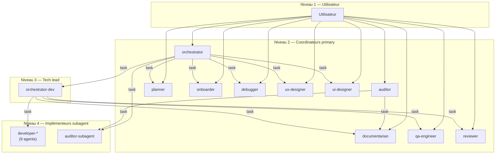
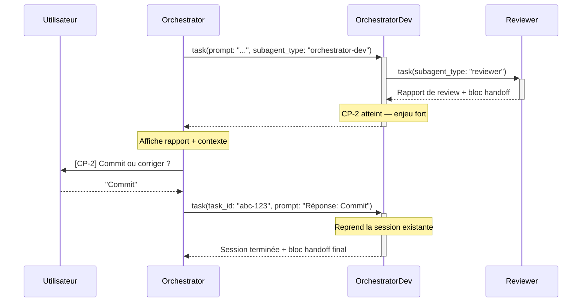
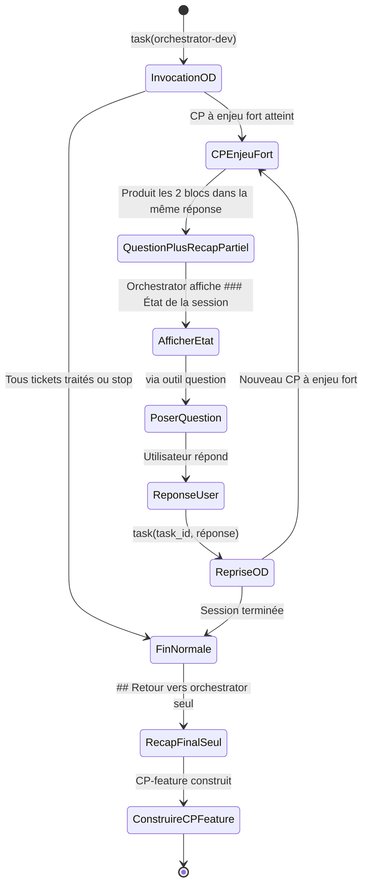

# Délégation inter-agents — L'outil `task`

Ce document détaille le mécanisme de délégation entre agents dans OpenCode,
la hiérarchie d'invocation et les protocoles de communication inter-agents.

> Voir aussi : [ADR-003](./adr/003-orchestrator-checkpoints.fr.md) (checkpoints),
> [ADR-006](./adr/006-orchestrator-configurable-mode.fr.md) (modes de workflow),
> [ADR-009](./adr/009-inter-agent-handoff-contracts.fr.md) (contrats de handoff).

---

## L'outil `task` — mécanique de base

L'outil `task` est le seul mécanisme de délégation entre agents dans OpenCode.
Il permet à un agent parent d'invoquer un agent enfant pour réaliser une tâche
autonome, puis de récupérer le résultat sous forme textuelle.

### Interface

```typescript
task({
  subagent_type: string,   // ID de l'agent à invoquer (obligatoire)
  prompt: string,          // Instructions pour le sous-agent (obligatoire)
  description: string,     // Description courte (3-5 mots) pour le suivi
  task_id?: string         // ID d'une session précédente à reprendre (optionnel)
})
```

### Comportement

- **Session isolée** : le sous-agent dispose de son propre contexte LLM —
  il ne voit pas l'historique de conversation du parent.
- **Résultat unique** : le sous-agent retourne un seul message textuel au parent
  à la fin de sa session.
- **Contexte via prompt** : toute information nécessaire au sous-agent doit être
  transmise explicitement dans le `prompt`.

### Différence avec les autres outils

| Outil | Rôle | Modifie le projet ? |
|-------|------|---------------------|
| `task` | Déléguer une tâche à un autre agent | Dépend du sous-agent |
| `bash` | Exécuter une commande shell | Oui (si commande modifiante) |
| `edit` | Modifier un fichier existant | Oui |
| `write` | Créer un nouveau fichier | Oui |
| `question` | Poser une question à l'utilisateur | Non |

### Permissions — whitelist par agent

L'outil `task` est soumis à une whitelist explicite dans `opencode.json`.
Chaque agent déclare quels sous-agents il peut invoquer :

```json
{
  "agent": {
    "orchestrator": {
      "permission": {
        "task": {
          "*": "deny",
          "planner": "allow",
          "onboarder": "allow",
          "ux-designer": "allow",
          "ui-designer": "allow",
          "auditor-subagent": "allow",
          "orchestrator-dev": "allow",
          "debugger": "allow"
        }
      }
    },
    "orchestrator-dev": {
      "permission": {
        "task": {
          "*": "deny",
          "developer-*": "allow",
          "reviewer": "allow",
          "qa-engineer": "allow",
          "documentarian": "allow"
        }
      }
    }
  }
}
```

Le pattern `"*": "deny"` avec des exceptions explicites garantit qu'un agent
ne peut pas invoquer arbitrairement n'importe quel autre agent.

---

## Hiérarchie des agents et règles de routing

### Les 4 niveaux d'invocation



### Matrice des droits d'invocation

| Agent appelant | Peut invoquer via `task` |
|---------------|--------------------------|
| `orchestrator` | `planner`, `onboarder`, `ux-designer`, `ui-designer`, `auditor-subagent`, `orchestrator-dev`, `debugger` |
| `orchestrator-dev` | `developer-*`, `reviewer`, `qa-engineer`, `documentarian` |
| `auditor` | `auditor-subagent`, `documentarian` |
| `planner` | `documentarian` |
| `debugger` | `documentarian` |

### Modes `primary` vs `subagent`

| Mode | Visibilité utilisateur | Invocation |
|------|------------------------|------------|
| `primary` | Visible dans le Tab picker | Directe par l'utilisateur ou via `task` |
| `subagent` | Invisible dans le Tab picker | Uniquement via `task` par un parent autorisé |

Les agents `developer-*` et `auditor-subagent` sont
en mode `subagent` — ils n'apparaissent pas dans l'interface utilisateur et
ne peuvent être invoqués que par leur parent désigné.

### Règle absolue — isolation des niveaux

> **L'orchestrator ne route JAMAIS directement vers les `developer-*`.**

Cette règle est fondamentale : l'`orchestrator` délègue toujours à
`orchestrator-dev`, qui lui-même route vers le bon `developer-*`.
Cette indirection permet de :

- Centraliser le workflow d'implémentation (QA, review, cycles de correction)
- Maintenir des protocoles de handoff cohérents
- Isoler les responsabilités (conception vs implémentation)

---

## Protocoles de communication inter-agents

### Le pattern général

Chaque sous-agent, quand invoqué via `task`, produit **dans cet ordre** :

1. **Contenu narratif complet** — le travail réalisé avec son contexte et son
   raisonnement (rapport, compte rendu d'implémentation, diagnostic...).
   Ce contenu apporte ce que le bloc structuré ne peut pas contenir : le
   *pourquoi* des décisions, les preuves, le contexte de découverte.
   **Il ne réencode pas les données déjà présentes dans le bloc structuré**
   (listes de fichiers, tableaux, champs normalisés).
2. **Bloc structuré `## Retour vers <parent>`** — résumé actionnable avec des
   champs normalisés (statut, routing, verdict, tableaux de synthèse).

Le bloc structuré **vient après** le contenu narratif — il le complète avec des
données structurées actionnables. Les deux sont complémentaires et non
redondants : le narratif apporte le contexte, le bloc structuré apporte
les métadonnées de routing et de décision.

```markdown
## Contenu complet du travail réalisé
[... rapport détaillé, code, analyse ...]

---

## Retour vers orchestrator-dev

**Agent :** developer-backend
**Ticket :** #bd-42 — Fix null guard

### Implémentation
**Diff résumé :** 3 fichiers, +85 / -5
[...]

### Statut
`implémenté`
```

### Les deux blocs de handoff vers l'orchestrator

Quand `orchestrator-dev` est invoqué depuis l'`orchestrator`, il utilise
deux blocs distincts selon la situation :

| Situation | Bloc produit |
|-----------|--------------|
| Fin normale (tous tickets traités ou stop) | `## Retour vers orchestrator` |
| CP à enjeu fort — décision requise | `## Question pour l'orchestrator` **+** `## Retour vers orchestrator` |

Le bloc `## Question pour l'orchestrator` contient :
- Le contexte complet (rapport de review, historique des cycles...)
- La question à poser à l'utilisateur
- Les options disponibles
- L'état de la session (`task_id` pour reprise)

### Tableau des contrats de handoff

| Skill | Producteur | Consommateur | Champs clés |
|-------|-----------|-------------|-------------|
| `developer/developer-handoff-format` | `developer-*` | `orchestrator-dev` | Fichiers modifiés, critères cochés, points d'attention, statut |
| `reviewer/reviewer-handoff-format` | `reviewer` | `orchestrator-dev` | Verdict, corrections verbatim, routing recommandé |
| `qa/qa-handoff-format` | `qa-engineer` | `orchestrator-dev` | Tests écrits, couverture, zones non testables |
| `documentarian/documentarian-handoff-format` | `documentarian` | `orchestrator-dev` | Type, fichiers modifiés, résumé |
| `orchestrator/orchestrator-handoff-format` | `orchestrator-dev` | `orchestrator` | Tickets traités, détail par ticket, points d'attention, statut global |
| `auditor/audit-handoff-format` | `auditor-*` | `orchestrator` | Vulnérabilités, recommandations, risque résiduel |
| `design/design-handoff-format` | `ux-designer`, `ui-designer` | `orchestrator` | Spec complète, contraintes, points ouverts |
| `planning/planner-handoff-format` | `planner` | `orchestrator` | Tableau des tickets, agents prévus, dépendances |
| `planning/onboarder-handoff-format` | `onboarder` | `orchestrator` | Stack, conventions, dette, incertitudes |
| `quality/debugger-handoff-format` | `debugger` | `orchestrator` | Cause racine, certitude, impact, actions urgentes |

### La règle de non-résumé et de non-duplication

> **Ne jamais résumer le contenu produit par un sous-agent.**
> **Ne jamais réencoder dans le contenu narratif les données déjà présentes dans le bloc structuré.**

Ces deux règles sont répétées dans chaque skill de handoff car elles sont critiques :

- Le consommateur affiche la synthèse condensée (statut, fichiers clés, points d'attention par ticket) avant de poser
  un checkpoint à l'utilisateur
- Les corrections du reviewer sont copiées **verbatim** dans les commentaires Beads
- Le rapport de review est transmis **tel quel** à l'utilisateur au CP-2
- Le narratif apporte ce que le bloc structuré ne peut pas donner : preuves,
  contexte, raisonnement — pas une répétition des tableaux et champs du bloc

Un résumé perd de l'information et peut mener à des décisions incorrectes.
Une duplication entre narratif et bloc structuré produit des retours redondants
visibles par l'utilisateur.

→ [ADR-009](./adr/009-inter-agent-handoff-contracts.fr.md)

---

## Reprise de session avec `task_id`

### Mécanisme

Quand un CP à enjeu fort survient, `orchestrator-dev` ne pose pas la question
lui-même — il produit un bloc `## Question pour l'orchestrator` et arrête sa
session. L'`orchestrator` :

1. Reçoit le bloc avec le `task_id` de la session suspendue
2. Affiche le contexte complet à l'utilisateur
3. Pose la question via l'outil `question`
4. Ré-invoque `orchestrator-dev` avec le même `task_id` + la réponse

### Flux de reprise



### CPs à enjeu fort déclenchant ce mécanisme

| CP | Déclencheur | Contexte transmis |
|----|------------|-------------------|
| **CP-2** | Rapport de review reçu | Synthèse + rapport intégral |
| **Blocage 3 cycles** | 3 reviews sans résolution | Rapports des 3 cycles |
| **Dépendance non résolue** | Ticket bloqué par un parent | ID et statut du bloquant |
| **Ticket bloqué** | Developer signale un blocage | Raison du blocage |

### Le `task_id` est un ID de session OpenCode

Le `task_id` n'est pas un identifiant LLM propriétaire — c'est un **ID de session OpenCode standard**. Quand un agent parent invoque `task(subagent_type, prompt)`, OpenCode crée une session enfant navigable dans le TUI (`session_child_first`, `session_child_cycle`) et accessible via le SDK (`session.children()`). L'ID retourné par l'outil `task` est l'ID de cette session.

**Conséquences directes :**
- La reprise via `task_id` est **fiable** : ce n'est pas un re-jeu de contexte LLM, c'est une reconnexion à une session existante côté serveur avec son historique de messages intact
- Le risque de "perte de contexte LLM" lors d'une reprise n'existe pas — le contexte est persisté côté serveur OpenCode

**Ce qui reste inconnu :**

| Point | Statut |
|-------|--------|
| Comment l'agent enfant connaît son propre `task_id` | Probablement injecté en contexte système par OpenCode — non documenté publiquement |
| Durée de vie d'une session | Les sessions persistent côté serveur (`session.delete()` existe) — TTL non documenté |
| Comportement si `task_id` invalide | `session.get()` lève une erreur — comportement de l'outil `task` non spécifié |
| `task` absent de la doc `/docs/tools` | L'outil existe (listé dans le schéma de permissions) mais n'est pas documenté dans la liste des built-ins — lacune ou intentionnel |

**Risque résiduel — redémarrage d'OpenCode :** si OpenCode redémarre entre le moment où `orchestrator-dev` produit la question montante et le moment où l'orchestrateur ré-invoque avec le `task_id`, la session enfant peut avoir disparu. Ce cas n'est pas géré dans les skills — voir `### task_id — session introuvable` dans la section Points d'attention.

---

## Le marqueur de contexte d'invocation

### Convention de chargement du parcours d'exécution

Depuis l'ADR-016, l'orchestrateur injecte deux marqueurs dans les prompts `task` vers les agents primaires :

```
[CONTEXTE] Invoqué depuis l'orchestrateur feature.
[SKILL:planning/planner-subagent]
```

Le marqueur `[SKILL:<nom>]` indique à l'agent quel skill de parcours charger au démarrage :
- Présent → l'agent charge le skill sous-agent (mécanisme d'interruption actif)
- Absent → l'agent charge le skill standalone par défaut (outil `question` actif)

Ce mécanisme remplace la détection du marqueur `[CONTEXTE]` directement dans les agents — la logique de bifurcation est désormais entièrement dans les skills dédiés.

> **Skills de parcours disponibles :**
>
> | Agent | Standalone | Sous-agent |
> |-------|-----------|-----------|
> | planner | `planning/planner-standalone` | `planning/planner-subagent` |
> | pathfinder | `planning/pathfinder-standalone` | `planning/pathfinder-subagent` |
> | onboarder | `planning/onboarder-standalone` | `planning/onboarder-subagent` |
> | auditor | `auditor/auditor-standalone` | `auditor/auditor-subagent` |
> | orchestrator-dev | `orchestrator/orchestrator-dev-standalone` | `orchestrator/orchestrator-dev-subagent` |
> | reviewer | `reviewer/reviewer-standalone` | `reviewer/reviewer-subagent` |
> | qa-engineer | `qa/qa-standalone` | `qa/qa-subagent` |

### Comportement standalone vs depuis orchestrateur

| Aspect | Standalone | Depuis orchestrateur |
|--------|-----------|---------------------|
| Skill de parcours | `-standalone` (défaut implicite) | `-subagent` (injecté via `[SKILL:...]`) |
| Mode de workflow | Demandé au CP-0 | Transmis en paramètre |
| Questions CP | Posées via `question` | Bloc `## Question pour l'orchestrator` |
| Récap global | Affiché à l'utilisateur | Transmis à l'orchestrator |
| Bloc handoff | Non produit | **Obligatoire** |

### Agents implémentant le mécanisme d'interruption

Les agents suivants implémentent le mécanisme d'interruption de session quand le skill sous-agent est chargé :

| Agent | Granularité des interruptions | Type d'interruption |
|-------|------------------------------|---------------------|
| **orchestrator-dev** | CPs à enjeu fort (CP-2, blocage, ticket bloqué) + CPs intermédiaires (CP-1, CP-QA, CP-3, branche) en mode `manuel` | Systématique à chaque CP |
| **planner** | Fin de chaque phase (0 à 5) + pauses ad hoc | Systématique |
| **pathfinder** | Clarification critique détectée | Ad hoc uniquement |
| **onboarder** | Fin de chaque phase (0 à 4) + pauses ad hoc | Systématique |
| **auditor** (coordinateur) | Fin de chaque phase (0 à 3) + pauses ad hoc | Systématique |
| **debugger** | Fin de chaque phase + confirmations d'action irréversible | Systématique |
| **ux-designer** | Clarification critique (design system, informations utilisateur) | Ad hoc uniquement |
| **ui-designer** | Clarification critique (design system inexistant) | Ad hoc uniquement |

### Ré-invocation avec task_id

Lors des ré-invocations avec `task_id`, l'orchestrateur **doit toujours re-transmettre** le marqueur `[SKILL:...]` :

```
task(
  subagent_type: "planner",
  task_id: "<task_id>",
  prompt: "Réponse Phase 1 : [option]. [CONTEXTE] Invoqué depuis l'orchestrateur feature. [SKILL:planning/planner-subagent]"
)
```

Sans ce marqueur, l'agent rechargé démarre en mode standalone — comportement dégradé mais non cassé.

---

## Checkpoints et points de décision

### Tableau complet des checkpoints

| CP | Agent | Moment | Pause modes | **Mécanisme en mode orchestrateur_feature** |
|----|-------|--------|-------------|----------------------------------------------|
| **CP-onboard** | `orchestrator` | Après `onboarder`, avant planification | Toujours manuel | Question montante de l'onboarder → task_id |
| **CP-0** | `orchestrator` | Après planification, avant conception | Toujours manuel | Question montante du planner → task_id |
| **CP-spec** | `orchestrator` | Après specs UX/UI, avant implémentation | Toujours manuel | Question montante du designer → task_id |
| **CP-audit** | `orchestrator` | Après audit, avant implémentation | Toujours manuel | Question montante de l'auditor → task_id |
| **CP-1** | `orchestrator-dev` | Avant chaque ticket | Manuel / auto (semi-auto, auto) | Bloc `## Question pour l'orchestrator` → task_id (mode manuel uniquement) |
| **CP-QA** | `orchestrator-dev` | Après implémentation, avant review | Manuel / fixé au CP-0 (auto) | Bloc `## Question pour l'orchestrator` → task_id (modes manuel/semi-auto) |
| **CP-2** | `orchestrator-dev` | Après review — commit ou corriger ? | **Toujours manuel** | Bloc `## Question pour l'orchestrator` → task_id (inchangé, déjà implémenté) |
| **CP-3** | `orchestrator-dev` | Après commit — ticket suivant ? | Manuel / auto (semi-auto, auto) | Bloc `## Question pour l'orchestrator` → task_id (mode manuel uniquement) |
| **CP-feature** | `orchestrator` | Fin de feature | Toujours manuel | Retour final complet |

### Règle absolue — CP-2 est non automatisable

> **CP-2 (commit ou corriger ?) est une pause dans TOUS les modes, sans exception.**

Cette règle ne peut pas être outrepassée, même en mode `auto`. Justification :

- "Absence d'erreur technique" ≠ "conforme aux attentes fonctionnelles"
- La décision de merger engage la responsabilité de l'utilisateur
- Un score de confiance IA sur un rapport de review serait une fausse précision

→ [ADR-006](./adr/006-orchestrator-configurable-mode.fr.md)

### Note : Deux variantes du bloc de question montante

Deux noms de blocs coexistent selon l'agent producteur — ils sont sémantiquement équivalents mais l'orchestrateur doit détecter les deux :

| Bloc | Producteurs | Détection |
|------|-------------|-----------|
| `## Question pour l'orchestrateur` (avec accent) | planner, pathfinder, onboarder, auditor, debugger, ux-designer, ui-designer | Contient `task_id` pour reprise |
| `## Question pour l'orchestrator` (sans accent) | orchestrator-dev | Contient `task_id` pour reprise |

Les deux déclenchent le même comportement côté orchestrateur : afficher le récap intermédiaire, relayer la question via `question`, ré-invoquer avec `task_id`.

### Compteurs anti-boucle

Pour éviter les boucles infinies, des limites sont imposées :

| Compteur | Limite | Action au dépassement |
|----------|--------|----------------------|
| Révisions de spec | 3 | Demande d'intervention manuelle |
| Re-audits après correction | 2 | Acceptation avec réserves |
| Cycles de review | 3 | Signalement blocage, choix utilisateur |

---

## Points d'attention et limites connues

### `task_id` — risque de session introuvable

Le `task_id` est un ID de session OpenCode standard — la reprise de session est fiable tant que la session existe côté serveur. Le seul risque réel est la **session introuvable** : si OpenCode redémarre entre la question montante et la reprise, la session enfant peut avoir disparu.

| Cause | Probabilité | Impact |
|-------|-------------|--------|
| Redémarrage d'OpenCode entre question montante et reprise | Faible — nécessite un redémarrage pendant la fenêtre d'attente | Workflow interrompu — reprise impossible via `task_id` |
| `task_id` mal copié dans le bloc `### État de la session` | Très faible — erreur LLM | Même impact |

**Garde-fou dans `orchestrator-protocol.md` :** si la ré-invocation avec `task_id` échoue (pas de résultat, erreur), l'orchestrator doit détecter le cas et proposer à l'utilisateur de relancer `orchestrator-dev` depuis zéro avec les tickets restants — voir la section dédiée dans `orchestrator-protocol.md`.

**Ce qui reste inconnu côté SDK :**
- Comment l'agent enfant connaît son propre `task_id` pendant l'exécution (non documenté publiquement)
- TTL des sessions (probablement illimité mais non spécifié)

### Récap partiel vs final

Quand `orchestrator-dev` atteint un CP à enjeu fort, il produit **dans la même réponse** deux blocs :

```
## Question pour l'orchestrator     ← décision requise
[contexte, question, options, état de session, task_id]

## Retour vers orchestrator         ← état courant de la session
[tickets traités jusqu'ici, statut partiel]
```

Le second bloc est **structurellement presque identique** au récap final — la seule distinction explicite est le champ `**Type de récap :**` : `partiel` quand émis avec une question montante, `final` quand émis seul en fin de session.

#### Ce que contient chaque type de récap

| Champ | Récap **partiel** | Récap **final** |
|-------|------------------|-----------------|
| `Tickets traités` | Ceux terminés jusqu'à l'instant T | Tous les tickets commités |
| `Tickets ignorés` | Ceux skippés jusqu'à l'instant T | Tous les tickets skippés |
| `Détail par ticket` | Tickets traités seulement — le ticket en cours et les restants sont absents | Tableau complet |
| `Points d'attention` | Agrégation partielle | Agrégation complète |
| `Statut global` | Techniquement incorrect — `succès` possible alors que des tickets restent | Correct — basé sur l'ensemble |

#### Signal de détection

```
Résultat contient ## Question pour l'orchestrator ?
  ├── OUI → récap PARTIEL
  │         Afficher ### État de la session dans la discussion
  │         Ne pas construire le CP-feature
  │         Poser la question → ré-invoquer avec task_id
  └── NON → récap FINAL
            Construire le CP-feature
```

#### Diagramme d'état



#### Ce qui peut mal tourner

| Erreur | Conséquence |
|--------|-------------|
| Construire le CP-feature sur le récap partiel | Tickets en cours et restants absents du récap global |
| Utiliser le `Statut global` du récap partiel | `succès` affiché alors que des tickets n'ont pas été traités |
| Ne pas afficher `### État de la session` | Utilisateur répond sans savoir où en est le workflow |
| Ne pas ré-invoquer avec `task_id` | Session `orchestrator-dev` perdue, workflow interrompu |

> ❌ **Ne jamais construire le CP-feature à partir d'un récap partiel.**
> Un récap est partiel si et seulement si la réponse de `task(orchestrator-dev)` contient aussi `## Question pour l'orchestrator`.

### Parallélisme conditionnel (mode `auto` uniquement)

Par défaut, `orchestrator-dev` traite les tickets **séquentiellement**. Un mode
de **parallélisme conditionnel** est disponible exclusivement en mode `auto` lorsque
les 4 critères de parallélisabilité sont réunis.

#### Pourquoi le séquentiel est le mode par défaut

Trois contraintes rendent le parallélisme non pertinent ou risqué dans le cas général :

| Contrainte | Impact |
|---|---|
| **CP-2 pause absolue** | Même en parallèle, les CP-2 de N sessions sont traités en séquentiel (un rapport à la fois) — le gain en phase d'implémentation est "absorbé" par la review |
| **Goulot humain** | En modes `manuel`/`semi-auto`, les pauses humaines (CP-1, CP-QA, CP-3) dominent le temps total — paralléliser l'implémentation n'accélère pas ces décisions |
| **Dépendances implicites non détectables** | Deux tickets sans relation `deps` formelle peuvent avoir des dépendances sémantiques invisibles à l'orchestrator |

Le gain réel du parallélisme n'existe qu'en mode `auto`, et uniquement sur la phase d'implémentation.

#### Les 4 critères de parallélisabilité

Un lot de tickets est éligible au traitement parallèle si et seulement si **tous** ces critères sont vérifiés :

| # | Critère | Vérification |
|---|---|---|
| 1 | **Pas de dépendance formelle entre tickets du lot** | `bd dep list <ID>` pour chaque ticket — l'intersection avec les IDs du lot est vide |
| 2 | **Agents différents, domaines disjoints** | Tickets routés vers des `developer-*` distincts — pas de `developer-fullstack` dans le lot |
| 3 | **Pas de fichiers transverses prévisibles** | Aucun ticket ne mentionne de types partagés, migrations de base de données, ou fichiers de configuration globaux |
| 4 | **Mode `auto` actif** | Les modes `manuel` et `semi-auto` restent séquentiels |

Si un seul critère n'est pas vérifié → **séquentiel forcé**.

#### Comportement en mode parallèle conditionnel

- **Lancement** : N sessions `developer-*` démarrées simultanément (max 3 en parallèle)
- **CP-2** : traité en **séquentiel** même en parallèle — une question à la fois dans l'ordre d'arrivée des résultats
- **Détection de conflit tardif** : si un `developer-*` modifie un fichier déjà modifié par une autre session parallèle (`git status`), l'orchestrator déclenche un CP-2 anticipé avant de continuer
- **Récap global** : produit uniquement quand **toutes** les sessions parallèles ont retourné un récap `final`
- **Limite** : maximum 3 sessions parallèles simultanées

#### Ce que le parallélisme ne résout pas

Le parallélisme ne supprime pas les pauses CP-2 — il les regroupe dans le temps. Pour un lot de N tickets en parallèle, l'utilisateur lira N rapports de review successifs en fin de phase d'implémentation au lieu de les lire au fil de l'eau. C'est un changement de posture : supervision agrégée plutôt que supervision ticket par ticket.

### Transmission du mode via prompt

Le mode de workflow (`manuel`, `semi-auto`, `auto`) est transmis dans le texte
du `prompt`, pas comme paramètre structuré de l'outil `task`.

#### Valeurs canoniques

Trois valeurs exactes sont acceptées (insensible à la casse) :

| Valeur | Mode appliqué |
|--------|---------------|
| `manuel` | Toutes les pauses actives — mode par défaut |
| `semi-auto` | CP-1 et CP-3 automatiques, CP-QA et CP-2 manuels |
| `auto` | Tout automatique sauf CP-2 (pause absolue) |

Ne jamais transmettre le label brut de l'option d'interface (`"Manuel (Recommandé)"`, `"Semi-auto"`) — normaliser en minuscule avant transmission.

**Exemple de formulation correcte dans le prompt :**
```
Mode de workflow : semi-auto
```

#### Cas de défaillance identifiés

| Cas | Probabilité | Impact |
|-----|-------------|--------|
| **Reprise via `task_id` sans re-transmission du mode** | 🔴 Élevée — systématique au CP-2 | Mode perdu silencieusement ; fallback `manuel` supposé mais non garanti |
| Mode absent dans le prompt initial | 🟠 Moyenne | Pauses CP-1/CP-3 inattendues si mode était `semi-auto`/`auto` |
| Mode mal formaté (ex: `"automatique"`) | 🟡 Faible-Moyenne | Parsing non défini — risque de mode `auto` non demandé |
| Modes contradictoires dans le prompt | 🟡 Faible | Comportement indéterminé — première occurrence appliquée |

**Le cas le plus critique :** chaque CP-2 invoqué depuis l'orchestrator entraîne une reprise de session via `task_id`. Le prompt de reprise ne contient pas naturellement le mode — il doit être re-transmis explicitement.

#### Correctifs appliqués dans les skills

Pour mitiger ces risques, les modifications suivantes ont été appliquées :

**`orchestrator-workflow-modes.md`**
- Définition explicite des trois valeurs canoniques côté émetteur
- Interdiction de transmettre les labels bruts de l'interface

**`orchestrator-protocol.md`**
- Autocontrôle avant délégation : "le mode canonique est-il dans le prompt ?"
- Prompt de reprise `task_id` modifié pour inclure systématiquement le mode :
  ```
  "Réponse de l'utilisateur au CP <phase>… Mode de workflow : <valeur canonique>. Reprendre…"
  ```

**`orchestrator-dev-protocol.md`**
- Règle de parsing documentée : valeurs canoniques, fallback `manuel` explicite, signal si absent ou ambigu
- Confirmation du mode reçu dans le message de démarrage :
  ```
  [orchestrator-dev] Mode de workflow reçu : <valeur>. Le bloc ## Retour sera produit en fin de session.
  ```
- Deux nouvelles interdictions dans "Ce que tu ne fais PAS"

### Permissions non héritées

Un sous-agent n'hérite pas des permissions de son parent. Chaque agent a ses
propres permissions déclarées dans `opencode.json`. Un `developer-backend`
peut écrire du code même si son parent `orchestrator-dev` ne le peut pas.
