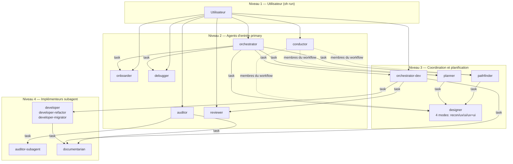
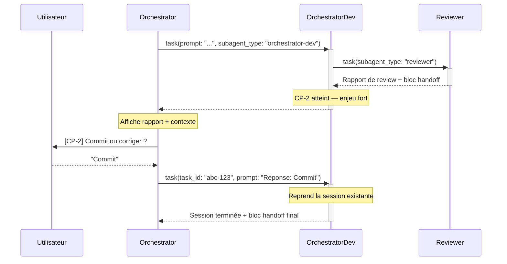
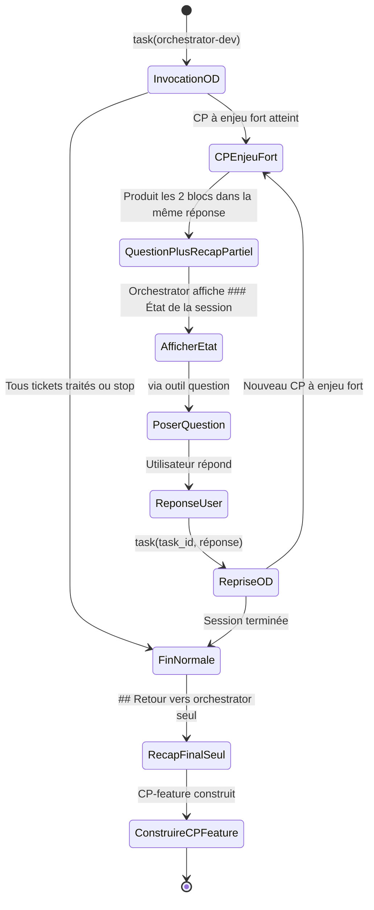

> [Read in English](task-delegation.en.md)

# Délégation inter-agents — L'outil `task`

Ce document détaille le mécanisme de délégation entre agents dans OpenCode,
la hiérarchie d'invocation et les protocoles de communication inter-agents.

> Voir aussi : [ADR-039](./adr/039-declarative-workflows-oh-v1.fr.md) (workflows, graphe et profondeur),
> [ADR-041](./adr/041-closed-world-isolation.fr.md) (monde fermé),
> [ADR-042](./adr/042-checkpoints-headless-decisions.fr.md) (checkpoints, verrous, coupe-circuit),
> [ADR-047](./adr/047-session-interaction-daemon.fr.md) (sessions, démon `ohd`),
> [ADR-009](./adr/009-inter-agent-handoff-contracts.fr.md) (contrats de handoff).
> [ADR-003](./adr/003-orchestrator-checkpoints.fr.md) (checkpoints) et [ADR-006](./adr/006-orchestrator-configurable-mode.fr.md)
> (modes) sont remplacés par ADR-039 et ADR-042.

---

## Délégation en v5 — le graphe du workflow

En v5, qui peut lancer qui n'est plus décidé par le prompt des agents ni par un `opencode.json` déployé dans le
projet : c'est le **workflow** de la session qui le fixe, et oh le fait respecter.

### Graphe de délégation

À la construction du paquet de session, oh calcule le graphe de délégation (`SubagentGraph`) :

- si l'agent a un champ `calls:` dans le workflow, ses cibles sont exactement cette liste ;
- sinon, ses cibles viennent de la permission `task` de son frontmatter, **restreinte aux membres du workflow**
  (`conductor` a `task: "*": allow` : il ne peut lancer que les membres de son workflow) ;
- l'**auto-délégation** n'existe que si elle est explicite : `calls: [reviewer]` dans le workflow `review` (sessions
  `reviewer` parallèles). Une permission `task` vers soi-même dans le frontmatter ne suffit pas.

```yaml
agents:
  orchestrator-dev: { role: workflow, calls: [developer] }   # review-feedback : seulement developer
  reviewer: { role: workflow, calls: [reviewer] }            # review : auto-délégation explicite
```

### Profondeur

La profondeur maximale du graphe, depuis l'agent d'entrée, est écrite dans la config de session
(`experimental.subagent_depth`, au moins 1). opencode V2 limite sinon la délégation à un seul niveau.
Exemples : `feature` donne 3 (orchestrator → orchestrator-dev → developer → documentarian), `ticket` 2, `audit` 1.

### Refus hors graphe

Dans la config de session, pour chaque agent, la délégation (`subagent` dans les règles d'opencode V2) est refusée
sur `*`, puis autorisée vers les seules cibles du graphe. Un agent hors du paquet n'existe pas : les agents natifs
d'opencode sont désactivés, et `Attest` vérifie au démarrage que rien d'autre n'est visible
([ADR-041](./adr/041-closed-world-isolation.fr.md)).

### Verrous `after:` et coupe-circuit

- **Verrous** : un agent déclaré avec `after: <checkpoint>` (ou `after: <agent>`) est verrouillé. Tant que le checkpoint
  n'est pas passé, oh pose sur la session une règle `subagent <agent>` en `deny`, par l'API d'opencode, et la lève
  au passage du checkpoint. Exemple : dans `feature`, `developer` est refusé avant `cp-1`.
- **Coupe-circuit** : au-delà de `circuit_breaker.max_consecutive_subagents` délégations consécutives sans
  intervention de l'utilisateur, oh refuse `subagent *` et lève une décision ✗ dans « À traiter ». Classer la décision
  lève le refus.

Voir [ADR-042](./adr/042-checkpoints-headless-decisions.fr.md).

### Sous-agents et sessions enfants

Chaque appel `task` crée une **session enfant** dans le serveur opencode du groupe. Le démon `ohd` la rattache à la
session racine : son activité, ses permissions et ses questions apparaissent dans la section « À traiter » de la vue
Sessions et dans `oh session inbox`, sous la session racine. Les règles de session (verrous, coupe-circuit) sont aussi
appliquées aux sous-sessions ([ADR-047](./adr/047-session-interaction-daemon.fr.md)).

### Limites connues (opencode 2.0.20)

- Les sous-sessions n'ont pas l'environnement de la session : le démon le réapplique.
- Le message d'un refus de permission n'est pas transmis à l'agent, qui ne voit que « Unable to execute ».
  oh envoie la consigne d'un refus par un message séparé.

---

## L'outil `task` — mécanique de base

L'outil `task` est le seul mécanisme de délégation entre agents dans OpenCode.
Il permet à un agent parent d'invoquer un agent enfant pour réaliser une tâche
autonome, puis de récupérer le résultat sous forme textuelle.

### Interface

```typescript
task({
  subagent_type: string,   // ID de l'agent à invoquer (obligatoire)
  prompt: string,          // Instructions pour le sous-agent (obligatoire)
  description: string,     // Description courte (3-5 mots) pour le suivi
  task_id?: string         // ID d'une session précédente à reprendre (optionnel)
})
```

### Comportement

- **Session isolée** : le sous-agent dispose de son propre contexte LLM —
  il ne voit pas l'historique de conversation du parent.
- **Résultat unique** : le sous-agent retourne un seul message textuel au parent
  à la fin de sa session.
- **Contexte via prompt** : toute information nécessaire au sous-agent doit être
  transmise explicitement dans le `prompt`.
- **Session enfant** : le sous-agent tourne dans une session enfant, rattachée par oh à la session racine
  (voir [Sous-agents et sessions enfants](#sous-agents-et-sessions-enfants)).

### Différence avec les autres outils

| Outil | Rôle | Modifie le projet ? |
|-------|------|---------------------|
| `task` | Déléguer une tâche à un autre agent | Dépend du sous-agent |
| `bash` | Exécuter une commande shell | Oui (si commande modifiante) |
| `edit` | Modifier un fichier existant | Oui |
| `write` | Créer un nouveau fichier | Oui |
| `question` | Poser une question à l'utilisateur | Non |

### Permissions — whitelist par agent

Chaque agent déclare dans son frontmatter (`agents/<famille>/<id>.md`) quels sous-agents il peut invoquer.
Il n'y a plus de `opencode.json` déployé dans le projet : oh compile ces déclarations dans la config du paquet de
session, restreintes au graphe du workflow (voir [Graphe de délégation](#graphe-de-délégation)).

```yaml
# agents/planning/orchestrator.md
permission:
  task:
    "*": deny
    "pathfinder": allow
    "planner": allow
    "onboarder": allow
    "designer": allow
    "orchestrator-dev": allow
    "debugger": allow
    "documentarian": allow
```

```yaml
# agents/planning/orchestrator-dev.md
permission:
  task:
    "*": deny
    "developer": allow
    "developer-refactor": allow
    "developer-migrator": allow
    "reviewer": allow
    "documentarian": allow
```

Le pattern `"*": "deny"` avec des exceptions explicites garantit qu'un agent
ne peut pas invoquer arbitrairement n'importe quel autre agent. Dans une session, la liste est en plus
limitée aux membres du workflow.

---

## Hiérarchie des agents et règles de routing

### Les 4 niveaux d'invocation

Le schéma montre les délégations permises par les frontmatter. Une session n'en garde que la partie qui relie
les membres de son workflow ; l'agent d'entrée est fixé par le workflow (`entry.agent`, ou `conductor`).


```mermaid
flowchart TB
    subgraph L1["Niveau 1 — Utilisateur (oh run)"]
        U[Utilisateur]
    end

    subgraph L2["Niveau 2 — Agents d'entrée primary"]
        C[conductor]
        O[orchestrator]
        A[auditor]
        ON[onboarder]
        DB[debugger]
        R[reviewer]
    end

    subgraph L3["Niveau 3 — Coordination et planification"]
        OD[orchestrator-dev]
        PA[pathfinder]
        PL[planner]
        DS[designer<br/>4 modes: recon/ux/ui/ux+ui]
    end

    subgraph L4["Niveau 4 — Implémenteurs subagent"]
        DEV["developer<br/>developer-refactor<br/>developer-migrator"]
        AUD["auditor-subagent"]
        DOC[documentarian]
    end

    U --> C
    U --> O
    U --> A
    U --> ON
    U --> DB
    U --> R
    U --> OD

    C -.->|membres du workflow| PA
    C -.->|membres du workflow| PL
    C -.->|membres du workflow| DS

    O -->|task| PA
    O -->|task| PL
    O -->|task| ON
    O -->|task| DS
    O -->|task| OD
    O -->|task| DB

    PA -->|task| DS
    PL -->|task| DS

    A -->|task| AUD
    A -->|task| DOC

    OD -->|task| DEV
    OD -->|task| R
    OD -->|task| DOC
    DEV -->|task| DOC
```

### Matrice des droits d'invocation

Relevé des permissions `task` des frontmatter (base `developer-rw` comprise). Dans une session, chaque ligne est
restreinte aux membres du workflow, ou remplacée par `calls:`.

| Agent appelant | Peut invoquer via `task` |
|---------------|--------------------------|
| `conductor` | `*` — en pratique les membres de son workflow |
| `orchestrator` | `pathfinder`, `planner`, `onboarder`, `designer`, `orchestrator-dev`, `debugger`, `documentarian` |
| `orchestrator-dev` | `developer`, `developer-refactor`, `developer-migrator`, `reviewer`, `documentarian` |
| `auditor` | `auditor-subagent`, `documentarian` |
| `planner` | `designer`, `documentarian` |
| `pathfinder` | `designer`, `documentarian` |
| `reviewer` | `documentarian` ; `reviewer` (lui-même) seulement avec `calls: [reviewer]` |
| `test-generator` | `reviewer`, `documentarian` |
| `debugger`, `benchmarker` | `documentarian` |
| `developer`, `developer-refactor`, `developer-migrator`, `database`, `infra` | `documentarian` |
| `auditor-subagent`, `designer`, `documentarian`, `onboarder`, `brief-enricher` | *(aucun)* |

### Modes `primary` vs `subagent`

| Mode | Visibilité utilisateur | Invocation |
|------|------------------------|------------|
| `primary` | Visible dans le Tab picker | Directe par l'utilisateur ou via `task` |
| `subagent` | Invisible dans le Tab picker | Uniquement via `task` par un parent autorisé |

Dans les frontmatter, `developer`, `developer-refactor`, `developer-migrator`, `auditor-subagent` et
`brief-enricher` sont en mode `subagent`. Le workflow peut changer le mode d'un membre (`agents.<id>.mode`) :
dans `feature`, `planner` et `reviewer` passent en `subagent` ; dans `quick`, `developer` passe en `primary`.

### Règle absolue — isolation des niveaux

> **L'orchestrator ne route JAMAIS directement vers les `developer-*`.**

Cette règle est fondamentale : l'`orchestrator` délègue toujours à
`orchestrator-dev`, qui lui-même route vers le bon `developer-*`.
Cette indirection permet de :

- Centraliser le workflow d'implémentation (review, cycles de correction)
- Maintenir des protocoles de handoff cohérents
- Isoler les responsabilités (conception vs implémentation)

---

## Protocoles de communication inter-agents

### Le pattern général

Chaque sous-agent, quand invoqué via `task`, produit **uniquement** un bloc structuré
`## Retour vers <parent>` qui est son **seul output** :

1. **Bloc structuré unique `## Retour vers <parent>`** — contient toutes les informations
   nécessaires au coordinateur : métadonnées actionnables (statut, routing, verdict,
   tableaux de synthèse) ET le contenu détaillé intégré dans une section dédiée
   (`### Rapport complet`, `### Spec complète`, `### Rapport pathfinder complet`, etc.).
   Ce bloc est autosuffisant — le coordinateur peut retranscrire ses champs directement
   à l'utilisateur sans perte d'information.

Aucun texte libre (rapport narratif, introduction, résumé, conclusion) n'est produit
avant ou après le bloc. Le bloc unique est la seule interface de communication entre
l'agent enfant et son parent coordinateur.

```markdown
## Retour vers orchestrator

**Agent :** <nom>
**Ticket :** #<ID> — <titre>

---

## Retour vers orchestrator-dev

**Agent :** developer (domaine backend)
**Ticket :** #bd-42 — Fix null guard

### Implémentation
**Diff résumé :** 3 fichiers, +85 / -5
[...]

### Statut
`implémenté`
```

### Les deux blocs de handoff vers l'orchestrator

Quand `orchestrator-dev` est invoqué depuis l'`orchestrator`, il utilise
deux blocs distincts selon la situation :

| Situation | Bloc produit |
|-----------|--------------|
| Fin normale (tous tickets traités ou stop) | `## Retour vers orchestrator` |
| CP à enjeu fort — décision requise | `## Question pour l'orchestrator` **+** `## Retour vers orchestrator` |

Le bloc `## Question pour l'orchestrator` contient :
- Le contexte complet (rapport de review, historique des cycles...)
- La question à poser à l'utilisateur
- Les options disponibles
- L'état de la session (`task_id` pour reprise)

### Tableau des contrats de handoff

| Skill | Producteur | Consommateur | Champs clés |
|-------|-----------|-------------|-------------|
| `developer/developer-handoff-format` | `developer`, `developer-refactor`, `developer-migrator` | `orchestrator-dev` | Fichiers modifiés, critères cochés, points d'attention, statut |
| `reviewer/reviewer-handoff-format` | `reviewer` | `orchestrator-dev` | Verdict, corrections verbatim, routing recommandé |
| `documentarian/documentarian-handoff-format` | `documentarian` | `orchestrator-dev` | Type, fichiers modifiés, résumé |
| `orchestrator/orchestrator-handoff-format` | `orchestrator-dev` | `orchestrator` | Tickets traités, détail par ticket, points d'attention, statut global |
| `auditor/audit-handoff-format` | `auditor-subagent` | `auditor` | Vulnérabilités, recommandations, risque résiduel |
| `design/design-handoff-format` | `designer` | `orchestrator` | Spec complète, contraintes, points ouverts |
| `planning/planner-handoff-format` | `planner` | `orchestrator` | Tableau des tickets, agents prévus, dépendances |
| `planning/onboarder-handoff-format` | `onboarder` | `orchestrator` | Stack, conventions, dette, incertitudes |
| `quality/debugger-handoff-format` | `debugger` | `orchestrator` | Cause racine, certitude, impact, actions urgentes |

### La règle de non-résumé et de non-duplication

> **Ne jamais résumer le contenu produit par un sous-agent.**
> **Ne jamais réencoder dans le contenu narratif les données déjà présentes dans le bloc structuré.**

Ces deux règles sont répétées dans chaque skill de handoff car elles sont critiques :

- Le consommateur affiche la synthèse condensée (statut, fichiers clés, points d'attention par ticket) avant de poser
  un checkpoint à l'utilisateur
- Les corrections du reviewer sont copiées **verbatim** dans les commentaires Beads
- Le rapport de review est transmis **tel quel** à l'utilisateur au CP-2
- Le narratif apporte ce que le bloc structuré ne peut pas donner : preuves,
  contexte, raisonnement — pas une répétition des tableaux et champs du bloc

Un résumé perd de l'information et peut mener à des décisions incorrectes.
Une duplication entre narratif et bloc structuré produit des retours redondants
visibles par l'utilisateur.

→ [ADR-009](./adr/009-inter-agent-handoff-contracts.fr.md)

---

## Reprise de session avec `task_id`

### Mécanisme

Quand un CP à enjeu fort survient, `orchestrator-dev` ne pose pas la question
lui-même — il produit un bloc `## Question pour l'orchestrator` et arrête sa
session. L'`orchestrator` :

1. Reçoit le bloc avec le `task_id` de la session suspendue
2. Affiche le contexte complet à l'utilisateur
3. Pose la question via l'outil `question`
4. Ré-invoque `orchestrator-dev` avec le même `task_id` + la réponse

### Flux de reprise


```mermaid
sequenceDiagram
    participant U as Utilisateur
    participant O as Orchestrator
    participant OD as OrchestratorDev
    participant R as Reviewer

    O->>+OD: task(prompt: "...", subagent_type: "orchestrator-dev")

    OD->>+R: task(subagent_type: "reviewer")
    R-->>-OD: Rapport de review + bloc handoff

    Note over OD: CP-2 atteint — enjeu fort
    OD-->>-O: ## Question pour l'orchestrator<br/>task_id: "abc-123"<br/>+ ## Retour vers orchestrator

    Note over O: Affiche rapport + contexte
    O->>U: [CP-2] Commit ou corriger ?
    U-->>O: "Commit"

    O->>+OD: task(task_id: "abc-123", prompt: "Réponse: Commit")
    Note over OD: Reprend la session existante
    OD-->>-O: Session terminée + bloc handoff final
```

### CPs à enjeu fort déclenchant ce mécanisme

| CP | Déclencheur | Contexte transmis |
|----|------------|-------------------|
| **CP-2** | Rapport de review reçu | Synthèse + rapport intégral |
| **Blocage 3 cycles** | 3 reviews sans résolution | Rapports des 3 cycles |
| **Dépendance non résolue** | Ticket bloqué par un parent | ID et statut du bloquant |
| **Ticket bloqué** | Developer signale un blocage | Raison du blocage |

### Le `task_id` est un ID de session OpenCode

Le `task_id` n'est pas un identifiant LLM propriétaire — c'est un **ID de session OpenCode standard**. Quand un agent parent invoque `task(subagent_type, prompt)`, OpenCode crée une session enfant navigable dans le TUI (`session_child_first`, `session_child_cycle`) et accessible via le SDK (`session.children()`). L'ID retourné par l'outil `task` est l'ID de cette session.

**Conséquences directes :**
- La reprise via `task_id` est **fiable** : ce n'est pas un re-jeu de contexte LLM, c'est une reconnexion à une session existante côté serveur avec son historique de messages intact
- Le risque de "perte de contexte LLM" lors d'une reprise n'existe pas — le contexte est persisté côté serveur OpenCode

**Ce qui reste inconnu :**

| Point | Statut |
|-------|--------|
| Comment l'agent enfant connaît son propre `task_id` | Probablement injecté en contexte système par OpenCode — non documenté publiquement |
| Durée de vie d'une session | Les sessions persistent côté serveur (`session.delete()` existe) — TTL non documenté |
| Comportement si `task_id` invalide | `session.get()` lève une erreur — comportement de l'outil `task` non spécifié |
| `task` absent de la doc `/docs/tools` | L'outil existe (listé dans le schéma de permissions) mais n'est pas documenté dans la liste des built-ins — lacune ou intentionnel |

**Risque résiduel — redémarrage du serveur :** si le serveur opencode redémarre entre le moment où `orchestrator-dev` produit la question montante et le moment où l'agent orchestrator ré-invoque avec le `task_id`, la session enfant peut ne plus être joignable. En v5, le serveur est lancé et supervisé par oh (un serveur par groupe) ; une session mise en veille reprend avec le même paquet (`oh session resume`). Ce cas n'est pas géré dans les skills — voir `### task_id — session introuvable` dans la section Points d'attention.

---

## Le marqueur de contexte d'invocation

### Convention de chargement du parcours d'exécution

Depuis l'ADR-016, l'agent orchestrator injecte deux marqueurs dans les prompts `task` vers les agents primaires :

```
[CONTEXTE] Invoqué depuis l'orchestrateur feature.
[SKILL:planning/planner-subagent]
```

Le marqueur `[SKILL:<nom>]` indique à l'agent quel skill de parcours charger au démarrage :
- Présent → l'agent charge le skill sous-agent (mécanisme d'interruption actif)
- Absent → l'agent charge le skill standalone par défaut (outil `question` actif)

Ce mécanisme remplace la détection du marqueur `[CONTEXTE]` directement dans les agents — la logique de bifurcation est désormais entièrement dans les skills dédiés.

> **Skills de parcours disponibles :** certains agents ont deux skills séparées, d'autres une seule skill
> `*-execution-modes` qui couvre les deux parcours.
>
> | Agent | Standalone | Sous-agent |
> |-------|-----------|-----------|
> | planner | `planning/planner-execution-modes` | `planning/planner-execution-modes` |
> | pathfinder | `planning/pathfinder-execution-modes` | `planning/pathfinder-execution-modes` |
> | onboarder | `planning/onboarder-execution-modes` | `planning/onboarder-execution-modes` |
> | auditor | `auditor/auditor-execution-modes` | `auditor/auditor-execution-modes` |
> | debugger | `quality/debugger-execution-modes` | `quality/debugger-execution-modes` |
> | designer | `designer/designer-standalone` | `designer/designer-subagent` |
> | orchestrator-dev | `orchestrator/orchestrator-dev-standalone` | `orchestrator/orchestrator-dev-subagent` |
> | reviewer | `reviewer/reviewer-standalone` | `reviewer/reviewer-subagent` |

### Comportement standalone vs depuis l'agent orchestrator

| Aspect | Standalone | Depuis orchestrateur |
|--------|-----------|---------------------|
| Skill de parcours | `-standalone` (défaut implicite) | `-subagent` (injecté via `[SKILL:...]`) |
| Mode de workflow | Fixé au lancement (`oh run … --mode`), ligne `Mode de workflow : <mode>` du prompt initial | Transmis dans le prompt de délégation |
| Questions CP | Posées via `question` | Bloc `## Question pour l'orchestrator` |
| Récap global | Affiché à l'utilisateur | Transmis à l'orchestrator |
| Bloc handoff | Non produit | **Obligatoire** |

### Agents implémentant le mécanisme d'interruption

Les agents suivants implémentent le mécanisme d'interruption de session quand le skill sous-agent est chargé :

| Agent | Granularité des interruptions | Type d'interruption |
|-------|------------------------------|---------------------|
| **orchestrator-dev** | CPs à enjeu fort (CP-2, blocage, ticket bloqué) + CPs intermédiaires (CP-1, CP-3, branche) en mode `manuel` | Systématique à chaque CP |
| **planner** | Fin de chaque phase (0 à 5) + pauses ad hoc | Systématique |
| **pathfinder** | Clarification critique détectée | Ad hoc uniquement |
| **onboarder** | Fin de chaque phase (0 à 4) + pauses ad hoc | Systématique |
| **auditor** (coordinateur) | Fin de chaque phase (0 à 3) + pauses ad hoc | Systématique |
| **debugger** | Fin de chaque phase + confirmations d'action irréversible | Systématique |
| **designer** | Clarification critique (design system, informations utilisateur, mode ambigu) | Ad hoc uniquement |

### Ré-invocation avec task_id

Lors des ré-invocations avec `task_id`, l'agent orchestrator **doit toujours re-transmettre** le marqueur `[SKILL:...]` :

```
task(
  subagent_type: "planner",
  task_id: "<task_id>",
  prompt: "Réponse Phase 1 : [option]. [CONTEXTE] Invoqué depuis l'orchestrateur feature. [SKILL:planning/planner-subagent]"
)
```

Sans ce marqueur, l'agent rechargé démarre en mode standalone — comportement dégradé mais non cassé.

---

## Checkpoints et points de décision

> **v5.** Les checkpoints sont déclarés dans le YAML du workflow (`checkpoints:`), avec leur comportement par mode.
> Exemple `feature` : `cp-0`, `cp-spec`, `cp-1`, `cp-2`, `cp-3`, `cp-feature`. L'agent les signale avec l'outil MCP
> `workflow_checkpoint` (pas avec `question`) ; oh tient la machine à états, répond seul aux checkpoints automatiques
> et pose une décision ⏸ dans « À traiter » pour ceux qui attendent l'utilisateur. Les agents verrouillés par `after:`
> restent refusés tant que leur checkpoint n'est pas passé
> ([ADR-042](./adr/042-checkpoints-headless-decisions.fr.md)). Le tableau ci-dessous décrit le protocole des skills ;
> en cas d'écart, le YAML du workflow fait foi (`oh workflow show <id>`).

### Tableau complet des checkpoints

| CP | Agent | Moment | Pause modes | **Mécanisme en mode orchestrator_feature** |
|----|-------|--------|-------------|----------------------------------------------|
| **CP-onboard** | `orchestrator` | Après `onboarder`, avant planification | Toujours manuel | Question montante de l'onboarder → task_id |
| **CP-0** | `orchestrator` | Après planification, avant conception | Toujours manuel | Question montante du planner → task_id |
| **CP-spec** | `orchestrator` | Après specs UX/UI, avant implémentation | Toujours manuel | Question montante du designer → task_id |
| **CP-audit** | `orchestrator` | Après audit, avant implémentation | Toujours manuel | Question montante de l'auditor → task_id |
| **CP-1** | `orchestrator-dev` | Avant chaque ticket | Manuel / auto (semi-auto, auto) | Bloc `## Question pour l'orchestrator` → task_id (mode manuel uniquement) |
| **CP-2** | `orchestrator-dev` | Après review — commit ou corriger ? | **Toujours manuel** | Bloc `## Question pour l'orchestrator` → task_id (inchangé, déjà implémenté) |
| **CP-3** | `orchestrator-dev` | Après commit — ticket suivant ? | Manuel / auto (semi-auto, auto) | Bloc `## Question pour l'orchestrator` → task_id (mode manuel uniquement) |
| **CP-feature** | `orchestrator` | Fin de feature | Toujours manuel | Retour final complet |

### Règle absolue — CP-2 est non automatisable

> **CP-2 (commit ou corriger ?) est une pause dans TOUS les modes, sans exception.**

Cette règle ne peut pas être outrepassée, même en mode `auto`. Dans les workflows livrés, `cp-2` est `mandatory: true`
et en `pause` dans les trois modes : une couche équipe ou projet ne peut pas l'assouplir. Justification :

- "Absence d'erreur technique" ≠ "conforme aux attentes fonctionnelles"
- La décision de merger engage la responsabilité de l'utilisateur
- Un score de confiance IA sur un rapport de review serait une fausse précision

→ [ADR-042](./adr/042-checkpoints-headless-decisions.fr.md) (remplace [ADR-006](./adr/006-orchestrator-configurable-mode.fr.md))

### Note : Deux variantes du bloc de question montante

Deux noms de blocs coexistent selon l'agent producteur — ils sont sémantiquement équivalents mais l'agent orchestrator doit détecter les deux :

| Bloc | Producteurs | Détection |
|------|-------------|-----------|
| `## Question pour l'orchestrator` (avec accent) | planner, pathfinder, onboarder, auditor, debugger, designer | Contient `task_id` pour reprise |
| `## Question pour l'orchestrator` (sans accent) | orchestrator-dev | Contient `task_id` pour reprise |

Les deux déclenchent le même comportement côté orchestrateur : afficher le récap intermédiaire, relayer la question via `question`, ré-invoquer avec `task_id`.

### Compteurs anti-boucle

Pour éviter les boucles infinies, des limites sont imposées par les skills. En plus, oh applique un coupe-circuit
sur les délégations consécutives (`circuit_breaker.max_consecutive_subagents`, voir
[Verrous `after:` et coupe-circuit](#verrous-after-et-coupe-circuit)) :

| Compteur | Limite | Action au dépassement |
|----------|--------|----------------------|
| Révisions de spec | 3 | Demande d'intervention manuelle |
| Re-audits après correction | 2 | Acceptation avec réserves |
| Cycles de review | 3 | Signalement blocage, choix utilisateur |

---

## Points d'attention et limites connues

### `task_id` — risque de session introuvable

Le `task_id` est un ID de session OpenCode standard — la reprise de session est fiable tant que la session existe côté serveur. Le seul risque réel est la **session introuvable** : si OpenCode redémarre entre la question montante et la reprise, la session enfant peut avoir disparu.

| Cause | Probabilité | Impact |
|-------|-------------|--------|
| Redémarrage d'OpenCode entre question montante et reprise | Faible — nécessite un redémarrage pendant la fenêtre d'attente | Workflow interrompu — reprise impossible via `task_id` |
| `task_id` mal copié dans le bloc `### État de la session` | Très faible — erreur LLM | Même impact |

**Garde-fou dans `orchestrator-protocol.md` :** si la ré-invocation avec `task_id` échoue (pas de résultat, erreur), l'orchestrator doit détecter le cas et proposer à l'utilisateur de relancer `orchestrator-dev` depuis zéro avec les tickets restants — voir la section dédiée dans `orchestrator-protocol.md`.

**Ce qui reste inconnu côté SDK :**
- Comment l'agent enfant connaît son propre `task_id` pendant l'exécution (non documenté publiquement)
- TTL des sessions (probablement illimité mais non spécifié)

### Récap partiel vs final

Quand `orchestrator-dev` atteint un CP à enjeu fort, il produit **dans la même réponse** deux blocs :

```
## Question pour l'orchestrator     ← décision requise
[contexte, question, options, état de session, task_id]

## Retour vers orchestrator         ← état courant de la session
[tickets traités jusqu'ici, statut partiel]
```

Le second bloc est **structurellement presque identique** au récap final — la seule distinction explicite est le champ `**Type de récap :**` : `partiel` quand émis avec une question montante, `final` quand émis seul en fin de session.

#### Ce que contient chaque type de récap

| Champ | Récap **partiel** | Récap **final** |
|-------|------------------|-----------------|
| `Tickets traités` | Ceux terminés jusqu'à l'instant T | Tous les tickets commités |
| `Tickets ignorés` | Ceux skippés jusqu'à l'instant T | Tous les tickets skippés |
| `Détail par ticket` | Tickets traités seulement — le ticket en cours et les restants sont absents | Tableau complet |
| `Points d'attention` | Agrégation partielle | Agrégation complète |
| `Statut global` | Techniquement incorrect — `succès` possible alors que des tickets restent | Correct — basé sur l'ensemble |

#### Signal de détection

```
Résultat contient ## Question pour l'orchestrator ?
  ├── OUI → récap PARTIEL
  │         Afficher ### État de la session dans la discussion
  │         Ne pas construire le CP-feature
  │         Poser la question → ré-invoquer avec task_id
  └── NON → récap FINAL
            Construire le CP-feature
```

#### Diagramme d'état


```mermaid
stateDiagram-v2
    [*] --> InvocationOD : task(orchestrator-dev)

    InvocationOD --> CPEnjeuFort : CP à enjeu fort atteint
    InvocationOD --> FinNormale  : Tous tickets traités ou stop

    CPEnjeuFort --> QuestionPlusRecapPartiel : Produit les 2 blocs dans la même réponse
    QuestionPlusRecapPartiel --> AfficherEtat : Orchestrator affiche ### État de la session
    AfficherEtat --> PoserQuestion : via outil question
    PoserQuestion --> ReponseUser : Utilisateur répond
    ReponseUser --> RepriseOD : task(task_id, réponse)

    RepriseOD --> CPEnjeuFort : Nouveau CP à enjeu fort
    RepriseOD --> FinNormale  : Session terminée

    FinNormale --> RecapFinalSeul : ## Retour vers orchestrator seul
    RecapFinalSeul --> ConstruireCPFeature : CP-feature construit
    ConstruireCPFeature --> [*]
```

#### Ce qui peut mal tourner

| Erreur | Conséquence |
|--------|-------------|
| Construire le CP-feature sur le récap partiel | Tickets en cours et restants absents du récap global |
| Utiliser le `Statut global` du récap partiel | `succès` affiché alors que des tickets n'ont pas été traités |
| Ne pas afficher `### État de la session` | Utilisateur répond sans savoir où en est le workflow |
| Ne pas ré-invoquer avec `task_id` | Session `orchestrator-dev` perdue, workflow interrompu |

> ❌ **Ne jamais construire le CP-feature à partir d'un récap partiel.**
> Un récap est partiel si et seulement si la réponse de `task(orchestrator-dev)` contient aussi `## Question pour l'orchestrator`.

### Parallélisme conditionnel (mode `auto` uniquement)

Par défaut, `orchestrator-dev` traite les tickets **séquentiellement**. Un mode
de **parallélisme conditionnel** est disponible exclusivement en mode `auto` lorsque
les 4 critères de parallélisabilité sont réunis.

#### Pourquoi le séquentiel est le mode par défaut

Trois contraintes rendent le parallélisme non pertinent ou risqué dans le cas général :

| Contrainte | Impact |
|---|---|
| **CP-2 pause absolue** | Même en parallèle, les CP-2 de N sessions sont traités en séquentiel (un rapport à la fois) — le gain en phase d'implémentation est "absorbé" par la review |
| **Goulot humain** | En modes `manuel`/`semi-auto`, les pauses humaines (CP-1, CP-3) dominent le temps total — paralléliser l'implémentation n'accélère pas ces décisions |
| **Dépendances implicites non détectables** | Deux tickets sans relation `deps` formelle peuvent avoir des dépendances sémantiques invisibles à l'orchestrator |

Le gain réel du parallélisme n'existe qu'en mode `auto`, et uniquement sur la phase d'implémentation.

#### Les 4 critères de parallélisabilité

Un lot de tickets est éligible au traitement parallèle si et seulement si **tous** ces critères sont vérifiés :

| # | Critère | Vérification |
|---|---|---|
| 1 | **Pas de dépendance formelle entre tickets du lot** | `bd dep list <ID>` pour chaque ticket — l'intersection avec les IDs du lot est vide |
| 2 | **Domaines disjoints** | Tickets confiés à `developer` avec des domaines distincts (ou à `developer-refactor` / `developer-migrator`) — pas de domaine `fullstack` dans le lot |
| 3 | **Pas de fichiers transverses prévisibles** | Aucun ticket ne mentionne de types partagés, migrations de base de données, ou fichiers de configuration globaux |
| 4 | **Mode `auto` actif** | Les modes `manuel` et `semi-auto` restent séquentiels |

Si un seul critère n'est pas vérifié → **séquentiel forcé**.

#### Comportement en mode parallèle conditionnel

- **Lancement** : N sous-agents `developer*` démarrés simultanément (max 3 en parallèle), chacun dans sa session enfant
- **CP-2** : traité en **séquentiel** même en parallèle — une question à la fois dans l'ordre d'arrivée des résultats
- **Détection de conflit tardif** : si un sous-agent modifie un fichier déjà modifié par une autre session parallèle (`git status`), l'orchestrator déclenche un CP-2 anticipé avant de continuer
- **Récap global** : produit uniquement quand **toutes** les sessions parallèles ont retourné un récap `final`
- **Limite** : maximum 3 sessions parallèles simultanées

Ce parallélisme reste à l'intérieur d'une session oh, dans le même dossier. Pour traiter des tickets dans des
sessions oh séparées (une session et un worktree par ticket), utiliser `oh run ticket --tickets a,b`
(voir [Sessions v5](../guides/sessions-v5.fr.md)).

#### Ce que le parallélisme ne résout pas

Le parallélisme ne supprime pas les pauses CP-2 — il les regroupe dans le temps. Pour un lot de N tickets en parallèle, l'utilisateur lira N rapports de review successifs en fin de phase d'implémentation au lieu de les lire au fil de l'eau. C'est un changement de posture : supervision agrégée plutôt que supervision ticket par ticket.

### Transmission du mode via prompt

Le mode de workflow (`manuel`, `semi-auto`, `auto`) est transmis dans le texte
du `prompt`, pas comme paramètre structuré de l'outil `task`.

En v5, le mode est fixé au lancement (`oh run <workflow> --mode …`, sinon `modes.default` du workflow) et n'est plus
demandé par l'agent. Le prompt initial de la session contient toujours la ligne `Mode de workflow : <mode>`, et
c'est oh qui applique le comportement de chaque checkpoint dans ce mode. Les règles ci-dessous portent sur la
transmission du mode d'un agent à ses sous-agents.

#### Valeurs canoniques

Trois valeurs exactes sont acceptées (insensible à la casse) :

| Valeur | Mode appliqué (workflows `feature` et `ticket`) |
|--------|---------------|
| `manuel` | Toutes les pauses actives |
| `semi-auto` | CP-1 et CP-3 automatiques, CP-2 manuels — défaut des workflows livrés |
| `auto` | Tout automatique sauf CP-2 (pause absolue) et, dans `feature`, `cp-0` et `cp-spec` |

Ne jamais transmettre le label brut de l'option d'interface (`"Manuel (Recommandé)"`, `"Semi-auto"`) — normaliser en minuscule avant transmission.

**Exemple de formulation correcte dans le prompt :**
```
Mode de workflow : semi-auto
```

#### Cas de défaillance identifiés

| Cas | Probabilité | Impact |
|-----|-------------|--------|
| **Reprise via `task_id` sans re-transmission du mode** | 🔴 Élevée — systématique au CP-2 | Mode perdu silencieusement ; fallback `manuel` supposé mais non garanti |
| Mode absent dans le prompt initial | 🟠 Moyenne | Pauses CP-1/CP-3 inattendues si mode était `semi-auto`/`auto` |
| Mode mal formaté (ex: `"automatique"`) | 🟡 Faible-Moyenne | Parsing non défini — risque de mode `auto` non demandé |
| Modes contradictoires dans le prompt | 🟡 Faible | Comportement indéterminé — première occurrence appliquée |

**Le cas le plus critique :** chaque CP-2 invoqué depuis l'orchestrator entraîne une reprise de session via `task_id`. Le prompt de reprise ne contient pas naturellement le mode — il doit être re-transmis explicitement.

#### Correctifs appliqués dans les skills

Pour mitiger ces risques, les modifications suivantes ont été appliquées :

**`orchestrator-workflow-modes.md`**
- Définition explicite des trois valeurs canoniques côté émetteur
- Interdiction de transmettre les labels bruts de l'interface

**`orchestrator-protocol.md`**
- Autocontrôle avant délégation : "le mode canonique est-il dans le prompt ?"
- Prompt de reprise `task_id` modifié pour inclure systématiquement le mode :
  ```
  "Réponse de l'utilisateur au CP <phase>… Mode de workflow : <valeur canonique>. Reprendre…"
  ```

**`orchestrator-dev-protocol.md`**
- Règle de parsing documentée : valeurs canoniques, fallback `manuel` explicite, signal si absent ou ambigu
- Confirmation du mode reçu dans le message de démarrage :
  ```
  [orchestrator-dev] Mode de workflow reçu : <valeur>. Le bloc ## Retour sera produit en fin de session.
  ```
- Deux nouvelles interdictions dans "Ce que tu ne fais PAS"

### Permissions non héritées

Un sous-agent n'hérite pas des permissions de son parent. Chaque agent a ses
propres permissions, déclarées dans son frontmatter (`permission:` et `permission_base`) et compilées dans la
config du paquet de session. La config du projet (`opencode.json`, `.opencode/`) n'est pas lue
(`OPENCODE_DISABLE_PROJECT_CONFIG=1`). Un `developer` peut écrire du code même si son parent `orchestrator-dev`
ne le peut pas.

Les règles de **session** posées par oh (verrous `after:`, coupe-circuit, checkpoints) s'appliquent en revanche à
la session racine et à ses sous-sessions. Les demandes de permission d'un sous-agent remontent dans « À traiter »
sous la session racine ; si elles sont refusées, l'agent ne reçoit pas le message du refus (limite d'opencode 2.0.20).
