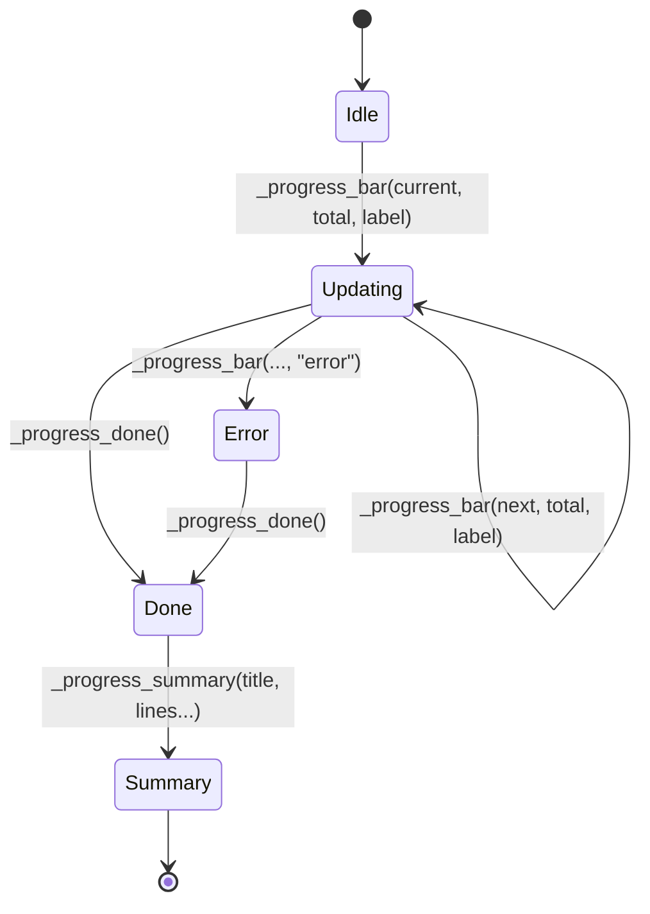
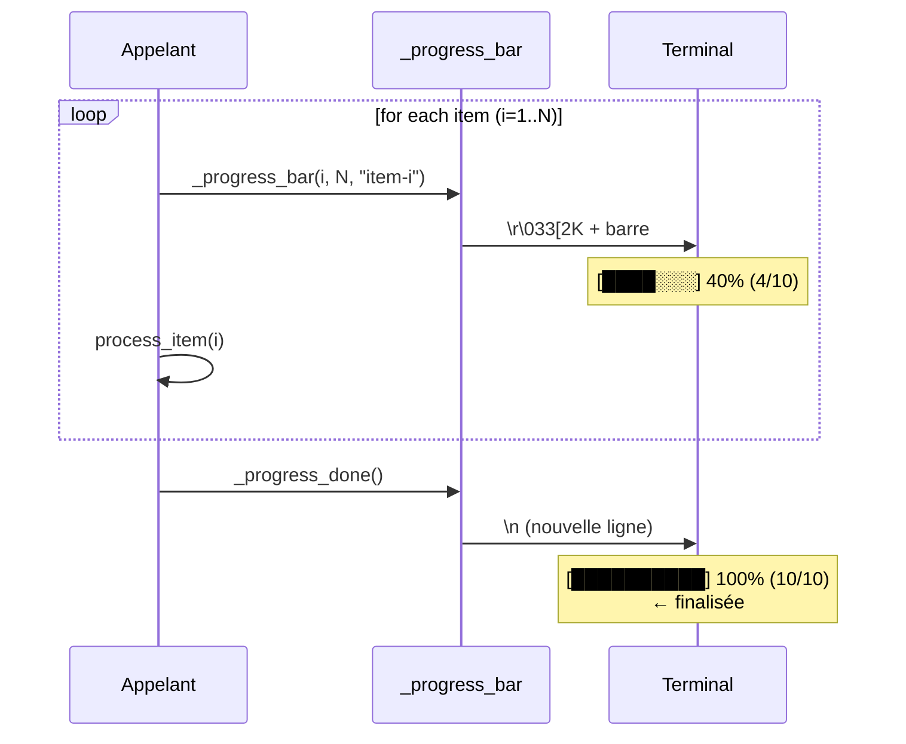
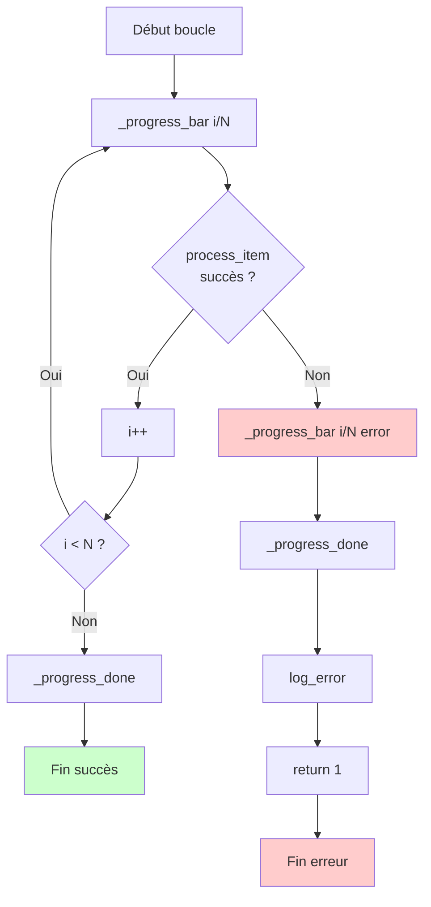
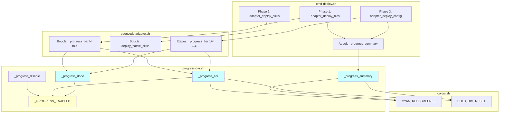

# Système de barre de progression

> Documentation complète du système de feedback visuel pour les opérations longues

## Introduction

Le système de barre de progression fournit un **feedback visuel en temps réel** pour les opérations longues dans openhub, particulièrement pendant le workflow `oc deploy`. Il est composé de trois fonctions principales :

- **`_progress_bar()`** : Affichage de la progression en temps réel sur une ligne
- **`_progress_done()`** : Finalisation de la barre de progression
- **`_progress_summary()`** : Récapitulatif structuré après une phase

**Philosophie** : Feedback immédiat pendant le traitement + résumés détaillés à la complétion.

**Compatibilité** : bash 3.2+ (macOS), détection automatique TTY, aucune dépendance externe.

---

## Vue d'ensemble visuelle

### Exemple de sortie (annoté)

```
📦 Phase 1 — Copie des agents

    [████████████░░░░░░░░] 60% (18/30) developer-api    ← Barre de progression
                                                          
    ✅ Phase 1 terminée                                  ← Titre récapitulatif
       · 30 agents déployés                             ← Ligne récapitulatif
       · Familles : 11 developer, 8 auditor, ...        ← Ligne récapitulatif
         - 18 en mode subagent                          ← Sous-item (indenté)
```

### Diagramme d'états



**États** :
- **Idle** : Aucune barre affichée
- **Updating** : Barre visible, mise à jour à chaque itération
- **Error** : Barre affichée en rouge avec ✗
- **Done** : Barre finalisée (nouvelle ligne)
- **Summary** : Récapitulatif structuré affiché

---

## Référence API

### `_progress_bar(current, total, label, [status])`

Affiche ou met à jour une barre de progression sur une seule ligne.

**Signature** :
```bash
_progress_bar <current> <total> <label> [status]
```

**Paramètres** :
- `current` (int, 1-based) : Position actuelle dans la progression
- `total` (int) : Nombre total d'items
- `label` (string) : Texte descriptif (nom de l'item en cours)
- `status` (string, optionnel) : `"error"` pour affichage rouge avec ✗

**Comportement** :
- Affiche/met à jour une barre sur **une seule ligne**
- Utilise `\r` (retour chariot) pour écraser la ligne précédente
- Skip silencieusement si `$_PROGRESS_ENABLED != true`

**Composants visuels** :
```
    [████████████░░░░░░░░] 75% (15/20) agent-name
     └─────┬─────┘         │    │  │   └─ label
           │               │    │  └───── total
           │               │    └──────── current
           │               └───────────── pourcentage
           └───────────────────────────── barre (20 chars)
```

**Couleurs** :
- Normal : `${CYAN}` (barre) + `${BOLD}` (pourcentage) + `${DIM}` (label)
- Error : `${RED}` + suffixe ` ✗`

**Codes ANSI utilisés** :
- `\r` : Retour chariot (U+000D)
- `\033[2K` : Efface la ligne (CSI K avec param 2)
- `\033[91m` : Rouge vif
- `\033[96m` : Cyan vif

**Caractères Unicode** :
- `█` (U+2588) : Bloc plein (partie remplie)
- `░` (U+2591) : Ombrage léger (partie vide)

**Exemple** :
```bash
# Boucle avec progression
total=30
for i in $(seq 1 $total); do
  _progress_bar $i $total "traitement-item-$i"
  # ... traitement ...
done
_progress_done
```

**Détails d'implémentation** :

La barre est calculée comme suit :
```bash
local bar_width=20
local percent=$(( current * 100 / total ))
local filled=$(( percent * bar_width / 100 ))
local empty=$(( bar_width - filled ))

local bar=""
local i=0
while [ "$i" -lt "$filled" ]; do 
  bar="${bar}█"
  i=$((i + 1))
done
i=0
while [ "$i" -lt "$empty" ]; do 
  bar="${bar}░"
  i=$((i + 1))
done
```

**Note** : Utilise des boucles `while` au lieu de `seq` pour la compatibilité bash 3.2 (macOS).

---

### `_progress_done()`

Finalise la barre de progression.

**Signature** :
```bash
_progress_done
```

**Comportement** :
- Finalise la barre de progression
- Affiche une nouvelle ligne (`echo ""`)
- Permet d'afficher du texte après sans écraser la barre

**IMPORTANT** : Toujours appeler avant d'afficher des messages (log, echo, etc.)

**Exemple** :
```bash
_progress_bar 30 30 "dernier-item"
_progress_done  # ← OBLIGATOIRE avant d'afficher quoi que ce soit

echo "Traitement terminé"
```

---

### `_progress_summary(title, lines...)`

Affiche un récapitulatif structuré après une phase.

**Signature** :
```bash
_progress_summary <title> <line1> [line2] [...]
```

**Paramètres** :
- `title` (string) : Titre du récapitulatif (ex : "Phase 1 terminée")
- `lines...` (strings variadic) : Lignes du récapitulatif

**Format** :
- **Ligne normale** : préfixée par ` · ` (bullet point bleu)
- **Sous-item** : commence par espace(s), indenté + texte grisé

**Exemple** :
```bash
_progress_summary "Phase 1 terminée" \
  "30 agents déployés" \
  "Familles : 11 developer, 8 auditor" \
  "  - 18 en mode subagent" \
  "  - 4 désactivés"
```

**Sortie** :
```
    ✅ Phase 1 terminée
       · 30 agents déployés
       · Familles : 11 developer, 8 auditor
         - 18 en mode subagent
         - 4 désactivés
```

**Reconnaissance des lignes** :
```bash
# Ligne normale (bullet point)
"30 agents déployés"

# Sous-item (indenté, commence par espace)
"  - 18 en mode subagent"  # Commence par 2 espaces
```

---

### `_progress_disable()`

Désactive l'affichage de la progression.

**Signature** :
```bash
_progress_disable
```

**Comportement** :
- Désactive la progression (`_PROGRESS_ENABLED=false`)
- Utilisé par le flag `--no-progress`

**Exemple** :
```bash
# Dans cmd-deploy.sh
if [ "$NO_PROGRESS" = true ]; then
  _progress_disable
fi
```

---

## Patterns d'utilisation

### Pattern 1 : Boucle (Phase 1)

**Cas d'usage** : Itérer sur N items avec progression de 1 à N

**Code** :
```bash
adapter_deploy_files() {
  # ...
  local total="${#items[@]}"
  local i=0
  
  while [ "$i" -lt "$total" ]; do
    local item="${items[$i]}"
    
    # Afficher la progression
    _progress_bar $(($i + 1)) "$total" "$item"
    
    # Traiter l'item
    process_item "$item"
    
    i=$(($i + 1))
  done
  
  # Finaliser
  _progress_done
}
```

**Gestion d'erreur** :
```bash
while [ "$i" -lt "$total" ]; do
  # ...
  
  if ! process_item "$item" 2>&1; then
    # Afficher l'erreur sur la barre
    _progress_bar $(($i + 1)) "$total" "$item" "error"
    _progress_done  # ← CRUCIAL : finaliser avant log
    
    log_error "Échec du traitement de $item"
    return 1
  fi
  
  i=$(($i + 1))
done
```

**Flux visuel** :
```
[██░░░░░░░░░░░░░░░░░░] 10% (3/30) agent-1
[████░░░░░░░░░░░░░░░░] 20% (6/30) agent-2
[██████░░░░░░░░░░░░░░] 30% (9/30) agent-3
...
[████████████████████] 100% (30/30) agent-30
```

---

### Pattern 2 : Étapes fixes (Phase 2)

**Cas d'usage** : Progression par étapes prédéfinies (1/4, 2/4, 3/4, 4/4)

**Code** :
```bash
adapter_deploy_config() {
  # Définir le nombre d'étapes
  local config_steps=4
  local step=0
  
  # Étape 1/4
  step=1
  _progress_bar $step $config_steps "Chargement métadonnées"
  # ... travail ...
  
  # Étape 2/4
  step=2
  _progress_bar $step $config_steps "Construction JSON agents"
  # ... travail ...
  
  # Étape 3/4
  step=3
  _progress_bar $step $config_steps "Fusion configuration"
  # ... travail ...
  
  # Étape 4/4
  step=4
  _progress_bar $step $config_steps "Écriture opencode.json"
  # ... travail ...
  
  # Finaliser
  _progress_done
}
```

**Flux visuel** :
```
[█████░░░░░░░░░░░░░░░] 25% (1/4) Chargement métadonnées
[██████████░░░░░░░░░░] 50% (2/4) Construction JSON agents
[███████████████░░░░░] 75% (3/4) Fusion configuration
[████████████████████] 100% (4/4) Écriture opencode.json
```

---

### Pattern 3 : Récapitulatif avec sous-items

**Cas d'usage** : Afficher un récapitulatif structuré après une phase

**Code** :
```bash
# Construire les lignes du récapitulatif
summary_lines=()
summary_lines+=("30 agents déployés")
summary_lines+=("Familles : 11 developer, 8 auditor")

# Sous-items (commencer par espace)
if [ "$subagents" -gt 0 ]; then
  summary_lines+=("  - $subagents en mode subagent")
fi
if [ "$disabled" -gt 0 ]; then
  summary_lines+=("  - $disabled désactivés")
fi

# Afficher
_progress_summary "Phase 1 terminée" "${summary_lines[@]}"
```

**Structure de sortie** :
```
✅ Titre
   · Ligne 1          ← Ligne normale (bullet)
   · Ligne 2          ← Ligne normale (bullet)
     - Sous-item 1    ← Sous-item (indenté)
     - Sous-item 2    ← Sous-item (indenté)
```

---

## Détails techniques

### Algorithme de calcul de la barre

**Pseudo-code** :
```
percent = (current * 100) / total
filled = (percent * bar_width) / 100
empty = bar_width - filled

bar = "█" × filled + "░" × empty
```

**Implémentation Bash** :
```bash
local bar_width=20
local percent=$(( current * 100 / total ))
local filled=$(( percent * bar_width / 100 ))
local empty=$(( bar_width - filled ))

local bar=""
local i=0
while [ "$i" -lt "$filled" ]; do 
  bar="${bar}█"
  i=$((i + 1))
done
i=0
while [ "$i" -lt "$empty" ]; do 
  bar="${bar}░"
  i=$((i + 1))
done
```

**Pourquoi des boucles `while` ?**
- Bash 3.2 (macOS) n'a pas l'expansion `{1..N}` dans tous les contextes
- `seq` n'est pas toujours disponible
- Les boucles `while` sont la solution la plus portable

---

### Mécanisme de mise à jour sur une ligne

**Principe** :
- `\r` : Retourne le curseur au début de la ligne (sans créer de nouvelle ligne)
- `\033[2K` : Efface la ligne entière
- `printf` : Réaffiche la barre mise à jour

**Séquence d'affichage** :
```
\r              ← Retour au début de ligne
\033[2K         ← Effacer la ligne
[...barre...]   ← Réafficher
```

**Code** :
```bash
printf "\r\033[2K    ${color}[${bar}]${RESET} ${BOLD}%3d%%${RESET} (%d/%d) ${DIM}%s${RESET}%s" \
  "$percent" "$current" "$total" "$label" "$suffix"
```

**Pourquoi pas `echo` ?**
- `echo` ajoute automatiquement un `\n` (nouvelle ligne)
- `printf` permet un contrôle précis sans newline

**Exemple** :
```bash
# Premier appel
printf "\r\033[2K[██░░░] 20% (2/10)"
# Terminal affiche : [██░░░] 20% (2/10)

# Deuxième appel (écrase)
printf "\r\033[2K[████░] 40% (4/10)"
# Terminal affiche : [████░] 40% (4/10)  ← Même ligne
```

---

### Détection TTY

**Mécanisme** :
```bash
if [ -t 1 ]; then
  _PROGRESS_ENABLED=true
fi
```

**Explication** :
- `[ -t 1 ]` : Teste si le descripteur de fichier 1 (stdout) est un terminal
- Si stdout est redirigé (`> file` ou `| cat`), la barre est automatiquement désactivée

**Test** :
```bash
# TTY : barre affichée
./oc.sh deploy

# Non-TTY : barre masquée
./oc.sh deploy | cat
./oc.sh deploy > output.txt

# Forcé : barre masquée
./oc.sh deploy --no-progress
```

**Pourquoi l'auto-détection ?**
- La sortie redirigée doit être propre (pas de codes ANSI)
- Les commandes en pipe ne doivent pas afficher de barres de progression
- Les fichiers de log doivent contenir uniquement du texte, pas de caractères de contrôle

---

## Bonnes pratiques

### ✅ À faire

1. **Toujours finaliser avec `_progress_done()`**
   ```bash
   _progress_bar 30 30 "dernier-item"
   _progress_done  # ← OBLIGATOIRE
   ```

2. **Appeler `_progress_done()` AVANT tout affichage**
   ```bash
   _progress_bar 10 10 "item"
   _progress_done  # ← Finaliser AVANT log
   log_error "Erreur"
   ```

3. **Utiliser le status `"error"` pour les erreurs**
   ```bash
   if ! process "$item"; then
     _progress_bar $i $total "$item" "error"
     _progress_done
     return 1
   fi
   ```

4. **Indenter les sous-items avec des espaces**
   ```bash
   summary_lines+=("  - Sous-item")  # Commence par 2 espaces
   ```

5. **Tester avec et sans TTY**
   ```bash
   ./oc.sh deploy              # Avec barre
   ./oc.sh deploy | cat        # Sans barre
   ./oc.sh deploy --no-progress  # Sans barre (forcé)
   ```

6. **Utiliser l'indexation 1-based pour `current`**
   ```bash
   # ✅ BON
   _progress_bar 1 10 "item"  # 10% affiché
   
   # ❌ MAUVAIS
   _progress_bar 0 10 "item"  # 0% affiché (confusion)
   ```

---

### ❌ À éviter

1. **❌ Ne jamais faire `echo` entre `_progress_bar()` et `_progress_done()`**
   ```bash
   # ❌ MAUVAIS
   _progress_bar 5 10 "item"
   echo "Message"  # ← Écrase la barre !
   _progress_done
   
   # ✅ BON
   _progress_bar 5 10 "item"
   _progress_done
   echo "Message"
   ```

2. **❌ Ne pas oublier `_progress_done()` en cas d'erreur**
   ```bash
   # ❌ MAUVAIS
   _progress_bar 5 10 "item" "error"
   log_error "Erreur"  # ← Écrase la barre d'erreur !
   
   # ✅ BON
   _progress_bar 5 10 "item" "error"
   _progress_done  # ← Finaliser AVANT log
   log_error "Erreur"
   ```

3. **❌ Ne pas appeler `_progress_bar()` sans incrémenter**
   ```bash
   # ❌ MAUVAIS (boucle visuelle infinie)
   while true; do
     _progress_bar 5 10 "bloqué"  # ← Toujours 5/10 !
   done
   ```

4. **❌ Ne pas utiliser `current=0` (indexation 1-based)**
   ```bash
   # ❌ MAUVAIS
   _progress_bar 0 10 "item"  # ← 0% affiché
   
   # ✅ BON
   _progress_bar 1 10 "item"  # ← 10% affiché
   ```

5. **❌ Ne pas mélanger les patterns**
   ```bash
   # ❌ MAUVAIS (confusion)
   _progress_bar 1 4 "Étape 1"      # Pattern étapes
   _progress_bar 5 30 "agent-5"     # Pattern boucle (incohérent !)
   
   # ✅ BON (cohérent)
   _progress_bar 1 4 "Étape 1"
   _progress_bar 2 4 "Étape 2"
   ```

---

## Diagrammes

### Diagramme de séquence : Pattern boucle



---

### Diagramme de flux : Gestion d'erreur



---

### Diagramme d'architecture : Composants



---

## Tests et debugging

### Tests fonctionnels

```bash
# Test 1 : TTY détecté (barre affichée)
./oc.sh deploy PROJECT_ID

# Test 2 : Non-TTY (barre masquée)
./oc.sh deploy PROJECT_ID | cat

# Test 3 : Flag --no-progress (forcé)
./oc.sh deploy PROJECT_ID --no-progress

# Test 4 : Simulation d'erreur
# (Modifier temporairement un agent pour causer une erreur de build)
```

**Comportement attendu** :
- Test 1 : Barre de progression visible, couleurs affichées
- Test 2 : Pas de barre, sortie texte propre
- Test 3 : Pas de barre, sortie texte propre
- Test 4 : Barre d'erreur (rouge avec ✗), puis message d'erreur

---

### Debugging

**Activer les logs de debug** :
```bash
# Ajouter temporairement dans progress-bar.sh
_progress_bar() {
  echo "[DEBUG] _progress_bar appelé : $1/$2 '$3' '$4'" >> /tmp/progress-debug.log
  # ... reste du code ...
}
```

**Vérifier l'état de `_PROGRESS_ENABLED`** :
```bash
# Dans votre script
echo "Progression activée : $_PROGRESS_ENABLED"
```

**Test manuel** :
```bash
source scripts/common.sh
source scripts/lib/progress-bar.sh

# Test simple
for i in {1..10}; do
  _progress_bar $i 10 "item-$i"
  sleep 0.5
done
_progress_done

_progress_summary "Test terminé" "10 items traités" "  - 5 en mode test"
```

**Vérifier les codes ANSI** :
```bash
# Afficher la sortie brute
./oc.sh deploy PROJECT_ID 2>&1 | od -c | grep -E '\\r|\\033'
```

---

## Historique et alternatives

### Pourquoi cette implémentation ?

**Contraintes** :
- ✅ Bash 3.2+ (macOS, pas de `seq`, pas de `${array[@]^}`)
- ✅ Aucune dépendance externe (`tput`, `dialog`, `whiptail`)
- ✅ Détection automatique TTY
- ✅ Coloration ANSI standard
- ✅ Unicode moderne (terminaux 2020+)

**Alternatives considérées** :

| Alternative | Avantages | Inconvénients | Verdict |
|-------------|-----------|---------------|---------|
| `tput` (ncurses) | Portable | Dépendance externe | ❌ Rejeté |
| `dialog` / `whiptail` | UI complète | Trop lourd, non adapté | ❌ Rejeté |
| Spinner (`⠋⠙⠹⠸⠼⠴⠦⠧⠇⠏`) | Léger | Pas de pourcentage | ❌ Rejeté |
| Points (`...`) | Très simple | Pas informatif | ❌ Rejeté |
| Barre ANSI (actuel) | Bon équilibre | Nécessite Unicode | ✅ **Choisi** |

---

### Évolutions possibles

1. **Barre adaptative** : Ajuster la largeur selon la taille du terminal
   ```bash
   bar_width=$(tput cols)
   bar_width=$((bar_width / 2))
   ```

2. **ETA (temps restant)** : Calculer le temps estimé
   ```bash
   elapsed=$SECONDS
   eta=$((elapsed * (total - current) / current))
   echo "ETA : ${eta}s"
   ```

3. **Multi-barres** : Afficher plusieurs barres simultanément (complexe)
   - Nécessite la manipulation du terminal (sauvegarder/restaurer position curseur)
   - Non compatible avec bash 3.2

4. **Animations** : Spinner animé pendant le traitement
   ```bash
   spinner=('⠋' '⠙' '⠹' '⠸' '⠼' '⠴' '⠦' '⠧' '⠇' '⠏')
   frame=$((frame % ${#spinner[@]}))
   echo -n "${spinner[$frame]}"
   ```

---

## Références

### Codes ANSI

| Code | Description | Utilisation |
|------|-------------|-------------|
| `\r` | Retour chariot (U+000D) | Retour début de ligne |
| `\033[2K` | Efface ligne (CSI K) | Effacer la ligne |
| `\033[91m` | Rouge vif | Couleur erreur |
| `\033[92m` | Vert vif | Couleur succès |
| `\033[94m` | Bleu vif | Couleur bullet |
| `\033[96m` | Cyan vif | Couleur barre |
| `\033[1m` | Gras | Texte gras |
| `\033[2m` | Dim | Texte grisé |
| `\033[0m` | Reset | Réinitialiser style |

**Référence** : [ANSI Escape Codes - Wikipedia](https://en.wikipedia.org/wiki/ANSI_escape_code)

---

### Caractères Unicode

| Char | Code | Nom | Utilisation |
|------|------|-----|-------------|
| `█` | U+2588 | Bloc plein | Partie remplie |
| `░` | U+2591 | Ombrage léger | Partie vide |
| `✅` | U+2705 | Bouton check mark | Succès summary |
| `✗` | U+2717 | Ballot X | Erreur |
| `·` | U+00B7 | Middle dot | Bullet point |

---

### Fichiers liés

- `scripts/lib/progress-bar.sh` : Implémentation (118 lignes)
- `scripts/lib/colors.sh` : Constantes de couleurs
- `scripts/cmd-deploy.sh` : Utilisation (récapitulatifs)
- `scripts/adapters/opencode.adapter.sh` : Utilisation (barres)

---

## Exemple complet

### Flux de deploy réel

```bash
#!/bin/bash
# Workflow de deploy simplifié montrant tous les patterns

# Phase 1 : Pattern boucle
echo "📦 Phase 1 — Copie des agents"
total=30
i=0

while [ "$i" -lt "$total" ]; do
  agent="agent-$((i + 1))"
  
  # Afficher la progression
  _progress_bar $((i + 1)) $total "$agent"
  
  # Builder l'agent (avec gestion d'erreur)
  if ! build_agent "$agent"; then
    _progress_bar $((i + 1)) $total "$agent" "error"
    _progress_done
    log_error "Échec du build de $agent"
    exit 1
  fi
  
  i=$((i + 1))
done

_progress_done

# Récapitulatif
_progress_summary "Phase 1 terminée" \
  "30 agents déployés" \
  "Familles : 11 developer, 8 auditor" \
  "  - 18 en mode subagent"

echo ""

# Phase 2 : Déploiement des skills (pattern boucle simple)
echo "🧩  Phase 2 — Déploiement des skills"
deploy_skills
_progress_summary "Phase 2 terminée" \
  "8 skills déployées"

echo ""

# Phase 3 : Pattern étapes
echo "⚙️  Phase 3 — Configuration"
config_steps=4

# Étape 1/4
_progress_bar 1 $config_steps "Chargement métadonnées"
load_metadata
sleep 1

# Étape 2/4
_progress_bar 2 $config_steps "Construction JSON"
build_json
sleep 1

# Étape 3/4
_progress_bar 3 $config_steps "Fusion config"
merge_config
sleep 1

# Étape 4/4
_progress_bar 4 $config_steps "Écriture fichier"
write_file
sleep 1

_progress_done

# Récapitulatif
_progress_summary "Phase 3 terminée" \
  "opencode.json généré (12K)" \
  "Modèle : anthropic/claude-sonnet-4-5" \
  "Provider : anthropic"

echo ""
log_success "Déploiement terminé en ${SECONDS}s"
```

**Sortie** :
```
📦 Phase 1 — Copie des agents
    [████████████████████] 100% (30/30) agent-30

    ✅ Phase 1 terminée
       · 30 agents déployés
       · Familles : 11 developer, 8 auditor
         - 18 en mode subagent

🧩  Phase 2 — Déploiement des skills

    ✅ Phase 2 terminée
       · 8 skills déployées

⚙️  Phase 3 — Configuration
    [████████████████████] 100% (4/4) Écriture fichier

    ✅ Phase 3 terminée
       · opencode.json généré (12K)
       · Modèle : anthropic/claude-sonnet-4-5
       · Provider : anthropic

◆  Déploiement terminé en 38s
```
