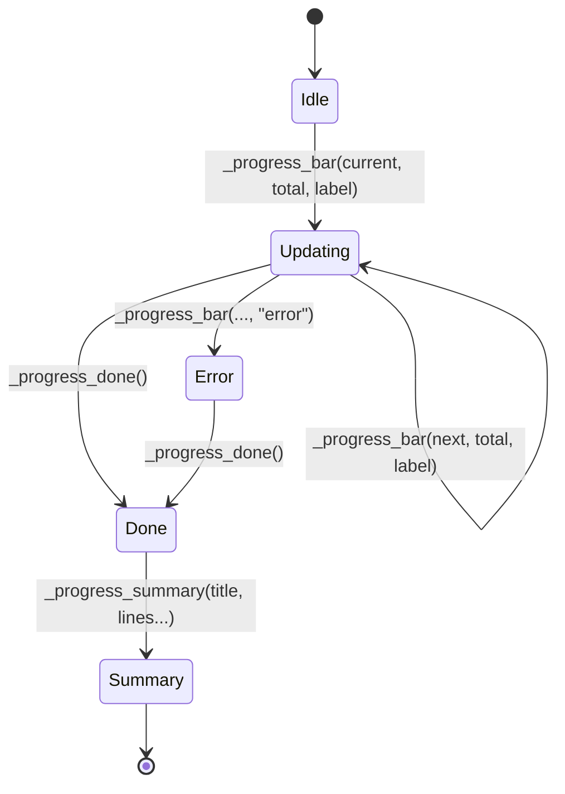
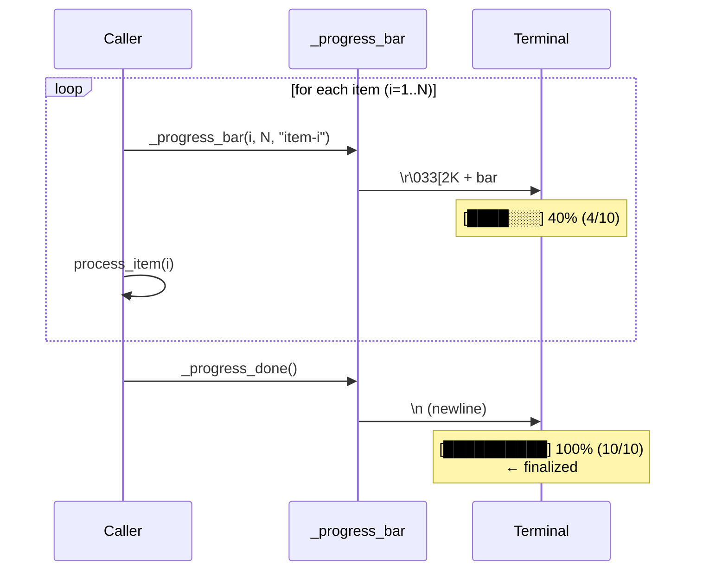
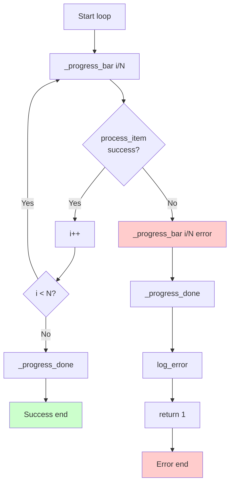
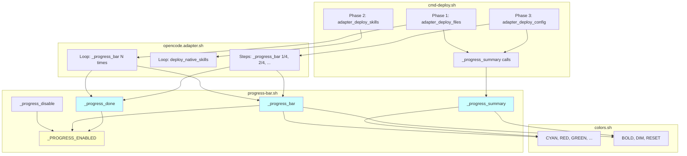

# Progress Bar System

> Comprehensive documentation of the visual feedback system for long-running operations

## Introduction

The progress bar system provides **real-time visual feedback** for long-running operations in openhub, particularly during the `oc deploy` workflow. It consists of three main components:

- **`_progress_bar()`**: Real-time progress display on a single line
- **`_progress_done()`**: Finalize the progress bar
- **`_progress_summary()`**: Structured recap after a phase

**Philosophy**: Immediate feedback during processing + detailed summaries at completion.

**Compatibility**: bash 3.2+ (macOS), automatic TTY detection, no external dependencies.

---

## Visual Overview

### Example Output (annotated)

```
📦 Phase 1 — Copying agents

    [████████████░░░░░░░░] 60% (18/30) developer-api    ← Progress bar
                                                          
    ✅ Phase 1 completed                                 ← Summary title
       · 30 agents deployed                             ← Summary line
       · Families: 11 developer, 8 auditor, ...         ← Summary line
         - 18 in subagent mode                          ← Sub-item (indented)
```

### State Diagram



**States**:
- **Idle**: No progress bar displayed
- **Updating**: Progress bar visible, updated on each iteration
- **Error**: Progress bar displayed in red with ✗
- **Done**: Progress bar finalized (new line)
- **Summary**: Structured recap displayed

---

## API Reference

### `_progress_bar(current, total, label, [status])`

Displays or updates a progress bar on a single line.

**Signature**:
```bash
_progress_bar <current> <total> <label> [status]
```

**Parameters**:
- `current` (int, 1-based): Current position in the progression
- `total` (int): Total number of items
- `label` (string): Descriptive text (name of current item)
- `status` (string, optional): `"error"` for red display with ✗

**Behavior**:
- Displays/updates a bar on **a single line**
- Uses `\r` (carriage return) to overwrite the previous line
- Silently skips if `$_PROGRESS_ENABLED != true`

**Visual Components**:
```
    [████████████░░░░░░░░] 75% (15/20) agent-name
     └─────┬─────┘         │    │  │   └─ label
           │               │    │  └───── total
           │               │    └──────── current
           │               └───────────── percentage
           └───────────────────────────── bar (20 chars)
```

**Colors**:
- Normal: `${CYAN}` (bar) + `${BOLD}` (percentage) + `${DIM}` (label)
- Error: `${RED}` + suffix ` ✗`

**ANSI Codes Used**:
- `\r`: Carriage return (U+000D)
- `\033[2K`: Erase line (CSI K with param 2)
- `\033[91m`: Bright red
- `\033[96m`: Bright cyan

**Unicode Characters**:
- `█` (U+2588): Full block (filled portion)
- `░` (U+2591): Light shade (empty portion)

**Example**:
```bash
# Loop with progress
total=30
for i in $(seq 1 $total); do
  _progress_bar $i $total "processing-item-$i"
  # ... processing ...
done
_progress_done
```

**Implementation Details**:

The bar is calculated as follows:
```bash
local bar_width=20
local percent=$(( current * 100 / total ))
local filled=$(( percent * bar_width / 100 ))
local empty=$(( bar_width - filled ))

local bar=""
local i=0
while [ "$i" -lt "$filled" ]; do 
  bar="${bar}█"
  i=$((i + 1))
done
i=0
while [ "$i" -lt "$empty" ]; do 
  bar="${bar}░"
  i=$((i + 1))
done
```

**Note**: Uses `while` loops instead of `seq` for bash 3.2 compatibility (macOS).

---

### `_progress_done()`

Finalizes the progress bar.

**Signature**:
```bash
_progress_done
```

**Behavior**:
- Finalizes the progress bar
- Displays a new line (`echo ""`)
- Allows displaying text afterward without overwriting the bar

**IMPORTANT**: Always call before displaying messages (log, echo, etc.)

**Example**:
```bash
_progress_bar 30 30 "last-item"
_progress_done  # ← MANDATORY before displaying anything

echo "Processing completed"
```

---

### `_progress_summary(title, lines...)`

Displays a structured recap after a phase.

**Signature**:
```bash
_progress_summary <title> <line1> [line2] [...]
```

**Parameters**:
- `title` (string): Summary title (e.g., "Phase 1 completed")
- `lines...` (variadic strings): Summary lines

**Format**:
- **Normal line**: prefixed with ` · ` (blue bullet point)
- **Sub-item**: starts with space(s), indented + grayed text

**Example**:
```bash
_progress_summary "Phase 1 completed" \
  "30 agents deployed" \
  "Families: 11 developer, 8 auditor" \
  "  - 18 in subagent mode" \
  "  - 4 disabled"
```

**Output**:
```
    ✅ Phase 1 completed
       · 30 agents deployed
       · Families: 11 developer, 8 auditor
         - 18 in subagent mode
         - 4 disabled
```

**Line Recognition**:
```bash
# Normal line (bullet point)
"30 agents deployed"

# Sub-item (indented, starts with space)
"  - 18 in subagent mode"  # Starts with 2 spaces
```

---

### `_progress_disable()`

Disables progress display.

**Signature**:
```bash
_progress_disable
```

**Behavior**:
- Disables progress (`_PROGRESS_ENABLED=false`)
- Used by `--no-progress` flag

**Example**:
```bash
# In cmd-deploy.sh
if [ "$NO_PROGRESS" = true ]; then
  _progress_disable
fi
```

---

## Usage Patterns

### Pattern 1: Loop (Phase 1)

**Use case**: Iterate over N items with 1-to-N progression

**Code**:
```bash
adapter_deploy_files() {
  # ...
  local total="${#items[@]}"
  local i=0
  
  while [ "$i" -lt "$total" ]; do
    local item="${items[$i]}"
    
    # Display progress
    _progress_bar $(($i + 1)) "$total" "$item"
    
    # Process item
    process_item "$item"
    
    i=$(($i + 1))
  done
  
  # Finalize
  _progress_done
}
```

**Error Handling**:
```bash
while [ "$i" -lt "$total" ]; do
  # ...
  
  if ! process_item "$item" 2>&1; then
    # Display error on bar
    _progress_bar $(($i + 1)) "$total" "$item" "error"
    _progress_done  # ← CRUCIAL: finalize before log
    
    log_error "Failed to process $item"
    return 1
  fi
  
  i=$(($i + 1))
done
```

**Visual Flow**:
```
[██░░░░░░░░░░░░░░░░░░] 10% (3/30) agent-1
[████░░░░░░░░░░░░░░░░] 20% (6/30) agent-2
[██████░░░░░░░░░░░░░░] 30% (9/30) agent-3
...
[████████████████████] 100% (30/30) agent-30
```

---

### Pattern 2: Fixed Steps (Phase 2)

**Use case**: Progression through predefined steps (1/4, 2/4, 3/4, 4/4)

**Code**:
```bash
adapter_deploy_config() {
  # Define number of steps
  local config_steps=4
  local step=0
  
  # Step 1/4
  step=1
  _progress_bar $step $config_steps "Loading metadata"
  # ... work ...
  
  # Step 2/4
  step=2
  _progress_bar $step $config_steps "Building JSON agents"
  # ... work ...
  
  # Step 3/4
  step=3
  _progress_bar $step $config_steps "Merging configuration"
  # ... work ...
  
  # Step 4/4
  step=4
  _progress_bar $step $config_steps "Writing opencode.json"
  # ... work ...
  
  # Finalize
  _progress_done
}
```

**Visual Flow**:
```
[█████░░░░░░░░░░░░░░░] 25% (1/4) Loading metadata
[██████████░░░░░░░░░░] 50% (2/4) Building JSON agents
[███████████████░░░░░] 75% (3/4) Merging configuration
[████████████████████] 100% (4/4) Writing opencode.json
```

---

### Pattern 3: Summary with Sub-items

**Use case**: Display a structured recap after a phase

**Code**:
```bash
# Build summary lines
summary_lines=()
summary_lines+=("30 agents deployed")
summary_lines+=("Families: 11 developer, 8 auditor")

# Sub-items (start with space)
if [ "$subagents" -gt 0 ]; then
  summary_lines+=("  - $subagents in subagent mode")
fi
if [ "$disabled" -gt 0 ]; then
  summary_lines+=("  - $disabled disabled")
fi

# Display
_progress_summary "Phase 1 completed" "${summary_lines[@]}"
```

**Output Structure**:
```
✅ Title
   · Line 1          ← Normal line (bullet)
   · Line 2          ← Normal line (bullet)
     - Sub-item 1    ← Sub-item (indented)
     - Sub-item 2    ← Sub-item (indented)
```

---

## Technical Details

### Bar Calculation Algorithm

**Pseudo-code**:
```
percent = (current * 100) / total
filled = (percent * bar_width) / 100
empty = bar_width - filled

bar = "█" × filled + "░" × empty
```

**Bash Implementation**:
```bash
local bar_width=20
local percent=$(( current * 100 / total ))
local filled=$(( percent * bar_width / 100 ))
local empty=$(( bar_width - filled ))

local bar=""
local i=0
while [ "$i" -lt "$filled" ]; do 
  bar="${bar}█"
  i=$((i + 1))
done
i=0
while [ "$i" -lt "$empty" ]; do 
  bar="${bar}░"
  i=$((i + 1))
done
```

**Why `while` loops?**
- Bash 3.2 (macOS) doesn't have `{1..N}` expansion in all contexts
- `seq` is not always available
- `while` loops are the most portable solution

---

### Single-Line Update Mechanism

**Principle**:
- `\r`: Returns cursor to the beginning of the line (without creating a new line)
- `\033[2K`: Erases the entire line
- `printf`: Redisplays the updated bar

**Display Sequence**:
```
\r              ← Return to beginning of line
\033[2K         ← Erase line
[...bar...]     ← Redisplay
```

**Code**:
```bash
printf "\r\033[2K    ${color}[${bar}]${RESET} ${BOLD}%3d%%${RESET} (%d/%d) ${DIM}%s${RESET}%s" \
  "$percent" "$current" "$total" "$label" "$suffix"
```

**Why not `echo`?**
- `echo` automatically adds a `\n` (newline)
- `printf` allows precise control without newline

**Example**:
```bash
# First call
printf "\r\033[2K[██░░░] 20% (2/10)"
# Terminal shows: [██░░░] 20% (2/10)

# Second call (overwrites)
printf "\r\033[2K[████░] 40% (4/10)"
# Terminal shows: [████░] 40% (4/10)  ← Same line
```

---

### TTY Detection

**Mechanism**:
```bash
if [ -t 1 ]; then
  _PROGRESS_ENABLED=true
fi
```

**Explanation**:
- `[ -t 1 ]`: Tests if file descriptor 1 (stdout) is a terminal
- If stdout is redirected (`> file` or `| cat`), the bar is automatically disabled

**Test**:
```bash
# TTY: bar displayed
./oc.sh deploy

# Non-TTY: bar hidden
./oc.sh deploy | cat
./oc.sh deploy > output.txt

# Forced: bar hidden
./oc.sh deploy --no-progress
```

**Why auto-detect?**
- Redirected output should be clean (no ANSI codes)
- Piped commands should not display progress bars
- Log files should contain only text, not control characters

---

## Best Practices

### ✅ Do

1. **Always finalize with `_progress_done()`**
   ```bash
   _progress_bar 30 30 "last-item"
   _progress_done  # ← MANDATORY
   ```

2. **Call `_progress_done()` BEFORE any display**
   ```bash
   _progress_bar 10 10 "item"
   _progress_done  # ← Finalize BEFORE log
   log_error "Error"
   ```

3. **Use `"error"` status for errors**
   ```bash
   if ! process "$item"; then
     _progress_bar $i $total "$item" "error"
     _progress_done
     return 1
   fi
   ```

4. **Indent sub-items with spaces**
   ```bash
   summary_lines+=("  - Sub-item")  # Starts with 2 spaces
   ```

5. **Test with and without TTY**
   ```bash
   ./oc.sh deploy              # With bar
   ./oc.sh deploy | cat        # Without bar
   ./oc.sh deploy --no-progress  # Without bar (forced)
   ```

6. **Use 1-based indexing for `current`**
   ```bash
   # ✅ GOOD
   _progress_bar 1 10 "item"  # 10% displayed
   
   # ❌ BAD
   _progress_bar 0 10 "item"  # 0% displayed (confusing)
   ```

---

### ❌ Don't

1. **❌ Never `echo` between `_progress_bar()` and `_progress_done()`**
   ```bash
   # ❌ BAD
   _progress_bar 5 10 "item"
   echo "Message"  # ← Overwrites the bar!
   _progress_done
   
   # ✅ GOOD
   _progress_bar 5 10 "item"
   _progress_done
   echo "Message"
   ```

2. **❌ Don't forget `_progress_done()` on error**
   ```bash
   # ❌ BAD
   _progress_bar 5 10 "item" "error"
   log_error "Error"  # ← Overwrites the error bar!
   
   # ✅ GOOD
   _progress_bar 5 10 "item" "error"
   _progress_done  # ← Finalize BEFORE log
   log_error "Error"
   ```

3. **❌ Don't call `_progress_bar()` without incrementing**
   ```bash
   # ❌ BAD (infinite visual loop)
   while true; do
     _progress_bar 5 10 "stuck"  # ← Always 5/10!
   done
   ```

4. **❌ Don't use `current=0` (1-based indexing)**
   ```bash
   # ❌ BAD
   _progress_bar 0 10 "item"  # ← 0% displayed
   
   # ✅ GOOD
   _progress_bar 1 10 "item"  # ← 10% displayed
   ```

5. **❌ Don't mix patterns**
   ```bash
   # ❌ BAD (confusing)
   _progress_bar 1 4 "Step 1"      # Steps pattern
   _progress_bar 5 30 "agent-5"    # Loop pattern (inconsistent!)
   
   # ✅ GOOD (consistent)
   _progress_bar 1 4 "Step 1"
   _progress_bar 2 4 "Step 2"
   ```

---

## Diagrams

### Sequence Diagram: Loop Pattern



---

### Flow Diagram: Error Handling



---

### Architecture Diagram: Components



---

## Testing and Debugging

### Functional Tests

```bash
# Test 1: TTY detected (bar displayed)
./oc.sh deploy PROJECT_ID

# Test 2: Non-TTY (bar hidden)
./oc.sh deploy PROJECT_ID | cat

# Test 3: --no-progress flag (forced)
./oc.sh deploy PROJECT_ID --no-progress

# Test 4: Error simulation
# (Temporarily modify an agent to cause a build error)
```

**Expected behavior**:
- Test 1: Progress bar visible, colors displayed
- Test 2: No progress bar, clean text output
- Test 3: No progress bar, clean text output
- Test 4: Error bar (red with ✗), then error message

---

### Debugging

**Enable debug logs**:
```bash
# Temporarily add in progress-bar.sh
_progress_bar() {
  echo "[DEBUG] _progress_bar called: $1/$2 '$3' '$4'" >> /tmp/progress-debug.log
  # ... rest of code ...
}
```

**Check `_PROGRESS_ENABLED` state**:
```bash
# In your script
echo "Progress enabled: $_PROGRESS_ENABLED"
```

**Manual test**:
```bash
source scripts/common.sh
source scripts/lib/progress-bar.sh

# Simple test
for i in {1..10}; do
  _progress_bar $i 10 "item-$i"
  sleep 0.5
done
_progress_done

_progress_summary "Test completed" "10 items processed" "  - 5 in test mode"
```

**Verify ANSI codes**:
```bash
# Display raw output
./oc.sh deploy PROJECT_ID 2>&1 | od -c | grep -E '\\r|\\033'
```

---

## History and Alternatives

### Why This Implementation?

**Constraints**:
- ✅ Bash 3.2+ (macOS, no `seq`, no `${array[@]^}`)
- ✅ No external dependencies (`tput`, `dialog`, `whiptail`)
- ✅ Automatic TTY detection
- ✅ Standard ANSI coloring
- ✅ Modern Unicode (2020+ terminals)

**Alternatives Considered**:

| Alternative | Advantages | Disadvantages | Verdict |
|-------------|-----------|---------------|---------|
| `tput` (ncurses) | Portable | External dependency | ❌ Rejected |
| `dialog` / `whiptail` | Full UI | Too heavy, not adapted | ❌ Rejected |
| Spinner (`⠋⠙⠹⠸⠼⠴⠦⠧⠇⠏`) | Lightweight | No percentage | ❌ Rejected |
| Dots (`...`) | Very simple | Not informative | ❌ Rejected |
| ANSI Bar (current) | Good balance | Requires Unicode | ✅ **Chosen** |

---

### Possible Evolutions

1. **Adaptive bar**: Adjust width based on terminal size
   ```bash
   bar_width=$(tput cols)
   bar_width=$((bar_width / 2))
   ```

2. **ETA (time remaining)**: Calculate estimated time
   ```bash
   elapsed=$SECONDS
   eta=$((elapsed * (total - current) / current))
   echo "ETA: ${eta}s"
   ```

3. **Multi-bars**: Display multiple bars simultaneously (complex)
   - Requires terminal manipulation (save/restore cursor position)
   - Not compatible with bash 3.2

4. **Animations**: Animated spinner during processing
   ```bash
   spinner=('⠋' '⠙' '⠹' '⠸' '⠼' '⠴' '⠦' '⠧' '⠇' '⠏')
   frame=$((frame % ${#spinner[@]}))
   echo -n "${spinner[$frame]}"
   ```

---

## References

### ANSI Codes

| Code | Description | Usage |
|------|-------------|-------|
| `\r` | Carriage return (U+000D) | Return to line start |
| `\033[2K` | Erase line (CSI K) | Clear line |
| `\033[91m` | Bright red | Error color |
| `\033[92m` | Bright green | Success color |
| `\033[94m` | Bright blue | Bullet color |
| `\033[96m` | Bright cyan | Bar color |
| `\033[1m` | Bold | Bold text |
| `\033[2m` | Dim | Grayed text |
| `\033[0m` | Reset | Reset style |

**Reference**: [ANSI Escape Codes - Wikipedia](https://en.wikipedia.org/wiki/ANSI_escape_code)

---

### Unicode Characters

| Char | Code | Name | Usage |
|------|------|------|-------|
| `█` | U+2588 | Full block | Filled portion |
| `░` | U+2591 | Light shade | Empty portion |
| `✅` | U+2705 | Check mark button | Success summary |
| `✗` | U+2717 | Ballot X | Error |
| `·` | U+00B7 | Middle dot | Bullet point |

---

### Related Files

- `scripts/lib/progress-bar.sh` : Implementation (118 lines)
- `scripts/lib/colors.sh` : Color constants
- `scripts/cmd-deploy.sh` : Usage (summaries)
- `scripts/adapters/opencode.adapter.sh` : Usage (bars)

---

## Complete Example

### Real-World Deploy Flow

```bash
#!/bin/bash
# Simplified deploy workflow showing all patterns

# Phase 1: Loop pattern
echo "📦 Phase 1 — Copying agents"
total=30
i=0

while [ "$i" -lt "$total" ]; do
  agent="agent-$((i + 1))"
  
  # Display progress
  _progress_bar $((i + 1)) $total "$agent"
  
  # Build agent (with error handling)
  if ! build_agent "$agent"; then
    _progress_bar $((i + 1)) $total "$agent" "error"
    _progress_done
    log_error "Failed to build $agent"
    exit 1
  fi
  
  i=$((i + 1))
done

_progress_done

# Summary
_progress_summary "Phase 1 completed" \
  "30 agents deployed" \
  "Families: 11 developer, 8 auditor" \
  "  - 18 in subagent mode"

echo ""

# Phase 2: Skills deployment (simple loop pattern)
echo "🧩  Phase 2 — Deploying skills"
deploy_skills
_progress_summary "Phase 2 completed" \
  "8 skills deployed"

echo ""

# Phase 3: Steps pattern
echo "⚙️  Phase 3 — Configuration"
config_steps=4

# Step 1/4
_progress_bar 1 $config_steps "Loading metadata"
load_metadata
sleep 1

# Step 2/4
_progress_bar 2 $config_steps "Building JSON"
build_json
sleep 1

# Step 3/4
_progress_bar 3 $config_steps "Merging config"
merge_config
sleep 1

# Step 4/4
_progress_bar 4 $config_steps "Writing file"
write_file
sleep 1

_progress_done

# Summary
_progress_summary "Phase 3 completed" \
  "opencode.json generated (12K)" \
  "Model: anthropic/claude-sonnet-4-5" \
  "Provider: anthropic"

echo ""
log_success "Deploy completed in ${SECONDS}s"
```

**Output**:
```
📦 Phase 1 — Copying agents
    [████████████████████] 100% (30/30) agent-30

    ✅ Phase 1 completed
       · 30 agents deployed
       · Families: 11 developer, 8 auditor
         - 18 in subagent mode

🧩  Phase 2 — Deploying skills

    ✅ Phase 2 completed
       · 8 skills deployed

⚙️  Phase 3 — Configuration
    [████████████████████] 100% (4/4) Writing file

    ✅ Phase 3 completed
       · opencode.json generated (12K)
       · Model: anthropic/claude-sonnet-4-5
       · Provider: anthropic

◆  Deploy completed in 38s
```
