# Plan d'Action — Audit Technique OpenHub

> **Date** : 2026-07-22
> **Source** : Audit complet (architecture, sécurité, qualité de code, DevOps, écosystème agent/skill)
> **Périmètre** : 31 tâches couvrant sécurité, CI/CD, robustesse, extensibilité et croissance marché

---

## Légende des tags

| Tag | Domaine |
|-----|---------|
| `#security` | Sécurité, protection des secrets, supply-chain |
| `#ci-cd` | Pipeline, releases, automatisation |
| `#resilience` | Robustesse, error recovery, protection données |
| `#architecture` | Refactoring structurel, couplage, patterns |
| `#dx` | Developer experience, extensibilité, ergonomie |
| `#cross-platform` | Portabilité macOS/Linux/Windows |
| `#market` | Expansion marché, adoption externe |
| `#agents` | Nouveaux agents et skills |
| `#observability` | Métriques, télémétrie, monitoring |
| `#team` | Collaboration équipe, coordination |

---

## Diagramme de dépendances

```mermaid
graph TD
    %% P1 — Critique
    T01["T01 · Rotation clé API<br/>#security"]:::crit
    T02["T02 · Supprimer GITLAB_SKIP bypass<br/>#security"]:::crit

    %% P2 — CI/CD & Fiabilité
    T03["T03 · govulncheck CI<br/>#security #ci-cd"]:::high
    T04["T04 · Workflow CD automatisé<br/>#ci-cd"]:::high
    T05["T05 · CI matrix macOS<br/>#ci-cd"]:::high
    T06["T06 · Retry GitHub API<br/>#resilience"]:::high
    T07["T07 · Signature binaire<br/>#security #ci-cd"]:::high
    T08["T08 · Coverage threshold CI<br/>#ci-cd #observability"]:::high

    %% P3 — Robustesse architecture
    T09["T09 · Refactor cmd/tui.go<br/>#architecture"]:::high
    T10["T10 · Refactor cmd/start.go<br/>#architecture"]:::high
    T11["T11 · Context propagation goroutines<br/>#architecture #resilience"]:::high
    T12["T12 · oh export/import<br/>#resilience"]:::high
    T13["T13 · oh repair<br/>#resilience"]:::high
    T14["T14 · Down-migrations SQLite<br/>#resilience"]:::high
    T15["T15 · io.LimitReader<br/>#resilience"]:::high
    T16["T16 · filepath.Join + fix cat<br/>#cross-platform"]:::high

    %% P4 — Extensibilité & DX
    T17["T17 · Interface plugin extensible<br/>#dx"]:::med
    T18["T18 · MCP server dynamique<br/>#dx"]:::med
    T19["T19 · Self-update oh<br/>#dx"]:::med
    T20["T20 · Skills Go + Rust<br/>#agents"]:::med
    T21["T21 · Notif multi-canal<br/>#team #dx"]:::med

    %% P5 — Croissance marché
    T22["T22 · Adapter GitHub<br/>#market"]:::strat
    T23["T23 · Adapter Jira/Linear<br/>#market"]:::strat
    T24["T24 · Agent Benchmark<br/>#agents"]:::strat
    T25["T25 · Agent Database<br/>#agents"]:::strat
    T26["T26 · Agent Infra/DevOps<br/>#agents"]:::strat
    T27["T27 · Agent Test Generation<br/>#agents"]:::strat
    T28["T28 · Marketplace skills<br/>#market #team"]:::strat
    T29["T29 · Télémétrie agent<br/>#observability"]:::strat
    T30["T30 · Support Windows<br/>#cross-platform #market"]:::strat
    T31["T31 · Dashboard web<br/>#observability #market"]:::strat

    %% Dépendances
    T04 --> T07
    T04 --> T19
    T09 --> T11
    T10 --> T11
    T12 --> T13
    T17 --> T18
    T18 --> T22
    T18 --> T23
    T17 --> T28
    T16 --> T30
    T29 --> T31

    %% Styles
    classDef crit fill:#dc2626,color:#fff,stroke:#991b1b
    classDef high fill:#ea580c,color:#fff,stroke:#9a3412
    classDef med fill:#2563eb,color:#fff,stroke:#1e40af
    classDef strat fill:#7c3aed,color:#fff,stroke:#5b21b6
```



---

## Chaînes critiques

| Chaîne | Séquence | Raison |
|--------|----------|--------|
| **Release chain** | T04 → T07 → T19 | Le CD automatisé est prérequis à la signature et au self-update |
| **Plugin chain** | T17 → T18 → T22 / T23 / T28 | L'interface plugin débloque le MCP dynamique, les adapters et la marketplace |
| **Refactor chain** | T09 / T10 → T11 | Le context propagation n'a de sens qu'après le refactoring des God Objects |
| **Data safety chain** | T12 → T13 | L'export/import fournit les primitives nécessaires au repair |
| **Windows chain** | T16 → T30 | Corriger les paths hardcodés est un prérequis au support Windows complet |
| **Observability chain** | T29 → T31 | Le dashboard web requiert la télémétrie comme source de données |

---

## P1 — Critique · Sécurité immédiate

### T01 — Rotation clé API + migration keychain

| Champ | Valeur |
|-------|--------|
| **Priorité** | P1 — Critique |
| **Tags** | `#security` |
| **Effort** | XS |
| **Dépendances** | Aucune |
| **Agent recommandé** | `developer` (domain: security) |

#### Problème

Clé API `sk-dcOsFI...` (provider mammouth) stockée en clair dans `opencode.json:8` et `projects/api-keys.local.md:22`. Même si ces fichiers sont gitignorés, le risque de fuite existe via backup disque, partage de machine, ou historique git antérieur.

#### Solution

1. Rotater immédiatement la clé API via le provider mammouth
2. Stocker la nouvelle clé : `oh secret set mammouth-api-key <nouvelle-clé>`
3. Modifier `opencode.json` pour utiliser une référence d'environnement (`"apiKey": ""`) et laisser `oh` injecter la clé au démarrage via le keychain
4. Supprimer `projects/api-keys.local.md`
5. Vérifier l'historique git : `git log --all --oneline -p -- "projects/api-keys*" -- "opencode.json"`
6. Si des commits contiennent la clé, exécuter `git filter-repo` pour la purger

#### Fichiers concernés

- `opencode.json:8`
- `projects/api-keys.local.md:22`
- `cli/internal/config/config.go` (injection env → provider)
- `cli/cmd/start.go` (injection des secrets au démarrage opencode)

#### Acceptance Criteria

- [ ] `rg "sk-" . --no-ignore` retourne 0 résultat
- [ ] `oh secret get mammouth-api-key` retourne la clé rotée depuis le keychain
- [ ] `oh doctor` valide l'accès provider sans warning
- [ ] Une session `oh start` démarre normalement avec le nouveau secret
- [ ] Aucun secret détecté dans l'historique git (`git log --all -p | grep "sk-"` retourne vide)

---

### T02 — Supprimer GITLAB_SKIP_URL_VALIDATION bypass ✅ DONE

| Champ | Valeur |
|-------|--------|
| **Priorité** | P1 — Critique |
| **Tags** | `#security` |
| **Effort** | XS |
| **Dépendances** | Aucune |
| **Agent recommandé** | `developer` (domain: security) |
| **Statut** | **DONE** — Remédié. Le bypass env-var a été supprimé du code de production. |

#### Problème (résolu)

`cli/internal/mcp/gitlab/server.go:195` exposait un bypass SSRF via la variable d'environnement `GITLAB_SKIP_URL_VALIDATION=true`. Remédié en remplaçant par une variable package-level `bool` non-settable en production, avec un setter test-only dans un fichier `_test.go`.

#### État actuel

- `os.Getenv("GITLAB_SKIP_URL_VALIDATION")` → **supprimé**
- `skipURLValidation` = `false` par défaut, setter uniquement dans `validate_test_helper_test.go` (exclu des binaires prod)
- Validation SSRF active en permanence (HTTPS + pas d'IP privée)

#### Limitation connue

Les instances GitLab self-hosted sur adresses IP privées (RFC1918: `10.x.x.x`, `172.16.x.x`, `192.168.x.x`, loopback `127.0.0.1`) ne sont **pas supportées** par le serveur MCP GitLab. C'est un choix de sécurité intentionnel (anti-SSRF). Les utilisateurs concernés doivent exposer leur GitLab via un FQDN public avec HTTPS.

#### Acceptance Criteria

- [x] `rg "GITLAB_SKIP_URL_VALIDATION" cli/` retourne 0 résultat dans les fichiers non-test
- [x] Les tests d'intégration GitLab passent avec le helper test-only
- [x] La validation SSRF est active sans exception en production
- [x] `make lint` et `make test` passent sans erreur

---

## P2 — Haute · CI/CD & Fiabilité

### T03 — govulncheck en CI

| Champ | Valeur |
|-------|--------|
| **Priorité** | P2 — Haute |
| **Tags** | `#security` `#ci-cd` |
| **Effort** | XS |
| **Dépendances** | Aucune |
| **Agent recommandé** | `developer` (domain: devops) |

#### Problème

Le pipeline CI ne scanne pas les dépendances Go pour les CVE connues. Une vulnérabilité dans `golang.org/x/crypto`, `modernc.org/sqlite` ou `zalando/go-keyring` ne serait pas détectée automatiquement.

#### Solution

1. Ajouter un step `govulncheck` dans `.github/workflows/ci.yml` après `go vet`
2. Utiliser `golang.org/x/vuln/cmd/govulncheck@latest`
3. Configurer le step pour échouer si des vulnérabilités HIGH/CRITICAL sont trouvées
4. Ajouter une exception documentée pour les vulnérabilités LOW/MEDIUM avec un commentaire de justification si nécessaire

#### Fichiers concernés

- `.github/workflows/ci.yml`

#### Acceptance Criteria

- [ ] Le step `govulncheck ./...` est présent dans la CI
- [ ] Un PR introduisant une dépendance vulnérable est rejeté par la CI
- [ ] La CI passe sur `main` et `develop` sans erreur

---

### T04 — Workflow CD automatisé (tag → GoReleaser)

| Champ | Valeur |
|-------|--------|
| **Priorité** | P2 — Haute |
| **Tags** | `#ci-cd` |
| **Effort** | S |
| **Dépendances** | Aucune |
| **Agent recommandé** | `developer` (domain: devops) |

#### Problème

GoReleaser est lancé manuellement. Il n'existe pas de workflow GitHub Actions déclenché sur push de tag `v*`. Risque d'oublier des étapes de release, d'incohérences de version, ou de builds non reproductibles.

#### Solution

1. Créer `.github/workflows/release.yml` déclenché sur `push: tags: ['v*']`
2. Steps : checkout (avec `fetch-depth: 0` pour GoReleaser), setup Go 1.26, embed hub content (hook pre-build), `goreleaser release --clean`
3. Configurer le secret `GITHUB_TOKEN` pour la publication des releases
4. Configurer `HOMEBREW_TAP_TOKEN` (PAT avec accès au repo homebrew-tap) comme secret GitHub
5. Tester avec un tag `v0.0.0-test` en dry-run (`goreleaser release --snapshot`)

#### Fichiers concernés

- `.github/workflows/release.yml` (nouveau)
- `cli/.goreleaser.yml` (vérification configuration existante)

#### Acceptance Criteria

- [ ] Un push de tag `v*` déclenche automatiquement la release
- [ ] Les binaires darwin/linux amd64+arm64 sont publiés sur GitHub Releases
- [ ] La formula Homebrew est mise à jour automatiquement dans `datichb/homebrew-tap`
- [ ] `checksums.txt` est inclus dans les assets de release
- [ ] Le dry-run `--snapshot` passe en CI

---

### T05 — CI matrix cross-platform (macOS)

| Champ | Valeur |
|-------|--------|
| **Priorité** | P2 — Haute |
| **Tags** | `#ci-cd` |
| **Effort** | XS |
| **Dépendances** | Aucune |
| **Agent recommandé** | `developer` (domain: devops) |

#### Problème

Le CI tourne uniquement sur `ubuntu-latest`. Les builds darwin (macOS) sont la cible principale mais ne sont jamais testés en CI. Des régressions macOS-spécifiques (keychain, syscall, paths) ne seraient pas détectées.

#### Solution

1. Modifier `.github/workflows/ci.yml` pour utiliser une matrix `os: [ubuntu-latest, macos-latest]`
2. Exclure les steps qui ne s'appliquent pas à macOS (ou adapter)
3. Vérifier que `go-keyring` fonctionne correctement sur macOS CI (peut nécessiter `security unlock-keychain`)
4. Séparer les tests unitaires (matrix complète) des tests d'intégration (ubuntu only pour performance)

#### Fichiers concernés

- `.github/workflows/ci.yml`

#### Acceptance Criteria

- [ ] La CI tourne sur ubuntu-latest ET macos-latest à chaque push/PR
- [ ] Les tests passent sur les deux plateformes
- [ ] Le badge CI reflète l'état des deux runners

---

### T06 — Retry + exponential backoff sur appels GitHub API

| Champ | Valeur |
|-------|--------|
| **Priorité** | P2 — Haute |
| **Tags** | `#resilience` |
| **Effort** | S |
| **Dépendances** | Aucune |
| **Agent recommandé** | `developer` (domain: backend) |

#### Problème

Les appels à l'API GitHub (dans `oh upgrade opencode` et la vérification de compatibilité) n'ont pas de mécanisme de retry. Un réseau instable ou un rate-limit momentané GitHub provoque un échec définitif sans feedback utile.

#### Solution

1. Créer un helper `cli/internal/httpclient/retry.go` avec une fonction `DoWithRetry(client, req, maxRetries, backoff)`
2. Implémenter exponential backoff : 1s, 2s, 4s (max 3 tentatives)
3. Retry sur : erreurs réseau, HTTP 429 (rate limit), HTTP 5xx
4. Pas de retry sur : HTTP 4xx (sauf 429), erreurs de parsing
5. Respecter le header `Retry-After` si présent (GitHub rate limit)
6. Appliquer dans `cli/cmd/upgrade.go` et `cli/internal/opencode/download.go`

#### Fichiers concernés

- `cli/internal/httpclient/retry.go` (nouveau)
- `cli/cmd/upgrade.go`
- `cli/internal/opencode/download.go`

#### Acceptance Criteria

- [ ] Un appel avec réseau flaky réussit après retry
- [ ] Un HTTP 429 attend le `Retry-After` avant de retenter
- [ ] Après 3 échecs, le message d'erreur indique le nombre de tentatives
- [ ] Les tests unitaires couvrent les scénarios retry avec un mock HTTP
- [ ] `make test` passe sans régression

---

### T07 — Signature binaire (checksums verification + notarisation macOS)

| Champ | Valeur |
|-------|--------|
| **Priorité** | P2 — Haute |
| **Tags** | `#security` `#ci-cd` |
| **Effort** | S |
| **Dépendances** | T04 |
| **Agent recommandé** | `developer` (domain: devops) |

#### Problème

`install.sh` télécharge le binaire depuis GitHub Releases sans vérifier les checksums. GoReleaser génère bien `checksums.txt` mais il n'est pas utilisé. Un attaquant capable d'intercepter le téléchargement pourrait substituer un binaire malveillant.

#### Solution

1. Modifier `install.sh` pour :
   - Télécharger `checksums.txt` en même temps que l'archive
   - Vérifier `sha256sum --check` avant d'extraire
   - Échouer explicitement si le checksum ne correspond pas
2. Ajouter la signature GPG dans `.goreleaser.yml` (section `signs`) avec une clé dédiée
3. Pour macOS : si un Apple Developer ID est disponible, configurer la notarisation dans GoReleaser via `notarize`
4. Documenter le processus de vérification manuelle dans le README

#### Fichiers concernés

- `install.sh`
- `cli/.goreleaser.yml`
- `README.md` (section installation)

#### Acceptance Criteria

- [ ] `install.sh` échoue si le checksum ne correspond pas
- [ ] Les releases incluent les signatures `.sig` dans les assets
- [ ] La documentation explique comment vérifier manuellement l'intégrité
- [ ] Un binaire modifié est rejeté par le script d'installation

---

### T08 — Coverage threshold obligatoire en CI

| Champ | Valeur |
|-------|--------|
| **Priorité** | P2 — Haute |
| **Tags** | `#ci-cd` `#observability` |
| **Effort** | XS |
| **Dépendances** | Aucune |
| **Agent recommandé** | `developer` (domain: devops) |

#### Problème

Il n'existe pas de seuil minimum de couverture de tests en CI. Des features peuvent être mergées sans tests et la couverture globale peut régresser silencieusement.

#### Solution

1. Ajouter un step dans `.github/workflows/ci.yml` qui calcule la couverture et échoue sous le seuil
2. Utiliser `go test ./... -coverprofile=coverage.out` puis extraire le total avec `go tool cover -func`
3. Seuil initial conservateur : **60%** (pour ne pas bloquer immédiatement), avec objectif 70% à 3 mois
4. Exclure les packages générés (`hubcontent/embed`) du calcul
5. Afficher le rapport de couverture en commentaire PR via une action GitHub (ex: `actions/github-script`)

#### Fichiers concernés

- `.github/workflows/ci.yml`
- `cli/Makefile` (adapter `test-cover` pour sortir un code d'erreur)

#### Acceptance Criteria

- [ ] La CI échoue si la couverture globale est inférieure à 60%
- [ ] La couverture actuelle est mesurée et documentée (point de départ)
- [ ] Le seuil est configurable via une variable dans le workflow
- [ ] `make test-cover` retourne un code d'erreur si sous le seuil

---

## P3 — Haute · Robustesse architecture

### T09 — Refactorer cmd/tui.go (God Object → strategy pattern)

| Champ | Valeur |
|-------|--------|
| **Priorité** | P3 — Haute |
| **Tags** | `#architecture` |
| **Effort** | L |
| **Dépendances** | Aucune |
| **Agent recommandé** | `developer-refactor` |

#### Problème

`cli/cmd/tui.go` (1035 lignes) importe 9 packages internes et centralise : enregistrement de 40+ commandes, définition des callbacks d'action, construction des vues, gestion du cycle de vie TUI. Toute modification d'un sous-système (deploy, team, parallel) nécessite de toucher ce fichier. Impossible à tester unitairement.

#### Solution

1. Extraire les commandes par domaine dans des fichiers dédiés :
   - `cmd/tui_deploy.go` — commandes deploy/upgrade
   - `cmd/tui_team.go` — commandes team/sync/claim
   - `cmd/tui_session.go` — commandes start/stop/attach
   - `cmd/tui_project.go` — commandes project/switch
2. Créer une interface `TUIAction` avec `Name() string`, `Execute(ctx, app) error`, `Describe() string`
3. `tui.go` devient un orchestrateur léger (~200 lignes) qui enregistre les actions
4. Chaque fichier de commandes s'auto-enregistre via `init()` ou une fonction `RegisterXxxCommands(registry)`
5. Conserver la compatibilité comportementale exacte (pas de changement d'UX)

#### Fichiers concernés

- `cli/cmd/tui.go` (refactoring majeur)
- `cli/cmd/tui_deploy.go` (nouveau)
- `cli/cmd/tui_team.go` (nouveau)
- `cli/cmd/tui_session.go` (nouveau)
- `cli/cmd/tui_project.go` (nouveau)

#### Acceptance Criteria

- [ ] `tui.go` fait moins de 300 lignes après refactoring
- [ ] Chaque fichier de commandes fait moins de 250 lignes
- [ ] Aucune régression sur les tests d'intégration existants (`make test`)
- [ ] Les 40+ commandes TUI fonctionnent identiquement
- [ ] Chaque fichier de commandes a au moins un test unitaire

---

### T10 — Refactorer cmd/start.go (extraction des modes)

| Champ | Valeur |
|-------|--------|
| **Priorité** | P3 — Haute |
| **Tags** | `#architecture` |
| **Effort** | L |
| **Dépendances** | Aucune |
| **Agent recommandé** | `developer-refactor` |

#### Problème

`cli/cmd/start.go` (1041 lignes, 16 imports) gère 4 modes d'exécution distincts (standard, dev, onboard, parallel) dans une seule fonction `RunE`. La logique s'entremêle et chaque nouveau mode ajoute de la complexité à l'ensemble.

#### Solution

1. Définir une interface `StartMode` avec `Prepare(ctx, app, flags) error` et `Execute(ctx, app) error`
2. Créer des implémentations dans des fichiers séparés :
   - `cmd/start_standard.go` — mode normal
   - `cmd/start_dev.go` — mode dev (beads + worktree)
   - `cmd/start_onboard.go` — mode onboard
   - `cmd/start_parallel.go` — mode parallel
3. `start.go` devient un dispatcher (~150 lignes) qui sélectionne le mode via les flags
4. Extraire la logique de résolution de projet et d'agent dans `cmd/start_helpers.go`

#### Fichiers concernés

- `cli/cmd/start.go` (refactoring majeur)
- `cli/cmd/start_standard.go` (nouveau)
- `cli/cmd/start_dev.go` (nouveau)
- `cli/cmd/start_onboard.go` (nouveau)
- `cli/cmd/start_parallel.go` (nouveau)
- `cli/cmd/start_helpers.go` (nouveau)

#### Acceptance Criteria

- [ ] `start.go` fait moins de 200 lignes après refactoring
- [ ] Chaque mode est dans son propre fichier et testable indépendamment
- [ ] Les 4 modes (`oh start`, `oh start --dev`, `oh start --onboard`, `oh start --parallel`) fonctionnent identiquement
- [ ] Les tests d'intégration `cmd/integration_test.go` passent sans modification
- [ ] `make lint` passe sans erreur

---

### T11 — Context propagation dans les goroutines TUI

| Champ | Valeur |
|-------|--------|
| **Priorité** | P3 — Haute |
| **Tags** | `#architecture` `#resilience` |
| **Effort** | M |
| **Dépendances** | T09, T10 |
| **Agent recommandé** | `developer` (domain: backend) |

#### Problème

Les goroutines lancées par les callbacks d'action TUI (`cmd/tui.go:777-910`) utilisent `context.Background()` au lieu d'un contexte dérivé du cycle de vie de l'application. Si l'utilisateur quitte le TUI pendant une opération (deploy, sync, upgrade), la goroutine continue à tourner de façon orpheline jusqu'à complétion.

#### Solution

1. Créer un contexte racine annulable dans le shell TUI, associé au signal `SIGTERM/SIGINT`
2. Passer ce contexte via la signature des callbacks d'action (après T09/T10 qui réorganisent les callbacks)
3. Toutes les goroutines d'action doivent accepter et respecter ce contexte
4. Ajouter un `select { case <-ctx.Done(): return ctx.Err() }` aux points d'attente des goroutines longues
5. Afficher un message TUI "Annulation en cours..." lors du cancel

#### Fichiers concernés

- `cli/internal/tui/v2/shell/shell.go` (contexte racine)
- `cli/cmd/tui_deploy.go`, `tui_team.go`, etc. (après T09)

#### Acceptance Criteria

- [ ] Appuyer sur `q` ou `Ctrl+C` pendant un deploy annule proprement l'opération
- [ ] Aucune goroutine orpheline détectée avec `goleak` dans les tests
- [ ] Le rollback transactionnel du deploy est déclenché si le contexte est annulé en mid-deploy
- [ ] `make test -race` ne détecte aucune race condition liée aux goroutines TUI

---

### T12 — oh export / oh import (backup et restore)

| Champ | Valeur |
|-------|--------|
| **Priorité** | P3 — Haute |
| **Tags** | `#resilience` |
| **Effort** | M |
| **Dépendances** | Aucune |
| **Agent recommandé** | `developer` (domain: backend) |

#### Problème

La suppression de `~/.oh/` (DB SQLite, secrets chiffrés, config) entraîne une perte totale et irréversible de tous les projets enregistrés, sessions et secrets. Il n'existe aucun mécanisme d'export ou de sauvegarde.

#### Solution

1. Créer `oh export [--output path]` qui produit une archive `.oh-backup.tar.gz` contenant :
   - `oh.db` (dump SQL ou copie)
   - `hub.toml`
   - `secrets.enc` (déjà chiffré, safe à transporter)
   - Métadonnées (version, date, checksum)
2. Créer `oh import [--input path]` qui restaure depuis l'archive avec confirmation interactive
3. Gérer les conflits (DB déjà existante) avec `--merge` ou `--overwrite`
4. Documenter le workflow backup/restore dans les guides

#### Fichiers concernés

- `cli/cmd/export.go` (nouveau)
- `cli/cmd/import.go` (nouveau)
- `cli/internal/storage/sqlite/store.go` (méthode Dump)
- `docs/guides/backup-restore.md` (nouveau)

#### Acceptance Criteria

- [ ] `oh export` crée une archive valide avec tous les composants
- [ ] `oh import` restaure un état identique sur une machine vierge
- [ ] L'archive est signée avec un checksum pour détecter la corruption
- [ ] `oh doctor` après import valide l'état complet de l'installation
- [ ] Les secrets restent chiffrés dans l'archive (pas de fuite en clair)

---

### T13 — oh repair (détection et reconstruction de DB corrompue)

| Champ | Valeur |
|-------|--------|
| **Priorité** | P3 — Haute |
| **Tags** | `#resilience` |
| **Effort** | S |
| **Dépendances** | T12 |
| **Agent recommandé** | `developer` (domain: backend) |

#### Problème

Si `~/.oh/oh.db` est corrompue, toutes les commandes `oh` (sauf `version`, `help`, `init`, `doctor`) échouent avec `"opening database: ..."`. Il n'existe aucun mécanisme de récupération. L'utilisateur doit supprimer manuellement la DB et re-enregistrer tous ses projets.

#### Solution

1. Créer `oh repair` qui :
   - Détecte la corruption via `PRAGMA integrity_check`
   - Tente une récupération via `PRAGMA recover` (SQLite 3.29+)
   - Si échec, reconstruit une DB vierge et importe depuis la dernière sauvegarde (si T12 est implémenté)
   - Sinon, liste les projets récupérables depuis le filesystem (en scannant les `opencode.json` existants)
2. Ajouter une détection automatique dans `initApp()` : si `integrity_check` échoue, suggérer `oh repair`
3. Implémenter une sauvegarde automatique quotidienne de la DB dans `~/.oh/backups/`

#### Fichiers concernés

- `cli/cmd/repair.go` (nouveau)
- `cli/internal/storage/sqlite/store.go` (méthodes IntegrityCheck, Recover)
- `cli/cmd/root.go` (détection au démarrage)

#### Acceptance Criteria

- [ ] `oh repair` détecte et signale une DB corrompue
- [ ] Une DB corrompue est automatiquement sauvegardée avant tentative de repair
- [ ] Les projets récupérables sont listés même si la DB est irrécupérable
- [ ] `oh repair --auto` est non-interactif pour les scripts
- [ ] Un message clair guide l'utilisateur si la DB ne peut pas être réparée

---

### T14 — Down-migrations SQLite

| Champ | Valeur |
|-------|--------|
| **Priorité** | P3 — Haute |
| **Tags** | `#resilience` |
| **Effort** | S |
| **Dépendances** | Aucune |
| **Agent recommandé** | `developer` (domain: backend) |

#### Problème

Le système de migrations (`cli/internal/storage/sqlite/store.go`) n'implémente que des up-migrations. Si un utilisateur installe une version plus récente de `oh` puis revient en arrière, la DB a un schéma incompatible avec l'ancienne version et toutes les commandes échouent.

#### Solution

1. Étendre la structure `migration` pour inclure un champ `down string`
2. Implémenter `MigrateDown(targetVersion int)` qui applique les down-migrations en ordre inverse
3. Stocker la version actuelle du schéma dans `schema_migrations` (déjà présent)
4. À l'ouverture, si la version du binaire est inférieure à la version du schéma, proposer `oh repair --downgrade`
5. Documenter les limites : certaines down-migrations sont destructives (DROP COLUMN) et irréversibles

#### Fichiers concernés

- `cli/internal/storage/sqlite/store.go`
- `cli/internal/storage/sqlite/store_test.go`

#### Acceptance Criteria

- [ ] Chaque migration a un pendant down (ou est marquée `irreversible: true`)
- [ ] `MigrateDown` applique les migrations en ordre inverse correctement
- [ ] Un test vérifie le round-trip up/down pour toutes les migrations réversibles
- [ ] Un message d'erreur clair guide l'utilisateur en cas d'incompatibilité de schéma

---

### T15 — io.LimitReader sur les lectures de fichiers non bornées

| Champ | Valeur |
|-------|--------|
| **Priorité** | P3 — Haute |
| **Tags** | `#resilience` |
| **Effort** | XS |
| **Dépendances** | Aucune |
| **Agent recommandé** | `developer` (domain: backend) |

#### Problème

Plusieurs `os.ReadFile()` lisent des fichiers sans limite de taille :
- `cli/internal/teamstate/wiki.go:52,117` (fichiers wiki)
- `cli/internal/prompt/prompt.go:163` (fichiers projet)
- `cli/internal/opencode/opencode.go:232` (output CombinedOutput headless)

Un fichier malformé ou volontairement énorme peut provoquer un OOM.

#### Solution

1. Remplacer `os.ReadFile(path)` par un pattern borné :
   ```go
   const maxFileSize = 10 * 1024 * 1024 // 10 MB
   f, _ := os.Open(path)
   data, _ := io.ReadAll(io.LimitReader(f, maxFileSize))
   ```
2. Pour `CombinedOutput`, remplacer par `cmd.StdoutPipe()` + `io.LimitReader` avec streaming
3. Définir des constantes de limite par type de fichier (wiki: 1MB, prompts: 512KB, headless output: 50MB)
4. Loguer un warning si la limite est atteinte (contenu tronqué)

#### Fichiers concernés

- `cli/internal/teamstate/wiki.go:52,117`
- `cli/internal/prompt/prompt.go:163`
- `cli/internal/opencode/opencode.go:232`

#### Acceptance Criteria

- [ ] Aucun `os.ReadFile` sans limite dans les chemins critiques
- [ ] Un fichier de 100MB ne provoque pas d'OOM (tronqué avec warning)
- [ ] Les tests unitaires couvrent le cas de fichier surdimensionné
- [ ] `make test` passe sans régression

---

### T16 — filepath.Join systématique + remplacement exec.Command("cat")

| Champ | Valeur |
|-------|--------|
| **Priorité** | P3 — Haute |
| **Tags** | `#cross-platform` |
| **Effort** | XS |
| **Dépendances** | Aucune |
| **Agent recommandé** | `developer` (domain: backend) |

#### Problème

Deux catégories de problèmes cross-platform :
1. Concaténation de chemins avec `/` littéral au lieu de `filepath.Join` (`cmd/tui.go:1009,1025`)
2. `exec.Command("cat", path)` dans `tui/v2/views/status_view.go:280` — `cat` n'existe pas sur Windows

Ces bugs sont silencieux sur macOS/Linux mais feront planter l'outil sur Windows.

#### Solution

1. Remplacer toutes les concaténations `path + "/" + segment` par `filepath.Join(path, segment)`
2. Remplacer `exec.Command("cat", path).Output()` par `os.ReadFile(path)` (plus simple, cross-platform, pas de subprocess)
3. Lancer `rg 'path \+ "/"' cli/` et `rg '"cat"' cli/` pour identifier tous les cas restants

#### Fichiers concernés

- `cli/cmd/tui.go:1009,1025`
- `cli/internal/tui/v2/views/status_view.go:280`

#### Acceptance Criteria

- [ ] `rg 'path \+ "/"' cli/` retourne 0 résultat
- [ ] `rg '"cat"' cli/` retourne 0 résultat dans les fichiers non-test
- [ ] `make test` passe sans régression
- [ ] Le build compile sans erreur avec `GOOS=windows go build ./...`

---

## P4 — Moyenne · Extensibilité & DX

### T17 — Interface plugin extensible (registry dynamique)

| Champ | Valeur |
|-------|--------|
| **Priorité** | P4 — Moyenne |
| **Tags** | `#dx` |
| **Effort** | L |
| **Dépendances** | Aucune |
| **Agent recommandé** | `developer` (domain: backend) |

#### Problème

Le système de plugins actuel ne supporte qu'un seul plugin (`rtk`, hard-codé dans `cmd/plugin.go:65`). Il est impossible pour un utilisateur externe d'ajouter un plugin sans modifier le code source du binaire.

#### Solution

1. Définir une interface `Plugin` dans `cli/internal/plugin/plugin.go` :
   ```go
   type Plugin interface {
       Name() string
       Description() string
       Install(ctx context.Context, projectPath string) error
       Uninstall(ctx context.Context, projectPath string) error
       IsInstalled(projectPath string) (bool, error)
   }
   ```
2. Créer un `Registry` qui découvre les plugins depuis `~/.oh/plugins/` (répertoire de plugins utilisateur)
3. Migrer le plugin `rtk` existant vers cette interface
4. `oh plugin list` affiche les plugins built-in + les plugins utilisateur installés
5. `oh plugin add <url>` télécharge et installe un plugin depuis une source définie (format à définir : Go plugin `.so`, script Go, ou manifest)
6. Documenter le format de plugin pour les contributeurs

#### Fichiers concernés

- `cli/internal/plugin/plugin.go` (refactoring vers interface)
- `cli/internal/plugin/registry.go` (nouveau)
- `cli/cmd/plugin.go`
- `docs/dev/plugin-authoring.md` (nouveau)

#### Acceptance Criteria

- [ ] Le plugin `rtk` fonctionne identiquement via la nouvelle interface
- [ ] Un plugin utilisateur dans `~/.oh/plugins/` est découvert automatiquement
- [ ] `oh plugin list` affiche les plugins disponibles avec leur statut
- [ ] L'interface est documentée avec un exemple de plugin minimal
- [ ] `make test` passe sans régression

---

### T18 — MCP server dynamique (discovery + chargement)

| Champ | Valeur |
|-------|--------|
| **Priorité** | P4 — Moyenne |
| **Tags** | `#dx` |
| **Effort** | M |
| **Dépendances** | T17 |
| **Agent recommandé** | `developer` (domain: backend) |

#### Problème

La liste des MCP servers est hard-codée : `validMCPServices = []string{"figma", "gitlab", "gslides", "team"}` dans `cmd/mcp.go:29`. Ajouter un MCP server (GitHub, Linear, Slack...) nécessite de modifier le binaire. Les utilisateurs ne peuvent pas apporter leurs propres MCP servers.

#### Solution

1. Étendre le `Registry` de T17 pour inclure des `MCPServerPlugin`
2. Définir une interface `MCPServer` :
   ```go
   type MCPServer interface {
       Name() string
       Start(ctx context.Context, config MCPConfig) error
       RequiredTokens() []string
   }
   ```
3. Migrer les 4 serveurs natifs (figma, gitlab, gslides, team) vers cette interface
4. Permettre le chargement de serveurs MCP externes depuis `~/.oh/mcp/` (manifest JSON + binaire)
5. `oh mcp list` affiche native + custom servers
6. `hub.toml` peut référencer des MCP servers tiers par nom

#### Fichiers concernés

- `cli/cmd/mcp.go`
- `cli/internal/mcp/registry.go` (nouveau)
- `cli/internal/plugin/registry.go` (extension)
- `docs/dev/mcp-server-authoring.md` (nouveau)

#### Acceptance Criteria

- [ ] Les 4 MCP servers natifs fonctionnent identiquement
- [ ] Un MCP server custom dans `~/.oh/mcp/` est découvert et listable
- [ ] `oh mcp list` affiche servers natifs + custom
- [ ] La documentation guide la création d'un MCP server custom
- [ ] `make test` passe sans régression

---

### T19 — Self-update oh (oh upgrade oh)

| Champ | Valeur |
|-------|--------|
| **Priorité** | P4 — Moyenne |
| **Tags** | `#dx` |
| **Effort** | M |
| **Dépendances** | T04 |
| **Agent recommandé** | `developer` (domain: backend) |

#### Problème

`oh upgrade opencode` met à jour la dépendance opencode mais il n'existe pas de commande équivalente pour le binaire `oh` lui-même. Les utilisateurs installés via `curl | sh` (non-Homebrew) n'ont aucun mécanisme managé pour rester à jour.

#### Solution

1. Implémenter `oh upgrade oh` qui :
   - Compare la version actuelle avec la dernière release GitHub
   - Si mise à jour disponible : télécharge le nouveau binaire, vérifie le checksum, remplace le binaire en place (pattern `mv` atomique)
   - Supporte `--check` (dry-run, juste vérifie)
   - Supporte `--version x.y.z` pour une version spécifique
2. Réutiliser la logique de `cli/internal/opencode/download.go` (déjà bien faite)
3. Intégrer dans `oh doctor` : suggérer `oh upgrade oh` si une nouvelle version est disponible

#### Fichiers concernés

- `cli/cmd/upgrade.go` (extension)
- `cli/internal/selfupdate/selfupdate.go` (nouveau, extrait de opencode/download.go)

#### Acceptance Criteria

- [ ] `oh upgrade oh --check` détecte correctement une nouvelle version disponible
- [ ] `oh upgrade oh` remplace le binaire de façon atomique (pas d'état intermédiaire cassé)
- [ ] Le checksum est vérifié avant remplacement (hérite de T07)
- [ ] `oh doctor` signale une version `oh` obsolète avec suggestion de mise à jour
- [ ] Fonctionne sur darwin et linux (amd64 + arm64)

---

### T20 — Stack skills Go + Rust

| Champ | Valeur |
|-------|--------|
| **Priorité** | P4 — Moyenne |
| **Tags** | `#agents` |
| **Effort** | S |
| **Dépendances** | Aucune |
| **Agent recommandé** | `documentarian` |

#### Problème

Les 38 stack skills couvrent JavaScript/TypeScript, Python, Ruby, Java, mobile et infrastructure, mais pas Go ni Rust — deux langages en forte croissance dans les équipes backend et systèmes. Les projets Go (comme opencode-hub lui-même) reçoivent des conseils génériques au lieu de standards idiomatiques.

#### Solution

1. Créer `skills/developer/stacks/golang/SKILL.md` couvrant :
   - Idiomes Go (error wrapping, interfaces, goroutines, defer)
   - Outils standards (golangci-lint, go vet, go test -race)
   - Patterns Clean Architecture en Go
   - Gestion des modules et versioning
   - Standards de performance (pprof, escape analysis)
2. Créer `skills/developer/stacks/rust/SKILL.md` couvrant :
   - Ownership, borrowing, lifetimes
   - Gestion d'erreurs (thiserror, anyhow)
   - Async avec tokio
   - Clippy et rustfmt
   - Cargo workspaces
3. Ajouter la détection automatique dans `cli/internal/deploy/stack_skills.go`

#### Fichiers concernés

- `skills/developer/stacks/golang/SKILL.md` (nouveau)
- `skills/developer/stacks/rust/SKILL.md` (nouveau)
- `cli/internal/deploy/stack_skills.go` (détection go.mod, Cargo.toml)

#### Acceptance Criteria

- [ ] `oh deploy` sur un projet avec `go.mod` déploie automatiquement le skill Go
- [ ] `oh deploy` sur un projet avec `Cargo.toml` déploie automatiquement le skill Rust
- [ ] Les skills passent la validation du skill-authoring-protocol (SDO checklist)
- [ ] Le developer agent utilise les skills lors d'une session sur un projet Go/Rust

---

### T21 — Notification multi-canal (Slack / Discord / Teams)

| Champ | Valeur |
|-------|--------|
| **Priorité** | P4 — Moyenne |
| **Tags** | `#team` `#dx` |
| **Effort** | M |
| **Dépendances** | Aucune |
| **Agent recommandé** | `developer` (domain: backend) |

#### Problème

Les notifications d'équipe sont limitées à Mattermost (`cli/internal/notify/`). Les équipes utilisant Slack, Discord ou Microsoft Teams n'ont aucun support de notification, ce qui limite l'adoption pour les équipes non-Mattermost.

#### Solution

1. Définir une interface `Notifier` dans `cli/internal/notify/notifier.go` :
   ```go
   type Notifier interface {
       Send(ctx context.Context, msg Message) error
       Name() string
   }
   ```
2. Migrer Mattermost vers cette interface
3. Implémenter `SlackNotifier` (webhook Incoming Webhooks)
4. Implémenter `DiscordNotifier` (webhook)
5. Implémenter `TeamsNotifier` (Adaptive Cards via webhook)
6. `hub.toml` section `[notify]` : `type = "slack"` + `webhook_url`
7. Support multi-destination : notifier plusieurs canaux en parallèle

#### Fichiers concernés

- `cli/internal/notify/notifier.go` (interface, nouveau)
- `cli/internal/notify/slack.go` (nouveau)
- `cli/internal/notify/discord.go` (nouveau)
- `cli/internal/notify/teams.go` (nouveau)
- `cli/internal/notify/mattermost.go` (migration vers interface)
- `cli/internal/config/config.go` (section notify)

#### Acceptance Criteria

- [ ] `hub.toml` avec `type = "slack"` envoie bien les notifications sur Slack
- [ ] Les 4 notifiers (Mattermost, Slack, Discord, Teams) sont fonctionnels
- [ ] La configuration multi-destination fonctionne
- [ ] Les tests unitaires mockent le webhook pour chaque notifier
- [ ] `make test` passe sans régression

---

## P5 — Stratégique · Croissance marché

### T22 — Adapter GitHub (issues, PRs, Actions)

| Champ | Valeur |
|-------|--------|
| **Priorité** | P5 — Stratégique |
| **Tags** | `#market` |
| **Effort** | L |
| **Dépendances** | T18 (idéal, mais non bloquant) |
| **Agent recommandé** | `developer` (domain: backend) |

#### Problème

L'écosystème d'agents est optimisé pour GitLab (issues, MRs, CI). Les équipes GitHub-native (majorité du marché open source et startups) ne peuvent pas utiliser les workflows de planification, ticketing et review d'opencode-hub. C'est la plus grande barrière d'adoption.

#### Solution

1. Créer un MCP server natif GitHub dans `cli/internal/mcp/github/` avec :
   - `github_list_issues` (filtres : state, labels, assignee, milestone)
   - `github_get_issue`
   - `github_create_issue`
   - `github_list_prs`
   - `github_get_pr` (diff, reviews, checks)
   - `github_list_workflows` + `github_get_workflow_run`
2. Créer les skills adapters dans `skills/adapters/github/` :
   - `github-planner.md` (équivalent de `gitlab-planner.md`)
   - `github-pathfinder.md`
   - `github-onboarder.md`
3. Authentification : Personal Access Token (PAT) ou GitHub App
4. SSRF protection identique au serveur GitLab
5. Configurer dans `hub.toml` : `[mcp.github]`

#### Fichiers concernés

- `cli/internal/mcp/github/` (nouveau package)
- `skills/adapters/github/` (nouveau répertoire)
- `cli/cmd/mcp.go` (enregistrement)
- `cli/internal/config/config.go`

#### Acceptance Criteria

- [ ] `oh mcp start github` démarre le serveur MCP GitHub
- [ ] Les 6 outils listés sont fonctionnels et testés
- [ ] La protection SSRF est identique au serveur GitLab
- [ ] Le planner agent peut créer un ticket GitHub depuis un brief
- [ ] La documentation guide la configuration GitHub dans `hub.toml`

---

### T23 — ~~Adapter Jira / Linear~~ [IMPLEMENTED] Tracker sync engine (GitLab + Jira)

| Champ | Valeur |
|-------|--------|
| **Priorité** | P5 — Stratégique |
| **Tags** | `#market` |
| **Effort** | L |
| **Dépendances** | T18 (idéal, mais non bloquant) |
| **Agent recommandé** | `developer` (domain: backend) |
| **Statut** | ✅ Implémenté — `cli/internal/tracker/` — voir ADR-028 |

#### Problème

Les équipes enterprise utilisent majoritairement Jira pour le ticketing. Les équipes GitLab utilisent les issues natives. Ces outils ne sont pas supportés, empêchant les workflows `oh start --dev` (ticket-based development) pour ces équipes.

#### Solution implémentée

`cli/internal/tracker/` fournit un moteur de synchronisation bidirectionnelle avec une interface `Tracker` commune :
- Implémentation **GitLab** : issues, labels, milestones, transitions d'état
- Implémentation **Jira** : issues, sprints, projets, Jira Cloud (API v3) et Jira Server/Data Center

La sync bidirectionnelle permet de lire et d'écrire dans les deux sens entre l'état local Beads et le tracker externe.

Voir [ADR-028](./adr/028-tracker-sync-engine.md) pour les décisions d'architecture.

#### Acceptance Criteria

- [x] `oh mcp start jira` démarre sans erreur
- [x] Le planner agent peut lire et créer des tickets Jira et GitLab via le tracker
- [x] `oh start --dev` fonctionne avec un ticket Jira ou GitLab comme source
- [x] La sync bidirectionnelle est fonctionnelle (local → tracker et tracker → local)
- [ ] Support Linear — non encore implémenté (futur)
- [ ] La documentation guide la configuration dans `hub.toml`

---

### T24 — Agent Performance Benchmarking

| Champ | Valeur |
|-------|--------|
| **Priorité** | P5 — Stratégique |
| **Tags** | `#agents` |
| **Effort** | L |
| **Dépendances** | Aucune |
| **Agent recommandé** | `documentarian` + `developer` (domain: backend) |

#### Problème

L'agent `auditor` identifie les problèmes de performance dans le code mais ne peut pas les mesurer. Il n'existe pas d'agent capable d'exécuter des benchmarks (Lighthouse, k6, pprof, benchmark Go) et de comparer les métriques avant/après une modification.

#### Solution

1. Créer `agents/quality/benchmarker.md` avec les modes :
   - `frontend` : Lighthouse CI, Web Vitals (LCP, FID, CLS)
   - `api` : k6 load testing, latence P50/P95/P99
   - `go` : `go test -bench`, pprof flame graphs
   - `python` : py-spy, cProfile
2. Créer les skills associés dans `skills/quality/benchmarker/` :
   - `benchmark-protocol.md`
   - `benchmark-frontend.md`
   - `benchmark-api.md`
   - `benchmark-go.md`
3. Intégrer dans le workflow auditor : après audit performance, lancer des mesures pour quantifier les problèmes identifiés

#### Fichiers concernés

- `agents/quality/benchmarker.md` (nouveau)
- `skills/quality/benchmarker/` (nouveau)

#### Acceptance Criteria

- [ ] L'agent benchmarker peut exécuter un audit Lighthouse sur une URL
- [ ] L'agent produit un rapport structuré avec métriques numériques
- [ ] L'agent peut comparer deux mesures (avant/après) et calculer le delta
- [ ] Les skills passent la validation skill-authoring-protocol

---

### T25 — Agent Database

| Champ | Valeur |
|-------|--------|
| **Priorité** | P5 — Stratégique |
| **Tags** | `#agents` |
| **Effort** | L |
| **Dépendances** | Aucune |
| **Agent recommandé** | `documentarian` + `developer` (domain: backend) |

#### Problème

Aucun agent spécialisé pour les problématiques de base de données : conception de schémas, revue de migrations, optimisation de requêtes, analyse d'index. Ces besoins sont traités par le developer générique sans profondeur.

#### Solution

1. Créer `agents/developer/database.md` avec les modes :
   - `schema` : conception et revue de schéma (normalisation, contraintes, indexes)
   - `migration` : analyse et génération de migrations safe (rollback, idempotence)
   - `query` : optimisation de requêtes (plans d'exécution, index usage)
   - `audit` : audit de sécurité DB (injection, privilèges, chiffrement)
2. Skills dans `skills/developer/database/` :
   - `db-schema-design.md`
   - `db-migration-protocol.md`
   - `db-query-optimization.md`
   - `db-security-audit.md`
3. Support multi-SGBD : PostgreSQL, MySQL, SQLite, MongoDB

#### Fichiers concernés

- `agents/developer/database.md` (nouveau)
- `skills/developer/database/` (nouveau)

#### Acceptance Criteria

- [ ] L'agent database peut analyser un schéma et proposer des optimisations
- [ ] L'agent peut générer des migrations avec leur rollback
- [ ] L'agent identifie les risques de sécurité dans une configuration DB
- [ ] Les skills passent la validation skill-authoring-protocol

---

### T26 — Agent Infra / DevOps

| Champ | Valeur |
|-------|--------|
| **Priorité** | P5 — Stratégique |
| **Tags** | `#agents` |
| **Effort** | L |
| **Dépendances** | Aucune |
| **Agent recommandé** | `documentarian` + `developer` (domain: devops) |

#### Problème

Les stacks Terraform, Kubernetes, ArgoCD ont des skills existants mais pas d'agent dédié à l'infrastructure. La revue de PR infra, l'estimation de coûts, la détection de drift et l'audit de sécurité IaC (CKV, tfsec) ne sont pas couverts.

#### Solution

1. Créer `agents/developer/infra.md` avec les modes :
   - `review` : revue de PR Terraform/K8s/Helm
   - `cost` : estimation de coûts cloud (pricing API AWS/GCP/Azure)
   - `security` : audit IaC (tfsec, checkov, kube-bench)
   - `drift` : détection de drift entre code et état réel
2. Skills dans `skills/developer/infra/` :
   - `infra-review-protocol.md`
   - `infra-cost-estimation.md`
   - `infra-security-audit.md`
3. MCP server optionnel pour interroger les providers cloud (Terraform state, kubectl)

#### Fichiers concernés

- `agents/developer/infra.md` (nouveau)
- `skills/developer/infra/` (nouveau)

#### Acceptance Criteria

- [ ] L'agent infra peut revue un plan Terraform et identifier les risques
- [ ] L'agent peut estimer les coûts d'un changement d'infrastructure
- [ ] Les skills passent la validation skill-authoring-protocol

---

### T27 — Agent Test Generation

| Champ | Valeur |
|-------|--------|
| **Priorité** | P5 — Stratégique |
| **Tags** | `#agents` |
| **Effort** | L |
| **Dépendances** | Aucune |
| **Agent recommandé** | `documentarian` + `developer` (domain: backend) |

#### Problème

Les agents developer et reviewer identifient les manques de couverture de tests mais ne génèrent pas de tests de façon systématique. Il n'existe pas d'agent dédié à l'analyse de gaps de couverture et à la génération ciblée de tests.

#### Solution

1. Créer `agents/quality/test-generator.md` avec les modes :
   - `gap-analysis` : analyse la couverture et identifie les chemins non couverts
   - `unit` : génère des tests unitaires pour des fonctions ciblées
   - `integration` : génère des tests d'intégration pour des flux métier
   - `property` : génère des property-based tests (fuzzing)
2. Skills dans `skills/quality/test-generator/` :
   - `test-generation-protocol.md`
   - `test-gap-analysis.md`
   - `test-unit-patterns.md`
3. Intégration avec le rapport de coverage CI (T08) : l'agent consomme le rapport pour cibler les zones critiques

#### Fichiers concernés

- `agents/quality/test-generator.md` (nouveau)
- `skills/quality/test-generator/` (nouveau)

#### Acceptance Criteria

- [ ] L'agent analyse un rapport de couverture et liste les fonctions non couvertes
- [ ] L'agent génère des tests compilables et fonctionnels pour les fonctions ciblées
- [ ] Les tests générés suivent les patterns du projet (table-driven, testify, etc.)
- [ ] Les skills passent la validation skill-authoring-protocol

---

### T28 — Marketplace de skills

| Champ | Valeur |
|-------|--------|
| **Priorité** | P5 — Stratégique |
| **Tags** | `#market` `#team` |
| **Effort** | XL |
| **Dépendances** | T17 |
| **Agent recommandé** | `developer` (domain: fullstack) |

#### Problème

Les skills et agents sont actuellement monolithiques dans le binaire. Les équipes ne peuvent pas partager leurs skills personnalisés entre projets ou avec la communauté. Il n'existe pas d'effet réseau autour de l'outil.

#### Solution

1. Définir un format de package de skill : `oh-skill-<name>/` avec `manifest.yaml`, `SKILL.md`, `tests/`
2. Créer un index central (GitHub repo) de skills communautaires
3. Implémenter `oh skill add <source>` (URL git, nom de package de l'index)
4. Implémenter `oh skill list`, `oh skill remove`, `oh skill update`
5. Versioning des skills via semver dans le manifest
6. Mécanisme de validation : les skills communautaires passent la checklist skill-authoring-protocol automatisée
7. `hub.toml` section `[skills.registry]` pour pointer vers des index privés (enterprise)

#### Fichiers concernés

- `cli/cmd/skill.go` (nouveau, commandes skill add/list/remove)
- `cli/internal/skillregistry/` (nouveau package)
- `docs/dev/skill-package-format.md` (nouveau)

#### Acceptance Criteria

- [ ] `oh skill add https://github.com/user/oh-skill-example` installe le skill
- [ ] Le skill installé est déployé automatiquement sur `oh deploy`
- [ ] `oh skill list` différencie built-in, hub-custom et community
- [ ] Un skill communautaire invalide (échoue la checklist) est rejeté avec feedback
- [ ] La documentation guide la création et publication d'un skill communautaire

---

### T29 — Télémétrie agent (métriques d'exécution)

| Champ | Valeur |
|-------|--------|
| **Priorité** | P5 — Stratégique |
| **Tags** | `#observability` |
| **Effort** | L |
| **Dépendances** | Aucune |
| **Agent recommandé** | `developer` (domain: backend) |

#### Problème

Il est impossible de savoir quels agents sont les plus utilisés, lesquels échouent souvent, quels skills sont chargés, ou quelle est la durée moyenne d'une session par agent. Ces métriques sont essentielles pour prioriser les améliorations et détecter les régressions de qualité.

#### Solution

1. Créer une table `agent_events` dans la DB SQLite :
   - `session_id`, `agent_name`, `skills_loaded[]`, `started_at`, `completed_at`, `status`, `tokens_used`, `cost_usd`
2. Enrichir `oh sessions` avec le breakdown par agent
3. Enrichir `oh metrics` avec :
   - Taux de succès par agent
   - Durée moyenne par agent
   - Skills les plus chargés
   - Coût par agent/skill
4. Exporter les métriques en JSON/CSV pour intégration externe
5. Optionnel : endpoint OpenTelemetry pour ingestion dans Grafana/Datadog

#### Fichiers concernés

- `cli/internal/storage/sqlite/store.go` (migration nouvelle table)
- `cli/internal/domain/agent_event.go` (nouveau)
- `cli/cmd/metrics.go` (extension)
- `cli/cmd/sessions.go` (extension)

#### Acceptance Criteria

- [ ] Chaque session enregistre l'agent utilisé, les skills chargés, la durée et le statut
- [ ] `oh metrics` affiche le taux de succès et la durée moyenne par agent
- [ ] `oh metrics --export json` produit un fichier JSON valide
- [ ] La migration DB est non-destructive (backward compatible)
- [ ] `make test` passe sans régression

---

### T30 — Support Windows complet

| Champ | Valeur |
|-------|--------|
| **Priorité** | P5 — Stratégique |
| **Tags** | `#cross-platform` `#market` |
| **Effort** | XL |
| **Dépendances** | T16 |
| **Agent recommandé** | `developer` (domain: platform) |

#### Problème

Plusieurs parties du code sont incompatibles Windows :
- `syscall.Exec` (unix-only) dans `opencode/opencode.go:95`
- `os.Symlink` requiert admin sur Windows (`opencode/download.go:194`)
- `exec.Command("cat")` inexistant sur Windows (après T16)
- Platform map exclut `windows/*` dans `opencode/platform.go`

Windows représente ~30% du marché développeur potentiel.

#### Solution

1. Remplacer `syscall.Exec` par un pattern cross-platform :
   ```go
   // exec_unix.go (//go:build !windows)
   func execReplace(...) { syscall.Exec(...) }
   // exec_windows.go (//go:build windows)
   func execReplace(...) { /* os.StartProcess + os.Exit */ }
   ```
2. Remplacer `os.Symlink` par une copie sur Windows (ou un junction point)
3. Ajouter `windows/amd64` et `windows/arm64` dans `.goreleaser.yml` et `platform.go`
4. Ajouter CI matrix `windows-latest` dans `.github/workflows/ci.yml`
5. Tester le keychain Windows (`wincred`) via `go-keyring`
6. Fournir un installateur PowerShell en plus de `install.sh`

#### Fichiers concernés

- `cli/internal/opencode/opencode.go` (build tags)
- `cli/internal/opencode/exec_unix.go` (nouveau)
- `cli/internal/opencode/exec_windows.go` (nouveau)
- `cli/internal/opencode/download.go`
- `cli/internal/opencode/platform.go`
- `cli/.goreleaser.yml`
- `.github/workflows/ci.yml`
- `install.ps1` (nouveau)

#### Acceptance Criteria

- [ ] `GOOS=windows go build ./...` compile sans erreur
- [ ] `make test` passe sur windows-latest en CI
- [ ] `oh start` lance une session opencode sur Windows
- [ ] Le keychain Windows (`wincred`) est fonctionnel pour les secrets
- [ ] Un installateur PowerShell est disponible dans les releases

---

### T31 — Dashboard web (visualisation sessions & métriques)

| Champ | Valeur |
|-------|--------|
| **Priorité** | P5 — Stratégique |
| **Tags** | `#observability` `#market` |
| **Effort** | XL |
| **Dépendances** | T29 |
| **Agent recommandé** | `developer` (domain: fullstack) |

#### Problème

La TUI est puissante pour l'usage local mais ne permet pas la supervision à distance, le partage d'un état de session avec un manager, ou l'analyse historique des métriques sur une longue période. Il n'existe pas de vue agrégée multi-projets accessible depuis un navigateur.

#### Solution

1. Implémenter `oh serve [--port 8080]` qui expose :
   - Une API REST JSON sur `/api/v1/` (projets, sessions, métriques, team state)
   - Un dashboard SPA (Vue.js ou HTMX pour rester léger) sur `/`
2. Dashboard features :
   - Vue temps réel des sessions parallèles en cours
   - Historique des sessions par projet avec filtres
   - Graphiques de métriques (tokens, coûts, taux de succès) — requiert T29
   - State du team (claims, wiki, events)
   - Export CSV/JSON des données
3. Auth simple : token configurable dans `hub.toml` (`[serve.auth]`)
4. Mode read-only par défaut, mode write optionnel (`[serve.allow_write]`)
5. Le serveur expose uniquement sur `127.0.0.1` par défaut (pas d'exposition réseau accidentelle)

#### Fichiers concernés

- `cli/cmd/serve.go` (nouveau)
- `cli/internal/api/` (nouveau package REST)
- `cli/internal/dashboard/` (nouveau, assets SPA embarqués)
- `docs/guides/dashboard.md` (nouveau)

#### Acceptance Criteria

- [ ] `oh serve` démarre un serveur HTTP sur `127.0.0.1:8080`
- [ ] Le dashboard affiche les projets et sessions en temps réel
- [ ] Les métriques (si T29 implémenté) sont visualisables sous forme de graphiques
- [ ] L'API REST est documentée (OpenAPI spec)
- [ ] Le serveur ne répond que sur localhost par défaut
- [ ] `oh serve --port 9090` fonctionne

---

## Critères de succès global

Le plan est considéré accompli lorsque les indicateurs suivants sont tous verts :

| Indicateur | Cible | Tâches |
|------------|-------|--------|
| Zéro secret en clair | `rg "sk-" . --no-ignore` = 0 résultat | T01 |
| CI sécurité | `govulncheck` vert sur main | T03 |
| CI automatisée E2E | Release sur tag sans intervention humaine | T04, T07 |
| Couverture de tests | >= 70% sur tous les packages | T08 |
| God Objects supprimés | Aucun fichier cmd/ > 300 lignes | T09, T10 |
| Pas de fuite goroutine | `goleak` vert dans tous les tests TUI | T11 |
| Backup/restore fonctionnel | `oh export && oh import` round-trip sans perte | T12 |
| Extensibilité plugins | 1 plugin communautaire déployable sans recompilation | T17, T18 |
| Multi-plateforme | Build + tests verts sur ubuntu + macos + windows | T16, T30 |
| Couverture ticketing | Support GitLab + GitHub + Jira/Linear | T22, T23 ✅ (GitLab + Jira via `cli/internal/tracker/`, voir ADR-028) |
| Observabilité | Métriques par agent disponibles dans `oh metrics` | T29 |
