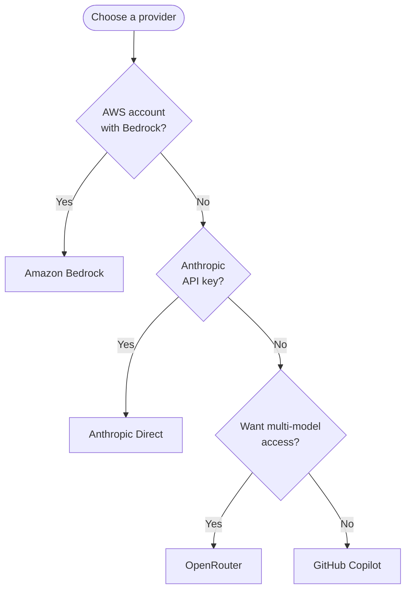
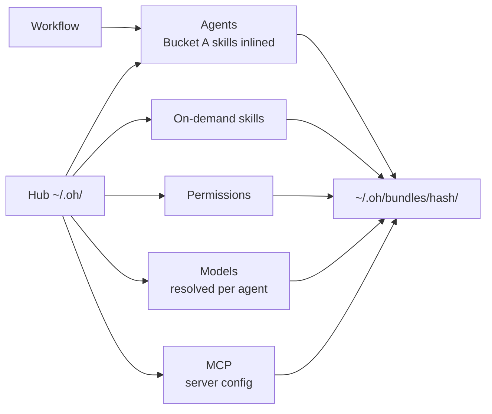
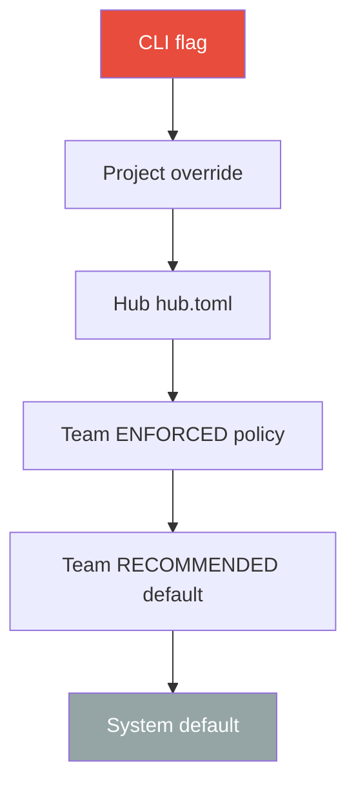

> [Lire en francais](configuration-guide.fr.md)

# Configuration Guide

This guide walks you through configuring OpenHub step by step, from the minimum viable setup to advanced team configuration. For the exhaustive reference of every configuration key, see [Configuration reference](../reference/config.en.md).

**What this guide covers:**

1. [Minimal solo setup](#1-minimal-solo-setup) -- Get started in 2 minutes
2. [Provider configuration](#2-provider-configuration) -- Set up your LLM provider
3. [Project registration](#3-project-registration) -- Register and configure projects
4. [MCP servers](#4-mcp-servers) -- Connect external tools
5. [Team configuration](#5-team-configuration) -- Multi-user collaboration
6. [Advanced configuration](#6-advanced-configuration) -- Customising workflows, instruction files, worktrees

---

## 1. Minimal Solo Setup

After running `oh init`, your hub configuration lives in `~/.oh/hub.toml`. The minimum viable configuration requires only 3 settings:

```toml
# ~/.oh/hub.toml -- minimal configuration
[cli]
language = "en"              # "en" or "fr"

[opencode]
default_provider = "anthropic"   # your LLM provider
```

That's it. Everything else has sensible defaults. The provider credentials are stored in your OS keychain (not in this file).

### File locations

| Path | Purpose |
|------|---------|
| `~/.oh/hub.toml` | Hub configuration |
| `~/.oh/oh.db` | Project registry (SQLite) |
| `~/.oh/hub/` | Embedded agents and skills |
| `~/.oh/secrets.enc` | Encrypted secrets (keychain fallback) |
| `~/.oh/bundles/<hash>/` | Session bundles (agents, skills, config) built at launch — nothing is deployed into `<project>/.opencode/` anymore |

---

## 2. Provider Configuration

### Choosing a provider



### Setting up Anthropic (simplest)

```bash
oh provider setup
# Select "Anthropic (direct API)"
# Enter your API key from console.anthropic.com
```

The key is stored in your OS keychain. To verify:

```bash
oh doctor
```

Hub.toml setting:

```toml
[opencode]
default_provider = "anthropic"
```

### Setting up Amazon Bedrock

Bedrock supports two authentication modes:

**Bearer token (API Gateway / LiteLLM):**

```bash
oh provider setup
# Select "Amazon Bedrock"
# Select "Bearer token"
# Enter your token
```

```toml
[opencode]
default_provider = "bedrock"

[provider.bedrock]
auth_mode = "bearer"
```

**AWS Profile (native Bedrock):**

```bash
oh provider setup
# Select "Amazon Bedrock"
# Select "AWS Profile"
# Enter profile name and region
```

```toml
[opencode]
default_provider = "bedrock"

[provider.bedrock]
auth_mode = "profile"
aws_profile = "my-profile"
aws_region = "us-east-1"
```

### Setting up OpenRouter

```bash
oh provider setup
# Select "OpenRouter"
# Enter your API key from openrouter.ai
```

```toml
[opencode]
default_provider = "openrouter"
```

### Setting up GitHub Copilot

```bash
oh provider setup
# Select "GitHub Copilot"
# Follow the OAuth flow
```

```toml
[opencode]
default_provider = "github-copilot"
```

### Per-project provider override

A project can use a different provider than the hub default:

```bash
oh project configure --provider bedrock
```

### Model configuration

```bash
# Set the default model for all agents
oh config model default claude-sonnet-4-6

# Set a model for a specific agent family
oh config model family planning claude-opus-4-6

# Set a model for a specific agent
oh config model agent planner claude-opus-4-6

# View current model configuration
oh config model show
```

In `hub.toml`:

```toml
[models]
default = "claude-sonnet-4-6"

[models.families]
planning = "claude-opus-4-6"

[models.agents]
reviewer = "claude-opus-4-6"
```

The model resolution follows a **10-level cascade** (first match wins), preceded by the `models:` block of the session's workflow:

```
Workflow agent > Workflow default >
Project agent > Project family > Project default >
Hub agent > Hub family > Hub default >
Team agent > Team family > Team default >
Agent frontmatter floor
```

See [Model resolution reference](../reference/model-resolution.en.md) for details.

---

## 3. Project Registration

### Adding a project

```bash
oh project add
```

Interactive wizard asks: name, path, language.

Non-interactive:

```bash
oh project add --name my-app --path ~/workspace/my-app --language typescript
```

### Listing projects

```bash
oh project list
```

### Session bundle of a project

Nothing is deployed into the project anymore (`oh deploy` removed in v5): each session starts from a bundle built at launch from its workflow.

```bash
cd ~/workspace/my-app
oh bundle show <workflow>                  # project detected from cwd
oh bundle show <workflow> -p my-project    # explicit project
oh bundle show <workflow> --budget         # context budget per agent/skill
oh bundle build <workflow>                 # build without launching
```



### Per-project settings

```bash
oh project configure --provider bedrock     # override provider
oh project configure --model claude-opus-4-6  # override model
oh project configure --language fr          # override language
```

---

## 4. MCP Servers

OpenHub includes 7 built-in MCP servers for external tool integration:

| Server | Purpose | Token needed |
|--------|---------|-------------|
| **GitLab** | Issues, MRs, pipelines | GitLab PAT |
| **GitHub** | Issues, PRs, Actions | GitHub PAT |
| **Figma** | Design files, components | Figma PAT |
| **Jira** | Issues, projects, transitions | Jira API token |
| **Linear** | Issues via GraphQL | Linear API key |
| **Google Slides** | Presentation analysis | Google OAuth |
| **Team** | Team state, claims, wiki | (no token -- local data) |

### Configuring MCP servers

```bash
oh mcp setup                 # interactive wizard
oh mcp list                  # list all servers and their status
oh mcp enable gitlab         # enable a server
oh mcp disable figma         # disable a server
oh mcp status                # detailed status of all servers
```

In `hub.toml`:

```toml
[mcp.gitlab]
enabled = true
token_key = "openhub.mcp.gitlab.token"
write_enabled = true
url = "https://gitlab.mycompany.com"

[mcp.figma]
enabled = true
token_key = "openhub.mcp.figma.token"

[mcp.jira]
enabled = false
```

### Per-project MCP override

MCP servers can be enabled/disabled per project (`oh mcp enable|setup`). At each launch, the hub settings combined with project-level overrides are put in the session bundle — no redeploy needed.

---

## 5. Team Configuration

Team features allow multiple developers to collaborate through a shared Git repository ("team-state repo") that synchronizes claims, policies, wiki, and events.

> **Solo user?** Skip this section entirely. Team features are optional and do not affect solo usage.

### Initial setup

**Step 1 -- Create a team-state repository:**

Create a new Git repository (can be on any Git host) to hold team state.

**Step 2 -- Initialize team features:**

```bash
oh team init
```

The wizard guides you through:
1. **Repository connection** -- URL of your team-state repo
2. **Global configuration** -- Default settings for all members
3. **Identity** -- Your member ID (used for claims)
4. **Notifications** -- Webhook destinations (Slack, Discord, Teams, Mattermost)
5. **Policies** -- Code review rules, branch naming, commit conventions

In `hub.toml`:

```toml
[[teams]]
id = "my-team"
name = "My Team"
enabled = true
state_repo = "git@github.com:myorg/team-state.git"
state_path = "~/.oh/team-state/my-team"
member_id = "alice"
```

### Multi-team support

You can belong to multiple teams. Each team has its own state repo:

```bash
oh teams list                # list all teams
oh teams add --repo git@... --member-id alice
oh teams remove <team-id>
```

### Team policies

Policies define enforceable rules for the team:

```bash
oh policies list             # show active policies
oh policies check            # validate current project against policies
oh policies add              # add a new policy
```

### Team conventions

```bash
oh conventions check         # validate project against team conventions
```

### Notifications

Notifications are configured in the team-state configuration file (not `hub.toml`):

```toml
# team-state config.toml
[notification]
enabled = true

[[notification.destinations]]
type = "slack"
webhook_url = "https://hooks.slack.com/..."
channel = "#dev-ai"
bot_name = "openhub"
```

Supported platforms: Slack, Discord, Microsoft Teams, Mattermost.

### Claims and collaboration

```bash
oh team claim <ticket-id>                    # claim a ticket
oh team release <ticket-id>                  # release a claim
oh team claim transfer <ticket-id> --to bob  # transfer a claim
oh team status                               # show team status
oh team activity --today                     # today's activity
oh team board                                # team kanban board
```

### Takeover briefs

When taking over someone else's work:

```bash
oh takeover-brief show <ticket-id>   # view takeover context
oh takeover-brief list               # list available briefs
oh run brief-enrich --headless -i ticket=<ticket-id>   # enrich with code analysis
```

`oh takeover-brief enrich <ticket-id>` remains a deprecated alias of `oh run brief-enrich --headless`.

### Patterns library

Share reusable patterns across the team:

```bash
oh patterns list             # list team patterns
oh patterns show <name>      # view a pattern
oh patterns add              # propose a new pattern
oh patterns validate         # validate patterns
```

---

## 6. Advanced Configuration

### Customising workflows

The `[workflow]` block of `hub.toml` no longer exists in v5: it is migrated automatically to a `feature` workflow in the team-state (see [Team workflows › Migration of the former workflow overrides](team-workflows.en.md#migration-of-the-former-workflow-overrides-v5)). To adapt a workflow (checkpoints, mode, models, limits), create a team or project layer:

```bash
oh workflow list              # available workflows (every layer)
oh workflow show feature      # resolved workflow, with the origin of its values
oh workflow edit feature      # draft, then oh workflow publish
```

See [Team workflows](team-workflows.en.md) and the [Workflows reference](../reference/workflows.en.md).

### Instruction files

`disable_native_agents` was removed in v5 (the agents of a session are those of its workflow). Only the extra instruction files remain, embedded in every agent of the session bundles:

```toml
[deploy]
instruction_files = ["docs/ARCHITECTURE.md"]
```

### Worktree configuration

```toml
[worktree]
auto_cleanup = true          # remove merged worktrees automatically
base_branch = "main"         # base branch for new worktrees
branch_pattern = "oh/%s"     # branch naming pattern (%s = worktree name)
```

### Tracker integration

Configure external tracker sync for Beads tickets:

```toml
[tracker]
enabled = true
auto_sync = true             # sync on session end
push_labels = true           # push labels to external tracker
```

### OpenCode settings

```toml
[opencode]
default_provider = "bedrock"   # opencode V2 is installed with its own tooling (v5)
```

### Secrets management

```bash
oh secrets set <key>           # store a secret in keychain (value prompted)
oh secrets get <key>           # retrieve a secret
oh secrets list                # list stored secret keys
oh secrets delete <key>        # remove a secret
```

### Plugins

`oh plugin` (global opencode V1 plugins, including RTK) is removed in v5. Plugins are declared per workflow (`plugins:`); see [Built-in workflows › Plugins and code mode](../reference/workflows.en.md#plugins-and-code-mode).

---

## Configuration Precedence

When multiple sources define the same setting, the resolution follows this order (highest priority first):



Team **ENFORCED** policies override all local settings. Team **RECOMMENDED** policies serve as defaults that can be overridden locally.

---

**Next:** Explore [Workflows](workflows.en.md) for real-world usage scenarios, or see the [Configuration reference](../reference/config.en.md) for the exhaustive list of all keys.
