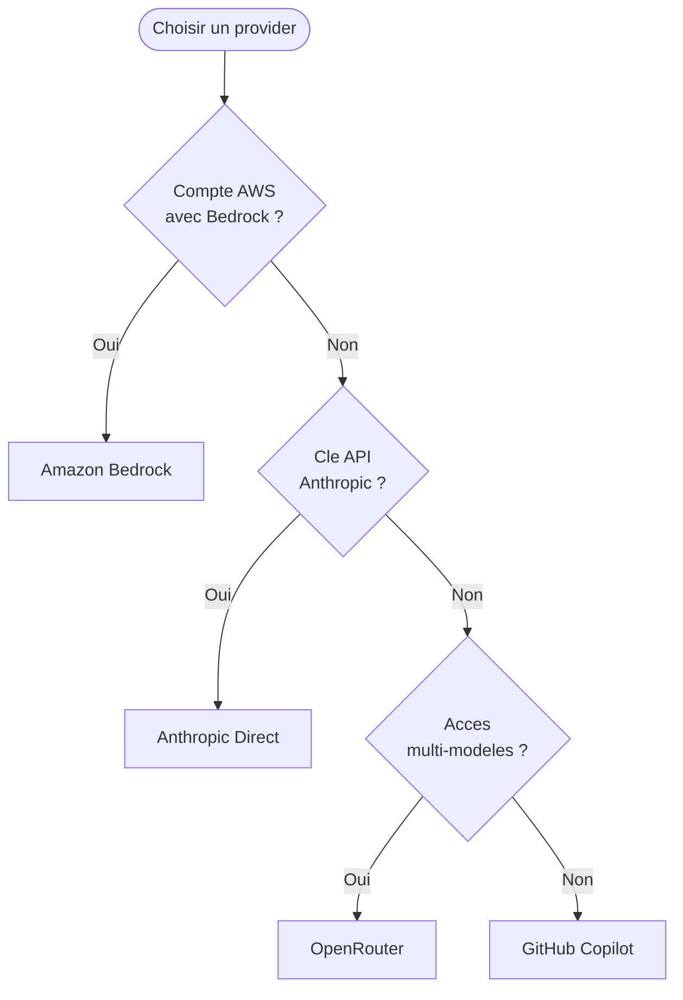
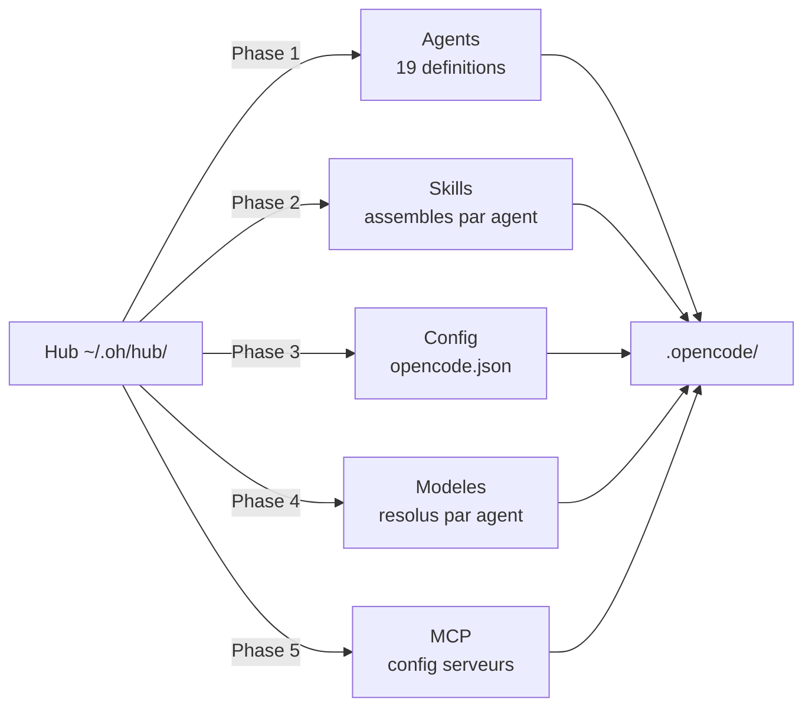
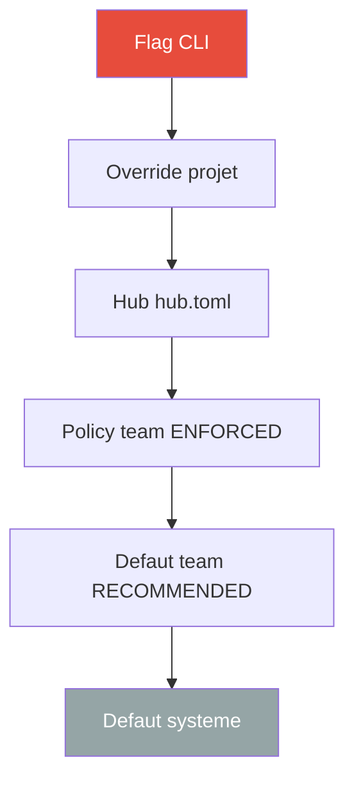

> [Read in English](configuration-guide.en.md)

# Guide de configuration

Ce guide vous accompagne pas a pas dans la configuration d'OpenHub, depuis le setup minimal jusqu'a la configuration equipe avancee. Pour la reference exhaustive de chaque cle de configuration, voir [Reference configuration](../reference/config.fr.md).

**Ce que couvre ce guide :**

1. [Setup solo minimal](#1-setup-solo-minimal) -- Demarrez en 2 minutes
2. [Configuration du provider](#2-configuration-du-provider) -- Configurer votre fournisseur LLM
3. [Enregistrement de projets](#3-enregistrement-de-projets) -- Enregistrer et configurer des projets
4. [Serveurs MCP](#4-serveurs-mcp) -- Connecter des outils externes
5. [Configuration equipe](#5-configuration-equipe) -- Collaboration multi-utilisateurs
6. [Configuration avancee](#6-configuration-avancee) -- Overrides de workflow, options de deploy, worktrees

---

## 1. Setup Solo Minimal

Apres avoir execute `oh init`, votre configuration hub vit dans `~/.oh/hub.toml`. La configuration minimale viable ne requiert que 3 parametres :

```toml
# ~/.oh/hub.toml -- configuration minimale
[cli]
language = "fr"              # "en" ou "fr"

[opencode]
default_provider = "anthropic"   # votre fournisseur LLM
```

C'est tout. Tout le reste a des valeurs par defaut sensibles. Les credentials du provider sont stockes dans votre trousseau OS (pas dans ce fichier).

### Emplacements des fichiers

| Chemin | Usage |
|--------|-------|
| `~/.oh/hub.toml` | Configuration du hub |
| `~/.oh/oh.db` | Registre de projets (SQLite) |
| `~/.oh/hub/` | Agents et skills embarques |
| `~/.oh/secrets.enc` | Secrets chiffres (fallback trousseau) |
| `<projet>/.opencode/` | Agents, skills et config deployes |

---

## 2. Configuration du Provider

### Choisir un provider



### Configurer Anthropic (le plus simple)

```bash
oh provider setup
# Selectionnez "Anthropic (API directe)"
# Entrez votre cle API depuis console.anthropic.com
```

La cle est stockee dans votre trousseau OS. Pour verifier :

```bash
oh doctor
```

Parametre hub.toml :

```toml
[opencode]
default_provider = "anthropic"
```

### Configurer Amazon Bedrock

Bedrock supporte deux modes d'authentification :

**Bearer token (API Gateway / LiteLLM) :**

```bash
oh provider setup
# Selectionnez "Amazon Bedrock"
# Selectionnez "Bearer token"
# Entrez votre token
```

```toml
[opencode]
default_provider = "bedrock"

[provider.bedrock]
auth_mode = "bearer"
```

**Profil AWS (Bedrock natif) :**

```bash
oh provider setup
# Selectionnez "Amazon Bedrock"
# Selectionnez "Profil AWS"
# Entrez le nom du profil et la region
```

```toml
[opencode]
default_provider = "bedrock"

[provider.bedrock]
auth_mode = "profile"
aws_profile = "my-profile"
aws_region = "us-east-1"
```

### Configurer OpenRouter

```bash
oh provider setup
# Selectionnez "OpenRouter"
# Entrez votre cle API depuis openrouter.ai
```

```toml
[opencode]
default_provider = "openrouter"
```

### Configurer GitHub Copilot

```bash
oh provider setup
# Selectionnez "GitHub Copilot"
# Suivez le flux OAuth
```

```toml
[opencode]
default_provider = "github-copilot"
```

### Override provider par projet

Un projet peut utiliser un provider different du defaut du hub :

```bash
oh project configure --provider bedrock
```

### Configuration des modeles

```bash
# Definir le modele par defaut pour tous les agents
oh config model default claude-sonnet-4-6

# Definir un modele pour une famille d'agents
oh config model family planning claude-opus-4-6

# Definir un modele pour un agent specifique
oh config model agent planner claude-opus-4-6

# Voir la configuration modele actuelle
oh config model show
```

Dans `hub.toml` :

```toml
[models]
default = "claude-sonnet-4-6"

[models.families]
planning = "claude-opus-4-6"

[models.agents]
reviewer = "claude-opus-4-6"
```

La resolution de modele suit une **cascade a 10 niveaux** (premier match gagne) :

```
Projet agent > Projet famille > Projet defaut >
Hub agent > Hub famille > Hub defaut >
Team agent > Team famille > Team defaut >
Plancher frontmatter agent
```

Voir [Reference resolution de modeles](../reference/model-resolution.fr.md) pour les details.

---

## 3. Enregistrement de Projets

### Ajouter un projet

```bash
oh project add
```

L'assistant interactif demande : nom, chemin, langage.

Non-interactif :

```bash
oh project add --name my-app --path ~/workspace/my-app --language typescript
```

### Lister les projets

```bash
oh project list
```

### Deployer vers un projet

```bash
cd ~/workspace/my-app
oh deploy                    # deployer depuis le repertoire courant
oh deploy -p my-project      # projet explicite
oh deploy --diff             # previsualiser les changements
oh deploy --check            # verifier si le deploy est necessaire (exit 1 si obsolete)
```



### Parametres par projet

```bash
oh project configure --provider bedrock       # override provider
oh project configure --model claude-opus-4-6  # override modele
oh project configure --language fr            # override langue
```

---

## 4. Serveurs MCP

OpenHub inclut 7 serveurs MCP integres pour l'integration d'outils externes :

| Serveur | Usage | Token requis |
|---------|-------|-------------|
| **GitLab** | Issues, MR, pipelines | PAT GitLab |
| **GitHub** | Issues, PR, Actions | PAT GitHub |
| **Figma** | Fichiers design, composants | PAT Figma |
| **Jira** | Issues, projets, transitions | Token API Jira |
| **Linear** | Issues via GraphQL | Cle API Linear |
| **Google Slides** | Analyse de presentations | OAuth Google |
| **Team** | Etat equipe, claims, wiki | (pas de token -- donnees locales) |

### Configurer les serveurs MCP

```bash
oh mcp setup                 # assistant interactif
oh mcp list                  # lister tous les serveurs et leur statut
oh mcp enable gitlab         # activer un serveur
oh mcp disable figma         # desactiver un serveur
oh mcp status                # statut detaille de tous les serveurs
```

Dans `hub.toml` :

```toml
[mcp.gitlab]
enabled = true
token_key = "openhub.mcp.gitlab.token"
write_enabled = true
url = "https://gitlab.mycompany.com"

[mcp.figma]
enabled = true
token_key = "openhub.mcp.figma.token"

[mcp.jira]
enabled = false
```

### Override MCP par projet

Les serveurs MCP peuvent etre actives/desactives par projet pendant `oh deploy`. La configuration projet dans `opencode.json` est generee a partir des parametres hub combines aux overrides projet.

---

## 5. Configuration Equipe

Les fonctionnalites equipe permettent a plusieurs developpeurs de collaborer via un depot Git partage ("team-state repo") qui synchronise les claims, policies, wiki et evenements.

> **Utilisateur solo ?** Passez cette section entierement. Les fonctionnalites equipe sont optionnelles et n'affectent pas l'usage solo.

### Configuration initiale

**Etape 1 -- Creer un depot team-state :**

Creez un nouveau depot Git (sur n'importe quel hebergeur Git) pour contenir l'etat equipe.

**Etape 2 -- Initialiser les fonctionnalites equipe :**

```bash
oh team init
```

L'assistant vous guide a travers :
1. **Connexion au depot** -- URL de votre depot team-state
2. **Configuration globale** -- Parametres par defaut pour tous les membres
3. **Identite** -- Votre member ID (utilise pour les claims)
4. **Notifications** -- Destinations webhook (Slack, Discord, Teams, Mattermost)
5. **Policies** -- Regles de revue de code, nommage de branches, conventions de commits

Dans `hub.toml` :

```toml
[[teams]]
id = "my-team"
name = "Mon Equipe"
enabled = true
state_repo = "git@github.com:myorg/team-state.git"
state_path = "~/.oh/team-state/my-team"
member_id = "alice"
```

### Support multi-equipe

Vous pouvez appartenir a plusieurs equipes. Chaque equipe a son propre depot :

```bash
oh teams list                # lister toutes les equipes
oh teams add --repo git@... --member-id alice
oh teams remove <team-id>
```

### Policies d'equipe

Les policies definissent des regles applicables a l'equipe :

```bash
oh policies list             # afficher les policies actives
oh policies check            # valider le projet courant contre les policies
oh policies add              # ajouter une nouvelle policy
```

### Conventions d'equipe

```bash
oh conventions check         # valider le projet contre les conventions d'equipe
```

### Notifications

Les notifications sont configurees dans le fichier de configuration team-state (pas dans `hub.toml`) :

```toml
# team-state config.toml
[notification]
enabled = true

[[notification.destinations]]
type = "slack"
webhook_url = "https://hooks.slack.com/..."
channel = "#dev-ai"
bot_name = "openhub"
```

Plateformes supportees : Slack, Discord, Microsoft Teams, Mattermost.

### Claims et collaboration

```bash
oh team claim <ticket-id>                    # revendiquer un ticket
oh team release <ticket-id>                  # liberer un claim
oh team claim transfer <ticket-id> --to bob  # transferer un claim
oh team status                               # afficher l'etat de l'equipe
oh team activity --today                     # activite du jour
oh team board                                # kanban d'equipe
```

### Takeover briefs

Lors de la reprise du travail de quelqu'un d'autre :

```bash
oh takeover-brief show <ticket-id>   # voir le contexte de reprise
oh takeover-brief list               # lister les briefs disponibles
oh takeover-brief enrich <ticket-id> # enrichir avec l'analyse du code
```

### Bibliotheque de patterns

Partager des patterns reutilisables au sein de l'equipe :

```bash
oh patterns list             # lister les patterns d'equipe
oh patterns show <name>      # voir un pattern
oh patterns add              # proposer un nouveau pattern
oh patterns validate         # valider les patterns
```

---

## 6. Configuration Avancee

### Overrides de workflow

Override du comportement de workflow par defaut dans `hub.toml` :

```toml
[workflow]
# Les overrides de workflow sont appliques pendant le deploy
```

### Options de deploy

Desactiver des agents natifs specifiques pendant le deploy :

```toml
[deploy]
disable_native_agents = ["benchmarker", "test-generator"]
```

### Configuration worktree

```toml
[worktree]
auto_cleanup = true          # supprimer les worktrees merges automatiquement
base_branch = "main"         # branche de base pour les nouveaux worktrees
branch_pattern = "oh/%s"     # pattern de nommage de branche (%s = nom worktree)
```

### Integration tracker

Configurer la synchronisation tracker externe pour les tickets Beads :

```toml
[tracker]
enabled = true
auto_sync = true             # synchroniser en fin de session
push_labels = true           # pousser les labels vers le tracker externe
```

### Parametres OpenCode

```toml
[opencode]
default_provider = "bedrock"   # opencode V2 est installé avec son propre outil (v5)
```

### Gestion des secrets

```bash
oh secrets set <key> <value>   # stocker un secret dans le trousseau
oh secrets get <key>           # recuperer un secret
oh secrets list                # lister les cles de secrets stockes
oh secrets delete <key>        # supprimer un secret
```

### Gestion des plugins

```bash
oh plugin list               # lister les plugins installes
oh plugin install <name>     # installer un plugin
oh plugin remove <name>      # supprimer un plugin
oh plugin status             # afficher le statut des plugins
```

---

## Precedence de Configuration

Quand plusieurs sources definissent le meme parametre, la resolution suit cet ordre (priorite la plus haute en premier) :



Les policies **ENFORCED** de l'equipe overrident tous les parametres locaux. Les policies **RECOMMENDED** de l'equipe servent de defauts qui peuvent etre overrides localement.

---

**Suite :** Explorez les [Workflows](workflows.fr.md) pour des scenarios d'usage reels, ou consultez la [Reference configuration](../reference/config.fr.md) pour la liste exhaustive de toutes les cles.
