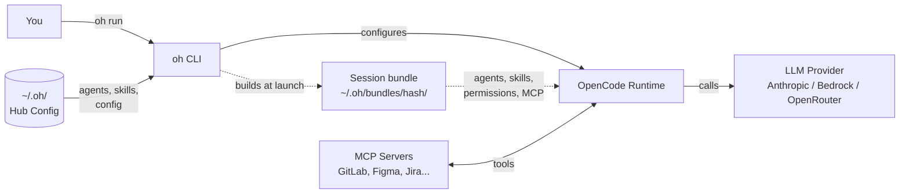

> [Lire en francais](getting-started.fr.md)

# Getting Started

## What is OpenHub?

OpenHub (`oh`) is a central hub that manages AI coding assistants across your projects. It provides **19 specialized AI agents** organized into 7 families (planning, development, audit, quality, design, documentation, utility) that collaborate to handle everything from feature planning to code review.



**Key concepts** (see the full [Glossary](../reference/glossary.en.md)):
- **Hub** (`~/.oh/`) -- central configuration and agent/skill store
- **Agent** -- a specialized AI role (orchestrator, developer, reviewer, etc.)
- **Skill** -- a protocol document giving domain expertise to an agent
- **Session bundle** -- agents, skills, permissions and MCP of a session, built at launch from its workflow outside the project (`~/.oh/bundles/<hash>/`); replaces deploy (removed in v5)
- **MCP Server** -- external tool integration (GitLab, Figma, Jira, etc.)

> **New here?** Start with the [5-minute tutorial](tutorial.en.md) for a hands-on walkthrough.

This guide is the comprehensive command reference. For configuration details, see the [Configuration guide](configuration-guide.en.md).

---

## Prerequisites

| Tool | Purpose | Required |
|------|---------|----------|
| **git** | Version control | Yes |
| **opencode V2** (2.0.0 or later) | AI coding agent | Yes — install it with its own tool (`brew install anomalyco/tap/opencode`, or https://opencode.ai); checked by `oh init` and `oh doctor` |
| **bd** | Beads ticket tracker | No (for the `ticket` workflow and `oh board`) |

No Node.js, jq, sqlite3, bun, or Python needed. The Go binary is self-contained.

## Installation

**Supported platforms:** macOS (darwin) and Linux — amd64 and arm64.

**Homebrew (recommended — macOS/Linux):**

```bash
brew install datichb/tap/openhub
```

**Curl script (macOS/Linux):**

```bash
curl -fsSL https://raw.githubusercontent.com/datichb/openhub/main/install.sh | bash
```

**From source:**

```bash
cd cli && go install .
```

## First-time Setup

```bash
oh init
```

This interactive wizard in 3 steps will:

**[1/3] Hub Configuration:**
- Display a preamble with requirements (provider, MCP tokens)
- Ask your preferred language (fr/en)
- Check that opencode V2 is installed (oh no longer installs opencode)
- Choose default LLM provider (Bedrock, Anthropic, OpenRouter, GitHub Copilot)
- Auto-detect existing credentials and offer to use them or configure new ones

**[2/3] MCP Servers (optional):**
- Offer to configure MCP services (Figma, GitLab, Google Slides)
- For each selected service: prompt for token and store in keychain
- Services without token are skipped (configurable later via `oh mcp setup`)

**[3/3] First Project (optional):**
- Offer to register a first project
- If yes: launches the project wizard (name, path, language, MCP)
- If no: initialization complete (`oh project add` available later)

Hub content (agents and skills) is automatically extracted to `~/.oh/hub/` from the binary.

## Register a Project

If you have additional projects after init:

```bash
oh project add
```

Or non-interactively:

```bash
oh project add --name my-app --path ~/workspace/my-app --language typescript
```

## Session Bundle

Nothing is deployed into the project anymore (`oh deploy` / `oh sync` removed in v5). Each session starts from a session bundle built at launch outside the project (`~/.oh/bundles/<hash>/`) from its workflow: agents, skills, permissions, MCP servers, provider and model. To inspect it:

```bash
oh bundle show <workflow>                  # auto-detect project from cwd
oh bundle show <workflow> -p my-project    # explicit project
oh bundle show <workflow> --budget         # include the context budget
oh bundle build <workflow>                 # build the bundle without launching
```

Projects deployed with an older version: clean up the leftovers (`.opencode/agents`, `.opencode/skills`, oh keys in `opencode.json`…) with `oh migrate deploy-cleanup --dry-run` then `oh migrate deploy-cleanup`.

## Start a Session

Each session runs a **workflow** (see [Built-in workflows](../reference/workflows.en.md)):

```bash
oh run                       # project default workflow, auto-detect project
oh run feature -p my-project # explicit workflow and project
oh run feature -i request="explain..."   # with an initial request
oh run libre --agent orchestrator        # free session with the agent of your choice
oh run ticket --tickets <id> # implement a Beads ticket
oh run onboarding            # create project wiki
oh run feature --recap       # show configuration recap + confirmation
oh session attach <session-id>   # reopen an existing session
```

`oh start` is still available as a deprecated alias (`oh start` → `oh run feature`); see [Migrating to oh v5](migration-v5.en.md).

The start flow:

1. Resolves project (from cwd or `--project` flag)
2. Resolves the workflow, provider and bearer token
3. Builds the session bundle (outside the project)
4. Launches directly (use `--recap` to show summary + confirmation)
5. Starts the session on an opencode server and opens its interface

## Quick Start

```bash
oh run                       # auto-detect project, default workflow, launch immediately
```

## Day-to-Day Commands

### Essential

```bash
oh run <workflow>            # launch AI session
oh session list              # running, waiting and sleeping sessions
oh bundle show <workflow>    # inspect the session bundle of a workflow
oh status                    # show hub and current project status
oh doctor                    # system health check
```

### Development

```bash
oh run ticket                # pick a ticket, launches orchestrator-dev
oh run ticket --tickets a,b  # one session per ticket
oh run audit -i type=security    # code audit
oh run review                # code review
oh run debug -i issue="crash..." # debug session
```

### Infrastructure

```bash
oh migrate deploy-cleanup    # remove leftovers of former deployments (oh < v5)
oh provider setup            # configure provider credentials
oh mcp setup                 # configure MCP server tokens
oh metrics                   # per-agent usage and cost stats
oh serve                     # start local web dashboard on localhost:8080
oh                           # interactive TUI dashboard (no arguments)
oh board                     # kanban board (requires bd)
oh export                    # export all hub data to a backup file
oh repair                    # repair corrupted database or config state
```

### Team (optional)

```bash
oh team init                 # set up team collaboration
oh team claim <ticket-id>    # claim a ticket for yourself
oh team release <ticket-id>  # release a claimed ticket
oh team status               # show team status
oh team sync-tracker         # sync claims back to external tracker
```

## Development Workflow

```bash
oh run ticket                # pick a ticket, launches orchestrator-dev
oh run ticket --tickets a,b  # one session per ticket (one worktree per session)
oh run audit -i type=security    # code audit
oh run review                # code review
oh run debug -i issue="crash on login"  # debug session
```

The former commands `oh start --dev`, `oh audit`, `oh review` and `oh debug` are deprecated aliases of these commands.

## Worktree Management

```bash
oh run feature --location new   # creates worktree and launches there
oh worktree list             # list active worktrees
oh worktree cleanup          # remove merged worktrees
```

## Configuration

```bash
oh config list               # show all config
oh config set opencode.default_provider anthropic
oh config language fr        # switch to French
oh config websearch enable   # enable web search for agents
```

## Community Skills

Install community skills from the index or a Git URL:

```bash
oh skill add <index-name>            # install from community index
oh skill add https://github.com/...  # install from Git URL
oh skill list                        # list installed community skills
oh skill search <query>              # search the community index
```

See [skills.en.md](../architecture/skills.en.md#community-skills-marketplace) for details.

## Upgrading

```bash
brew upgrade openhub          # upgrade oh itself (Homebrew)
oh upgrade oh                 # upgrade oh itself (non-Homebrew)
```

opencode is upgraded with its own tool (`oh upgrade opencode` is removed in v5).

## Uninstalling

```bash
brew uninstall openhub
rm -rf ~/.oh                 # remove configuration and database
```

## Troubleshooting

Run diagnostics:

```bash
oh doctor
```

`oh doctor` checks:
- `oh` version (latest available vs installed)
- `opencode` binary presence and version (opencode V2 required)
- Provider credentials
- MCP server connectivity
- Project registry integrity

Common issues:

- **opencode not found or V1** — install opencode V2 with its own tool (see [Migrating to oh v5](migration-v5.en.md)), then run `oh doctor` again
- **Missing provider credentials** — run `oh provider setup`
- **MCP server errors** — verify tokens with `oh mcp setup`
- **Project not detected** — ensure you're in a registered project directory (`oh project list`)
- **Corrupted state** — run `oh repair` to attempt automatic recovery
