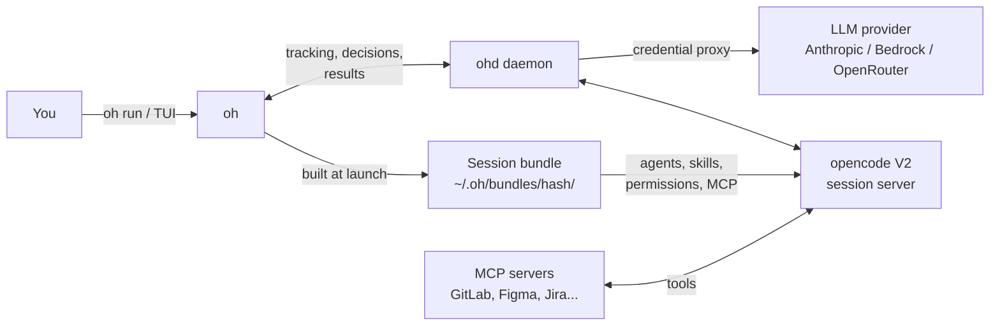

> [Lire en francais](getting-started.fr.md)

# Getting Started

## What is OpenHub?

OpenHub (`oh`) launches and drives AI coding agent sessions on your projects. Each session follows a **workflow** (for example `ticket`: implement a ticket, `review`: review a branch) and runs in opencode V2. oh is the **control tower**: it prepares the session, follows it, shows you the decisions to take and collects the results. opencode is the **cockpit**: the window where the agent works. Closing opencode does not stop the session.



**Key concepts** (see the full [Glossary](../reference/glossary.en.md)):
- **Workflow** -- what a session does: entry agent, allowed agents, inputs, checkpoints, modes (`manuel`, `semi-auto`, `auto`). 12 workflows are shipped (see [Shipped workflows](../reference/workflows.en.md)).
- **Session** -- one run of a workflow on a project. It runs on an `opencode serve` server managed by oh.
- **Session bundle** -- the agents, skills, permissions and MCP of a session, built at launch outside the project (`~/.oh/bundles/<hash>/`). Nothing is copied into the project. Only the bundle's agents are visible ("closed world").
- **Decision** -- what the session waits for from you: `⏸` checkpoint, `?` question, `!` permission, `$` budget, `✗` error.
- **`ohd` daemon** -- runs in the background: it keeps your LLM keys on the machine, follows the sessions and sends the notifications.

> **New here?** The [tutorial](tutorial.en.md) goes from installation to an implemented, then reviewed, ticket.

Coming from an earlier version of oh? Read [Migrating to oh v5](migration-v5.en.md) first.

---

## Prerequisites

| Tool | Purpose | Required |
|------|---------|----------|
| **git** | Version control, worktrees | Yes |
| **opencode V2** (2.0.0 or later) | Runs the sessions | Yes — install it with its own tool; oh does not install it |
| **bd** | Beads tickets (`ticket` workflow, board) | No |
| **Colima, Podman or Docker** | Container sessions | No |

The `oh` binary is self-contained (no Node.js, Python or external database).

## Installation

**Supported platforms:** macOS and Linux (amd64 and arm64). On Windows, only local sessions are supported.

### 1. Install oh

**Homebrew (recommended):**

```bash
brew install datichb/tap/openhub
```

**curl script:**

```bash
curl -fsSL https://raw.githubusercontent.com/datichb/openhub/main/install.sh | bash
```

**From source:**

```bash
cd cli && go install .
```

### 2. Install opencode V2

```bash
brew install anomalyco/tap/opencode    # or see https://opencode.ai
opencode --version                     # must print 2.x
```

opencode V1 is no longer supported: oh refuses to launch a session, with a clear message. See [Migrating to oh v5](migration-v5.en.md).

## Initial setup: `oh init`

```bash
oh init
```

The wizard opens in the terminal. The first page ("Welcome") offers three paths:

| Path | What it asks |
|------|--------------|
| **Solo developer** | AI provider, first project, MCP integrations; team features are skipped and a **solo** workflow space is created for the project |
| **Team member** | create or join a team; the AI provider comes from the team configuration |
| **Full setup** | every step, one by one |

The steps, in order:

1. **Language** -- interface language (French or English). The only required step.
2. **Provider** -- Bedrock, Anthropic, OpenRouter or GitHub Copilot, then the key (stored in the system keychain).
3. **Team** -- the space that holds your workflows: "Create a new team", "Rejoin an existing team" (team-state repository) or "Solo space (local workflows)". If the team has a tracker, the wizard offers to configure it.
4. **First project** -- name and path (the current directory is suggested), attachment to the team.
5. **MCP Integrations** -- GitLab, Figma, Google Slides… with their token. All optional: `oh mcp setup` later.

The hub content (agents, skills, workflows) is extracted to `~/.oh/hub/`. At the end, check the installation:

```bash
oh doctor
```

`oh doctor` checks opencode V2, the daemon, git, the terminal, the container engine and leftovers of former deployments.

For Beads: initialize the project tickets with oh (`oh project add`, or the TUI `board init` command), which runs `bd init --skip-hooks --skip-agents --setup-exclude`: nothing is added to the project repository ("zero impact").

> **`bd init` run by hand** (bd 1.3) also writes agent files (`AGENTS.md`, `CLAUDE.md`, the `.claude/`, `.codex/`, `.cursor/`, `.agents/` folders), a `.gitignore` block, git hooks, and **commits it all** ("bd init: initialize beads issue tracking"). oh takes it back on its own when it registers the project (`oh project add`, init wizard, TUI) or initializes Beads in it: it removes only what bd wrote (blocks managed by bd in your files, its hook entries, its own files), moves the `.gitignore` lines to `.git/info/exclude` and **undoes bd's commit when it is not pushed** (the files stay in the folder). What is already committed or pushed is left in place and reported by `oh doctor`; `oh doctor --fix` removes it from the files after a confirmation (to commit afterwards). The `.beads/hooks` hooks stay: oh routes them through its gateway. oh sessions need none of these files: the Beads instructions are in the session bundle.

## Registering more projects

```bash
oh project add                                   # wizard
oh project add --name my-app --path ~/workspace/my-app --language typescript
```

## First launch

### From the command line

From the project directory:

```bash
oh run quick -i request="Add a test for parseDate"   # small change, no checkpoint
oh run feature                                        # a complete feature (plan, dev, review)
oh run                                                # the project default workflow
oh run feature --recap                                # show the recap, then confirm
```

oh resolves the workflow (hub, team, project layers), builds the session bundle, picks the location (an automatic worktree when another session already writes in the directory), starts the opencode server and opens the session window: a new iTerm2 or Terminal.app tab, tmux, or the browser, depending on your Settings.

```
▸ Preparing workflow quick…
✔ Session opened (iterm): ses_2f9c1a7b
```

### From the TUI

```bash
oh
```

On the home screen, the **Start** section lists your pinned workflows (★), the recent ones and "All workflows". `Enter` opens the **launch form**: Inputs → Options → Recap; `Ctrl+S` launches. See [Using the TUI](tui-usage.en.md).

## Session bundle

Nothing is deployed into the project anymore (`oh deploy` / `oh sync` removed in v5). To see what a session will receive:

```bash
oh bundle show <workflow>                  # project detected from the current directory
oh bundle show <workflow> -p my-project    # explicit project
oh bundle show <workflow> --budget         # estimated context budget
oh bundle build <workflow>                 # build the bundle without launching
```

Projects deployed with an earlier version: remove the leftovers (`.opencode/agents`, `.opencode/skills`, oh keys in `opencode.json`…) with `oh migrate deploy-cleanup --dry-run` then `oh migrate deploy-cleanup`, or the TUI cleanup screen (`cleanup`).

## Following the session

The opencode window opens next to oh: you talk to the agent there as usual. Meanwhile, oh follows the session:

- **TUI, Sessions view** (`sessions` in the omnibar): sessions To handle, Running, Sleeping, Finished. `t` shows the live feed (current agent, tools, cost). The bottom bar shows `● N ⏸ M` everywhere: live sessions, waiting decisions.
- **CLI**:

```bash
oh session list                  # running, waiting, sleeping sessions
oh session follow <id>           # live feed, read only (Ctrl+C)
oh session attach <id>           # reopen the opencode window (resumes a sleeping session)
```

An id may be shortened (`oh session attach 2f9c`). A session with no activity and no waiting decision goes to sleep after 5 minutes; `oh session attach` resumes it on the same bundle. See [v5 sessions](sessions-v5.en.md).

## Deciding

When the agent needs you, a decision shows up: system notification, line in "To handle", `⏸` badge.

| Decision | Example | TUI (Sessions view) | CLI |
|----------|---------|---------------------|-----|
| `⏸` checkpoint | `cp-2 "Commit or fix"` | `Enter` → card → **Decide**: Validate / Fix first / Other instruction; `y` validates | `oh session approve <id>` (`--decision once\|fix\|other\|reject`, `-m "…"`) |
| `?` question | "MVP scope?" | `Enter` → form | `oh session answer <id> --field key=value` |
| `!` permission | `shell npm run e2e` | `y` once, `n` reject, `Enter` for the card | `oh session approve <id> --decision once\|always\|reject` |
| `$` budget, `✗` error | session budget reached | `x` dismiss | `oh session dismiss <id>` |

```bash
oh session inbox                 # every waiting decision
```

You may also answer in the opencode window or the browser: **the first answer wins**, oh tells you when the decision was already taken.

## Finishing

```bash
oh session results <id>          # changed files, branch, cost
oh session results <id> --mr     # merge request description (Markdown)
oh session results <id> --patch  # full diff
oh session stop <id>             # stop the session
```

In the Sessions view, `o` shows the results and the MR description, and `e` (**Chain with…**) offers the workflows that take the session outputs (for example `review` on the working branch); the launch form opens prefilled.

When you quit the TUI while a session works, oh asks for each one: finish the step then sleep, background, or stop.

## Going further

### Several tickets

```bash
oh run ticket --tickets bd-41,bd-42,bd-43    # one session per ticket, one worktree per session, a single server
oh run ticket --tickets bd-41,bd-42 --one-session
```

### Container

```bash
oh run ticket --tickets bd-42 --runtime container
```

The agent's commands run in an image built from the project's dev Dockerfile; Beads and the keys stay on the machine. See [Container sessions](container.en.md).

### Remote (GitLab CI)

```bash
oh remote setup
oh run ticket --tickets bd-42 --runtime remote
oh session fetch <id>      # fetch the result
oh session resolve <id>    # replay the Beads journal
```

See [Remote execution](remote-runners.en.md).

### Team workflows

The workflows of the team (or of your solo space) live in the team-state repository: `oh workflow new|edit|publish`, or the TUI `workflows` catalogue. See [Team workflows](team-workflows.en.md) and the [command reference](../reference/cli-workflows.en.md).

### Restrictions

Off by default: max working sessions, per-session and daily budget, memory cap, allowed models.

```bash
oh budget show
oh budget set session_budget_usd 5
```

Or **Settings → Session restrictions** in the TUI. See [v5 sessions › Restrictions](sessions-v5.en.md#restrictions).

## Daily commands

```bash
oh                           # TUI (control tower)
oh run <workflow>            # launch a session
oh session list              # follow your sessions
oh session inbox             # waiting decisions
oh bundle show <workflow>    # inspect a workflow's bundle
oh workflow list             # workflows available for the project
oh status                    # hub and current project status
oh doctor                    # diagnostics
```

```bash
oh run ticket                # pick a Beads ticket
oh run audit -i type=security
oh run review -i branch=feat/export
oh run debug -i issue="crash on login"
oh run onboarding            # create the project wiki
oh run libre --agent orchestrator
```

The former `oh start`, `oh audit`, `oh review` and `oh debug` commands are deprecated aliases of `oh run feature|audit|review|debug`.

```bash
oh provider setup            # provider credentials
oh mcp setup                 # MCP server tokens
oh config language en        # language
oh worktree list             # active worktrees
oh team status               # team status
oh daemon status             # daemon status
```

## Updating

```bash
brew upgrade openhub          # Homebrew
oh upgrade oh                 # outside Homebrew
```

opencode is updated with its own tool (`oh upgrade opencode` is removed in v5).

## Uninstalling

```bash
oh daemon stop
brew uninstall openhub
rm -rf ~/.oh                 # configuration, database and session bundles
```

## Troubleshooting

```bash
oh doctor
```

- **opencode missing or V1** -- install opencode V2 (see [Migrating to oh v5](migration-v5.en.md)), then `oh doctor`.
- **Missing provider credentials** -- `oh provider setup`.
- **MCP errors** -- check the tokens with `oh mcp setup`.
- **Project not detected** -- run from a registered project (`oh project list`) or add `-p <project>`.
- **The session does not start (isolation)** -- an agent outside the bundle is visible: `oh doctor`, then `oh migrate deploy-cleanup` if leftovers of former deployments are reported.
- **Corrupted state** -- `oh repair`.

See also [Troubleshooting](troubleshooting.en.md).
