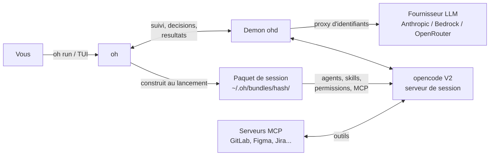

> [Read in English](getting-started.en.md)

# Demarrage rapide

## Qu'est-ce qu'OpenHub ?

OpenHub (`oh`) lance et pilote des sessions d'agents IA de code sur vos projets. Chaque session suit un **workflow** (par exemple `ticket` : implementer un ticket, `review` : relire une branche) et tourne dans opencode V2. oh est la **tour de controle** : il prepare la session, la suit, vous presente les decisions a prendre et recupere les resultats. opencode est la **cabine** : la fenetre ou l'agent travaille. Fermer opencode n'arrete pas la session.



**Concepts cles** (voir le [Glossaire](../reference/glossary.fr.md) complet) :
- **Workflow** -- ce que fait une session : agent d'entree, agents autorises, entrees, checkpoints, modes (`manuel`, `semi-auto`, `auto`). 12 workflows sont livres (voir [Workflows livres](../reference/workflows.fr.md)).
- **Session** -- une execution d'un workflow sur un projet. Elle tourne sur un serveur `opencode serve` gere par oh.
- **Paquet de session** -- agents, skills, permissions et MCP d'une session, construits au lancement hors du projet (`~/.oh/bundles/<hash>/`). Rien n'est copie dans le projet. Seuls les agents du paquet sont visibles (« monde ferme »).
- **Decision** -- ce que la session attend de vous : `⏸` checkpoint, `?` question, `!` permission, `$` budget, `✗` erreur.
- **Demon `ohd`** -- tourne en arriere-plan : il garde vos cles LLM sur la machine, suit les sessions et envoie les notifications.

> **Nouveau ici ?** Le [tutoriel](tutorial.fr.md) va de l'installation a un ticket implemente puis relu.

Vous venez d'une version precedente d'oh ? Lisez d'abord [Migrer vers oh v5](migration-v5.fr.md).

---

## Prerequis

| Outil | Usage | Requis |
|-------|-------|--------|
| **git** | Controle de version, worktrees | Oui |
| **opencode V2** (2.0.0 ou plus) | Execute les sessions | Oui — a installer avec son propre outil ; oh ne l'installe pas |
| **bd** | Tickets Beads (workflow `ticket`, board) | Non |
| **Colima, Podman ou Docker** | Sessions en conteneur | Non |

Le binaire `oh` est autonome (pas de Node.js, Python ni base externe).

## Installation

**Plateformes supportees :** macOS et Linux (amd64 et arm64). Sous Windows, seules les sessions locales sont prises en charge.

### 1. Installer oh

**Homebrew (recommande) :**

```bash
brew install datichb/tap/openhub
```

**Script curl :**

```bash
curl -fsSL https://raw.githubusercontent.com/datichb/openhub/main/install.sh | bash
```

**Depuis les sources :**

```bash
cd cli && go install .
```

### 2. Installer opencode V2

```bash
brew install anomalyco/tap/opencode    # ou voir https://opencode.ai
opencode --version                     # doit afficher 2.x
```

opencode V1 n'est plus pris en charge : oh refuse de lancer une session avec un message clair. Voir [Migrer vers oh v5](migration-v5.fr.md).

## Configuration initiale : `oh init`

```bash
oh init
```

L'assistant s'ouvre dans le terminal. La premiere page (« Bienvenue ») propose trois parcours :

| Parcours | Ce qui est demande |
|----------|--------------------|
| **Développeur solo** | fournisseur IA, premier projet, integrations MCP ; les fonctions d'equipe sont ignorees et un espace de workflows **solo** est cree pour le projet |
| **Membre d'équipe** | creer ou rejoindre une equipe ; le fournisseur IA vient de la configuration de l'equipe |
| **Configuration complète** | toutes les etapes une par une |

Les etapes, dans l'ordre :

1. **Langue** -- langue de l'interface (francais ou anglais). Seule etape obligatoire.
2. **Fournisseur IA** -- Bedrock, Anthropic, OpenRouter ou GitHub Copilot, puis la cle (rangee dans le trousseau systeme).
3. **Équipe** -- l'espace qui porte vos workflows : « Créer une nouvelle équipe », « Rejoindre une équipe existante » (depot team-state) ou « Espace solo (workflows locaux) ». Si l'equipe a un tracker, l'assistant propose de le configurer.
4. **Premier projet** -- nom et chemin (le dossier courant est propose), rattachement a l'equipe.
5. **Intégrations MCP** -- GitLab, Figma, Google Slides… avec leur jeton. Tout est facultatif : `oh mcp setup` plus tard.

Le contenu du hub (agents, skills, workflows) est extrait dans `~/.oh/hub/`. A la fin, verifiez l'installation :

```bash
oh doctor
```

`oh doctor` controle opencode V2, le demon, git, le terminal, le moteur de conteneurs et les restes d'anciens deploiements.

Pour Beads : initialisez les tickets du projet avec oh (`oh project add`, ou la commande `board init` de la TUI), qui lance `bd init --skip-hooks --skip-agents --setup-exclude` : rien n'est ajoute au depot du projet (« zero impact »).

> **`bd init` lance a la main** (bd 1.3) ecrit aussi des fichiers d'agents (`AGENTS.md`, `CLAUDE.md`, les dossiers `.claude/`, `.codex/`, `.cursor/`, `.agents/`), un bloc dans `.gitignore`, des hooks git, et **commite le tout** (« bd init: initialize beads issue tracking »). oh le reprend tout seul quand il enregistre le projet (`oh project add`, assistant d'init, TUI) ou y initialise Beads : il retire seulement ce que bd a ecrit (blocs geres par bd dans vos fichiers, ses entrees de hooks, ses propres fichiers), deplace les lignes du `.gitignore` dans `.git/info/exclude` et **annule le commit de bd s'il n'est pas pousse** (les fichiers restent dans le dossier). Ce qui est deja commite ou pousse est laisse en place et signale par `oh doctor` ; `oh doctor --fix` le retire des fichiers apres confirmation (a commiter ensuite). Les hooks de `.beads/hooks` restent : oh les fait passer par sa passerelle. Les sessions d'oh n'ont besoin d'aucun de ces fichiers : les consignes Beads sont dans le paquet de session.

## Enregistrer d'autres projets

```bash
oh project add                                   # assistant
oh project add --name my-app --path ~/workspace/my-app --language typescript
```

## Premier lancement

### En ligne de commande

Depuis le dossier du projet :

```bash
oh run quick -i request="Ajoute un test pour parseDate"   # petite modification, sans checkpoint
oh run feature                                             # une fonctionnalite complete (plan, dev, review)
oh run                                                     # workflow par defaut du projet
oh run feature --recap                                     # afficher le recapitulatif, puis confirmer
```

oh resout le workflow (couches hub, equipe, projet), construit le paquet de session, choisit l'emplacement (un worktree automatique si une autre session ecrit deja dans le dossier), demarre le serveur opencode et ouvre la fenetre de session : nouvel onglet iTerm2 ou Terminal.app, tmux, ou navigateur selon vos Reglages.

```
▸ Préparation du workflow quick…
✔ Session ouverte (iterm) : ses_2f9c1a7b
```

### Depuis la TUI

```bash
oh
```

Sur l'accueil, la section **Démarrer** liste vos workflows epingles (★), les recents et « Tous les workflows ». `Entree` ouvre la **fiche de lancement** : Entrées → Options → Récap ; `Ctrl+S` lance. Voir [Utiliser le TUI](tui-usage.fr.md).

## Paquet de session

Plus rien n'est deploye dans le projet (`oh deploy` / `oh sync` supprimes en v5). Pour voir ce qu'une session recevra :

```bash
oh bundle show <workflow>                  # projet detecte depuis le dossier courant
oh bundle show <workflow> -p my-project    # projet explicite
oh bundle show <workflow> --budget         # budget de contexte estime
oh bundle build <workflow>                 # construire le paquet sans lancer
```

Projets deployes avec une version precedente : retirez les restes (`.opencode/agents`, `.opencode/skills`, cles d'oh dans `opencode.json`…) avec `oh migrate deploy-cleanup --dry-run` puis `oh migrate deploy-cleanup`, ou l'ecran de nettoyage de la TUI (`cleanup`).

## Suivre la session

La fenetre opencode s'ouvre a cote : vous y discutez avec l'agent comme d'habitude. Pendant ce temps, oh suit la session :

- **TUI, vue Sessions** (`sessions` dans l'omnibar) : sessions À traiter, En cours, En veille, Terminées. `t` affiche le flux en direct (agent courant, outils, cout). La barre du bas affiche partout `● N ⏸ M` : sessions vivantes, decisions en attente.
- **CLI** :

```bash
oh session list                  # sessions en cours, en attente, en veille
oh session follow <id>           # flux en direct, lecture seule (Ctrl+C)
oh session attach <id>           # rouvrir la fenetre opencode (reprend une session en veille)
```

Un identifiant peut etre abrege (`oh session attach 2f9c`). Une session sans activite ni decision en attente se met en veille apres 5 minutes ; `oh session attach` la reprend sur le meme paquet. Voir [Sessions v5](sessions-v5.fr.md).

## Decider

Quand l'agent a besoin de vous, une decision apparait : notification systeme, ligne dans « À traiter », badge `⏸`.

| Decision | Exemple | TUI (vue Sessions) | CLI |
|----------|---------|--------------------|-----|
| `⏸` checkpoint | `cp-2 « Commit ou correction »` | `Entree` → fiche → **Décider** : Valider / Corriger d'abord / Autre consigne ; `y` valide | `oh session approve <id>` (`--decision once\|fix\|other\|reject`, `-m "…"`) |
| `?` question | « Périmètre MVP ? » | `Entree` → formulaire | `oh session answer <id> --field cle=valeur` |
| `!` permission | `shell npm run e2e` | `y` une fois, `n` refuser, `Entree` pour la fiche | `oh session approve <id> --decision once\|always\|reject` |
| `$` budget, `✗` erreur | budget de session atteint | `x` classer | `oh session dismiss <id>` |

```bash
oh session inbox                 # toutes les decisions en attente
```

Vous pouvez aussi repondre dans la fenetre opencode ou le navigateur : **la premiere reponse gagne**, oh le signale si la decision est deja prise.

## Finir

```bash
oh session results <id>          # fichiers modifies, branche, cout
oh session results <id> --mr     # description de merge request (Markdown)
oh session results <id> --patch  # diff complet
oh session stop <id>             # arreter la session
```

Dans la vue Sessions, `o` affiche les resultats et la description de MR, et `e` (**Enchaîner avec…**) propose les workflows qui reprennent les sorties de la session (par exemple `review` sur la branche de travail) ; la fiche de lancement s'ouvre preremplie.

En quittant la TUI pendant qu'une session travaille, oh demande pour chacune : finir l'etape puis veille, arriere-plan, ou arreter.

## Aller plus loin

### Plusieurs tickets

```bash
oh run ticket --tickets bd-41,bd-42,bd-43    # une session par ticket, un worktree par session, un seul serveur
oh run ticket --tickets bd-41,bd-42 --one-session
```

### Conteneur

```bash
oh run ticket --tickets bd-42 --runtime container
```

Les commandes de l'agent tournent dans une image construite depuis le Dockerfile de dev du projet ; Beads et les cles restent sur la machine. Voir [Sessions en conteneur](container.fr.md).

### Distant (GitLab CI)

```bash
oh remote setup
oh run ticket --tickets bd-42 --runtime remote
oh session fetch <id>      # recuperer le resultat
oh session resolve <id>    # rejouer le journal Beads
```

Voir [Execution distante](remote-runners.fr.md).

### Workflows d'equipe

Les workflows de l'equipe (ou de votre espace solo) vivent dans le depot team-state : `oh workflow new|edit|publish`, ou le catalogue `workflows` de la TUI. Voir [Workflows d'equipe](team-workflows.fr.md) et la [reference des commandes](../reference/cli-workflows.fr.md).

### Restrictions

Desactivees par defaut : sessions actives max, budget par session et journalier, plafond memoire, modeles autorises.

```bash
oh budget show
oh budget set session_budget_usd 5
```

Ou **Réglages → Restrictions des sessions** dans la TUI. Voir [Sessions v5 › Restrictions](sessions-v5.fr.md#restrictions).

## Commandes quotidiennes

```bash
oh                           # TUI (tour de controle)
oh run <workflow>            # lancer une session
oh session list              # suivre ses sessions
oh session inbox             # decisions en attente
oh bundle show <workflow>    # inspecter le paquet d'un workflow
oh workflow list             # workflows disponibles pour le projet
oh status                    # etat du hub et du projet courant
oh doctor                    # diagnostic
```

```bash
oh run ticket                # choisir un ticket Beads
oh run audit -i type=security
oh run review -i branch=feat/export
oh run debug -i issue="crash au login"
oh run onboarding            # creer le wiki du projet
oh run libre --agent orchestrator
```

Les anciennes commandes `oh start`, `oh audit`, `oh review` et `oh debug` sont des alias deprecies de `oh run feature|audit|review|debug`.

```bash
oh provider setup            # identifiants du fournisseur
oh mcp setup                 # jetons des serveurs MCP
oh config language fr        # langue
oh worktree list             # worktrees actifs
oh team status               # etat de l'equipe
oh daemon status             # etat du demon
```

## Mise a jour

```bash
brew upgrade openhub          # Homebrew
oh upgrade oh                 # hors Homebrew
```

opencode se met a jour avec son propre outil (`oh upgrade opencode` est supprime en v5).

## Desinstallation

```bash
oh daemon stop
brew uninstall openhub
rm -rf ~/.oh                 # configuration, base et paquets de session
```

## Depannage

```bash
oh doctor
```

- **opencode introuvable ou en V1** -- installer opencode V2 (voir [Migrer vers oh v5](migration-v5.fr.md)), puis `oh doctor`.
- **Identifiants du fournisseur manquants** -- `oh provider setup`.
- **Erreurs MCP** -- verifier les jetons avec `oh mcp setup`.
- **Projet non detecte** -- lancer depuis un projet enregistre (`oh project list`) ou ajouter `-p <projet>`.
- **La session ne demarre pas (isolation)** -- un agent hors paquet est visible : `oh doctor`, puis `oh migrate deploy-cleanup` si des restes d'anciens deploiements sont signales.
- **Etat corrompu** -- `oh repair`.

Voir aussi [Depannage](troubleshooting.fr.md).
