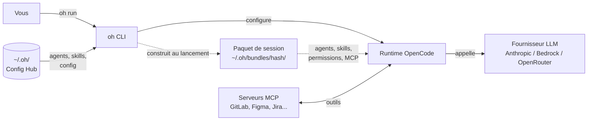

> [Read in English](getting-started.en.md)

# Demarrage rapide

## Qu'est-ce qu'OpenHub ?

OpenHub (`oh`) est un hub central qui gere les assistants IA de code a travers vos projets. Il fournit **19 agents IA specialises** organises en 7 familles (planning, developpement, audit, qualite, design, documentation, utilitaire) qui collaborent pour tout gerer, de la planification de fonctionnalites a la revue de code.



**Concepts cles** (voir le [Glossaire](../reference/glossary.fr.md) complet) :
- **Hub** (`~/.oh/`) -- configuration centrale et stockage agents/skills
- **Agent** -- un role IA specialise (orchestrateur, developpeur, reviewer, etc.)
- **Skill** -- un document de protocole donnant une expertise domaine a un agent
- **Paquet de session** -- agents, skills, permissions et MCP d'une session, construits au lancement a partir de son workflow hors du projet (`~/.oh/bundles/<hash>/`) ; remplace le deploy (supprime en v5)
- **MCP Server** -- integration d'outils externes (GitLab, Figma, Jira, etc.)

> **Nouveau ici ?** Commencez par le [tutoriel en 5 minutes](tutorial.fr.md) pour une prise en main pratique.

Ce guide est la reference complete des commandes. Pour les details de configuration, voir le [Guide de configuration](configuration-guide.fr.md).

---

## Prerequisites

| Outil | Usage | Requis |
|-------|-------|--------|
| **git** | Controle de version | Oui |
| **opencode V2** (2.0.0 ou plus) | Agent IA de code | Oui — a installer avec son propre outil (`brew install anomalyco/tap/opencode`, ou https://opencode.ai) ; verifie par `oh init` et `oh doctor` |
| **bd** | Gestionnaire de tickets Beads | Non (pour le workflow `ticket` et `oh board`) |

Aucun besoin de Node.js, jq, sqlite3, bun ou Python. Le binaire Go est autonome.

## Installation

**Plateformes supportees :** macOS (darwin) et Linux — amd64 et arm64.

**Homebrew (recommande — macOS/Linux) :**

```bash
brew install datichb/tap/openhub
```

**Script curl (macOS/Linux) :**

```bash
curl -fsSL https://raw.githubusercontent.com/datichb/openhub/main/install.sh | bash
```

**Depuis les sources :**

```bash
cd cli && go install .
```

## Configuration initiale

```bash
oh init
```

Cet assistant interactif en 3 etapes va :

**[1/3] Configuration du hub :**
- Afficher un preambule avec les prerequis (provider, tokens MCP)
- Demander votre langue preferee (fr/en)
- Verifier qu'opencode V2 est installe (oh n'installe plus opencode)
- Choisir le provider LLM par defaut (Bedrock, Anthropic, OpenRouter, GitHub Copilot)
- Detecter automatiquement les credentials existantes et proposer de les utiliser ou d'en configurer de nouvelles

**[2/3] Serveurs MCP (optionnel) :**
- Proposer de configurer des services MCP (Figma, GitLab, Google Slides)
- Pour chaque service selectionne : demander le token et le stocker dans le keychain
- Les services sans token sont ignores (configurables plus tard via `oh mcp setup`)

**[3/3] Premier projet (optionnel) :**
- Proposer d'enregistrer un premier projet
- Si oui : lance l'assistant de projet (nom, chemin, langage, MCP)
- Si non : l'initialisation est terminee (`oh project add` disponible plus tard)

Le hub content (agents et skills) est extrait automatiquement dans `~/.oh/hub/` depuis le binaire.

## Enregistrer un projet

Pour ajouter d'autres projets apres l'initialisation :

```bash
oh project add
```

Ou de maniere non-interactive :

```bash
oh project add --name my-app --path ~/workspace/my-app --language typescript
```

## Paquet de session

Plus rien n'est deploye dans le projet (`oh deploy` / `oh sync` supprimes en v5). Chaque session demarre d'un paquet de session construit au lancement hors du projet (`~/.oh/bundles/<hash>/`) a partir de son workflow : agents, skills, permissions, serveurs MCP, fournisseur et modele. Pour l'inspecter :

```bash
oh bundle show <workflow>                  # detection automatique du projet depuis le repertoire courant
oh bundle show <workflow> -p my-project    # projet explicite
oh bundle show <workflow> --budget         # inclure le budget de contexte
oh bundle build <workflow>                 # construire le paquet sans lancer
```

Projets deployes avec une version precedente : nettoyer les restes (`.opencode/agents`, `.opencode/skills`, cles oh dans `opencode.json`…) avec `oh migrate deploy-cleanup --dry-run` puis `oh migrate deploy-cleanup`.

## Lancer une session

Chaque session lance un **workflow** (voir [Workflows livres](../reference/workflows.fr.md)) :

```bash
oh run                       # workflow par defaut du projet, detection auto du projet
oh run feature -p my-project # workflow et projet explicites
oh run feature -i request="explique..."   # avec une demande initiale
oh run libre --agent orchestrator         # session libre avec l'agent de votre choix
oh run ticket --tickets <id> # implementer un ticket Beads
oh run onboarding            # creer le wiki du projet
oh run feature --recap       # afficher le récap + confirmation
oh session attach <session-id>   # rouvrir une session existante
```

`oh start` reste disponible comme alias deprecie (`oh start` → `oh run feature`) ; voir [Migrer vers oh v5](migration-v5.fr.md).

Le flux de demarrage :

1. Resout le projet (depuis le repertoire courant ou le flag `--project`)
2. Resout le workflow, le fournisseur et le token d'authentification
3. Construit le paquet de session (hors du projet)
4. Lance directement (utilisez `--recap` pour afficher le récap + confirmation)
5. Demarre la session sur un serveur opencode et ouvre son interface

## Démarrage rapide

```bash
oh run                       # détection auto du projet, workflow par defaut, lancement immédiat
```

## Commandes quotidiennes

### Essentielles

```bash
oh run <workflow>            # lancer une session IA
oh session list              # sessions en cours, en attente, en veille
oh bundle show <workflow>    # inspecter le paquet de session d'un workflow
oh status                    # afficher le statut du hub et du projet courant
oh doctor                    # verification de sante du systeme
```

### Developpement

```bash
oh run ticket                # choisir un ticket, lance orchestrator-dev
oh run ticket --tickets a,b  # une session par ticket
oh run audit -i type=security    # audit de code
oh run review                # revue de code
oh run debug -i issue="crash..." # session de debogage
```

### Infrastructure

```bash
oh migrate deploy-cleanup    # supprimer les restes des anciens deploiements (oh < v5)
oh provider setup            # configurer les credentials provider
oh mcp setup                 # configurer les tokens des serveurs MCP
oh metrics                   # stats d'utilisation par agent
oh serve                     # demarrer le dashboard web sur localhost:8080
oh                           # tableau de bord TUI interactif (sans arguments)
oh board                     # kanban (necessite bd)
oh export                    # exporter toutes les donnees du hub
oh repair                    # reparer la base de donnees ou l'etat corrompus
```

### Equipe (optionnel)

```bash
oh team init                 # configurer la collaboration d'equipe
oh team claim <ticket-id>    # revendiquer un ticket
oh team release <ticket-id>  # liberer un ticket revendique
oh team status               # afficher l'etat de l'equipe
oh team sync-tracker         # synchroniser les claims vers le tracker externe
```

## Workflow de developpement

```bash
oh run ticket                # choisir un ticket, lance orchestrator-dev
oh run ticket --tickets a,b  # une session par ticket (un worktree par session)
oh run audit -i type=security    # audit de code
oh run review                # revue de code
oh run debug -i issue="crash on login"  # session de debogage
```

Les anciennes commandes `oh start --dev`, `oh audit`, `oh review` et `oh debug` sont des alias deprecies de ces commandes.

## Gestion des worktrees

```bash
oh run feature --location new   # cree un worktree et lance dedans
oh worktree list             # lister les worktrees actifs
oh worktree cleanup          # supprimer les worktrees merges
```

## Configuration

```bash
oh config list               # afficher toute la configuration
oh config set opencode.default_provider anthropic
oh config language fr        # passer en francais
oh config websearch enable   # activer la recherche web pour les agents
```

## Skills communautaires

Installer des skills depuis l'index ou une URL Git :

```bash
oh skill add <nom-index>              # installer depuis l'index communautaire
oh skill add https://github.com/...  # installer depuis une URL Git
oh skill list                         # lister les skills communautaires installees
oh skill search <requete>             # rechercher dans l'index communautaire
```

Voir [skills.fr.md](../architecture/skills.fr.md#marketplace-de-skills-communautaires) pour les details.

## Mise a jour

```bash
brew upgrade openhub          # mettre a jour oh lui-meme (Homebrew)
oh upgrade oh                 # mettre a jour oh lui-meme (hors Homebrew)
```

opencode se met a jour avec son propre outil (`oh upgrade opencode` est supprime en v5).

## Desinstallation

```bash
brew uninstall openhub
rm -rf ~/.oh                 # supprimer la configuration et la base de donnees
```

## Depannage

Lancer les diagnostics :

```bash
oh doctor
```

`oh doctor` verifie :
- Version de `oh` (derniere disponible vs installee)
- Presence et version du binaire `opencode` (opencode V2 requis)
- Credentials provider
- Connectivite des serveurs MCP
- Integrite du registre de projets

Problemes courants :

- **opencode introuvable ou en V1** — installer opencode V2 avec son propre outil (voir [Migrer vers oh v5](migration-v5.fr.md)), puis relancer `oh doctor`
- **Credentials provider manquantes** — lancer `oh provider setup`
- **Erreurs de serveur MCP** — verifier les tokens avec `oh mcp setup`
- **Projet non detecte** — s'assurer d'etre dans un repertoire de projet enregistre (`oh project list`)
- **Etat corrompu** — lancer `oh repair` pour tenter une recuperation automatique
