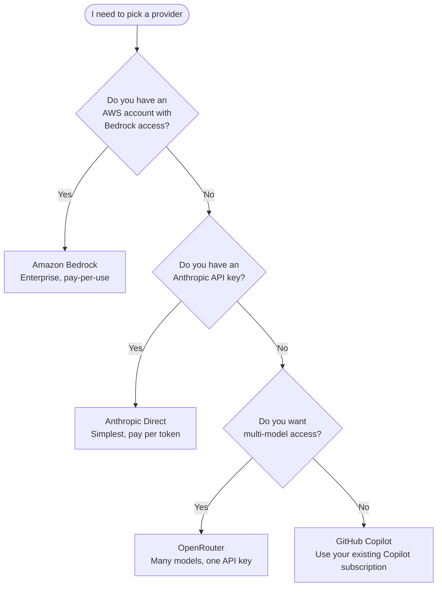

> [Lire en francais](tutorial.fr.md)

# Tutorial -- From the first launch to an implemented and reviewed ticket

This tutorial follows a complete path with oh v5: install oh and opencode V2, set up the hub, implement a Beads ticket with the `ticket` workflow, pass its checkpoints from the TUI, then have the branch reviewed with the `review` workflow. Each step shows what you should see.

**What you will be able to do:**
- Install `oh` and opencode V2, set up the hub with `oh init`
- Create a Beads ticket and run `oh run ticket --tickets <id>`
- Follow a session and pass its checkpoints from the checkpoint card
- Get the results and chain with a review

**Time needed:** ~20 minutes (depending on the ticket size).

> **Prerequisites:** `git`, `bd` (Beads), an API key for an LLM provider (see [Which provider should I choose?](#which-provider-should-i-choose)) and a git project (here `~/workspace/my-app`). The ids, costs and durations in the outputs below are examples.

---

## Which provider should I choose?



| Provider | Setup complexity | What you need before starting |
|----------|-----------------|-------------------------------|
| **Anthropic** | Low | An API key from [console.anthropic.com](https://console.anthropic.com) |
| **Amazon Bedrock** | Medium | An AWS account with Bedrock model access enabled |
| **OpenRouter** | Low | An API key from [openrouter.ai](https://openrouter.ai) |
| **GitHub Copilot** | Low | An active GitHub Copilot subscription |

> The keys stay on your machine: the oh daemon holds them and opencode never sees them. You can switch providers with `oh provider setup`.

---

## Step 1 -- Install oh and opencode V2

```bash
brew install datichb/tap/openhub
brew install anomalyco/tap/opencode
```

Without Homebrew: `curl -fsSL https://raw.githubusercontent.com/datichb/openhub/main/install.sh | bash` for oh, and https://opencode.ai for opencode.

Check:

```bash
oh version
opencode --version
```

Expected output:

```
oh v5.0.0
  commit:  4fb125b4
  built:   2026-10-06T20:00:33Z
  go:      go1.26.4
  os/arch: darwin/arm64
2.0.20
```

opencode must be version 2.x: oh no longer supports opencode V1 (see [Migrating to oh v5](migration-v5.en.md)).

---

## Step 2 -- Set up the hub: `oh init`

```bash
cd ~/workspace/my-app
oh init
```

The wizard opens in the terminal. On the "Welcome" page, choose **Solo developer** (you can switch to a team later), then "Get started".

```
◆ OpenHub — Setup Wizard

 Language ── Provider ── Team ── Project ── Integrations

 How would you like to set up?
 ▸ Solo developer  ~2 min
   Team member  ~5 min
   Full setup  ~5-8 min
```

Then, step by step:

| Step | What you enter |
|------|----------------|
| **Language** | English |
| **Provider** | `anthropic`, then the API key (stored in the keychain) |
| **First project** | name `my-app`, path `~/workspace/my-app` (suggested from the current directory) |
| **MCP Integrations** | GitLab if you have a token, otherwise "Skip" |

On the solo path, the **Team** step is skipped: oh creates a solo workflow space for the project. `Ctrl+S` submits a step, `Ctrl+B` goes back. A summary screen ends the wizard.

Then check:

```bash
oh doctor
```

Every line should be `✔` (or `⚠` for optional items, such as the container engine). In particular: opencode V2, the oh daemon and git.

---

## Step 3 -- Create a Beads ticket

```bash
bd init
bd create "Add the CSV export" -p 1 -l ai-delegated \
  -d "Export button on the order list; columns: id, date, customer, total."
```

`bd` prints the ticket id. Below, it is called `bd-42`. The `ai-delegated` label makes it show up in the TUI ticket picker (default filter).

---

## Step 4 -- Inspect the session bundle (optional)

Nothing is deployed into the project: every session starts from a bundle built at launch, outside the project. To see what a `ticket` session will receive:

```bash
oh bundle show ticket
```

The command lists the agents (`orchestrator-dev` as entry, `developer`, `reviewer`…), the skills, the permissions and the MCP servers. No file is written in `my-app`.

---

## Step 5 -- Launch the ticket

The `ticket` workflow has three checkpoints: `cp-1` "Start the ticket", `cp-2` "Commit or fix" (always paused) and `cp-3` "Next ticket". In `manuel` mode, all of them wait for your validation: the clearest choice for a first time.

```bash
oh run ticket --tickets bd-42 --mode manuel --recap
```

Expected output:

```
▸ Preparing workflow ticket…
Launch ticket (hub:ticket) · my-app
  Mode           manuel
  Runtime        local
  Agents (6)     orchestrator-dev (entry) · developer · developer-refactor · developer-migrator · reviewer · documentarian
  Skills (23)    ~14200 tokens (entry agent 5400 + skill catalogue 8800)
  MCP            gitlab, workflow
  Isolation      full
  Sessions       1 session(s) · 1 server · 0 worktree(s)
    bd-42        ~/workspace/my-app (base)
? Launch? Yes
✔ Session opened (iterm): ses_2f9c1a7b
```

A new tab opens with opencode: the `orchestrator-dev` agent reads the ticket and prepares its plan. Without `--recap`, the session starts right away.

> From the TUI, the same launch goes through "Start" → `ticket` → launch form: "Pick…" button for the ticket, `manuel` mode at the Options step, then `Ctrl+S`.

---

## Step 6 -- Follow the session

Keep the opencode window next to you. In another terminal:

```bash
oh session list
```

```
SESSION        PROJECT  AGENT             STATE      DECISIONS  COST    STARTED
ses_2f9c1a7b   my-app   orchestrator-dev  ⏸ waiting  ⏸ 1        $0.042  06/10 10:02
```

The session already waits for a decision: `cp-1`. Open the TUI:

```bash
oh
```

The bottom bar shows `● 1 ⏸ 1` (one live session, one waiting decision). Type `sessions` then `Enter` to open the **Sessions view**:

```
 Sessions
 ─ To handle (1)
 ▸ ⏸ ticket · my-app  cp-1 "Start the ticket"
      1m ago
 ─ Running (1)
   ⏸ ticket · my-app
      waiting · orchestrator-dev · $0.04 · 1 decision(s) waiting
 ┌ Detail · ticket · my-app ──────────────────────────────────────┐
 │ ticket · manuel · ⌂ · ~/workspace/my-app · 9f3c1d2e…           │
 │ ⏸ waiting · orchestrator-dev · $0.042 · started 1m ago         │
 │ ⏸ cp-1 → ○ cp-2 → ○ cp-3                                       │
 │ ses_2f9c1a7b                                                   │
 └────────────────────────────────────────────────────────────────┘
```

On the session line, `t` shows the live feed on the right (current agent, tools, cost).

---

## Step 7 -- Pass `cp-1` from the checkpoint card

Move to the `⏸ … cp-1` line and press `Enter`. The **checkpoint card** opens:

```
┌ ⏸ cp-1 · Start the ticket · ticket · my-app ───────────────────────┐
│ bd-42: CSV export of the order list. Planned agent: developer.      │
│ Target files: src/orders/export.ts, src/orders/List.tsx             │
│                                                                     │
│ ─ Changes                                                           │
│   no changes                                                        │
│                                                                     │
│ ─ Last messages                                                     │
│   I suggest handing the implementation to developer…                │
│                                                                     │
│ ─ Timeline                                                          │
│   ⏸ cp-1 → ○ cp-2 → ○ cp-3                                          │
│                                                                     │
│              [ Decide ]   [ Attach ]                                │
└─────────────────────────────────────────────────────────────────────┘
```

Choose **Decide**. The form offers:

| Choice | Effect | Message to the agent |
|--------|--------|----------------------|
| **Validate** | the checkpoint passes, the agent goes on | optional |
| **Fix first** | the agent fixes, then asks for the checkpoint again | required |
| **Other instruction** | the agent follows your instruction, then asks again | required |

Choose "Validate", add for example "Also add a unit test", then submit. The timeline becomes `✔ cp-1 10:05 → developer` and the `developer` agent may start (it was locked until `cp-1`).

> Shortcut: `y` on a checkpoint line validates it without opening the card. You may also validate in the opencode window: the first answer wins.

---

## Step 8 -- Pass `cp-2` (commit or fix)

When `developer` is done and `reviewer` has reviewed, `cp-2` "Commit or fix" shows up in "To handle" (and a system notification appears). Open the card with `Enter`:

```
┌ ⏸ cp-2 · Commit or fix · ticket · my-app ──────────────────────────┐
│ Review done: 0 blocking, 1 minor (naming of exportRows).            │
│                                                                     │
│ ─ Changes                                                           │
│   +142 −18 · 4 file(s)                                              │
│   A src/orders/export.ts  +96 −0                                    │
│   M src/orders/List.tsx  +21 −4                                     │
│   A src/orders/export.test.ts  +23 −0                               │
│   M package.json  +2 −14                                            │
│                                                                     │
│ ─ Last messages                                                     │
│   reviewer › 1 minor remark: rename exportRows to toCsvRows         │
│                                                                     │
│ ─ Timeline                                                          │
│   ✔ cp-1 10:05 → developer → reviewer → ⏸ cp-2 → ○ cp-3             │
│                                                                     │
│        [ Decide ]   [ Full diff ]   [ Attach ]                      │
└─────────────────────────────────────────────────────────────────────┘
```

"Full diff" shows the whole diff. To fix the remark before the commit: **Decide** → "Fix first", message "Rename exportRows to toCsvRows", submit. The agent fixes, then asks for `cp-2` again (the timeline shows `↺`).

This time, validate from the command line to see the other path:

```bash
oh session inbox
```

```
   DECISION                          AGENT             REQUEST                    SINCE
⏸  checkpoint:ses_2f9c1a7b:per_…     orchestrator-dev  cp-2 "Commit or fix"       1m0s ago
```

```bash
oh session approve 2f9c
```

```
cp-2 "Commit or fix" → once
```

The agent commits on the working branch. If `cp-3` "Next ticket" shows up next, validate it (`y` in the Sessions view): there is only one ticket, the agent stops.

---

## Step 9 -- Get the results

```bash
oh session results 2f9c
```

```
4 file(s) changed · +140 −18 · 182340 tokens · $1.12
Branch: feat/bd-42
  src/orders/export.ts  +94 −0
  src/orders/List.tsx  +21 −4
  src/orders/export.test.ts  +23 −0
  package.json  +2 −14
```

For the merge request:

```bash
oh session results 2f9c --mr
```

```markdown
## bd-42 Add the CSV export

4 file(s) changed · +140 −18 · 182340 tokens · $1.12

### Changed files

- `src/orders/export.ts` (+94 −0)
- ...

---
oh session `ses_2f9c1a7b` · agent orchestrator-dev · branch feat/bd-42
```

In the Sessions view, `o` shows the same description.

---

## Step 10 -- Have the branch reviewed: `oh run review`

The `review` workflow reviews a branch without changing anything. Two ways to launch it:

**From the TUI:** on the `ticket` session, press `e` (**Chain with…**). oh offers the workflows that take an output of the session; choose `review`: the launch form opens with `branch = feat/bd-42`. Pick the "Review type" (for example `adversarial`), then `Ctrl+S`.

**From the command line:**

```bash
oh run review -i branch=feat/bd-42 -i review_mode=adversarial --parent ses_2f9c1a7b
```

```
▸ Preparing workflow review…
✔ Session opened (iterm): ses_8d41e0c2
```

The `reviewer` agent reads the branch and writes its report in the opencode window. The `review` workflow has no checkpoint: follow it with `t` in the Sessions view or `oh session follow 8d41`.

---

## Step 11 -- Finish

```bash
oh session stop 2f9c
oh session stop 8d41
```

Or `s` in the Sessions view. If you quit the TUI (`Ctrl+Q`) while a session still works, oh asks for each one: "Finish step, sleep", "Background" or "Stop now" (`Esc` cancels). A sleeping session resumes with `oh session attach <id>`.

---

## Step 12 -- Explore further

| What you want to do | Command | Guide |
|---------------------|---------|-------|
| Several tickets in parallel | `oh run ticket --tickets bd-43,bd-44` | [Getting started](getting-started.en.md#several-tickets) |
| Isolate the agent's commands | `oh run ticket --tickets bd-42 --runtime container` | [Container](container.en.md) |
| Run on GitLab CI | `oh run ticket --tickets bd-42 --runtime remote` | [Remote execution](remote-runners.en.md) |
| Adapt a workflow for the team | `oh workflow new` | [Team workflows](team-workflows.en.md) |
| See every shipped workflow | `oh workflow list` | [Shipped workflows](../reference/workflows.en.md) |
| Cap the costs | `oh budget set session_budget_usd 5` | [v5 sessions](sessions-v5.en.md#restrictions) |
| Master the TUI | `oh` | [Using the TUI](tui-usage.en.md) |

---

## Quick reference

```
oh init                                   # setup wizard
oh doctor                                 # diagnostics
oh bundle show <workflow>                 # session bundle of a workflow
oh run ticket --tickets <id> [--mode manuel]
oh run review -i branch=<branch>
oh session list | inbox                   # sessions, waiting decisions
oh session approve <id> [--decision fix -m "…"]
oh session results <id> [--mr]
oh session attach | stop <id>
oh                                        # TUI: Sessions view (sessions), checkpoint card (Enter)
```

---

**Next:** [Getting started](getting-started.en.md) sums up the path and the commands; [v5 sessions](sessions-v5.en.md) details sessions, checkpoints and restrictions.
