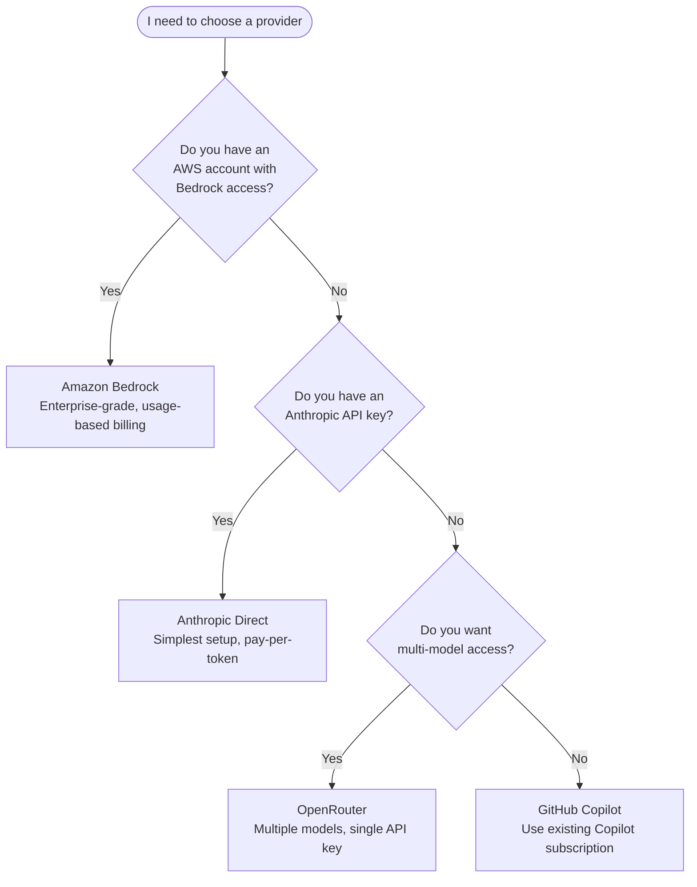

> [Lire en francais](tutorial.fr.md)

# Tutorial -- Your First 5 Minutes with OpenHub

This hands-on tutorial walks you through installing OpenHub, configuring your first project, and launching your first AI-assisted session. Every step includes the expected terminal output so you can verify you are on the right track.

**What you will be able to do after this tutorial:**
- Install the `oh` CLI
- Configure an LLM provider (Anthropic or Bedrock)
- Register a project
- Inspect the session bundle (agents and skills)
- Launch your first AI session

**Time required:** ~5 minutes.

> **Prerequisite:** You need `git`, opencode V2 (2.0.0 or later, installed with its own tool: `brew install anomalyco/tap/opencode` or https://opencode.ai) and an API key for at least one LLM provider. See the [provider decision guide](#which-provider-should-i-choose) below.

---

## Which provider should I choose?



| Provider | Setup complexity | What you need before starting |
|----------|-----------------|-------------------------------|
| **Anthropic** | Low | An API key from [console.anthropic.com](https://console.anthropic.com) |
| **Amazon Bedrock** | Medium | An AWS account with Bedrock model access enabled |
| **OpenRouter** | Low | An API key from [openrouter.ai](https://openrouter.ai) |
| **GitHub Copilot** | Low | An active GitHub Copilot subscription |

> **Recommendation for first-time users:** Start with **Anthropic** (simplest). You can switch providers later with `oh provider setup`.

---

## Step 1 -- Install OpenHub

**macOS/Linux (Homebrew):**

```bash
brew install datichb/tap/openhub
```

**macOS/Linux (curl):**

```bash
curl -fsSL https://raw.githubusercontent.com/datichb/openhub/main/install.sh | sh
```

**From source (requires Go 1.22+):**

```bash
cd cli && go install .
```

Verify the installation:

```bash
oh version
```

Expected output:

```
oh v5.0.0 (go1.26.4, darwin/arm64)
```

---

## Step 2 -- Initialize the Hub

```bash
oh init
```

The interactive wizard will guide you through 3 phases. Here is what to expect:

### [1/3] Hub Configuration

```
Welcome to OpenHub!

This wizard will set up your central hub for AI-assisted development.
You will need:
  - An API key for your LLM provider (Anthropic, Bedrock, OpenRouter, or GitHub Copilot)
  - (Optional) Tokens for MCP integrations (Figma, GitLab, Google Slides)

? Choose your language:
  > English
    Francais

  opencode V2 detected.

? Default LLM provider:
    Amazon Bedrock
  > Anthropic (direct API)
    OpenRouter
    GitHub Copilot
```

**If you chose Anthropic:**

```
? Anthropic API Key: sk-ant-••••••••
  API key stored in system keychain.
```

**If you chose Amazon Bedrock (alternative):**

```
? Authentication mode:
  > Bearer token (API Gateway / LiteLLM)
    AWS Profile (native Bedrock)

? Bearer token: ••••••••
  Token stored in system keychain.
```

### [2/3] MCP Servers (optional)

```
? Configure MCP integrations?
  [x] GitLab
  [ ] Figma
  [ ] Google Slides

? GitLab personal access token: glpat-••••••••
  Token stored in system keychain.
  Enable write mode (create MRs, add notes)? (y/N)
```

> Skip this step if you don't have any tokens yet. You can configure them later with `oh mcp setup`.

### [3/3] First Project (optional)

```
? Register a project now? (Y/n) Y
? Project name: my-app
? Project path: ~/workspace/my-app
? Primary language: typescript

  Project 'my-app' registered.
```

```
Hub initialized at ~/.oh/
  hub.toml ........... configuration
  oh.db .............. project registry
  hub/ ............... agents & skills (extracted from binary)

Run 'oh run <workflow>' in your project directory to get started.
```

---

## Step 3 -- Inspect the Session Bundle (optional)

There is nothing to deploy anymore (`oh deploy` removed in v5): each session starts from a session bundle built at launch, outside the project (`~/.oh/bundles/<hash>/`), from its workflow. To see what a `feature` session will receive:

```bash
cd ~/workspace/my-app
oh bundle show feature
```

The command lists the workflow's agents (Bucket A skills inlined), the on-demand skills, the permissions and the MCP servers. No file is written into your project.

---

## Step 4 -- Launch Your First Session

```bash
oh run feature --recap
```

Expected output:

```
  Project      my-app
  Path         ~/workspace/my-app
  Workflow     feature
  Provider     anthropic
  Model        claude-sonnet-4-6
  MCP          gitlab

Press Enter to start (or Ctrl+C to cancel)...
```

Press Enter. The session starts with the entry agent of the workflow and you can start working (without `--recap`, the session starts directly; `oh start` remains a deprecated alias of `oh run feature`):

```
> Explain the architecture of this project and suggest improvements.
```

The orchestrator will analyze your codebase, potentially delegate to specialized agents (planner, designer, developer), and provide structured results.

---

## Step 5 -- Explore Further

You now have a working OpenHub setup. Here are your next steps:

| What you want to do | Command | Guide |
|---------------------|---------|-------|
| Understand all agents and how they work | - | [Architecture overview](../architecture/overview.en.md) |
| Configure advanced settings | `oh config list` | [Configuration guide](configuration-guide.en.md) |
| Run a full feature workflow | `oh run feature` | [Workflows](workflows.en.md) |
| Audit your code for security/perf | `oh run audit -i type=security` | [Workflows](workflows.en.md#scenario-2--multi-domain-audit) |
| Set up team collaboration | `oh team init` | [Team setup](team-setup.en.md) |
| Explore the TUI dashboard | `oh` (no arguments) | [TUI usage](tui-usage.en.md) |
| Look up a term you don't know | - | [Glossary](../reference/glossary.en.md) |

---

## Quick Reference

```
oh init                 # first-time setup wizard
oh bundle show <workflow> # inspect the session bundle of a workflow
oh run                  # launch the project default workflow (quick launch)
oh run feature --recap  # launch AI session (with recap + confirmation)
oh run ticket           # pick tickets to implement
oh run onboarding       # discover and document a codebase
oh session list         # follow your sessions
oh doctor               # diagnose issues
oh status               # show hub and project status
```

---

**Next:** Read the [Getting Started guide](getting-started.en.md) for the full command reference, or dive into [Workflows](workflows.en.md) for real-world scenarios.
