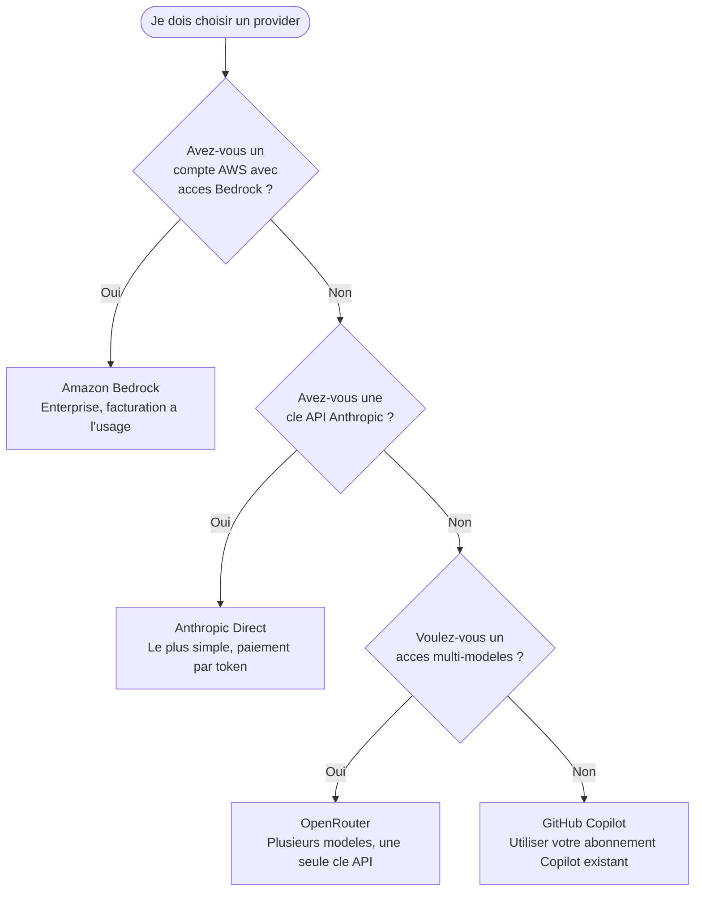

> [Read in English](tutorial.en.md)

# Tutoriel -- Du premier lancement a un ticket implemente et relu

Ce tutoriel suit un parcours complet avec oh v5 : installer oh et opencode V2, configurer le hub, implementer un ticket Beads avec le workflow `ticket`, passer ses checkpoints depuis la TUI, puis faire relire la branche avec le workflow `review`. Chaque etape montre ce que vous devez voir.

**Ce que vous saurez faire :**
- Installer `oh` et opencode V2, configurer le hub avec `oh init`
- Creer un ticket Beads et lancer `oh run ticket --tickets <id>`
- Suivre une session et passer ses checkpoints depuis la fiche checkpoint
- Recuperer les resultats et enchainer avec une review

**Temps necessaire :** ~20 minutes (selon la taille du ticket).

> **Prerequis :** `git`, `bd` (Beads), une cle API pour un fournisseur LLM (voir [Quel provider choisir ?](#quel-provider-choisir-)) et un projet git (ici `~/workspace/my-app`). Les identifiants, couts et durees des sorties ci-dessous sont des exemples.

---

## Quel provider choisir ?



| Provider | Complexite setup | Ce qu'il vous faut avant de commencer |
|----------|-----------------|---------------------------------------|
| **Anthropic** | Faible | Une cle API depuis [console.anthropic.com](https://console.anthropic.com) |
| **Amazon Bedrock** | Moyenne | Un compte AWS avec l'acces aux modeles Bedrock active |
| **OpenRouter** | Faible | Une cle API depuis [openrouter.ai](https://openrouter.ai) |
| **GitHub Copilot** | Faible | Un abonnement GitHub Copilot actif |

> Les cles restent sur votre machine : le demon d'oh les detient et opencode ne les voit jamais. Vous pourrez changer de provider avec `oh provider setup`.

---

## Etape 1 -- Installer oh et opencode V2

```bash
brew install datichb/tap/openhub
brew install anomalyco/tap/opencode
```

Sans Homebrew : `curl -fsSL https://raw.githubusercontent.com/datichb/openhub/main/install.sh | bash` pour oh, et https://opencode.ai pour opencode.

Verifier :

```bash
oh version
opencode --version
```

Sortie attendue :

```
oh v5.0.0
  commit:  4fb125b4
  built:   2026-10-06T20:00:33Z
  go:      go1.26.4
  os/arch: darwin/arm64
2.0.20
```

opencode doit etre en version 2.x : oh ne prend plus en charge opencode V1 (voir [Migrer vers oh v5](migration-v5.fr.md)).

---

## Etape 2 -- Configurer le hub : `oh init`

```bash
cd ~/workspace/my-app
oh init
```

L'assistant s'ouvre dans le terminal. Sur la page « Bienvenue », choisissez **Développeur solo** (vous pourrez passer en equipe plus tard), puis « Commencer ».

```
◆ OpenHub — Assistant de configuration

 Langue ── Provider ── Équipe ── Projet ── Intégrations

 Comment souhaitez-vous configurer ?
 ▸ Développeur solo  ~2 min
   Membre d'équipe  ~5 min
   Configuration complète  ~5-8 min
```

Puis, etape par etape :

| Etape | Ce que vous saisissez |
|-------|-----------------------|
| **Langue** | Français |
| **Fournisseur IA** | `anthropic`, puis la cle API (rangee dans le trousseau) |
| **Premier projet** | nom `my-app`, chemin `~/workspace/my-app` (propose depuis le dossier courant) |
| **Intégrations MCP** | GitLab si vous avez un jeton, sinon « Ignorer » |

En parcours solo, l'etape **Équipe** est sautee : oh cree un espace de workflows solo pour le projet. `Ctrl+S` valide une etape, `Ctrl+B` revient en arriere. Un ecran de resume termine l'assistant.

Verifier ensuite :

```bash
oh doctor
```

Chaque ligne doit etre `✔` (ou `⚠` pour ce qui est facultatif, comme le moteur de conteneurs). En particulier : opencode V2, le demon oh et git.

---

## Etape 3 -- Creer un ticket Beads

```bash
bd init
bd create "Ajouter l'export CSV" -p 1 -l ai-delegated \
  -d "Bouton Exporter sur la liste des commandes ; colonnes : id, date, client, total."
```

`bd` affiche l'identifiant du ticket. Dans la suite, il s'appelle `bd-42`. Le libelle `ai-delegated` le fait apparaitre dans le selecteur de tickets de la TUI (filtre par defaut).

---

## Etape 4 -- Inspecter le paquet de session (facultatif)

Rien n'est deploye dans le projet : chaque session part d'un paquet construit au lancement, hors du projet. Pour voir ce que recevra une session `ticket` :

```bash
oh bundle show ticket
```

La commande liste les agents (`orchestrator-dev` en entree, `developer`, `reviewer`…), les skills, les permissions et les serveurs MCP. Aucun fichier n'est ecrit dans `my-app`.

---

## Etape 5 -- Lancer le ticket

Le workflow `ticket` a trois checkpoints : `cp-1` « Démarrer le ticket », `cp-2` « Commit ou correction » (toujours en pause) et `cp-3` « Ticket suivant ». En mode `manuel`, tous attendent votre validation : c'est le plus parlant pour une premiere fois.

```bash
oh run ticket --tickets bd-42 --mode manuel --recap
```

Sortie attendue :

```
▸ Préparation du workflow ticket…
Lancer ticket (hub:ticket) · my-app
  Mode           manuel
  Exécution      local
  Agents (6)     orchestrator-dev (entrée) · developer · developer-refactor · developer-migrator · reviewer · documentarian
  Skills (23)    ~14200 tokens (agent d'entrée 5400 + catalogue des skills 8800)
  MCP            gitlab, workflow
  Isolation      full
  Sessions       1 session(s) · 1 serveur · 0 worktree(s)
    bd-42        ~/workspace/my-app (base)
? Lancer ? Oui
✔ Session ouverte (iterm) : ses_2f9c1a7b
```

Un nouvel onglet s'ouvre avec opencode : l'agent `orchestrator-dev` lit le ticket et prepare son plan. Sans `--recap`, la session demarre directement.

> Depuis la TUI, le meme lancement se fait par « Démarrer » → `ticket` → fiche de lancement : bouton « Choisir… » pour le ticket, mode `manuel` a l'etape Options, puis `Ctrl+S`.

---

## Etape 6 -- Suivre la session

Gardez la fenetre opencode a cote. Dans un autre terminal :

```bash
oh session list
```

```
SESSION        PROJET  AGENT             ÉTAT          DÉCISIONS  COÛT    DÉBUT
ses_2f9c1a7b   my-app  orchestrator-dev  ⏸ en attente  ⏸ 1        $0.042  06/10 10:02
```

La session attend deja une decision : `cp-1`. Ouvrez la TUI :

```bash
oh
```

La barre du bas affiche `● 1 ⏸ 1` (une session vivante, une decision en attente). Tapez `sessions` puis `Entree` pour ouvrir la **vue Sessions** :

```
 Sessions
 ─ À traiter (1)
 ▸ ⏸ ticket · my-app  cp-1 « Démarrer le ticket »
      il y a 1m
 ─ En cours (1)
   ⏸ ticket · my-app
      en attente · orchestrator-dev · $0.04 · 1 décision(s) en attente
 ┌ Détail · ticket · my-app ──────────────────────────────────────┐
 │ ticket · manuel · ⌂ · ~/workspace/my-app · 9f3c1d2e…           │
 │ ⏸ en attente · orchestrator-dev · $0.042 · démarrée il y a 1m  │
 │ ⏸ cp-1 → ○ cp-2 → ○ cp-3                                       │
 │ ses_2f9c1a7b                                                   │
 └────────────────────────────────────────────────────────────────┘
```

Sur la ligne de la session, `t` affiche a droite le flux en direct (agent courant, outils, cout).

---

## Etape 7 -- Passer `cp-1` depuis la fiche checkpoint

Placez-vous sur la ligne `⏸ … cp-1` et appuyez sur `Entree`. La **fiche checkpoint** s'ouvre :

```
┌ ⏸ cp-1 · Démarrer le ticket · ticket · my-app ─────────────────────┐
│ bd-42 : export CSV de la liste des commandes. Agent prévu :         │
│ developer. Fichiers visés : src/orders/export.ts, src/orders/List…  │
│                                                                     │
│ ─ Changements                                                       │
│   aucun changement                                                  │
│                                                                     │
│ ─ Derniers messages                                                 │
│   Je propose de confier l'implémentation à developer…               │
│                                                                     │
│ ─ Frise                                                             │
│   ⏸ cp-1 → ○ cp-2 → ○ cp-3                                          │
│                                                                     │
│              [ Décider ]   [ Attacher ]                             │
└─────────────────────────────────────────────────────────────────────┘
```

Choisissez **Décider**. Le formulaire propose :

| Choix | Effet | Message a l'agent |
|-------|-------|-------------------|
| **Valider** | le checkpoint passe, l'agent continue | facultatif |
| **Corriger d'abord** | l'agent corrige puis redemande le checkpoint | obligatoire |
| **Autre consigne** | l'agent suit votre consigne puis redemande | obligatoire |

Choisissez « Valider », ajoutez par exemple « Ajoute aussi un test unitaire », puis validez. La frise devient `✔ cp-1 10:05 → developer` et l'agent `developer` peut commencer (il etait verrouille jusqu'a `cp-1`).

> Raccourci : `y` sur la ligne d'un checkpoint le valide sans ouvrir la fiche. Vous pouvez aussi valider dans la fenetre opencode : la premiere reponse gagne.

---

## Etape 8 -- Passer `cp-2` (commit ou correction)

Quand `developer` a fini et que `reviewer` a relu, `cp-2` « Commit ou correction » arrive dans « À traiter » (et une notification systeme s'affiche). Ouvrez la fiche avec `Entree` :

```
┌ ⏸ cp-2 · Commit ou correction · ticket · my-app ───────────────────┐
│ Review terminée : 0 bloquant, 1 mineur (nommage de exportRows).     │
│                                                                     │
│ ─ Changements                                                       │
│   +142 −18 · 4 fichier(s)                                           │
│   A src/orders/export.ts  +96 −0                                    │
│   M src/orders/List.tsx  +21 −4                                     │
│   A src/orders/export.test.ts  +23 −0                               │
│   M package.json  +2 −14                                            │
│                                                                     │
│ ─ Derniers messages                                                 │
│   reviewer › 1 remarque mineure : renommer exportRows en toCsvRows  │
│                                                                     │
│ ─ Frise                                                             │
│   ✔ cp-1 10:05 → developer → reviewer → ⏸ cp-2 → ○ cp-3             │
│                                                                     │
│        [ Décider ]   [ Diff complet ]   [ Attacher ]                │
└─────────────────────────────────────────────────────────────────────┘
```

« Diff complet » affiche tout le diff. Pour corriger la remarque avant le commit : **Décider** → « Corriger d'abord », message « Renomme exportRows en toCsvRows », valider. L'agent corrige, puis redemande `cp-2` (la frise montre `↺`).

Cette fois, validez depuis la ligne de commande pour voir l'autre chemin :

```bash
oh session inbox
```

```
   DÉCISION                          AGENT             DEMANDE                         DEPUIS
⏸  checkpoint:ses_2f9c1a7b:per_…     orchestrator-dev  cp-2 « Commit ou correction »   il y a 1m0s
```

```bash
oh session approve 2f9c
```

```
cp-2 « Commit ou correction » → once
```

L'agent committe sur la branche de travail. Si `cp-3` « Ticket suivant » apparait ensuite, validez-le (`y` dans la vue Sessions) : il n'y a qu'un ticket, l'agent s'arrete.

---

## Etape 9 -- Recuperer les resultats

```bash
oh session results 2f9c
```

```
4 fichier(s) modifié(s) · +140 −18 · 182340 tokens · $1.12
Branche : feat/bd-42
  src/orders/export.ts  +94 −0
  src/orders/List.tsx  +21 −4
  src/orders/export.test.ts  +23 −0
  package.json  +2 −14
```

Pour la merge request :

```bash
oh session results 2f9c --mr
```

```markdown
## bd-42 Ajouter l'export CSV

4 fichier(s) modifié(s) · +140 −18 · 182340 tokens · $1.12

### Fichiers modifiés

- `src/orders/export.ts` (+94 −0)
- ...

---
Session oh `ses_2f9c1a7b` · agent orchestrator-dev · branche feat/bd-42
```

Dans la vue Sessions, `o` affiche la meme description.

---

## Etape 10 -- Faire relire la branche : `oh run review`

Le workflow `review` relit une branche sans rien modifier. Deux facons de le lancer :

**Depuis la TUI :** sur la session `ticket`, appuyez sur `e` (**Enchaîner avec…**). oh propose les workflows qui prennent une sortie de la session ; choisissez `review` : la fiche de lancement s'ouvre avec `branch = feat/bd-42`. Choisissez le « Type de review » (par exemple `adversarial`), puis `Ctrl+S`.

**En ligne de commande :**

```bash
oh run review -i branch=feat/bd-42 -i review_mode=adversarial --parent ses_2f9c1a7b
```

```
▸ Préparation du workflow review…
✔ Session ouverte (iterm) : ses_8d41e0c2
```

L'agent `reviewer` lit la branche et rend son rapport dans la fenetre opencode. Le workflow `review` n'a pas de checkpoint : suivez-le avec `t` dans la vue Sessions ou `oh session follow 8d41`.

---

## Etape 11 -- Terminer

```bash
oh session stop 2f9c
oh session stop 8d41
```

Ou `s` dans la vue Sessions. Si vous quittez la TUI (`Ctrl+Q`) pendant qu'une session travaille encore, oh demande pour chacune : « Finir l'étape, veille », « Arrière-plan » ou « Arrêter maintenant » (`Esc` annule). Une session en veille se reprend avec `oh session attach <id>`.

---

## Etape 12 -- Explorer la suite

| Ce que vous voulez faire | Commande | Guide |
|--------------------------|----------|-------|
| Plusieurs tickets en parallele | `oh run ticket --tickets bd-43,bd-44` | [Demarrage rapide](getting-started.fr.md#plusieurs-tickets) |
| Isoler les commandes de l'agent | `oh run ticket --tickets bd-42 --runtime container` | [Conteneur](container.fr.md) |
| Lancer sur GitLab CI | `oh run ticket --tickets bd-42 --runtime remote` | [Execution distante](remote-runners.fr.md) |
| Adapter un workflow pour l'equipe | `oh workflow new` | [Workflows d'equipe](team-workflows.fr.md) |
| Voir tous les workflows livres | `oh workflow list` | [Workflows livres](../reference/workflows.fr.md) |
| Limiter les couts | `oh budget set session_budget_usd 5` | [Sessions v5](sessions-v5.fr.md#restrictions) |
| Maitriser la TUI | `oh` | [Utiliser le TUI](tui-usage.fr.md) |

---

## Reference rapide

```
oh init                                   # assistant de configuration
oh doctor                                 # diagnostic
oh bundle show <workflow>                 # paquet de session d'un workflow
oh run ticket --tickets <id> [--mode manuel]
oh run review -i branch=<branche>
oh session list | inbox                   # sessions, decisions en attente
oh session approve <id> [--decision fix -m "…"]
oh session results <id> [--mr]
oh session attach | stop <id>
oh                                        # TUI : vue Sessions (sessions), fiche checkpoint (Entree)
```

---

**Suite :** le [Demarrage rapide](getting-started.fr.md) resume le parcours et les commandes ; [Sessions v5](sessions-v5.fr.md) detaille les sessions, les checkpoints et les restrictions.
