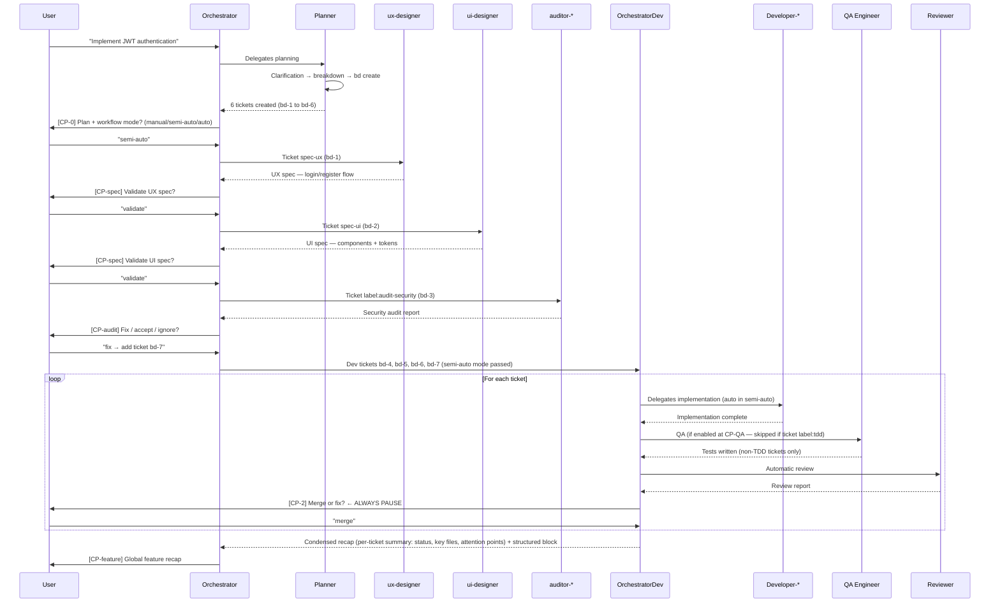
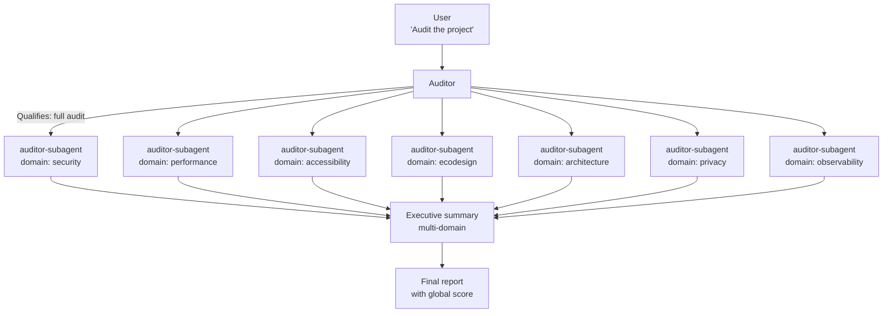
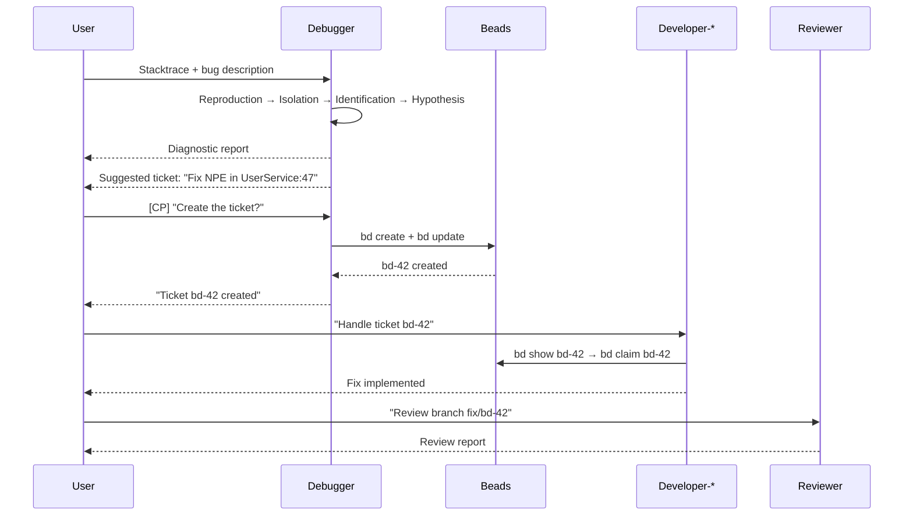
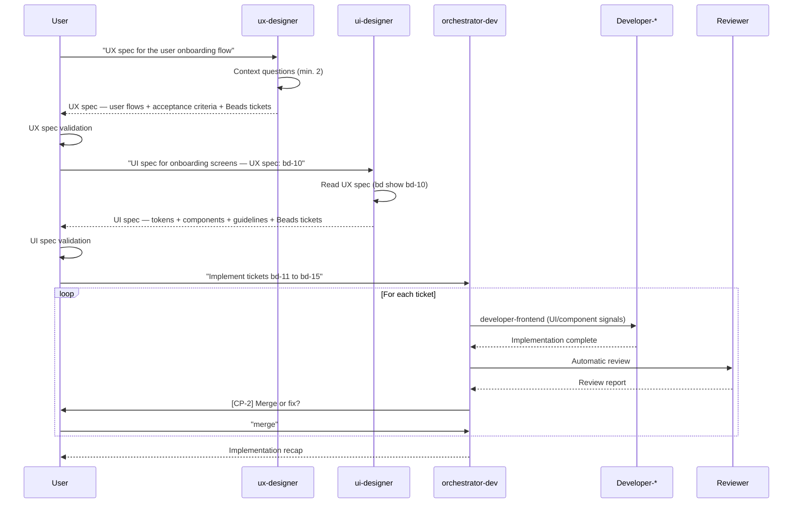
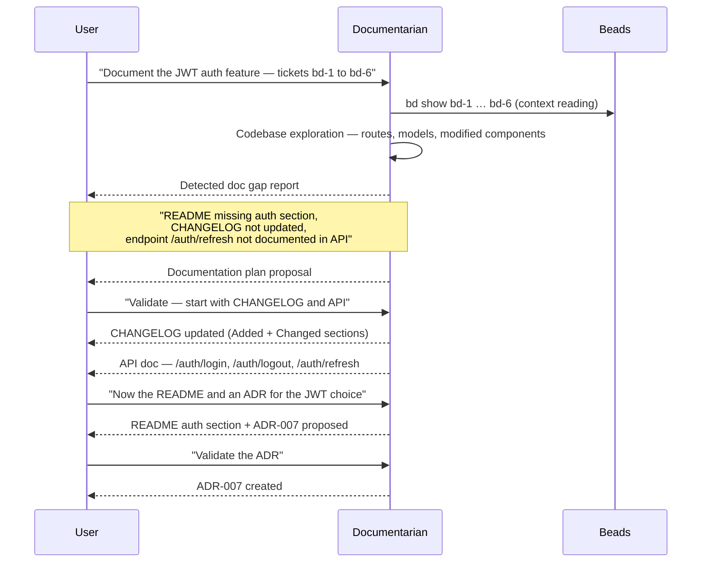
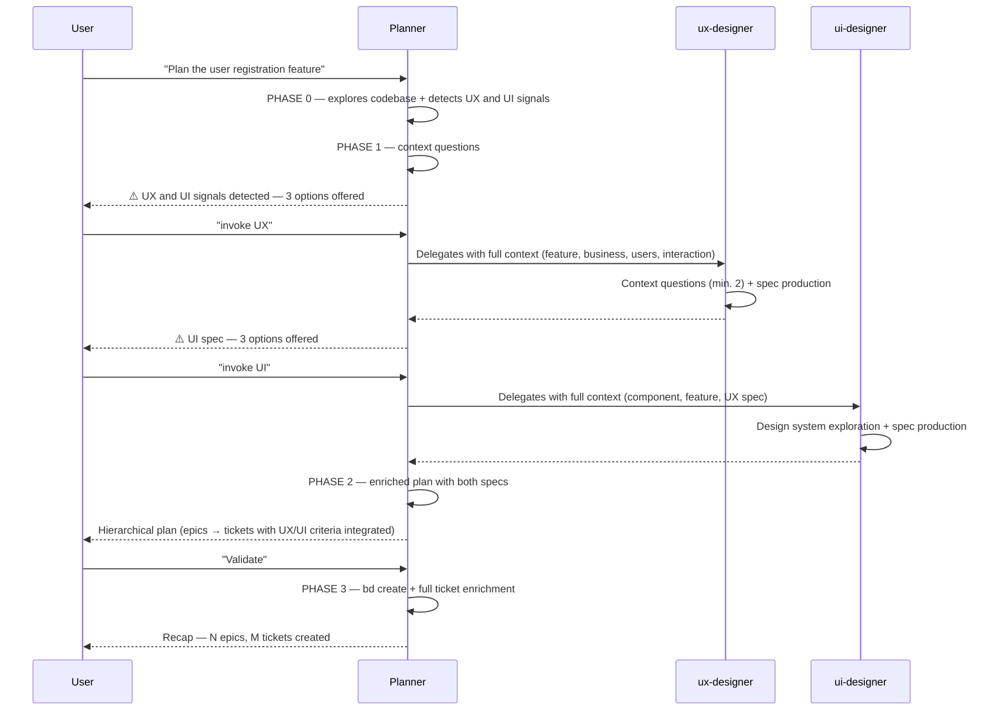

> 🇫🇷 [Lire en français](workflows.fr.md)

# Workflows

This guide illustrates the main usage scenarios for the hub,
end to end, with real prompts and expected outputs.

---

## Choosing your entry point

Before invoking an agent, identify your situation:

| Situation | Recommended entry point | Typical prompt |
|-----------|------------------------|----------------|
| Feature to design + implement from scratch | `orchestrator` | `"Implement [feature]"` |
| Beads tickets already planned, ready to code | `orchestrator-dev` | `"Implement tickets bd-X to bd-Y"` |
| UX/UI specifications only, without implementing | `ux-designer` / `ui-designer` | `"UX spec for [feature]"` |
| Audit before going to production | `auditor` | `"Audit the project"` |
| Production bug with stacktrace or logs | `debugger` | `"This bug: [stacktrace]"` |
| Review of a manually developed PR | `reviewer` | `"Review my PR — branch: [name]"` |
| Plan a feature without implementing it | `planner` | `"Break down [feature] into tickets"` |
| Plan + delegate UX/UI specs via the planner | `planner` | `"Plan [feature]"` then `"invoke UX"` / `"invoke UI"` |
| Document a delivered feature or a decision | `documentarian` | `"Document [topic]"` |

**Quick decision rule:**
- You have an idea → `orchestrator` (it orchestrates everything, from spec to merge)
- You have ready tickets → `orchestrator-dev` (direct implementation)
- You have a precise and bounded need → the specialised agent directly

---

## Scenario 1 — Full feature (orchestrator)

**Context:** you want to implement a new feature from A to Z,
from design to merge, mobilising all necessary agents.

### Diagram



### Detailed steps

#### 1. Launch the orchestrator

```
Prompt: "Implement the JWT authentication feature for our REST API"
```

The orchestrator immediately delegates to `planner` to break down the feature.

#### 2. The planner breaks it down

The planner explores the codebase (routes, models, components), asks clarification
questions, then proposes a plan:

```
## Breakdown plan — JWT Authentication

### Phase 0 — Specifications
- [ ] UX spec — login / register / reset password flow (label:ux)
- [ ] UI spec — form components + error feedback (label:ui)

### Phase 1 — Prior audit
- [ ] Security audit — OWASP Top 10 on the auth scope (label:audit-security)

### Phase 2 — Implementation
- [ ] User model + migrations
- [ ] JWT service (sign, verify, refresh)
- [ ] Login / logout / refresh endpoints
```

#### 3. [CP-0] Plan validation + mode selection

The orchestrator displays the ticket table **in the discussion** (not inside the question),
then asks a short question for the workflow mode:

```
## Planned tickets — JWT Authentication

| ID   | Title                           | Type          | Planned agent     |
|------|---------------------------------|---------------|-------------------|
| bd-1 | UX spec — auth flow             | spec-ux       | ux-designer       |
| bd-2 | UI spec — auth components       | spec-ui       | ui-designer       |
| bd-3 | Security audit auth scope       | audit         | auditor-subagent  |
| bd-4 | User model + migrations         | task          | developer-backend |
| bd-5 | JWT service                     | feature       | developer-backend |
| bd-6 | Login/logout/refresh endpoints  | feature       | developer-backend |

ℹ️ Automatic order applied: specs → audits → dev.
```

Then a short structured question: **"Which workflow mode?"** — Manual / Semi-auto / Auto.

#### 4. Design and audit phases

The orchestrator first handles `spec-*` and `audit` tickets:

- Invokes `ux-designer` → UX spec produced → **[CP-spec]** validate / revise / skip
  - The designer returns a structured block `## Return to orchestrator` with the complete spec, implementation constraints, and open points. The orchestrator validates the presence of this block before proceeding.
- Invokes `ui-designer` → UI spec produced → **[CP-spec]** validate / revise / skip
- Invokes `auditor-subagent` (security domain) → audit report → **[CP-audit]** fix / accept / skip
  - The auditor returns a structured block with the vulnerability table by severity, prioritized recommendations, residual risk, and a status (`corrections-required` / `acceptable` / `blocking`).
  - If "fix": a correction ticket is added to the dev list

#### 5. Implementation phase via orchestrator-dev

The orchestrator passes dev tickets to `orchestrator-dev` with the chosen mode.
`orchestrator-dev` takes over:

1. Presents each ticket `[CP-1]` (automatic in semi-auto/auto)
2. Identifies the agent via the routing matrix and delegates
3. Developer returns a structured `## Return to orchestrator-dev` block — files modified, acceptance criteria checked, **points of attention for the review** (fragile zones, technical trade-offs)
4. Automatically detects QA risk level (🔴 high: API/services/critical code → QA mandatory | 🟡 medium: utils/business logic → QA recommended | ⚪ low: UI/doc/config → QA optional); offers QA `[CP-QA]` based on risk and mode (automatic in auto mode if enabled at CP-0); for `tdd` tickets, performs a quick coverage audit instead of skipping; qa-engineer returns a structured block with tests written, acceptance criteria coverage, and **review attention points** (non-testable zones, edge cases, assumptions)
5. Launches review automatically — passing the developer's AND qa-engineer's points of attention to the reviewer
6. Reviewer returns a structured block with an **actionable verdict** (`commit` / `fix` / `fix-security`), problem summary by severity, and required corrections verbatim
7. Presents the review report `[CP-2]` — **always a pause, no exception**
8. If "fix": corrections are copied verbatim into the Beads comment — no manual summary; routing to `developer-security` if the verdict is `fix-security`
9. Closes and moves to the next `[CP-3]` (automatic in semi-auto/auto)
10. After all tickets: `orchestrator-dev` emits a **condensed per-ticket summary** (status, key files, covered criteria, attention points + aggregated global attention points) followed by the **structured** `## Return to orchestrator` **block** (per-ticket detail table, statistics, global status) — the two are complementary; the orchestrator **displays this summary in its discussion thread** before presenting the [CP-feature] to the user

> **Subagent questions:** when a subagent (planner, ux-designer, reviewer…) asks a question,
> it surfaces in the parent session with a context block identifying the agent and current phase —
> e.g. `[Planner — Phase 0 | Feature: JWT authentication]`. No need to navigate to the child session.

> **Missing agent:** if a required agent is not deployed in the project, the orchestrator displays
> a structured question: deploy via `!oc deploy opencode <PROJECT_ID>` directly in OpenCode / use a
> substitute (table by domain) / skip the ticket. Never falls back silently.

#### 6. [CP-feature] Global recap

```
## Feature recap — JWT Authentication

| ID   | Title                           | Phase  | Agent             | Status      |
|------|---------------------------------|--------|-------------------|-------------|
| bd-1 | UX spec — auth flow             | design | ux-designer       | ✅ Validated |
| bd-2 | UI spec — auth components       | design | ui-designer       | ✅ Validated |
| bd-3 | Security audit auth scope       | audit  | auditor-subagent  | ✅ Accepted  |
| bd-4 | User model + migrations         | dev    | developer-backend | ✅ Merged    |
| bd-5 | JWT service                     | dev    | developer-backend | ✅ Merged    |
| bd-6 | Login/logout/refresh endpoints  | dev    | developer-backend | ✅ Merged    |
| bd-7 | Fix misconfigured CORS          | dev    | developer-backend | ✅ Merged    |

- Tickets handled: 7 / 7
- Review cycles: 8
- Corrections requested: 1 (security audit → bd-7)
```

---

## Scenario 2 — Multi-domain audit

**Context:** you want a complete audit of the project before going to production.

### Diagram



### Detailed steps

#### 1. Full audit

```
Prompt: "Audit the project"
```

The auditor qualifies the request as a **full audit** and delegates to `auditor-subagent` for each of the 7 domains (one invocation per domain, domain + native_skill passed in the prompt).

#### 2. Targeted audit

```
Prompt: "Audit security and check GDPR compliance"
```

The auditor delegates only to `auditor-subagent` with domains `security` and `privacy`.

#### 3. Express audit (quick audit)

```
Prompt: "Quick audit"
```

The auditor delegates to `auditor-subagent` for the `security`, `accessibility`, `performance` domains.

#### 4. Synthesis report format

```
## Multi-domain Audit Summary — my-project

### Overview

| Domain        | Score | Level | Criticals |
|---------------|-------|-------|-----------|
| Security      | 6/10  | 🟠    | 2         |
| Performance   | 8/10  | ✅    | 0         |
| Accessibility | 5/10  | 🟠    | 1         |
| Ecodesign     | 7/10  | 🟡    | 0         |
| Architecture  | 7/10  | 🟡    | 0         |
| Privacy (GDPR)| 9/10  | ✅    | 0         |
| Observability | 6/10  | 🟠    | 1         |

### Estimated global score
6.7/10 — Fair — 4 critical issues to resolve before production

### Top 5 priority actions
1. [Security 🔴] Possible SQL injection — src/controllers/user.controller.ts:34
2. [Security 🔴] Secret exposed in code — config/database.ts:12
3. [Accessibility 🔴] Images without alt attribute — src/components/Gallery.vue
4. [Observability 🔴] No SLO defined — no error budget or actionable alerting
5. [Security 🟠] Misconfigured CORS — src/middleware/cors.ts
```

#### 5. Living docs enrichment (Phase 4)

After the executive summary, the auditor consolidates the `### Findings to document` sections
surfaced by subagents and proposes to the user to capitalize the relevant discoveries.

```
## 💾 Wiki enrichment — Findings to capitalize

### Proposed enrichments for `docs/wiki/index.md`
| Section | Action | Proposed content | Confidence |
|---------|--------|-----------------|------------|
| `## Active critical points 🔴` | Add | "SQL injection possible in UserController" | `CONFIRMÉ` · src/controllers/user.controller.ts:34 |

### Proposed enrichments for `docs/wiki/technical/stack.md`
| Section | Action | Proposed content | Confidence |
|---------|--------|-----------------|------------|
| `## Key libraries` | Add "Do not use" | "lodash 4.17.20 — CVE-2024-1234: prototype pollution" | `CONFIRMÉ` · package.json |

→ question: Delegate writing to the documentarian?
```

If the user accepts, the auditor invokes the `documentarian` via `task` to enrich
the wiki incrementally (see skill `living-docs-enrichment`).

---

## Scenario 3 — Debug → fix cycle

**Context:** a bug is reported in production, you have a stacktrace.

### Diagram



### Detailed steps

#### 1. Submit the bug to the debugger

```
Prompt:
"This bug has been happening in prod since this morning:

TypeError: Cannot read properties of null (reading 'email')
    at UserService.findById (src/services/user.service.ts:47:20)
    at AuthController.login (src/controllers/auth.controller.ts:23:35)
    at Layer.handle [as handle_request] (express/lib/router/layer.js:95:5)

Context: occurs when a user tries to log in with a non-existent
email. Frequency: systematic."
```

#### 2. Diagnostic report

```
## Diagnostic — TypeError null email in UserService

### Symptom
Login with non-existent email throws a TypeError in production.
Expected behaviour: return an explicit 401 error.
Frequency: systematic.

### Root cause
Method `findById` returns `null` when the user doesn't exist,
but line 47 directly accesses `.email` without prior null guard.

Certainty level: confirmed
Causal chain:
1. Login request with non-existent email
2. `UserRepository.findByEmail` returns `null`
3. `UserService.findById` accesses `.email` on the null value → TypeError

### Explored hypotheses
- Race condition in the repository: eliminated — error is systematic, not intermittent
- Missing null guard before line 47: confirmed — no guard found in the call chain

### Impact and potential regressions
- All login attempts with non-existent email result in an unhandled TypeError
- The error propagates to the HTTP layer as a 500 rather than a clean 401

### Suggested correction ticket
Title: Fix missing null guard in UserService.findById
Type: bug | Priority: P0
```

#### 3. Ticket creation

```
⏸️ Create this ticket in Beads? (yes/no)
→ yes

bd create "Fix missing null guard in UserService.findById" -p 0 -t bug --json
→ Ticket bd-42 created
```

#### 4. Living docs enrichment (Phase 5)

After ticket creation, the debugger identifies findings worth capitalizing:

```
## 💾 Wiki enrichment — Findings to capitalize

### Proposed enrichments for `docs/wiki/index.md`
| Section | Action | Proposed content | Confidence |
|---------|--------|-----------------|------------|
| `## Blind spots` | Add | "UserService.findById does not return explicit 401 — returns null without guard" | `CONFIRMÉ` · src/services/user.service.ts:47 |

### Proposed enrichments for `docs/wiki/technical/conventions.md`
| Section | Action | Proposed content | Confidence |
|---------|--------|-----------------|------------|
| `## Team-specific patterns` | Add | "Always check for null before accessing a repository return value property" | `CONFIRMÉ` · src/services/user.service.ts:47 |

→ question: Delegate writing to the documentarian?
```

If the user accepts, the debugger invokes the `documentarian` via `task`
(skill `living-docs-enrichment`) to enrich the wiki incrementally.

#### 5. Fix and review

The developer receives ticket bd-42, reads the diagnostic in the notes,
implements the targeted fix, and the reviewer checks the PR.

---

## Scenario 4 — Feature implementation → living wiki (developer-*)

**Context:** a developer completes ticket bd-15 (implement user filtering feature).

#### Living wiki enrichment (post-ticket)

After `bd close bd-15`, the developer identifies discoveries worth capitalizing:

```
## 💾 Wiki enrichment — Findings to capitalize

### Proposed enrichments for `docs/wiki/technical/conventions.md`
| Section | Action | Proposed content | Confidence |
|---------|--------|-----------------|------------|
| `## Team-specific patterns` | Add | "Filtering logic is always co-located in a dedicated `<feature>/filters/` folder" | `CONFIRMÉ` · src/users/filters/ · ticket bd-15 |
| `## Team-specific patterns` | Add | "Always use TanStack Query with a `staleTime: 60_000` default for list endpoints" | `CONFIRMÉ` · src/users/hooks/useUsers.ts:12 |

→ question: Delegate writing to the documentarian?
```

If the user accepts, the developer invokes the `documentarian` via `task`
(skill `shared/living-docs-enrichment`) to enrich the wiki incrementally.

---

## Scenario 5 — Code review → living wiki (reviewer)

**Context:** a reviewer analyses the diff for branch `feat/bd-15-user-filters`.

#### Living wiki enrichment (post-report)

After producing the review report, the reviewer identifies conventions worth capitalizing:

```
## 💾 Wiki enrichment — Findings to capitalize

### Proposed enrichments for `docs/wiki/technical/conventions.md`
| Section | Action | Proposed content | Confidence |
|---------|--------|-----------------|------------|
| `## Naming` | Add | "Filter composables are always named `use<Entity>Filters`" | `CONFIRMÉ` · src/users/hooks/useUserFilters.ts:1 |

→ question: Delegate writing to the documentarian?
```

If the user accepts, the reviewer invokes the `documentarian` via `task`
(skill `shared/living-docs-enrichment`) to enrich the wiki incrementally.

---

## Scenario 6 — Review only

**Context:** you developed a feature manually and want a review
before merging.

```
Prompt: "Review my PR — branch: <branch name>"
```

Or with Beads context:

```
Prompt: "Review branch feat/user-profile — ticket bd-28"
```

The reviewer reads ticket bd-28 for context, applies its systematic
checklist, and produces a structured report.

---

## Scenario 7 — UX/UI spec then implementation (standalone designers)

**Context:** you want to design the experience and interface of a feature
before coding, without going through the full orchestrator. Useful when specs
must be validated by a team or client before any development.

### Diagram



### Detailed steps

#### 1. UX spec

```
Prompt: "UX spec for the user onboarding flow —
our app is a B2B SaaS project management platform"
```

The `ux-designer` asks at least 2 context questions before producing:

```
Questions:
1. What is the profile of the user signing up
   (company admin, invited team member, both)?
2. What information is required at account creation?
```

Then produces the UX spec with:
- Nominal + alternative + error user flows
- Acceptance criteria per step
- Identified friction points and recommendations
- Suggested Beads tickets (with `label:ui` for screens to specify)

#### 2. UI spec

```
Prompt: "UI spec for onboarding screens — UX spec available in bd-10"
```

The `ui-designer` reads the UX spec via `bd show bd-10`, then produces:
- Design tokens used (colours, typography, spacing)
- Component specification (variants, states, do/don't)
- Flow-specific visual guidelines
- Beads tickets updated with UI constraints

#### 3. Implementation via orchestrator-dev

Once specs are validated, launch `orchestrator-dev` directly on development
tickets (spec tickets are already closed):

```
Prompt: "Implement tickets bd-11 to bd-15 — semi-auto mode"
```

---

## Scenario 8 — Documenting a delivered feature

**Context:** a feature has just been merged. You want to document what changed:
README, user guides, ADR if an architectural decision was made, CHANGELOG,
or API documentation if new endpoints were created.

### Diagram



### Detailed steps

#### 1. Launch the documentarian with context

```
Prompt: "Document the JWT authentication feature delivered in tickets bd-1 to bd-6"
```

The `documentarian` starts by exploring before writing:
1. Reads Beads tickets to understand the scope
2. Explores the codebase (new files, modified routes, added models)
3. Inspects existing documentation (README, `docs/`, CHANGELOG, API spec)

#### 2. Gap report

```
## Documentation gaps detected — JWT Auth Feature

| Document              | Status   | Recommended action                                  |
|-----------------------|----------|-----------------------------------------------------|
| README.md             | Partial  | Add "Authentication" section with examples          |
| CHANGELOG.md          | Missing  | Add Added + Changed entries for the release         |
| docs/api/auth.md      | Missing  | Create OpenAPI doc for /auth/* (3 endpoints)        |
| ADR                   | Missing  | Propose ADR-007 — JWT vs sessions choice            |
| docs/guides/          | Compliant| No modification needed                              |

Where to start? (or "all" to let the documentarian decide the order)
```

#### 3. Writing by validated sections

The `documentarian` **never modifies a format without confirmation**. For each
document:
- It detects the existing format and adapts to it
- It proposes content before writing if the document is new
- It never changes format (e.g.: switching from Nygard to MADR for ADRs)
  without explicit confirmation

#### 4. Example — generated CHANGELOG entry

```markdown
## [1.2.0] — 2026-03-30

### Added
- JWT authentication: endpoints `/auth/login`, `/auth/logout`, `/auth/refresh`
- `User` model with `email`, `password_hash`, `refresh_token` fields
- `JwtService` — sign, verify, refresh with token rotation

### Changed
- `AuthController`: migration from cookie sessions to JWT Bearer
```

---

## Scenario 9 — Planning with design delegation (planner → ux-designer / ui-designer)

**Context:** you want to plan a feature that involves a user journey or new visual
components, and want the planner to handle delegation to design agents — without
having to open sessions manually.

### Diagram



### Detailed steps

#### 1. Launch the planner

```
Prompt: "Plan the user registration feature"
```

The planner explores the codebase, detects design signals (new multi-step flow → UX,
new form component → UI) and presents them in its context summary (PHASE 0).

#### 2. [PHASE 1.5] The planner proposes UX delegation

```
## ⚠️ UX spec recommended before planning

This feature introduces a multi-step flow (email entry → verification → profile).
...

### How would you like to proceed?

Option A — I invoke it directly (recommended)
> Type "invoke UX"

Option B — You invoke it yourself
> ...

Option C — Continue without UX spec
> Type "continue without UX"
```

#### 3. Direct invocation of ux-designer (Option A)

```
Prompt: "invoke UX"
```

The planner announces the invocation and passes the full context to `ux-designer`.
`ux-designer` asks its questions, produces the spec, and returns it to the planner
in the standardized format:

```
## SPEC UX — User Registration

### Nominal user flow
1. User enters their email
2. They receive a verification email
3. They click the link → redirected to profile completion page
4. They enter name, surname, password
5. They are redirected to their dashboard

### Alternative flows
- Email already exists → inline error + "login" link
- Expired link → error page with "resend email" button

### Error states
- Invalid email → inline validation (format)
- Password too weak → strength indicator + rules displayed

### UX acceptance criteria
- Nominal flow completes in ≤ 4 steps without forced backtracking
- Every error is explained with a clear corrective action
- Verification email arrives in < 30s
```

#### 4. Direct invocation of ui-designer (Option A)

Same mechanism for UI — the planner proposes, the user confirms with `"invoke UI"`.
`ui-designer` receives the component context + the already-produced UX spec,
and returns the UI spec in the standardized format:

```
## SPEC UI — RegistrationForm

### Design system components used
- DsfrInput — floating label variant
- DsfrButton — primary variant (submit) + secondary (cancel)
- DsfrAlert — error variant (inline)

### Visual states
- Default: empty field, label visible
- Focus: outline 2px token.color.focus
- Error: border token.color.error + inline message
- Loading: disabled button + spinner

### Tokens used
- color.primary.main: submit button background
- color.error.main: border + error text

### Accessibility
- aria-describedby on each field → linked to error message
- Keyboard navigation: Tab between fields, Enter submits the form
- Contrast: 4.5:1 minimum (WCAG AA)
```

#### 5. Enriched plan + ticket creation

The planner integrates both specs into its plan (PHASE 2) and creates tickets (PHASE 3)
with UX acceptance criteria and the `--design` field fully populated from the start.

```
bd-12  P1  feature  ~3h   Registration form implementation
       → design: full RegistrationForm spec (DSFR tokens, states, a11y)
       → acceptance: nominal flow ≤ 4 steps, errors with corrective action, ...

bd-13  P1  feature  ~2h   Email verification service
       → acceptance: email sent < 30s, link expires after 24h, ...
```
