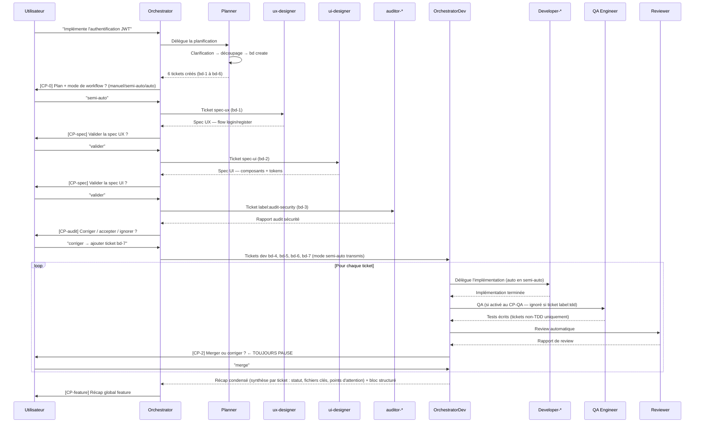
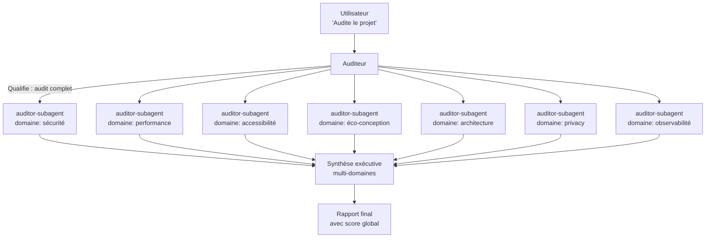
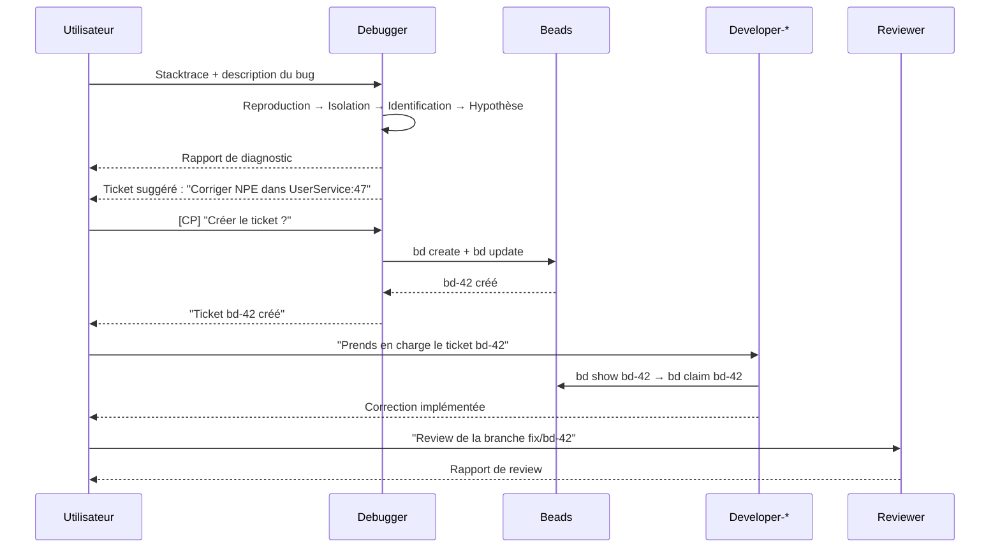
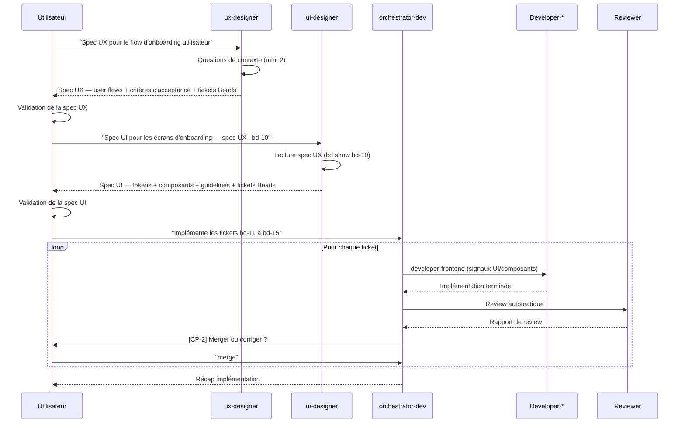
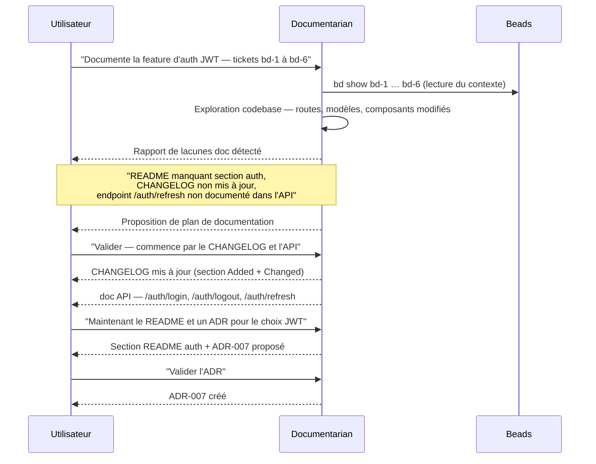
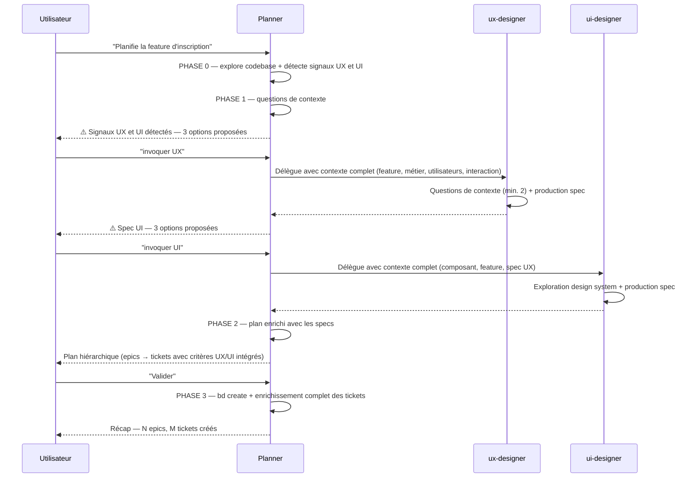

# Workflows

Ce guide illustre les scénarios principaux d'utilisation du hub,
de bout en bout, avec les prompts réels et les sorties attendues.

---

## Choisir son point d'entrée

Avant d'invoquer un agent, identifiez votre situation :

| Situation | Point d'entrée recommandé | Prompt type |
|-----------|--------------------------|-------------|
| Feature à concevoir + implémenter de zéro | `orchestrator` | `"Implémente [feature]"` |
| Tickets Beads déjà planifiés, prêts à coder | `orchestrator-dev` | `"Implémente les tickets bd-X à bd-Y"` |
| Spécifications UX/UI uniquement, sans implémenter | `ux-designer` / `ui-designer` | `"Spec UX pour [feature]"` |
| Audit avant mise en production | `auditor` | `"Audite le projet"` |
| Bug en production avec stacktrace ou logs | `debugger` | `"Ce bug : [stacktrace]"` |
| Review d'une PR développée manuellement | `reviewer` | `"Review de ma PR — branche : [nom]"` |
| Planifier une feature sans l'implémenter | `planner` | `"Décompose [feature] en tickets"` |
| Planifier + déléguer les specs UX/UI au planner | `planner` | `"Planifie [feature]"` puis `"invoquer UX"` / `"invoquer UI"` |
| Documenter une feature livrée ou une décision | `documentarian` | `"Documente [sujet]"` |

**Règle de décision rapide :**
- Tu as une idée → `orchestrator` (il orchestre tout, de la spec au merge)
- Tu as des tickets prêts → `orchestrator-dev` (implémentation directe)
- Tu as un besoin précis et délimité → l'agent spécialisé directement

---

## Scénario 1 — Feature complète (orchestrateur)

**Contexte :** vous voulez implémenter une nouvelle feature de A à Z,
depuis la conception jusqu'au merge, en mobilisant tous les agents nécessaires.

### Diagramme



### Étapes détaillées

#### 1. Lancer l'agent orchestrator

```
Prompt : "Implémente la feature d'authentification JWT pour notre API REST"
```

L'orchestrateur délègue immédiatement au `planner` pour décomposer la feature.

#### 2. Le planner décompose

Le planner explore la codebase (routes, modèles, composants), pose ses questions
de clarification, puis propose un plan :

```
## Plan de décomposition — Authentification JWT

### Phase 0 — Spécifications
- [ ] Spec UX — flow login / register / reset password (label:ux)
- [ ] Spec UI — composants formulaires + feedback d'erreur (label:ui)

### Phase 1 — Audit préalable
- [ ] Audit sécurité — OWASP Top 10 sur le périmètre auth (label:audit-security)

### Phase 2 — Implémentation
- [ ] Modèle User + migrations
- [ ] Service JWT (sign, verify, refresh)
- [ ] Endpoints login / logout / refresh
```

#### 3. [CP-0] Validation du plan + choix du mode

L'orchestrateur affiche le tableau des tickets **dans la discussion** (pas dans la question),
puis pose une question courte pour le mode de workflow :

```
## Tickets planifiés — Authentification JWT

| ID   | Titre                          | Type          | Agent prévu       |
|------|--------------------------------|---------------|-------------------|
| bd-1 | Spec UX — flow auth            | spec-ux       | ux-designer       |
| bd-2 | Spec UI — composants auth      | spec-ui       | ui-designer       |
| bd-3 | Audit sécurité périmètre auth  | audit         | auditor-subagent  |
| bd-4 | Modèle User + migrations       | task          | developer-backend |
| bd-5 | Service JWT                    | feature       | developer-backend |
| bd-6 | Endpoints login/logout/refresh | feature       | developer-backend |

ℹ️ Ordre automatique appliqué : specs → audits → dev.
```

Puis une question structurée (courte) : **"Quel mode de workflow ?"** — Manuel / Semi-auto / Auto.

#### 4. Phases conception et audit

L'orchestrateur traite d'abord les tickets de type `spec-*` et `audit` :

- Invoque `ux-designer` → spec UX produite → **[CP-spec]** valider / réviser / ignorer
  - L'agent design retourne un bloc structuré `## Retour vers orchestrator` avec la spec complète, les contraintes d'implémentation et les points ouverts. L'orchestrateur valide la présence de ce bloc avant de continuer.
- Invoque `ui-designer` → spec UI produite → **[CP-spec]** valider / réviser / ignorer
- Invoque `auditor-subagent` (domaine sécurité) → rapport d'audit → **[CP-audit]** corriger / accepter / ignorer
  - L'auditeur retourne un bloc structuré avec le tableau des vulnérabilités par sévérité, les recommandations priorisées, le risque résiduel et un statut (`corrections-requises` / `acceptable` / `bloquant`).
  - Si "corriger" : un ticket de correction est ajouté à la liste dev

#### 5. Phase implémentation via orchestrator-dev

L'orchestrateur transmet les tickets dev à `orchestrator-dev` avec le mode choisi.
`orchestrator-dev` prend le relais :

1. Présente chaque ticket `[CP-1]` (automatique en semi-auto/auto)
2. Identifie l'agent via la matrice de routing et délègue
3. Le developer retourne un bloc structuré `## Retour vers orchestrator-dev` — fichiers modifiés, critères d'acceptance cochés, **points d'attention pour la review** (zones fragiles, compromis techniques)
4. Détecte automatiquement le niveau de risque QA (🔴 élevé : API/services/code critique → QA obligatoire | 🟡 moyen : utils/logique métier → QA recommandé | ⚪ faible : UI/doc/config → QA optionnel) ; propose le QA `[CP-QA]` selon le risque et le mode (automatique en mode auto si activé au CP-0) ; pour les tickets `tdd`, effectue un audit rapide de couverture au lieu de skipper ; le qa-engineer retourne un bloc structuré avec les tests écrits, la couverture des critères d'acceptance et des **points d'attention pour la review** (zones non testables, edge cases, hypothèses)
5. Lance la review automatiquement — en transmettant les points d'attention du developer ET du qa-engineer au reviewer
6. Le reviewer retourne un bloc structuré avec un **verdict actionnable** (`commit` / `corriger` / `corriger-sécurité`), une synthèse des problèmes par sévérité et les corrections requises verbatim
7. Présente le rapport de review `[CP-2]` — **toujours une pause**, sans exception
8. Si "corriger" : les corrections sont copiées verbatim dans le commentaire Beads — sans résumé manuel ; routing vers `developer-security` si le verdict est `corriger-sécurité`
9. Clôture et passe au suivant `[CP-3]` (automatique en semi-auto/auto)
10. Après tous les tickets : `orchestrator-dev` émet une **synthèse condensée par ticket** (statut, fichiers clés, critères couverts, points d'attention + points d'attention globaux agrégés) suivie du **bloc structuré** `## Retour vers orchestrator` (tableau de détail des tickets, statistiques, statut global) — les deux sont complémentaires ; l'agent orchestrator **affiche cette synthèse dans son fil de discussion** avant de présenter le [CP-feature] à l'utilisateur

> **Questions des sous-agents :** quand un sous-agent (planner, ux-designer, reviewer…) pose une question,
> elle remonte dans la session parente avec un bloc de contexte identifiant l'agent et la phase en cours —
> ex. `[Planner — Phase 0 | Feature : authentification JWT]`. Aucun besoin de naviguer dans la session enfant.

> **Agent non déployé :** si un agent requis est absent du projet, l'agent orchestrator affiche une question
> structurée : déployer via `!oc deploy opencode <PROJECT_ID>` directement dans OpenCode / utiliser un
> substitut (table par domaine) / ignorer le ticket. Il ne bascule jamais silencieusement.

#### 6. [CP-feature] Récap global

```
## Récap feature — Authentification JWT

| ID   | Titre                          | Phase    | Agent             | Statut     |
|------|--------------------------------|----------|-------------------|------------|
| bd-1 | Spec UX — flow auth            | design   | ux-designer       | ✅ Validé  |
| bd-2 | Spec UI — composants auth      | design   | ui-designer       | ✅ Validé  |
| bd-3 | Audit sécurité périmètre auth  | audit    | auditor-subagent  | ✅ Accepté |
| bd-4 | Modèle User + migrations       | dev      | developer-backend | ✅ Mergé   |
| bd-5 | Service JWT                    | dev      | developer-backend | ✅ Mergé   |
| bd-6 | Endpoints login/logout/refresh | dev      | developer-backend | ✅ Mergé   |
| bd-7 | Corriger CORS mal configuré    | dev      | developer-backend | ✅ Mergé   |

- Tickets traités : 7 / 7
- Cycles de review : 8
- Corrections demandées : 1 (audit sécurité → bd-7)
```

---

## Scénario 2 — Audit multi-domaines

**Contexte :** vous voulez un audit complet du projet avant une mise en production.

### Diagramme



### Étapes détaillées

#### 1. Audit complet

```
Prompt : "Audite le projet"
```

L'auditeur qualifie la demande comme un **audit complet** et délègue à `auditor-subagent` pour chacun des 7 domaines (une invocation par domaine, domaine + native_skill transmis dans le prompt).

#### 2. Audit ciblé

```
Prompt : "Audite la sécurité et vérifie le RGPD"
```

L'auditeur délègue uniquement à `auditor-subagent` avec les domaines `sécurité` et `privacy`.

#### 3. Audit express (quick audit)

```
Prompt : "Quick audit"
```

L'auditeur délègue à `auditor-subagent` pour les domaines `sécurité`, `accessibilité`, `performance`.

#### 4. Format du rapport de synthèse

```
## Synthèse Audit Multi-domaines — mon-projet

### Vue d'ensemble

| Domaine        | Score | Niveau | Critiques |
|----------------|-------|--------|-----------|
| Sécurité       | 6/10  | 🟠     | 2         |
| Performance    | 8/10  | ✅     | 0         |
| Accessibilité  | 5/10  | 🟠     | 1         |
| Éco-conception | 7/10  | 🟡     | 0         |
| Architecture   | 7/10  | 🟡     | 0         |
| Privacy (RGPD) | 9/10  | ✅     | 0         |
| Observabilité  | 6/10  | 🟠     | 1         |

### Score global estimé
6.7/10 — Passable — 4 problèmes critiques à résoudre avant mise en production

### Top 5 des actions prioritaires
1. [Sécurité 🔴] Injection SQL possible — src/controllers/user.controller.ts:34
2. [Sécurité 🔴] Secret exposé dans le code — config/database.ts:12
3. [Accessibilité 🔴] Images sans attribut alt — src/components/Gallery.vue
4. [Observabilité 🔴] Aucun SLO défini — pas d'error budget ni d'alerting actionnable
5. [Sécurité 🟠] CORS mal configuré — src/middleware/cors.ts
```

#### 5. Enrichissement des documents vivants (Phase 4)

Après la synthèse exécutive, l'auditeur consolide les sections `### Découvertes à documenter`
remontées par les sous-agents et propose à l'utilisateur de capitaliser les découvertes pertinentes.

```
## 💾 Enrichissement du wiki documentaire — Découvertes à capitaliser

### Enrichissements proposés pour `docs/wiki/index.md`
| Section | Action | Contenu proposé | Confiance |
|---------|--------|-----------------|-----------|
| `## Points critiques actifs 🔴` | Ajouter | "Injection SQL possible dans UserController" | `CONFIRMÉ` · src/controllers/user.controller.ts:34 |

### Enrichissements proposés pour `docs/wiki/technical/stack.md`
| Section | Action | Contenu proposé | Confiance |
|---------|--------|-----------------|-----------|
| `## Librairies clés` | Ajouter "À ne pas utiliser" | "lodash 4.17.20 — CVE-2024-1234 : prototype pollution" | `CONFIRMÉ` · package.json |

→ question : Déléguer l'écriture au documentarian ?
```

Si l'utilisateur accepte, l'auditeur invoque le `documentarian` via `task` pour enrichir
les pages wiki de manière incrémentale (voir skill `living-docs-enrichment`).

---

## Scénario 3 — Cycle debug → fix

**Contexte :** un bug est signalé en production, vous avez une stacktrace.

### Diagramme



### Étapes détaillées

#### 1. Soumettre le bug au debugger

```
Prompt :
"Ce bug arrive en prod depuis ce matin :

TypeError: Cannot read properties of null (reading 'email')
    at UserService.findById (src/services/user.service.ts:47:20)
    at AuthController.login (src/controllers/auth.controller.ts:23:35)
    at Layer.handle [as handle_request] (express/lib/router/layer.js:95:5)

Contexte : se produit quand un utilisateur essaie de se connecter avec un
email inexistant. Fréquence : systématique."
```

#### 2. Rapport de diagnostic

```
## Diagnostic — TypeError null email dans UserService

### Symptôme
Login avec email inexistant lève une TypeError en production.
Comportement attendu : retourner une erreur 401 explicite.
Fréquence : systématique.

### Cause racine
La méthode `findById` retourne `null` quand l'utilisateur n'existe pas,
mais la ligne 47 accède directement à `.email` sans guard null préalable.

Niveau de certitude : confirmé
Chaîne causale :
1. Requête de login avec email inexistant
2. `UserRepository.findByEmail` retourne `null`
3. `UserService.findById` accède à `.email` sur la valeur null → TypeError

### Hypothèses explorées
- Race condition dans le repository : écartée — l'erreur est systématique, pas intermittente
- Guard null manquant avant la ligne 47 : confirmée — aucun guard dans la chaîne d'appel

### Impact et régressions potentielles
- Toutes les tentatives de login avec email inexistant génèrent une TypeError non gérée
- L'erreur se propage vers la couche HTTP comme un 500 au lieu d'un 401 propre

### Ticket de correction suggéré
Titre : Corriger l'absence de guard null dans UserService.findById
Type : bug | Priorité : P0
```

#### 3. Création du ticket

```
⏸️ Créer ce ticket dans Beads ? (oui/non)
→ oui

bd create "Corriger l'absence de guard null dans UserService.findById" -p 0 -t bug --json
→ Ticket bd-42 créé
```

#### 4. Enrichissement des documents vivants (Phase 5)

Après la création du ticket, le debugger identifie les découvertes à capitaliser :

```
## 💾 Enrichissement du wiki documentaire — Découvertes à capitaliser

### Enrichissements proposés pour `docs/wiki/index.md`
| Section | Action | Contenu proposé | Confiance |
|---------|--------|-----------------|-----------|
| `## Zones d'ombre` | Ajouter | "UserService.findById ne retourne pas d'erreur 401 — retourne null sans guard" | `CONFIRMÉ` · src/services/user.service.ts:47 |

### Enrichissements proposés pour `docs/wiki/technical/conventions.md`
| Section | Action | Contenu proposé | Confiance |
|---------|--------|-----------------|-----------|
| `## Patterns spécifiques à l'équipe` | Ajouter | "Toujours vérifier le null avant d'accéder à une propriété de retour de repository" | `CONFIRMÉ` · src/services/user.service.ts:47 |

→ question : Déléguer l'écriture au documentarian ?
```

Si l'utilisateur accepte, le debugger invoque le `documentarian` via `task`
(skill `living-docs-enrichment`) pour enrichir le wiki de manière incrémentale.

#### 5. Correction et review

Le developer reçoit le ticket bd-42, lit le diagnostic dans les notes,
implémente la correction ciblée, et le reviewer vérifie la PR.

---

## Scénario 4 — Implémentation feature → docs vivants (developer-*)

**Contexte :** un développeur vient de clore le ticket bd-15 (implémentation filtrage utilisateurs).

#### Enrichissement des documents vivants (post-ticket)

Après `bd close bd-15`, le developer identifie des découvertes à capitaliser :

```
## 💾 Enrichissement du wiki documentaire — Découvertes à capitaliser

### Enrichissements proposés pour `docs/wiki/technical/conventions.md`
| Section | Action | Contenu proposé | Confiance |
|---------|--------|-----------------|-----------|
| `## Patterns spécifiques à l'équipe` | Ajouter | "La logique de filtrage est toujours co-localisée dans un dossier `<feature>/filters/` dédié" | `CONFIRMÉ` · src/users/filters/ · ticket bd-15 |
| `## Patterns spécifiques à l'équipe` | Ajouter | "Toujours utiliser TanStack Query avec un `staleTime: 60_000` par défaut pour les endpoints de liste" | `CONFIRMÉ` · src/users/hooks/useUsers.ts:12 |

→ question : Déléguer l'écriture au documentarian ?
```

Si l'utilisateur accepte, le developer invoque le `documentarian` via `task`
(skill `shared/living-docs-enrichment`) pour enrichir le wiki de manière incrémentale.

---

## Scénario 5 — Code review → wiki documentaire (reviewer)

**Contexte :** un reviewer analyse le diff de la branche `feat/bd-15-user-filters`.

#### Enrichissement du wiki documentaire (post-rapport)

Après avoir produit le rapport de review, le reviewer identifie des conventions à capitaliser :

```
## 💾 Enrichissement du wiki documentaire — Découvertes à capitaliser

### Enrichissements proposés pour `docs/wiki/technical/conventions.md`
| Section | Action | Contenu proposé | Confiance |
|---------|--------|-----------------|-----------|
| `## Nommage` | Ajouter | "Les composables de filtrage sont toujours nommés `use<Entité>Filters`" | `CONFIRMÉ` · src/users/hooks/useUserFilters.ts:1 |

→ question : Déléguer l'écriture au documentarian ?
```

Si l'utilisateur accepte, le reviewer invoque le `documentarian` via `task`
(skill `shared/living-docs-enrichment`) pour enrichir le wiki de manière incrémentale.

---

## Scénario 6 — Review seule

**Contexte :** vous avez développé une feature manuellement et voulez une review
avant de merger.

```
Prompt : "Review de ma PR — branche : <nom de la branche>"
```

Ou avec contexte Beads :

```
Prompt : "Review de la branche feat/user-profile — ticket bd-28"
```

Le reviewer lit le ticket bd-28 pour contextualiser, applique sa checklist
systématique, et produit un rapport structuré.

---

## Scénario 7 — Spec UX/UI puis implémentation (designers standalone)

**Contexte :** vous voulez concevoir l'expérience et l'interface d'une feature
avant de coder, sans passer par l'agent orchestrator complet. Utile quand les specs
doivent être validées par une équipe ou un client avant tout développement.

### Diagramme



### Étapes détaillées

#### 1. Spec UX

```
Prompt : "Spec UX pour le flow d'onboarding utilisateur —
notre app est une plateforme B2B SaaS de gestion de projets"
```

Le `ux-designer` pose au minimum 2 questions de contexte avant de produire :

```
Questions :
1. Quel est le profil de l'utilisateur qui s'inscrit
   (admin entreprise, membre d'équipe invité, les deux) ?
2. Quelles informations sont obligatoires à la création de compte ?
```

Puis produit la spec UX avec :
- User flow nominal + alternatifs + cas d'erreur
- Critères d'acceptance par étape
- Points de friction identifiés et recommandations
- Tickets Beads suggérés (avec labels `label:ui` pour les écrans à spécifier)

#### 2. Spec UI

```
Prompt : "Spec UI pour les écrans d'onboarding — spec UX disponible dans bd-10"
```

Le `ui-designer` lit la spec UX via `bd show bd-10`, puis produit :
- Tokens de design utilisés (couleurs, typographie, espacement)
- Spécification des composants (variants, états, do/don't)
- Guidelines visuelles spécifiques au flow
- Tickets Beads mis à jour avec les contraintes UI

#### 3. Implémentation via orchestrator-dev

Une fois les specs validées, lancer `orchestrator-dev` directement sur les tickets
de développement (les tickets spec sont déjà clôturés) :

```
Prompt : "Implémente les tickets bd-11 à bd-15 — mode semi-auto"
```

---

## Scénario 8 — Documentation d'une feature livrée

**Contexte :** une feature vient d'être mergée. Vous voulez documenter ce qui a changé :
README, guides utilisateur, ADR si une décision architecturale a été prise, CHANGELOG,
ou documentation API si de nouveaux endpoints ont été créés.

### Diagramme



### Étapes détaillées

#### 1. Lancer le documentarian avec le contexte

```
Prompt : "Documente la feature d'authentification JWT livrée dans les tickets bd-1 à bd-6"
```

Le `documentarian` commence par explorer avant d'écrire :
1. Lit les tickets Beads pour comprendre le périmètre
2. Explore la codebase (nouveaux fichiers, routes modifiées, modèles ajoutés)
3. Inspecte la documentation existante (README, `docs/`, CHANGELOG, spec API)

#### 2. Rapport de lacunes

```
## Lacunes documentaires détectées — Feature Auth JWT

| Document              | Statut   | Action recommandée                              |
|-----------------------|----------|-------------------------------------------------|
| README.md             | Partiel  | Ajouter section "Authentification" avec exemples|
| CHANGELOG.md          | Absent   | Ajouter entrées Added + Changed pour la release |
| docs/api/auth.md      | Absent   | Créer doc OpenAPI pour /auth/* (3 endpoints)    |
| ADR                   | Absent   | Proposer ADR-007 — Choix JWT vs sessions        |
| docs/guides/          | Conforme | Aucune modification nécessaire                  |

Par quoi commencer ? (ou "tout" pour laisser le documentarian décider de l'ordre)
```

#### 3. Écriture par sections validées

Le `documentarian` **ne modifie jamais un format sans confirmation**. Pour chaque
document :
- Il détecte le format existant et s'y adapte
- Il propose le contenu avant d'écrire si le document est nouveau
- Il ne change jamais de format (ex : passer de Nygard à MADR pour les ADR)
  sans confirmation explicite

#### 4. Exemple — entrée CHANGELOG générée

```markdown
## [1.2.0] — 2026-03-30

### Added
- Authentification JWT : endpoints `/auth/login`, `/auth/logout`, `/auth/refresh`
- Modèle `User` avec champs `email`, `password_hash`, `refresh_token`
- Service `JwtService` — sign, verify, refresh avec rotation des tokens

### Changed
- `AuthController` : migration de sessions cookie vers JWT Bearer
```

---

## Scénario 9 — Planification avec délégation design (planner → ux-designer / ui-designer)

**Contexte :** vous voulez planifier une feature qui implique un parcours utilisateur
ou de nouveaux composants visuels, et souhaitez que le planner prenne en charge la
délégation aux agents de design — sans avoir à ouvrir des sessions manuellement.

### Diagramme



### Étapes détaillées

#### 1. Lancer le planner

```
Prompt : "Planifie la feature d'inscription utilisateur"
```

Le planner explore la codebase, détecte les signaux design (nouveau parcours multi-étapes → UX,
nouveau composant formulaire → UI) et les présente dans son résumé de contexte (PHASE 0).

#### 2. [PHASE 1.5] Le planner propose la délégation UX

```
## ⚠️ Spec UX recommandée avant planification

Cette feature introduit un flow multi-étapes (saisie email → vérification → profil).
...

### Comment souhaitez-vous procéder ?

Option A — Je l'invoque directement (recommandé)
> Tapez "invoquer UX"

Option B — Vous l'invoquez vous-même
> ...

Option C — Continuer sans spec UX
> Tapez "continuer sans UX"
```

#### 3. Invocation directe de ux-designer (Option A)

```
Prompt : "invoquer UX"
```

Le planner annonce l'invocation et transmet le contexte complet à `ux-designer`.
`ux-designer` pose ses questions, produit la spec, et la retourne au planner
au format standardisé :

```
## SPEC UX — Inscription utilisateur

### User flow nominal
1. L'utilisateur saisit son email
2. Il reçoit un email de vérification
3. Il clique sur le lien → redirigé vers la page de complétion de profil
4. Il saisit nom, prénom, mot de passe
5. Il est redirigé vers son tableau de bord

### Flows alternatifs
- Email déjà existant → message d'erreur inline + lien "connexion"
- Lien expiré → page d'erreur avec bouton "renvoyer l'email"

### États d'erreur
- Email invalide → validation inline (format)
- Mot de passe trop faible → indicateur de force + règles affichées

### Critères d'acceptance UX
- Le flow nominal s'effectue en ≤ 4 étapes sans retour en arrière forcé
- Chaque erreur est expliquée avec une action corrective claire
- L'email de vérification arrive en < 30s
```

#### 4. Invocation directe de ui-designer (Option A)

Même mécanique pour l'UI — le planner propose, l'utilisateur confirme avec `"invoquer UI"`.
`ui-designer` reçoit le contexte composant + la spec UX déjà produite,
et retourne la spec UI au format standardisé :

```
## SPEC UI — FormulaireInscription

### Composants design system utilisés
- DsfrInput — variante avec label flottant
- DsfrButton — variante primary (soumission) + secondary (annuler)
- DsfrAlert — variante error (inline)

### États visuels
- Default : champ vide, label visible
- Focus : outline 2px token.color.focus
- Error : bordure token.color.error + message inline
- Loading : bouton disabled + spinner

### Tokens utilisés
- color.primary.main : fond bouton de soumission
- color.error.main : bordure + texte d'erreur

### Accessibilité
- aria-describedby sur chaque champ → lié au message d'erreur
- Navigation clavier : Tab entre champs, Entrée soumet le formulaire
- Contraste : 4.5:1 minimum (WCAG AA)
```

#### 5. Plan enrichi + création des tickets

Le planner intègre les deux specs dans son plan (PHASE 2) et crée les tickets (PHASE 3)
avec les critères d'acceptance UX et le champ `--design` complet directement renseigné.

```
bd-12  P1  feature  ~3h   Implémentation formulaire d'inscription
       → design : spec complète FormulaireInscription (tokens DSFR, états, a11y)
       → acceptance : flow nominal ≤ 4 étapes, erreurs avec action corrective, ...

bd-13  P1  feature  ~2h   Service de vérification email
       → acceptance : email envoyé < 30s, lien expire après 24h, ...
```
